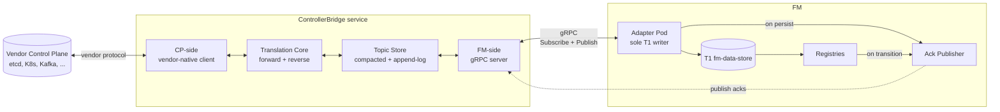
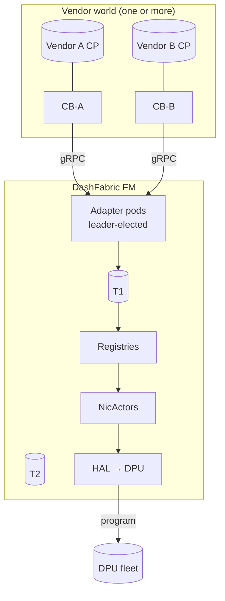

# CB Architecture — High Level Design (HLD)

> **Status:** Draft v1
> **Module:** ControllerBridge (CB)
> **Audience:** Architects, vendor CB implementers, FM core engineers

## 1. Why CB exists

DashFabric's Fleet Manager (FM) needs a **vendor-neutral** way to
consume orchestrator state from any control plane (etcd, K8s, Kafka,
NATS, proprietary). The previous design had a "plugin" loaded into
FM's address space; that was rejected for two reasons:

1. **Security / isolation.** Vendor code in FM's process is an attack
   surface for every other tenant on the same FM pod.
2. **Operational coupling.** Vendor releases would force FM rolls.

CB is the answer: **a separate service, vendor-implemented, that
talks to FM only over the wire (gRPC) using FM-defined schemas**.

## 2. Core idea — symmetric topic broker

CB is best understood not as an "event source" but as a **symmetric
pub/sub topic broker with a translation core**.



Both halves of CB do the same thing — store-and-forward typed events
on topics. The only asymmetry is the wire protocol on each side:
vendor-native on the CP-side, FM-spec gRPC on the FM-side.

## 3. The two halves

| Half | Talks to | Protocol | Owned by |
|------|----------|----------|----------|
| **CP-side** | Vendor's control plane | Vendor's choice (etcd watch, K8s informer, Kafka, NATS, REST polling, ...) | Vendor implementer |
| **FM-side** | FM Adapter | gRPC, FM-spec (`cb_fm_protos/`) | FM core (locked) |

The **Translation Core** in the middle does:
- **Forward translation**: vendor schema → FM proto, on inbound config events.
- **Reverse translation**: FM proto → vendor schema, on outbound acks (so
  vendor's CP can read them in its native form).

Vendor freedom is in the CP-side and the translation rules. The
FM-side gRPC contract is locked.

## 4. Topic taxonomy

All FM-spec topics live under `/dashfabric/v1/config/...`. Every config
topic has paired ack sub-topics:

```
/dashfabric/v1/config/<resource>/<key>            ← config event (vendor publishes)
/dashfabric/v1/config/<resource>/<key>/ack/delivery   ← FM-published, append-log
/dashfabric/v1/config/<resource>/<key>/ack/state      ← FM-published, compacted
```

| Resource | Key format | DASH upstream | FM consumer | Sharing scope |
|----------|------------|----------------|-------------|----------------|
| `devices` | `{dpu_id}` | (FM-synthetic) | Adapter | per-DPU |
| `nics` | `{eni_id}` = `ENI_<DPU>_<MAC>` | DASH_ENI_TABLE | Adapter → NicActor | per-ENI |
| `vnets` | `{vnet_id}` | DASH_VNET_TABLE | Adapter → VnetRegistry | per-VNET |
| `mappings` | `{vnet_id}` | DASH_VNET_MAPPING_TABLE | Adapter → VnetMappingRegistry | per-VNET |
| `acls` | `{acl_group_id}` | DASH_ACL_GROUP_TABLE + DASH_ACL_RULE_TABLE | Adapter → GroupRegistry | per-VNET reusable |
| `routes` | `{route_group_id}` | DASH_ROUTE_GROUP_TABLE + DASH_ROUTE_TABLE | Adapter → GroupRegistry | per-VNET reusable |
| `vms` | `{vm_id}` | (FM-extension) | Adapter | per-VM |
| `containers` | `{container_id}` | (FM-extension) | Adapter | per-container |
| `ha` | `{ha_set_id}` | DASH_HA_SET_TABLE | Adapter → HaRegistry | per-HA-pair |

DASH-derived fields are labeled **upstream / envelope / synthetic**
inside each topic's `.proto` per project Protocol 1.

### 4.1 Topic class — last-wins vs append-log

| Class | Semantics | Examples |
|-------|-----------|----------|
| **Compacted (last-wins)** | Topic store keeps only latest value per key; overwrites drop old | All `/config/<resource>/<key>` config topics; `/ack/state` |
| **Append-log** | All entries retained in order until retention policy expires | `/ack/delivery`; future `/events/...` audit topics |

Vendor's CB picks an underlying store that matches the class. FM-spec
dictates which class each topic is.

## 5. The wire contract (FM-side)

A single gRPC service `ControllerBridge` with these RPCs:

| RPC | Purpose | Direction |
|-----|---------|-----------|
| `Init` | Negotiate version, capabilities | FM → CB |
| `Topics` | Discover supported topic patterns | FM → CB |
| `Subscribe` | Stream events on matching topic patterns | FM ← CB (server stream) |
| `Publish` | FM publishes ack events (or any FM-owned topic) | FM → CB (client stream) |
| `Get` | Pull current value for `(topic, key)` | FM ↔ CB |
| `List` | Pull full topic snapshot | FM ← CB (server stream) |
| `Resync` | Bracketed `BEGIN…END` snapshot for gap recovery | FM ← CB (server stream) |
| `Health` | Liveness + readiness with detail | FM → CB |

Full proto in [`Specs/cb_fm_protos/service/cb_service.proto`](../cb_fm_protos/).

## 6. Acks at high level

FM publishes two **distinct sub-topic families** for every config key
it consumes. Vendor subscribes to whichever they care about; both are
opt-in on the vendor side.

| Sub-topic | Class | Emitted when | Carries | Vendor uses for |
|-----------|-------|--------------|---------|-----------------|
| `…/ack/delivery` | append-log | FM Adapter durably persists an event into T1 | `topic, key, watermark, content_hash, recv_ts` | "Did my publish reach FM at all?" — drives CP retry/redelivery. |
| `…/ack/state` | compacted | A registry transitions to `Programmed`, `Failed`, or `Retired` for `(resource, version)` | `resource_id, desired_version, actual_state, consumers[], ref_count, t_observed, t_programmed` | "Did the ENIs depending on this resource version actually program?" — drives quotas, billing, rollouts on CP side. |

Detail in [05-cb-ack-and-versioning.md](05-cb-ack-and-versioning.md).

## 7. Versioning identifiers (the three-id model)

Every event carries three identifiers, each owned by a different layer:

| ID | Owner | Semantics | Example |
|----|-------|-----------|---------|
| `watermark` | CB (from vendor CP) | Resume / ordering / gap detection | etcd revision `4815162342`; K8s `resourceVersion`; Kafka offset |
| `content_hash` | FM (assigned at Adapter ingest) | Dedup, idempotency, causality | `sha256` of canonical proto bytes |
| `desired_version` | FM (assigned at Adapter ingest) | "the version FM is trying to reach" — keyed by `(topic, key)` | monotonic per-key counter |

Why three: vendor sees its own world (`watermark`); FM sees its own
internal causality (`content_hash`); registries pivot on a stable
human-readable thing (`desired_version`). Mixing these breaks one of
the three concerns.

## 8. Position in the fleet



One FM can talk to many CBs (one per vendor flavor). One CB can serve
many FMs (multi-tenant deployments). The boundary is the gRPC contract.

## 9. Deployment shapes (per tier)

| Tier | CB shape | Notes |
|------|----------|-------|
| Ultra-small (compose) | Single CB container, in-memory topic store, embedded vendor sim | One docker-compose file. CB and FM colocated for evaluation. |
| Small (K8s, ≤500 DPUs) | CB Deployment, replicas=2, BoltDB-backed store | Shared with FM cluster, mTLS. |
| Medium (K8s, ≤5k DPUs) | CB Deployment, replicas=3, etcd-backed store | One CB per vendor flavor. |
| Large (K8s, ≥5k DPUs) | CB Deployment, replicas=N, vendor-native store (e.g., regional etcd / Kafka) | Sharded by topic prefix; FM connects to ≥1 CB per shard. |

The same CB binary runs in all four. Only the store backend and replica
count change. Tier-specific code paths are forbidden (Protocol 5).

## 10. Failure modes (high level)

| Failure | FM behavior | CB behavior | Recovery |
|---------|-------------|-------------|----------|
| CB crash | `Subscribe` stream breaks; FM enters `WAITING` | CB restarts; reloads store if durable | FM reconnects, calls `Resync` from last watermark |
| Vendor CP outage | Topics stop receiving events | CB serves last-known from store | FM continues from cache; on CP resume, CB catches up and republishes from gap |
| FM Adapter crash | No publishes, no consumption | CB's stored events still available | New Adapter leader connects, calls `Resync`, republishes acks for current state |
| Network partition (FM ↔ CB) | Stream break; FM in `WAITING` | Buffers if backed by durable store | On reconnect, FM resumes from watermark |
| Both crash simultaneously | T1 contains last persisted state; FM continues from T1 | Vendor CP unaffected | When CB resumes and FM reconnects, FM `Resync` recovers any gap |

Detail in `02-cb-low-level-design-lld.md` §Crash recovery.

## 11. What's out of scope for CB

- **Vendor CP design.** CB doesn't constrain how the vendor runs etcd,
  K8s, Kafka, etc.
- **DPU programming.** That's HAL's job, downstream of FM.
- **FM internal storage.** T1/T2/T3 are FM's; CB doesn't share them.
- **Cross-CB consensus.** Multiple CBs are independent; FM is the
  reconciliation point.

## 12. Acceptance criteria

A CB design / implementation is acceptable iff:

1. It enforces the **cardinal rule** indirectly — by delivering events
   in a way that lets FM's registries enforce L0–L3 + L4 ordering.
2. It respects the **sharing matrix** — per-VNET topics for per-VNET
   data; never per-ENI subscriptions on per-VNET resources.
3. It passes the **conformance suite** in
   [04-cb-conformance-suite.md](04-cb-conformance-suite.md).
4. It is **vendor-implementable in any language** (Go, Rust, C++, Java,
   Python).
5. FM never links any code from the vendor's CB.

## 13. References

- `02-cb-low-level-design-lld.md` — internals.
- `03-cb-vendor-implementation-guide.md` — for vendors.
- `04-cb-conformance-suite.md` — mandatory tests.
- `05-cb-ack-and-versioning.md` — ack details.
- `06-cb-simulator-design.md`, `07-cb-simulator-cli.md` — sim.
- `Specs/FM/registry-pattern-design.md` — FM consumer side.
- `Specs/Learning-DashNet/11A-ENI-Dependency-Graph.md` — cardinal rule.
- `Specs/me-and-ai/controller-bridge-and-acks.md` — discussion history.
- Upstream DASH: <https://github.com/sonic-net/DASH/tree/main>.
