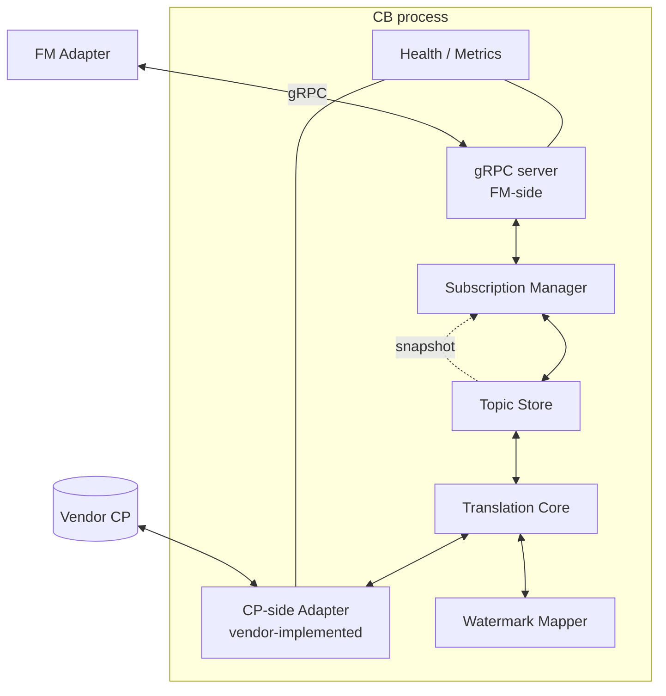
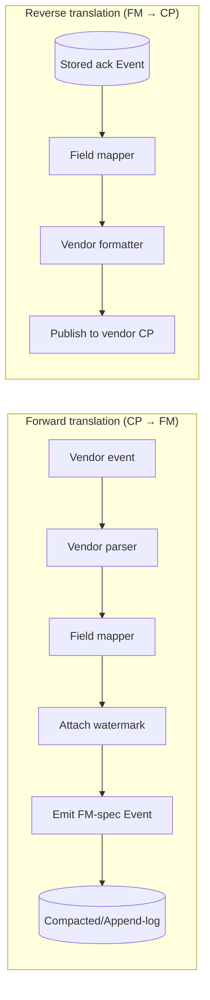
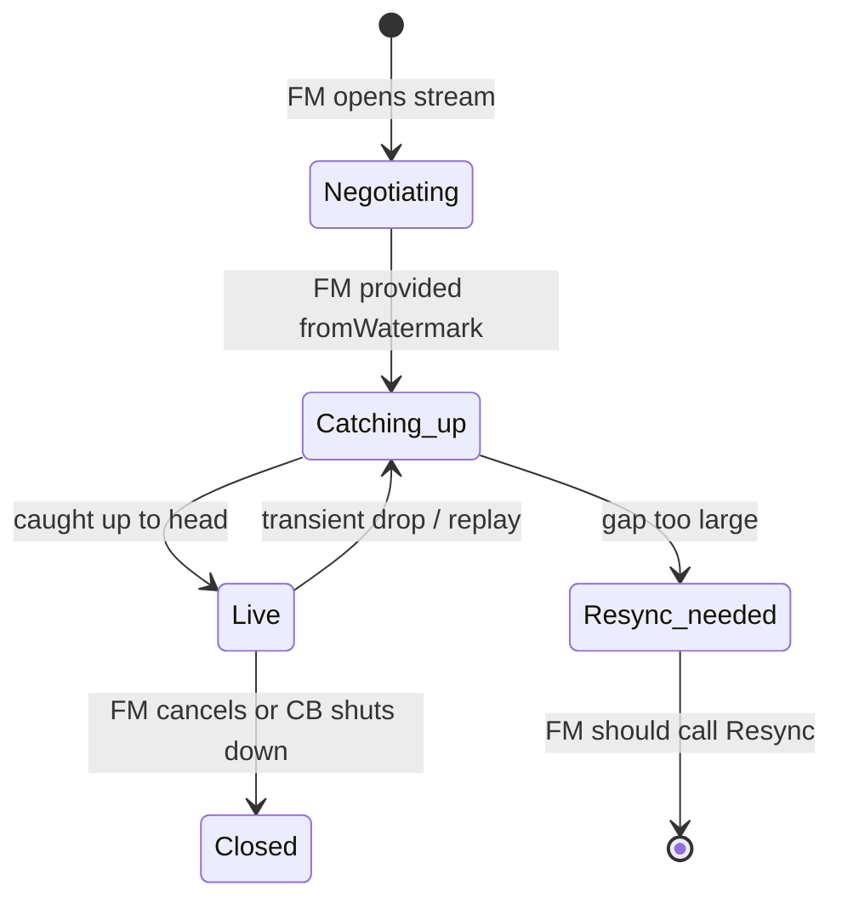
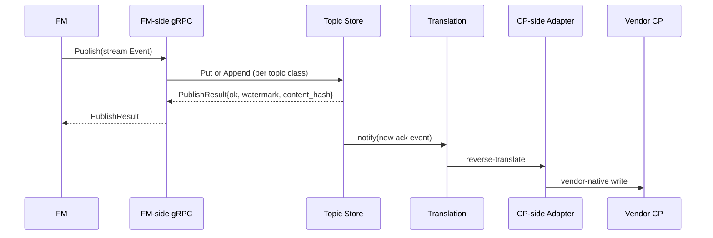
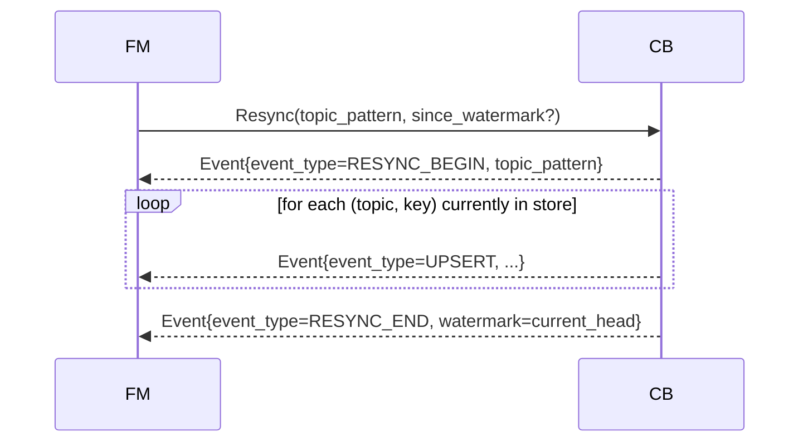

# CB Low-Level Design (LLD)

> **Status:** Draft v1
> **Module:** ControllerBridge (CB)
> **Audience:** CB implementers; reviewers checking concurrency, durability, recovery

This document describes the **internal** structure of a CB process —
how the topic store, translation core, gRPC server, and CP-side adapter
fit together. It is normative for the FM-side surface and advisory for
the CP-side (vendor freedom).

## 1. Process model



Single process; multi-goroutine (or equivalent for non-Go vendors). No
shared global mutable state outside the documented components below.

## 2. Topic Store

The Topic Store is the heart of CB. It holds typed events on named
topics with one of two retention shapes.

### 2.1 Compacted topics

```
Topic: /dashfabric/v1/config/vnets/{vnet_id}
Storage: map[key] -> latest Event
Operations:
  Put(key, event)   # overwrite; emits change notification
  Get(key) -> event
  List() -> all (key, event) pairs
  Delete(key)       # tombstone
```

Last-wins. Old values are garbage-collected on overwrite. Used for
goal-state config and `/ack/state`.

### 2.2 Append-log topics

```
Topic: /dashfabric/v1/config/<...>/ack/delivery
Storage: append-only ring buffer, keyed by (key, watermark)
Operations:
  Append(key, event)    # always inserts, never overwrites
  ReadFrom(watermark) -> stream of events from that point
  Compact(retention)    # drops entries older than retention
Retention: configurable (default 24h or 1M entries per topic, whichever first)
```

Used for delivery acks and (future) audit/event-log topics.

### 2.3 Storage backends

The store is behind an interface. Vendor picks at deploy time:

| Backend | Durability | Best for | Notes |
|---------|------------|----------|-------|
| `memory` | Lost on restart | ultra-small, dev, sim | Default in compose tier |
| `boltdb` | Local file | small/medium | Single-process; simple |
| `sqlite` | Local file | small/medium | Familiar; queryable |
| `etcd` | Distributed | medium/large | Replicated; vendor likely already runs etcd |
| `vendor-native` | Vendor's choice | large | E.g., a vendor reuses Kafka or Zookeeper |

**Knob (Protocol 6):** `cb.store.backend` selects the backend; default
is `memory` for dev, `boltdb` for small-tier, `etcd` for large.

### 2.4 Concurrency model

- **One writer goroutine per topic** (per-topic single-writer to avoid
  cross-topic locking).
- **N reader goroutines** per Subscribe stream; subscribers receive
  notifications via per-topic fan-out channel.
- **No global lock.** Cross-topic operations (e.g., `List` across
  topics) iterate sequentially.

### 2.5 GC / retention

| Class | GC trigger |
|-------|-----------|
| Compacted | On overwrite or explicit `Delete` (tombstone retained for retention window so late subscribers see deletion) |
| Append-log | Time-based (retention window) and/or count-based (max entries per topic) |

Tombstones for compacted topics are kept for `cb.tombstone.retention`
(default 1h); long enough for any in-flight subscriber to observe the
deletion.

## 3. Translation Core

Translation is the **mapping layer between vendor's CP schema and
FM-spec protos**. Two pipelines:



### 3.1 Forward translation

For each topic, vendor implements a function:

```go
// pseudo-code; vendor language varies
func (a *VendorAdapter) ToFMEvent(vendorEvent VendorObj) (*pb.Event, error) {
    return &pb.Event{
        Topic:       "/dashfabric/v1/config/vnets/" + vendorEvent.ID,
        Key:         vendorEvent.ID,
        EventType:   mapType(vendorEvent.Op),       // UPSERT/DELETE
        Watermark:   a.wm.AssignFromVendor(vendorEvent.Revision),
        ProducerTs:  vendorEvent.Timestamp,
        Payload:     marshalVnetConfig(vendorEvent), // returns *anypb.Any
    }, nil
}
```

The `Payload` is the topic-specific FM proto (e.g., `VnetConfig` for
`vnets`). FM parses based on topic.

### 3.2 Reverse translation

For each ack sub-topic vendor cares about, vendor implements a handler:

```go
func (a *VendorAdapter) OnAckEvent(ev *pb.Event) error {
    switch {
    case strings.HasSuffix(ev.Topic, "/ack/state"):
        var ack pb.StateAck
        ev.Payload.UnmarshalTo(&ack)
        return a.applyStateAckToCP(ack)
    case strings.HasSuffix(ev.Topic, "/ack/delivery"):
        var ack pb.DeliveryAck
        ev.Payload.UnmarshalTo(&ack)
        return a.appendDeliveryToCP(ack)
    }
    return nil
}
```

What "applyStateAckToCP" means is vendor's call (write to a status
table, post a webhook, update a Kafka topic, etc.).

### 3.3 No partial events

Forward translation **must emit one whole event per resource change**.
A VNET update with five field changes is one `Event`, not five. This
is enforced by the conformance suite (T6/T8).

## 4. Watermark Mapper

The Watermark Mapper turns vendor-native progress markers into stable
FM-resumable tokens.

| Vendor primitive | Mapped to |
|------------------|-----------|
| etcd revision (int64) | `cb.watermark.etcd:{rev}` |
| K8s `resourceVersion` (string) | `cb.watermark.k8s:{rv}` |
| Kafka `(partition, offset)` | `cb.watermark.kafka:{p}:{o}` |
| REST polling counter | `cb.watermark.rest:{counter}:{hash}` |
| NATS sequence | `cb.watermark.nats:{seq}` |

Watermark format is opaque to FM — FM just stores and replays it. CB
must guarantee:

- **Monotonic per topic.** Within a topic, watermarks are strictly
  non-decreasing.
- **Resumable.** Given a watermark, CB must be able to deliver every
  event with strictly greater watermark, or signal `RESYNC_NEEDED` if
  the gap is too large.
- **Stable across CB restart.** Watermarks must survive CB process
  restart (durable store) or CB must trigger `RESYNC` on restart
  (ephemeral store).

## 5. Subscription Manager

Manages active `Subscribe` streams from FM.

### 5.1 Stream lifecycle



- **Catching_up:** stream emits stored events from the watermark
  forward, in order.
- **Live:** stream emits new events as they land in the topic store.
- **Resync_needed:** the requested watermark is below CB's earliest
  retained one; CB sends a single `RESYNC_NEEDED` sentinel and ends
  the stream. FM must call `Resync` to recover.

### 5.2 Backpressure

- Per-stream buffered channel (default 1024 events).
- If the buffer fills (slow FM), CB drops the stream with
  `FM_TOO_SLOW`. FM reconnects from last acked watermark.
- **`Subscribe` and `Publish` are independent**. Slow `Subscribe`
  consumer must not block FM's `Publish` of acks. Conformance test T12.

### 5.3 Pattern matching

`Subscribe` request includes a topic pattern. Supported syntax:

| Pattern | Matches |
|---------|---------|
| `/dashfabric/v1/config/vnets/*` | All keys under `vnets/` |
| `/dashfabric/v1/config/vnets/vnet-1234` | Exact key |
| `/dashfabric/v1/config/**` | Recursive (every config topic) |

Glob style; no regex. Vendor implementations must support `*` and `**`.

## 6. Publish path (FM-published acks)



- FM publishes ack events; CB acknowledges *only* the durable Put/Append
  into the store. Reverse translation to vendor CP happens
  asynchronously.
- **FM never blocks waiting for vendor CP.** That decoupling is the
  point of the topic-broker model.

### 6.1 Publish idempotency

`PublishResult` includes the `content_hash`. If the same `(topic, key,
content_hash)` is republished:
- **Compacted:** overwrite is a no-op (same value); succeeds, version
  unchanged.
- **Append-log:** dedup by `content_hash` within retention window; succeeds.

FM republish on restart is therefore safe and expected.

## 7. Resync algorithm



- `RESYNC_BEGIN` and `RESYNC_END` bracket the snapshot.
- Between them, every event is an `UPSERT` (no deletes — absent =
  deleted).
- After `RESYNC_END`, FM may resume `Subscribe` from the watermark
  carried in `RESYNC_END`.
- Ordering inside the resync: per-topic-arrival order, no cross-topic
  ordering promise.

## 8. CP-side Adapter (vendor surface)

CB exposes an internal interface that vendors implement:

```go
type CPSideAdapter interface {
    Init(ctx context.Context, cfg map[string]any) error
    Start(ctx context.Context) error
    Subscribe(topics []string) (<-chan VendorEvent, error)  // CP → CB
    Apply(ack VendorAck) error                              // CB → CP (reverse)
    Health(ctx context.Context) HealthDetail
    Close() error
}
```

Each vendor ships a binary that includes:
- a CP-side adapter implementation,
- a translation table (forward+reverse) registered per topic,
- the standard CB FM-side gRPC server (vendor links the CB SDK).

The **CB SDK** (a Go module — and we can also ship Rust/Python/Java
ports later) is provided by the DashFabric project; vendors only fill
in `CPSideAdapter` and translation tables.

### 8.1 Reference adapter list (initial)

| Adapter | Source | Watermark | Topic store default |
|---------|--------|-----------|---------------------|
| `etcd-watch` | etcd watch API | revision | etcd-backed |
| `k8s-informer` | client-go informer | resourceVersion | boltdb |
| `kafka` | franz-go consumer group | (partition, offset) | boltdb |
| `nats-jetstream` | nats.go JetStream | seq | nats-native |
| `rest-poll` | HTTP polling | counter+hash | boltdb |
| `cbsim` | YAML fixture | monotonic | memory |

## 9. Health & metrics

`Health()` returns:
```proto
message HealthResponse {
  HealthState state = 1;        // SERVING, DEGRADED, NOT_SERVING
  string version = 2;
  CPSideHealth cp_side = 3;     // CP connectivity, last vendor event
  StoreHealth store = 4;        // backend, used bytes, oldest/newest watermark
  repeated TopicHealth topics = 5;
}
```

Required Prometheus metrics (knob: `cb.metrics.disabled`):
- `cb_events_received_total{topic, source=vendor}`
- `cb_events_published_total{topic, source=fm}`
- `cb_subscribers_active{topic}`
- `cb_resyncs_total{reason}`
- `cb_translate_errors_total{topic, direction}`
- `cb_store_bytes{topic, class}`
- `cb_watermark_lag_seconds{topic}`

## 10. Crash recovery

| Crashed | Effect | Recovery |
|---------|--------|----------|
| CB process | All `Subscribe` streams break; in-flight publishes lost | FM reconnects; if store is durable, resumes from last watermark; else `Resync`. CB rebuilds from store. |
| CP-side adapter only | Forward stream stalls; FM keeps reading store | CB restarts adapter; vendor reconnects to CP. |
| FM Adapter | No publishes, no consumption | New Adapter leader connects; calls `Resync` for current state; republishes acks. |
| Network FM↔CB | Stream break, reconnect loop with exponential backoff | FM resumes from watermark on reconnect. |

**Crash-safety invariant.** A CB with a durable store must be
restartable to a state that is consistent with the last `PublishResult`
returned to FM. CB must not lie about durability.

## 11. Configuration knobs (Protocol 6 — every default a knob)

| Knob | Default | Purpose |
|------|---------|---------|
| `cb.store.backend` | `boltdb` (small/medium), `etcd` (large), `memory` (dev) | Topic store backend |
| `cb.store.path` | `/var/lib/cb` | Local-store path |
| `cb.tombstone.retention` | `1h` | How long to keep deletion markers |
| `cb.appendlog.retention.duration` | `24h` | Append-log retention window |
| `cb.appendlog.retention.entries` | `1000000` | Per-topic max entries |
| `cb.subscribe.buffer` | `1024` | Per-stream channel buffer |
| `cb.subscribe.slow_drop_after` | `5s` | Drop a stuck subscriber after this |
| `cb.publish.dedup.window` | `1h` | How far back to dedup append-log publishes |
| `cb.grpc.listen` | `:7443` | gRPC bind address |
| `cb.grpc.tls.enabled` | `true` (production), `false` (dev) | mTLS toggle |
| `cb.metrics.disabled` | `false` | Disable Prometheus metrics |
| `cb.health.bind` | `:7080` | HTTP health bind |

## 12. Security

- **mTLS between FM and CB.** Mutual cert validation; CN must match
  expected SAN list. Configurable via `cb.grpc.tls.*`.
- **Authn.** FM identifies via cert SAN; CB enforces an allowlist of
  authorized FM clients.
- **Authz.** Per-topic-pattern read/write ACLs configurable; default
  is "FM may subscribe to any `/dashfabric/v1/config/**`, publish to any
  `…/ack/**`".
- **CB ↔ vendor CP** auth is vendor's responsibility.

## 13. Worked example — VNET cold-start flow

1. Vendor's etcd has a VNET object at revision 4815.
2. CB-A's `etcd-watch` adapter sees it on startup `List`.
3. Adapter calls `ToFMEvent` → produces FM-spec `Event{topic=/dashfabric/v1/config/vnets/vnet-1234, key=vnet-1234, payload=VnetConfig{...}, watermark=etcd:4815}`.
4. Translation Core stores it in the compacted Topic Store under
   topic `/dashfabric/v1/config/vnets/`, key `vnet-1234`.
5. FM Adapter's open `Subscribe(/dashfabric/v1/config/**)` stream
   receives the Event.
6. FM Adapter persists into T1 (`content_hash=H1`, `desired_version=v1`).
7. FM Adapter publishes
   `Event{topic=/dashfabric/v1/config/vnets/vnet-1234/ack/delivery,
   payload=DeliveryAck{watermark=etcd:4815, content_hash=H1, recv_ts=…}}`.
8. CB stores the delivery ack in append-log.
9. Vendor's CB-side handler (subscribed to `…/ack/delivery` if it cares)
   reads it and updates vendor's CP.
10. Eventually, registries program ENIs against `vnet-1234`. As each
    transitions to `Programmed`, FM publishes to `…/ack/state` (compacted),
    overwriting the previous state ack with updated `consumers[]` and
    `ref_count`.
11. When all consumers drop their reference (e.g., VNET retired), FM
    publishes a final `RESOURCE_VERSION_RETIRED` state ack.

## 14. References

- `01-cb-architecture-hld.md` — high-level.
- `03-cb-vendor-implementation-guide.md` — vendor steps.
- `05-cb-ack-and-versioning.md` — ack details.
- `Specs/cb_fm_protos/service/cb_service.proto` — wire contract.
- `Specs/FM/registry-pattern-design.md` — FM consumer side.
