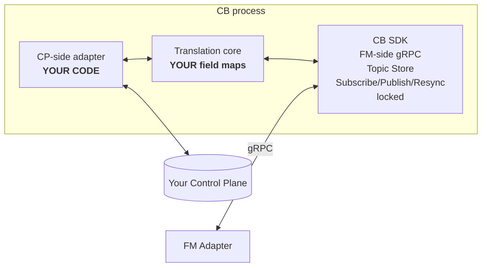

# CB Vendor Implementation Guide

> **Status:** Draft v1
> **Audience:** Vendor engineers implementing a ControllerBridge for
> their orchestrator / control plane.

This guide is your single starting point for implementing CB against
your control plane. Read [01-cb-architecture-hld.md](01-cb-architecture-hld.md)
first for context.

## 1. What you must implement

You implement **the CP-side half** of CB. The FM-side half is provided
by the DashFabric CB SDK and is not yours to change.



Three things you provide:

1. **CP-side adapter** — a Go (or via a future language SDK port: Rust,
   Java, Python) implementation of `CPSideAdapter`.
2. **Translation tables** — for each topic you carry, a forward
   (`vendor → FM-spec`) and (optionally) reverse (`FM-spec → vendor`)
   mapping function.
3. **Configuration / deployment** — Helm chart or compose snippet,
   wiring the CB binary to your CP.

## 2. The locked surface — what you cannot change

| Surface | Locked | Where defined |
|---------|--------|---------------|
| FM-side gRPC service | Yes | `Specs/cb_fm_protos/service/cb_service.proto` |
| Event envelope | Yes | `Specs/cb_fm_protos/service/cb_events.proto` |
| Ack message types | Yes | `Specs/cb_fm_protos/service/cb_acks.proto` |
| Per-topic payload protos | Yes | `Specs/cb_fm_protos/topics/*.proto` |
| Topic naming convention | Yes | `/dashfabric/v1/config/<resource>/<key>` |
| Topic class (compacted vs append-log) | Yes | per-topic, see HLD §4.1 |
| Watermark semantics (monotonic per topic, opaque to FM) | Yes | LLD §4 |

## 3. Step-by-step implementation

### Step 1 — clone the SDK skeleton

```bash
git clone https://github.com/<dashfabric>/cb-sdk-go
cd cb-sdk-go/templates/vendor-skeleton
go mod init cb-acme
```

The skeleton gives you:
- a `main.go` that boots the FM-side gRPC server,
- a `cpside/` package where you implement `CPSideAdapter`,
- a `xl/` package for translation tables,
- a `Dockerfile` and `helm/` chart.

### Step 2 — implement `CPSideAdapter`

```go
package cpside

import (
    "context"
    cb "github.com/dashfabric/cb-sdk-go/cb"
)

type AcmeAdapter struct {
    client *acme.Client
    // ...
}

func (a *AcmeAdapter) Init(ctx context.Context, cfg map[string]any) error {
    // dial your control plane
}

func (a *AcmeAdapter) Start(ctx context.Context) error {
    // begin watching / consuming; spawn goroutines
}

func (a *AcmeAdapter) Subscribe(topics []string) (<-chan cb.VendorEvent, error) {
    // return a channel that emits raw vendor events for the requested topics
}

func (a *AcmeAdapter) Apply(ack cb.VendorAck) error {
    // CB has a new ack to deliver to your CP — write/publish it however you do
}

func (a *AcmeAdapter) Health(ctx context.Context) cb.HealthDetail { ... }
func (a *AcmeAdapter) Close() error { ... }
```

### Step 3 — register translation tables

```go
package xl

import (
    cb "github.com/dashfabric/cb-sdk-go/cb"
    pb "github.com/dashfabric/cb-fm-protos/topics"
)

func init() {
    cb.RegisterForward("/dashfabric/v1/config/vnets/*", forwardVnet)
    cb.RegisterForward("/dashfabric/v1/config/mappings/*", forwardMapping)
    cb.RegisterReverse("/dashfabric/v1/config/vnets/*/ack/state", reverseVnetStateAck)
    // ...
}

func forwardVnet(v cb.VendorEvent) (*cb.Event, error) {
    raw := v.Payload.(*acme.VNetSpec)
    payload, _ := anypb.New(&pb.VnetConfig{
        VnetId:        raw.ID,                    // upstream
        Vni:           raw.Vni,                   // upstream (DASH: vni)
        EncapType:     mapEncap(raw.EncapKind),   // upstream
        AddressSpaces: mapPrefixes(raw.Prefixes), // upstream
        // envelope fields
        Tenant:        raw.TenantID,
        Region:        raw.Region,
    })
    return &cb.Event{
        Topic:      "/dashfabric/v1/config/vnets/" + raw.ID,
        Key:        raw.ID,
        EventType:  mapType(v.Op),
        Watermark:  cb.Watermark(fmt.Sprintf("acme:%d", v.Revision)),
        ProducerTs: v.Timestamp,
        Payload:    payload,
    }, nil
}
```

### Step 4 — implement the watermark

Pick the most stable monotonic counter your CP exposes:

| If your CP is | Watermark choice |
|---------------|-------------------|
| etcd-based | `revision` |
| K8s-based | `resourceVersion` (note: not numerically comparable across resources) |
| Kafka-based | `(partition, offset)` per partition |
| NATS JetStream | stream `seq` |
| Custom HTTP | a server-side monotonic counter; if absent, `(timestamp, hash)` |

Watermark must be:
1. Monotonic per topic.
2. Opaque to FM (FM stores and replays bytes).
3. Resumable: given watermark `W`, your adapter must be able to deliver
   every event with `W' > W`, or signal `RESYNC_NEEDED`.
4. Stable across CB restart (if you use a durable store) or trigger
   `RESYNC` on restart (if ephemeral).

### Step 5 — choose a topic store backend

| Tier | Recommended backend | Why |
|------|---------------------|-----|
| Dev / sim | `memory` | Fast, ephemeral. |
| Small | `boltdb` | Single-file, durable, no extra service. |
| Medium | `boltdb` or `sqlite` | Same as small. |
| Large | `etcd` or vendor-native | If you already run etcd, reuse it. Otherwise pick a backend matching your scale. |

Configured via `cb.store.backend`.

### Step 6 — pass conformance

Run the conformance suite from
[04-cb-conformance-suite.md](04-cb-conformance-suite.md):

```bash
cb-conformance --target=localhost:7443 --topics=vnets,mappings,acls
```

All mandatory tests (T1–T12) must pass. Optional tests (T13+) may apply
depending on which topics your CB carries.

### Step 7 — package and submit

- Dockerfile produces a static binary (`cb-acme`).
- Helm chart for K8s deploy (replica count, resource requests, mTLS
  certs, store volume).
- Compose snippet for ultra-small tier.
- `cb-conformance` report attached to the submission.

## 4. Translation recipes per topic

Below is the canonical mapping for each FM-spec topic. The DASH lineage
column tells you what upstream artifact the topic corresponds to;
your job is to bridge whatever your CP calls these things to the
FM-spec proto.

### 4.1 `/config/devices/{dpu_id}` — host inventory

| FM field | Required | Source guidance |
|----------|----------|------------------|
| `dpu_id` | yes | Your CP's stable DPU identifier (UUID or hostname-derived). |
| `host_id` | yes | Physical host hosting the DPU. |
| `nic_pci_addr` | recommended | PCI BDF if your CP knows it. |
| `firmware_version`, `dash_version` | recommended | From DPU registration. |
| `lifecycle_state` | yes | One of `BOOTING`, `READY`, `DRAINING`, `OFFLINE`. |

### 4.2 `/config/nics/{eni_id}` — NIC declaration (DASH_ENI_TABLE)

| FM field | DASH | Source guidance |
|----------|------|------------------|
| `eni_id` | upstream | Format `ENI_<DPU>_<MAC>`. Stable for the life of the NIC. |
| `mac` | upstream | NIC MAC. |
| `dpu_id` | envelope | Where the NIC lives. |
| `vnet_id` | upstream | The VNET this NIC joins. |
| `vm_id` / `container_id` | envelope | Lifecycle parent. |
| `acl_group_in` / `acl_group_out` | upstream | ACL group references. |
| `route_group_id` | upstream | Route group reference. |
| `admin_state` | upstream | `UP` / `DOWN`. |

Cross-reference: the cardinal rule (Layer-3 NIC declaration) requires
this event before the ENI can be programmed; do not delay it on
unrelated dependencies.

### 4.3 `/config/vnets/{vnet_id}` — VNET (DASH_VNET_TABLE)

| FM field | DASH | Source guidance |
|----------|------|------------------|
| `vnet_id` | upstream | |
| `vni` | upstream | VxLAN VNI. |
| `encap_type` | upstream | DASH encap type enum. |
| `address_spaces` | upstream | List of CIDRs. |
| `tenant`, `region` | envelope | Multi-tenant tags. |

### 4.4 `/config/mappings/{vnet_id}` — VNET mapping (DASH_VNET_MAPPING_TABLE)

This is the **hot topic** (per-VNET, can be huge). Forward translation
must:

- Emit one event per `(vnet_id)` containing the **full mapping table**
  for that VNET.
- Use a content-addressed `watermark` or version per VNET — vendors with
  partial-update CPs should buffer and emit a coalesced full-table event.

Why full table per event: matches the per-VNET sub-actor design on FM
side. Per-prefix events would explode subscriber count (sharing matrix
violation).

### 4.5 `/config/acls/{acl_group_id}` — ACL groups (DASH_ACL_GROUP/RULE)

| FM field | DASH | |
|----------|------|---|
| `acl_group_id` | upstream | |
| `vnet_id` | envelope | The VNET this group is reusable within. |
| `rules` | upstream | List of `AclRule` (priority, match, action). |
| `version` | envelope | Stable across rule reordering. |

Per-VNET reusable: many ENIs in a VNET may reference the same group.

### 4.6 `/config/routes/{route_group_id}` — Route groups (DASH_ROUTE_GROUP/TABLE)

Mirror of ACL pattern. One event per group, full table contents.

### 4.7 `/config/vms/{vm_id}` and `/config/containers/{container_id}`

FM-extension topics (no direct DASH analog). Lifecycle events for the
parent compute object. Required for FM to gate ENI programming on
parent state.

### 4.8 `/config/ha/{ha_set_id}` — HA pairs (DASH_HA_SET_TABLE)

| FM field | DASH | |
|----------|------|---|
| `ha_set_id` | upstream | |
| `members` | upstream | List of DPU+role (Active/Standby). |
| `pairing_state` | upstream | `Pairing`, `Paired`, `Split`, `Solo`. |

## 5. Reverse translation (handling FM-published acks)

Your CB will receive ack events on topics like
`/dashfabric/v1/config/vnets/vnet-1234/ack/state`. What you do with them
is your call:

| Approach | When to use |
|----------|-------------|
| Write to a status table in your CP | Common case; vendor's CP has a place for "programmed state." |
| Publish to an internal Kafka/NATS topic | When downstream services consume programming status. |
| Trigger a webhook | Integrations with external billing/quotas. |
| Drop (just store in CB's topic store) | Vendors that pull on demand instead of pushing. |

Your reverse-translation function receives the FM-spec `StateAck` /
`DeliveryAck` proto and is responsible for whatever side effects your
CP needs.

## 6. Common pitfalls

| Pitfall | Symptom | Fix |
|---------|---------|-----|
| Emitting partial events (one event per field change) | FM applies inconsistent state; cardinal rule erodes | Coalesce vendor events into one whole-resource event before forwarding |
| Reusing a non-monotonic watermark | FM resume returns wrong events; gaps appear | Use a strictly monotonic per-topic counter |
| Writing to FM's T1 directly | (Architectural violation) | T1 is FM's; CB never touches it |
| Coupling Subscribe and Publish backpressure | FM appears stuck | Run them on separate goroutines; conformance T12 |
| Linking your CB binary into FM | (Architectural violation; rejected) | Always run CB as a separate process |
| Returning `PublishResult{ok}` before the store has durably committed | Crash loses acks; FM thinks they're delivered | Only ack after durable Put/Append succeeds |
| Skipping `RESYNC_END` | FM can't resume cleanly | Always bracket resync with BEGIN/END |

## 7. Performance targets

| Metric | Target | Notes |
|--------|--------|-------|
| Event ingest throughput (per CB) | ≥ 50k events/sec | At medium tier hardware |
| `Subscribe` end-to-end latency | p99 ≤ 50 ms | Inside one DC |
| `Publish` ack latency (FM → CB → durable store) | p99 ≤ 20 ms | BoltDB backend |
| `Resync` latency for 1M-key topic | ≤ 30 s | Streamed |
| Memory footprint, idle | ≤ 200 MB | Memory backend |

## 8. Security checklist

- [ ] mTLS configured for FM↔CB.
- [ ] Cert SAN allowlist matches expected FM identities.
- [ ] CB↔CP auth uses vendor's standard (token, cert, IAM).
- [ ] No vendor secrets in CB logs.
- [ ] CB has no privileges on FM's storage tiers.

## 9. Submission checklist

- [ ] Implements `CPSideAdapter` for the target CP.
- [ ] Translation tables registered for all carried topics.
- [ ] Conformance suite passes (report attached).
- [ ] Helm chart (or compose) deploys cleanly in target tier.
- [ ] Documentation in `docs/cb-<vendor>/` covering: topic list,
      configuration, deployment, troubleshooting.
- [ ] Dockerfile builds reproducibly.
- [ ] Vendor signs the upstream alignment statement (Protocol 1).

## 10. References

- `01-cb-architecture-hld.md`, `02-cb-low-level-design-lld.md`.
- `04-cb-conformance-suite.md` — must pass.
- `05-cb-ack-and-versioning.md` — ack semantics.
- `Specs/cb_fm_protos/` — locked contract.
- Upstream DASH SAI tables: <https://github.com/sonic-net/DASH/tree/main>.
