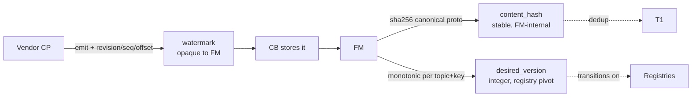
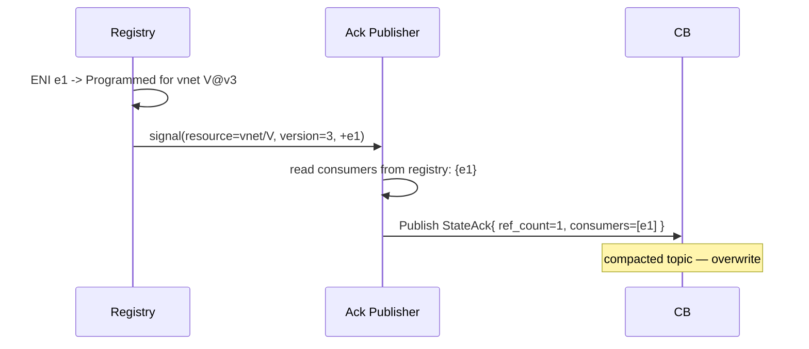

# CB Acks and Versioning

> **Status:** Draft v1
> **Audience:** CB and FM implementers; vendor CB authors who consume
> ack streams.

This is the normative reference for FM's two ack families, the
three-id versioning model, ref-count derivation, and republish
semantics.

## 1. The three-id model (recap)

Every event flowing through CB carries three identifiers, each owned by
a different layer. Confusing them is the most common design mistake.

| ID | Owner | Semantics | Why it must be its own thing |
|----|-------|-----------|--------------------------------|
| `watermark` | CB (from vendor CP) | Resume / ordering / gap detection | Vendor's world; must be opaque to FM |
| `content_hash` | FM (computed at Adapter ingest) | Dedup, idempotency, causality | Stable across restarts; cross-vendor portable |
| `desired_version` | FM (assigned at Adapter ingest) | "the version FM is trying to reach" | Stable, monotonic per-`(topic, key)`; pivot for registries |



### 1.1 Worked example

Vendor publishes a VNET update for `vnet-1234` from etcd revision `4815`:

```
Event {
  topic       = /dashfabric/v1/config/vnets/vnet-1234
  key         = vnet-1234
  watermark   = "etcd:4815"        # vendor world
  payload     = VnetConfig { ... }
}
```

FM Adapter receives it, persists into T1, and assigns:

```
content_hash    = sha256(canonical_proto_bytes(payload))   = H1
desired_version = vnet_version_counter[vnet-1234] + 1      = 7
```

Both stored in T1 alongside the payload. FM then publishes acks
referencing all three identifiers.

## 2. DeliveryAck

**Class:** append-log
**Topic pattern:** `/dashfabric/v1/config/<resource>/<key>/ack/delivery`
**Emitted:** when the FM Adapter has *durably persisted* the event
into T1 (after the `content_hash` is committed; before any registry
processing).

### 2.1 Payload (proto)

```proto
message DeliveryAck {
  string  topic            = 1;   // /dashfabric/v1/config/vnets/vnet-1234
  string  key              = 2;   // vnet-1234
  string  watermark        = 3;   // "etcd:4815"
  bytes   content_hash     = 4;   // sha256
  uint64  desired_version  = 5;
  google.protobuf.Timestamp recv_ts = 6;     // when CB delivered to FM
  google.protobuf.Timestamp persist_ts = 7;  // when FM committed to T1
  string  fm_instance_id   = 8;              // which Adapter persisted it
}
```

### 2.2 Semantics

- **One DeliveryAck per persisted event.** Even if multiple Adapter
  instances see the same event due to leader transition, only the
  current leader publishes an ack; followers do not.
- **No business-logic gating.** Persistence is the only condition. FM
  does not wait for downstream programming.
- **Append-log retention.** Vendor sees full history within retention
  window (default 24h).

### 2.3 What vendor uses it for

- Confirm that the publish reached FM at all.
- Drive CP-side retry/redelivery decisions ("haven't seen ack in 30s,
  republish").
- Auditing and SLA dashboards.

## 3. StateAck

**Class:** compacted (last-wins per `(resource, desired_version)`)
**Topic pattern:** `/dashfabric/v1/config/<resource>/<key>/ack/state`
**Emitted:** when the FM registry for the resource transitions to
`Programmed`, `Failed`, or `Retired` for a given `desired_version`,
*and* on consumer-set changes.

### 3.1 Payload (proto)

```proto
message StateAck {
  string  resource_topic   = 1;   // /dashfabric/v1/config/vnets/vnet-1234
  string  resource_key     = 2;   // vnet-1234
  uint64  desired_version  = 3;
  bytes   content_hash     = 4;
  ResourceState actual_state = 5;        // PROGRAMMED, FAILED, RETIRED
  repeated string consumers = 6;         // eni_ids currently bound to this version
  uint32  ref_count        = 7;          // len(consumers)
  google.protobuf.Timestamp t_observed   = 8;
  google.protobuf.Timestamp t_programmed = 9;  // earliest consumer Programmed time
  optional FailureDetail failure = 10;
}

enum ResourceState {
  STATE_UNSPECIFIED = 0;
  PROGRAMMED        = 1;  // ≥1 consumer in Programmed
  FAILED            = 2;  // any consumer in Failed
  RETIRED           = 3;  // ref_count == 0 after having been Programmed
}
```

### 3.2 Semantics

- **Last-wins** per `(resource_key, desired_version)`. Vendor reading
  the topic always sees current state.
- **Edge-triggered emit** on:
  - First consumer reaches `Programmed` for `(resource, version)` →
    emit with `actual_state=PROGRAMMED`.
  - Any consumer reaches `Failed` → emit with `actual_state=FAILED`,
    failure detail attached.
  - Consumer added or removed → emit with updated `consumers[]` and
    `ref_count`.
  - `ref_count` hits 0 after having been positive → emit with
    `actual_state=RETIRED` (terminal).
- **No emit for intermediate states** like `Hydrating`, `Waiting`. Knob
  `cb.ack.verbose` enables verbose mode for debugging.

### 3.3 What vendor uses it for

- Quotas / billing — bill per programmed ENI per version.
- Rollouts — gate next batch on `ref_count == expected_count`.
- Garbage collection — when `RETIRED`, free vendor-side resources.

## 4. Ref-count — derived, not maintained

**The ref count is not a separate counter.** It is a derived view from
the existing FM registries.

| Resource | Registry that owns the consumer set | Derivation |
|----------|--------------------------------------|------------|
| VNET | `VnetRegistry` | ENIs whose `vnet_id == this VNET` and state ∈ {Programmed} |
| Mapping | `VnetMappingRegistry` (per-VNET sub-actor) | ENIs in this VNET currently using this mapping version |
| ACL group | `GroupRegistry` | ENIs referencing this `acl_group_id` at version V |
| Route group | `GroupRegistry` | ENIs referencing this `route_group_id` at version V |
| HA set | `HaRegistry` | DPUs paired in this HA set |

When a registry transitions a consumer's state, it triggers re-emission
of the relevant resource StateAck:



**Why derived, not stored.** A separately stored counter drifts. The
registry is already the cardinal-rule enforcement point and the
authoritative consumer set; reusing it for ack derivation means the
ack cannot contradict the rest of FM.

## 5. Version retirement

When `ref_count` for `(resource, version)` falls to 0 *after having
been positive*, FM emits a final StateAck:

```
StateAck {
  desired_version = V
  actual_state    = RETIRED
  consumers       = []
  ref_count       = 0
  t_observed      = now
}
```

Vendor can use this as a green-light to GC (e.g., delete a stale
VNET version's mapping table from its CP).

After `RETIRED`, the compacted topic value remains until garbage-collected
by `cb.tombstone.retention`. A subsequent new version of the same resource
key gets its own StateAck under the new `desired_version`.

## 6. Republish semantics (cold-start FM Adapter)

When an FM Adapter starts up (initial boot or leader takeover):

1. **Hydrate** registries from T1 (existing reconciliation flow).
2. **Walk** every resource in registries.
3. **Republish** the current state to `…/ack/state` for each
   `(resource, current_version)`. This is idempotent because the topic
   is compacted — overwriting with the same value is a no-op.
4. **Do not republish DeliveryAck.** That topic is append-log; vendor
   already has the historical trail. Cold start does not retro-emit
   delivery acks.

This guarantees: after FM cold-start, vendor's view of state acks
converges to current truth without flooding the delivery-ack topic.

## 7. Versioning policy across releases

| Concept | Versioning approach | Migration |
|---------|---------------------|-----------|
| Wire (`cb_fm_protos`) | Major prefix in topic root: `/dashfabric/v1/...`, `/dashfabric/v2/...` | Old + new coexist on same CB; FM negotiates highest common at `Init` |
| Per-resource | `desired_version` monotonic per `(topic, key)` | Bumped on any payload change FM observes |
| FM internal | `content_hash` = sha256 of canonical proto bytes | Stable across FM restart and across vendor swap |

Breaking proto changes bump `v1 → v2`; CB must support both for at
least one major release window. FM at startup picks the highest `v`
that both sides support.

## 8. Decision table — which ack to consume

For a vendor wondering "which ack stream do I subscribe to?":

| Vendor goal | Subscribe to |
|-------------|--------------|
| Confirm publish reached FM | `…/ack/delivery` |
| Bill per programmed ENI | `…/ack/state` |
| Trigger rollout step on programmed count | `…/ack/state` |
| Garbage-collect retired versions | `…/ack/state` |
| Audit log of every event FM saw | `…/ack/delivery` |
| Both | both |

Default recommendation: subscribe to both for `nics`, `vnets`, `mappings`;
delivery only for `acls`, `routes` (state acks are noisier there).

## 9. Worked example — full ack flow

Cold-boot a single ENI, single VNET:

```mermaid
sequenceDiagram
    participant CP as Vendor CP
    participant CB
    participant ADP as FM Adapter
    participant REG as Registries
    participant ACK as Ack Publisher

    CP->>CB: VNET vnet-1234 v3 (etcd:4815)
    CB->>ADP: Event /config/vnets/vnet-1234
    ADP->>ADP: persist T1 (content_hash=H1, desired_version=7)
    ADP->>ACK: persisted
    ACK->>CB: Publish DeliveryAck{H1, v7, ts}
    Note over CB: append-log
    ADP->>REG: VnetRegistry.Acquire(vnet-1234, v7)
    Note over REG: VNET in HYDRATING, no consumers yet

    CP->>CB: NIC eni-N1 declared (etcd:4816)
    CB->>ADP: Event /config/nics/eni-N1
    ADP->>ADP: persist T1
    ACK->>CB: Publish DeliveryAck{H2, v1, ts}
    REG->>REG: NicActor born; binds vnet-1234@v7
    REG->>REG: gates G0..G3 pass; G4 (mapping) waiting

    CP->>CB: Mapping table for vnet-1234 v3
    CB->>ADP: Event /config/mappings/vnet-1234
    ADP->>ADP: persist T1
    ACK->>CB: Publish DeliveryAck{H3, v1, ts}
    REG->>REG: G4 passes; eni-N1 -> Programmed
    REG->>ACK: signal eni-N1 Programmed for (vnet, v7) and (mapping, v1)
    ACK->>CB: Publish StateAck{vnet/v7, PROGRAMMED, consumers=[eni-N1], ref=1}
    ACK->>CB: Publish StateAck{mapping/v1, PROGRAMMED, consumers=[eni-N1], ref=1}
    Note over CB: compacted topics
```

Later when ENI is deleted:

```mermaid
sequenceDiagram
    participant CP as Vendor CP
    participant CB
    participant ADP as FM Adapter
    participant REG as Registries
    participant ACK as Ack Publisher

    CP->>CB: NIC eni-N1 DELETE
    CB->>ADP: Event /config/nics/eni-N1 (DELETE)
    ADP->>ADP: persist tombstone
    ACK->>CB: Publish DeliveryAck (DELETE)
    REG->>REG: NicActor exits; releases vnet/v7, mapping/v1
    REG->>ACK: signal -eni-N1 from (vnet, v7) -- ref drops to 0
    ACK->>CB: Publish StateAck{vnet/v7, RETIRED, consumers=[], ref=0}
    ACK->>CB: Publish StateAck{mapping/v1, RETIRED, consumers=[], ref=0}
```

Vendor's CB sees `RETIRED` and may GC vendor-side state.

## 10. References

- `01-cb-architecture-hld.md` — high level.
- `02-cb-low-level-design-lld.md` — store, publish path, watermark.
- `03-cb-vendor-implementation-guide.md` — how vendor consumes acks.
- `Specs/cb_fm_protos/service/cb_acks.proto` — proto definitions.
- `Specs/FM/registry-pattern-design.md` — registries that derive
  `consumers[]` and `ref_count`.
- `Specs/Learning-DashNet/11A-ENI-Dependency-Graph.md` — cardinal rule
  + sharing matrix that the StateAck carries.
