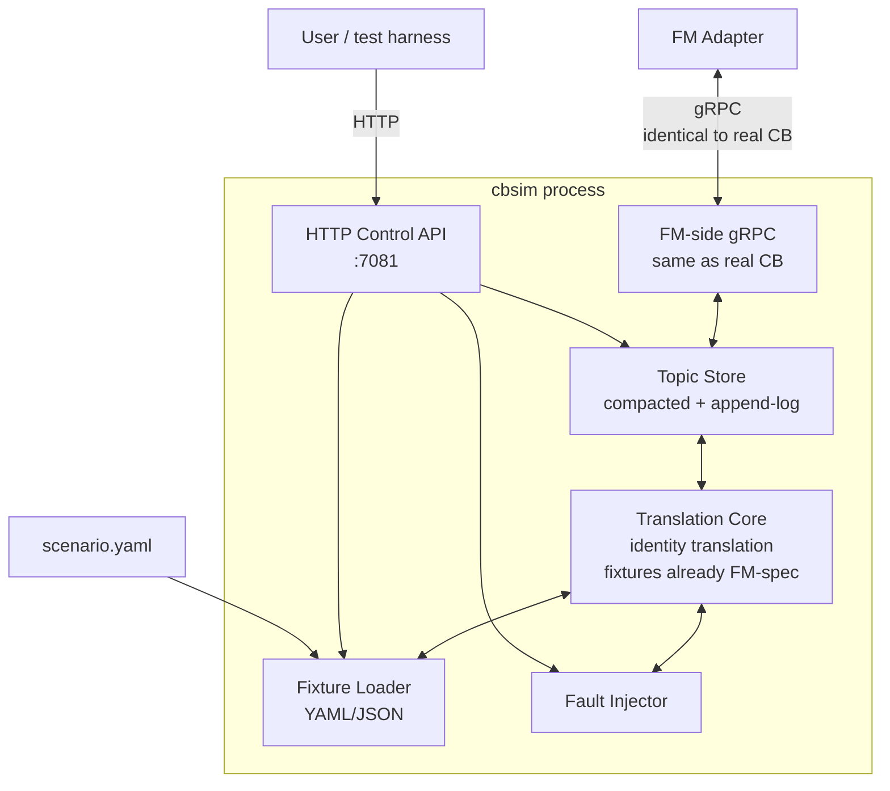

# CB Simulator (`cbsim`) Design

> **Status:** Draft v1
> **Audience:** FM developers (writing tests, demos), conformance harness
> authors, anyone evaluating DashFabric without a real vendor CP.

`cbsim` is a **CB-spec-compliant simulator**. It implements the
**FM-side** of CB exactly — same gRPC, same protos, same conformance
guarantees — but the **CP-side** is replaced with a fixture-driven,
fault-injectable scripted source.

FM cannot tell `cbsim` apart from a real CB. That is the point.

## 1. Why cbsim

| Use case | What cbsim provides |
|----------|---------------------|
| FM dev loop | Boot FM against a known fleet without running a vendor CP |
| Unit / integration tests | Deterministic event sequences; assertable acks |
| Conformance harness self-test | Verify the harness itself works against a known-good CB |
| Demos | Drive a fleet through scripted scenarios on a laptop |
| Regression suite | Replay scenarios that hit historical bugs |
| Multi-vendor parity | Same scenario against `cbsim` and against vendor CB to confirm equivalence |

## 2. Architecture



Key shape: the FM-side and Topic Store are **identical** to a real
CB (linked from the same SDK code). The CP-side adapter is replaced
with a fixture loader + fault injector + HTTP control API. Translations
become identity — fixtures are authored directly in FM-spec, no
vendor schema to bridge.

## 3. Components

### 3.1 Fixture Loader

Reads YAML or JSON describing the initial fleet and timed events.

```yaml
# scenario.yaml
version: 1
initial:
  devices:
    - dpu_id: dpu-001
      host_id: host-A
      lifecycle_state: READY
  vnets:
    - vnet_id: vnet-customer-1
      vni: 100001
      address_spaces: ["10.1.0.0/16"]
  mappings:
    - vnet_id: vnet-customer-1
      entries:
        - dst_prefix: "10.1.1.0/24"
          underlay_ip: "192.0.2.10"
        - dst_prefix: "10.1.2.0/24"
          underlay_ip: "192.0.2.11"
  nics:
    - eni_id: ENI_dpu-001_aabbccddeeff
      mac: "aa:bb:cc:dd:ee:ff"
      dpu_id: dpu-001
      vnet_id: vnet-customer-1
      vm_id: vm-1
      acl_group_in: acl-default
      acl_group_out: acl-default
      admin_state: UP
events:
  - at: 5s
    op: upsert
    topic: /dashfabric/v1/config/nics/ENI_dpu-001_112233445566
    payload:
      eni_id: ENI_dpu-001_112233445566
      mac: "11:22:33:44:55:66"
      dpu_id: dpu-001
      vnet_id: vnet-customer-1
      vm_id: vm-2
      admin_state: UP
  - at: 30s
    op: delete
    topic: /dashfabric/v1/config/nics/ENI_dpu-001_aabbccddeeff
faults:
  - at: 15s
    kind: drop
    topic_pattern: /dashfabric/v1/config/mappings/*
    duration: 5s
  - at: 60s
    kind: resync_required
    topic: /dashfabric/v1/config/vnets/*
```

### 3.2 Fault Injector

Operates between the Topic Store and the FM-side, applying configured
distortions:

| Fault kind | Effect |
|------------|--------|
| `drop` | Discards events on matching topics during window |
| `delay` | Delays events by `jitter_ms` |
| `reorder` | Buffers and emits in shuffled order |
| `duplicate` | Emits each matching event twice |
| `truncate` | Cuts payload (simulates a buggy vendor) |
| `resync_required` | Forces `RESYNC_NEEDED` on next subscribe to matching topics |
| `health_degraded` | `Health()` reports `DEGRADED` for window |
| `crash` | Process exits; restart-via-supervisor required for recovery test |
| `partition` | Refuses gRPC connections for window (network partition sim) |
| `slow_publish` | `PublishResult` artificially delayed |

Faults are scoped by topic pattern and time window.

### 3.3 HTTP Control API

Bound to `:7081` by default. Endpoints:

| Endpoint | Verb | Purpose |
|----------|------|---------|
| `/v1/load` | POST | Load a scenario file |
| `/v1/run` | POST | Begin executing a loaded scenario |
| `/v1/pause`, `/v1/resume` | POST | Stop / resume time |
| `/v1/event` | POST | Inject one ad-hoc event |
| `/v1/fault` | POST | Inject one ad-hoc fault |
| `/v1/peek?topic=…&key=…` | GET | Read current store value |
| `/v1/ack-trace?key=…` | GET | Stream observed acks for a key |
| `/v1/store/dump` | GET | Full store snapshot for debugging |
| `/v1/clear` | POST | Reset to empty state |

### 3.4 Topic Store

Identical implementation to real CB — same code module from the SDK.
Default backend is `memory` (ephemeral). Switchable to `boltdb` for
crash-recovery testing.

### 3.5 Translation Core (identity)

Because fixtures are authored in FM-spec already, the forward
translation is the identity function. This makes fixtures a
double-purpose artifact:

- **Source of truth** for the scenario.
- **Reference** for what a real CB should produce given equivalent
  vendor input.

Reverse translation (FM ack → vendor format) is also identity for
`cbsim`: acks are stored in the topic store and exposed via the HTTP
`/v1/ack-trace` endpoint.

## 4. Operating modes

| Mode | Source | Use case |
|------|--------|----------|
| **Scenario mode** | YAML/JSON file via `--scenario=` flag | Demos, regression tests |
| **Manual mode** | HTTP control API only | Interactive debugging |
| **Replay mode** | Recorded trace from a real CB session (`--replay=trace.jsonl`) | Reproduce bugs from production |
| **Generator mode** | Synthetic load (`--generate=load.yaml`) | High-throughput perf testing |

## 5. Determinism

`cbsim` uses a virtual clock by default (`--virtual-clock`). Time
advances only when commanded:

```bash
cbsim run --scenario=foo.yaml --virtual-clock
# ... in another terminal:
curl -X POST :7081/v1/advance -d '{"by": "30s"}'
```

This makes tests reproducible. Wall-clock mode (`--wall-clock`) is
available for demos.

## 6. Differences vs real CB

| Aspect | Real CB | cbsim |
|--------|---------|-------|
| FM-side gRPC | Same | Same (identical code) |
| Topic Store | Same (vendor's choice) | Memory or BoltDB only |
| CP-side | Vendor adapter to vendor CP | Fixture loader + fault injector |
| Translation | Vendor field maps | Identity (fixtures pre-FM-spec) |
| Health `cp_side` | Real CP status | Synthetic from scenario |
| Watermarks | Vendor-derived | Synthetic monotonic counter `cbsim:N` |
| Determinism | Best-effort | Deterministic with virtual clock |

## 7. Scenario library (initial)

Shipped with the project under `scenarios/`:

| Scenario | What it exercises |
|----------|-------------------|
| `cold-boot-1-vnet-1-eni.yaml` | Cardinal rule, gates G0–G4, single ENI flow |
| `cold-boot-100-vnets-10k-enis.yaml` | Sharing matrix at small scale |
| `add-eni-to-existing-vnet.yaml` | Fast path (vendor pushed VNET already) |
| `vnet-mapping-update.yaml` | Mapping change, all consumers re-ack |
| `nic-delete-retired-vnet.yaml` | RETIRED state ack lifecycle |
| `cb-crash-recovery.yaml` | T17/T18 — kill -9 cbsim, restart, verify resume |
| `vendor-cp-partition.yaml` | T19 — `health_degraded` for 30s |
| `slow-fm-subscriber.yaml` | T12 — verify Publish independence |
| `ha-failover.yaml` | DASH HA pair takeover |
| `large-mapping-resync.yaml` | T16 — 1M-entry mapping table resync |

## 8. Use as conformance reference

The conformance harness (T1–T24) runs against `cbsim` as part of the
DashFabric CI:

- If `cbsim` fails a test, the test is wrong (cbsim is the reference).
- If a vendor CB fails a test that `cbsim` passes, vendor CB is wrong.

This circular sanity check keeps the contract honest.

## 9. Implementation notes

- **Single binary**, Go.
- Linked against `cb-sdk-go` for FM-side parity.
- Embedded HTTP server for control API.
- YAML parsing via standard `gopkg.in/yaml.v3`.
- Virtual clock implemented via a controllable `clockwork.Clock`.
- Crash test mode: `cbsim` exits non-zero on `crash` fault; expected
  to be wrapped in a supervisor (`tini`, `systemd`, K8s `restartPolicy`).

## 10. Out of scope

- **Vendor-specific behaviors.** cbsim does not pretend to be etcd or
  K8s. Vendor-specific quirks must be tested against vendor CB.
- **DPU programming.** cbsim drives FM only; HAL is downstream.
- **Multi-CB scenarios.** Each cbsim instance is a single CB. To
  simulate multi-CB, run multiple cbsim instances on different ports.

## 11. References

- `07-cb-simulator-cli.md` — `cbsim` command reference.
- `04-cb-conformance-suite.md` — tests cbsim must pass (and validate).
- `Specs/cb_fm_protos/` — the contract being implemented.
