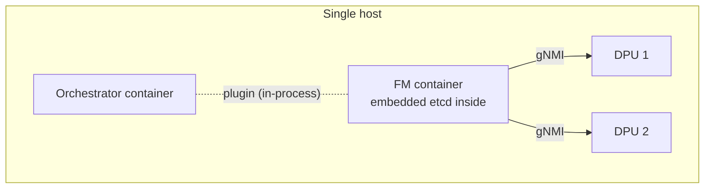
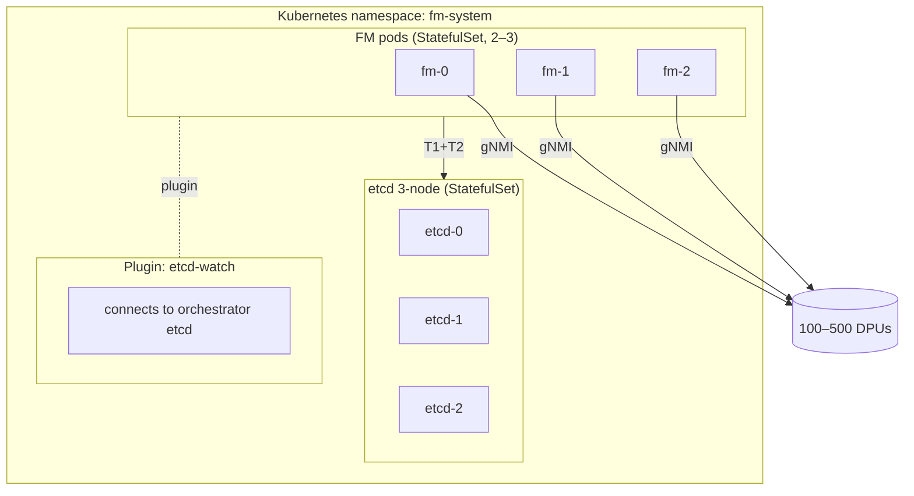
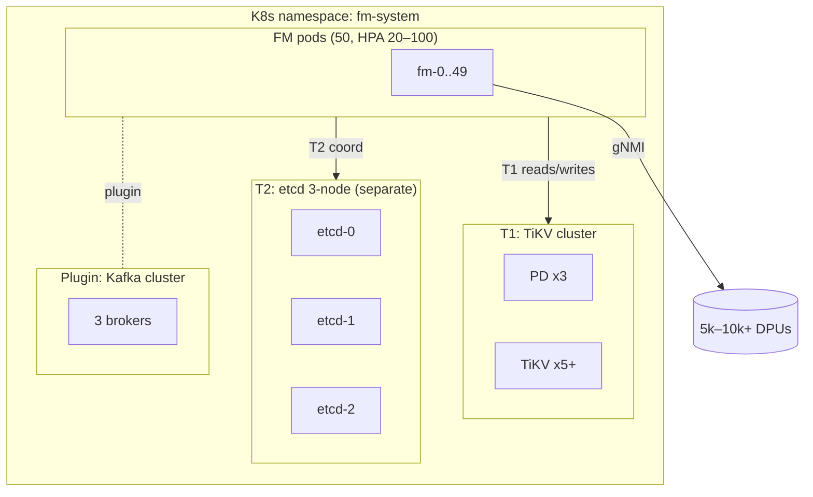
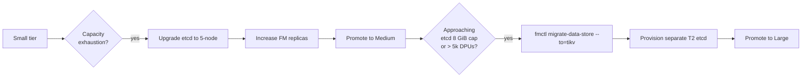

# FleetManager — Deployment Tiers

> **TL;DR:** The same FM binary runs in **four customer tiers** —
> ultra-small docker-compose, small K8s, medium K8s, large K8s+TiKV.
> Only the storage backend, replica count, and plugin choice differ.
> This doc gives **concrete config recipes**, sizing tables, and the
> command lines to bring each tier up.

---

## 1. Tier overview

| Tier | DPUs | ENIs | Hosts | T1 backend | T2 | FM pods | Plugin example |
|------|------|------|-------|------------|----|---------|-----------------|
| **Ultra-small** | 1–100 | <5k | 1 host | embedded etcd OR SQLite | shared with T1 | 1 container | `etcd-watch` (single etcd) |
| **Small** | 100–500 | 5k–50k | 1–3 nodes | etcd 3-node co-located | shared with T1 | 2–3 pods | `etcd-watch` |
| **Medium** | 500–5k | 50k–500k | 3–10 nodes | etcd 3-node dedicated | shared with T1 | 5–20 pods | `k8s-informer` or `kafka` |
| **Large** | 5k–10k+ | 500k–10M | 10+ nodes | etcd 5-node OR TiKV | etcd 3-node *separate* | 20–100 pods | `kafka` or `grpc-sidecar` |

The binary doesn't change. **Configuration is the only difference.**

---

## 2. Tier 1 — Ultra-small (docker-compose)

**Profile:** edge POP, lab, regional dev environment, IoT gateway.
Single host. No K8s.



### 2.1 docker-compose.yml

```yaml
services:
  fm:
    image: dashfabric/fm:latest
    restart: always
    volumes:
      - ./fm-config.yaml:/etc/fm/config.yaml:ro
      - ./fm-data:/var/lib/fm        # persists T1+T3
    ports:
      - "8080:8080"          # REST
      - "5051:5051"          # gRPC northbound
      - "9090:9090"          # metrics
    environment:
      - FM_POD_ID=fm-0
      - FM_CONFIG=/etc/fm/config.yaml
```

### 2.2 fm-config.yaml

```yaml
fm:
  cluster:
    cluster_id: "fm-edge-1"
    pod_id: "fm-0"
    pod_role: ["adapter", "hdo", "co", "no"]

  storage:
    data_store:
      backend: "embedded_etcd"        # or "sqlite" for absolute minimum
      embedded:
        data_dir: "/var/lib/fm/etcd"
        listen_client: "127.0.0.1:2379"
      prefix: "/fm/v1"
      goalstate_durability: "hash_only"

    cluster_state:
      backend: "embedded_etcd"
      share_with_data_store: true     # same backend, prefix /fm/cs

    local:
      backend: "rocksdb"
      path: "/var/lib/fm/local"
      max_size_bytes: 268435456       # 256 MiB

  plugin:
    name: "etcd-watch"
    config_file: "/etc/fm/plugin.yaml"

  shards:
    strategy: "static"                # only 1 pod; no rebalance needed
```

### 2.3 Sizing

| Resource | Size |
|----------|------|
| FM container CPU | 1–2 cores |
| FM container RAM | 1–2 GiB |
| Disk | 10 GiB |
| DPU count cap | ~100 |
| ENI count cap | ~5,000 |

### 2.4 Tradeoffs

- **No HA.** Restart = brief outage; no leader handoff.
- **Backup** = host-level filesystem snapshot of `./fm-data`.
- **Upgrade** = swap container image; ~5–10s outage during restart.
- **Why this tier exists:** small POPs, dev/test, customer eval. Same
  binary so promotion to higher tiers is config-only.

---

## 3. Tier 2 — Small (K8s, co-located etcd)

**Profile:** regional rack, single AZ. 100–500 DPUs.



### 3.1 Helm values (excerpt)

```yaml
fm:
  replicas: 3
  image: dashfabric/fm:1.0.0
  resources:
    requests: { cpu: 2, memory: 4Gi }
    limits:   { cpu: 4, memory: 8Gi }
  storage:
    local:
      size: 10Gi
      storageClass: "fast-ssd"
  config:
    storage:
      data_store:
        backend: "etcd"
        endpoints:
          - "fm-etcd-0.fm-etcd:2379"
          - "fm-etcd-1.fm-etcd:2379"
          - "fm-etcd-2.fm-etcd:2379"
        prefix: "/fm/v1"
        tls: { enabled: true, secret: "fm-etcd-client" }
      cluster_state:
        backend: "etcd"
        share_with_data_store: true
        prefix: "/fm/cs"
      local:
        backend: "rocksdb"
        path: "/var/lib/fm/local"
        max_size_bytes: 2147483648    # 2 GiB
    shards:
      strategy: "rendezvous_hash"
      target_per_pod: 5000

etcd:
  replicas: 3
  resources:
    requests: { cpu: 1, memory: 2Gi }
  storage:
    size: 30Gi
```

### 3.2 Sizing

| Resource | Per FM pod | Per etcd node |
|----------|-----------|---------------|
| CPU | 2–4 cores | 1–2 cores |
| RAM | 4–8 GiB | 2–4 GiB |
| Disk | 10 GiB | 30 GiB |

### 3.3 HA expectations

- 1 FM pod can fail without service degradation.
- 1 etcd node can fail without quorum loss.
- Recovery: pod restart RTO <2 min; etcd node replace <10 min.

---

## 4. Tier 3 — Medium (K8s, dedicated etcd)

**Profile:** regional fleet, multi-AZ K8s. 500–5,000 DPUs.

### 4.1 Helm values (excerpt)

```yaml
fm:
  replicas: 10           # HPA min=10, max=20
  resources:
    requests: { cpu: 4, memory: 16Gi }
    limits:   { cpu: 8, memory: 32Gi }
  storage:
    local:
      size: 50Gi
      storageClass: "fast-ssd"
  topologySpreadConstraints:
    - maxSkew: 1
      topologyKey: topology.kubernetes.io/zone
      whenUnsatisfiable: ScheduleAnyway
  config:
    storage:
      data_store:
        backend: "etcd"
        endpoints: [ "fm-etcd-data-{0..2}.fm-etcd-data:2379" ]
        prefix: "/fm/v1"
      cluster_state:
        backend: "etcd"
        share_with_data_store: true
        prefix: "/fm/cs"
      local:
        backend: "rocksdb"
        max_size_bytes: 17179869184   # 16 GiB
    shards:
      strategy: "rendezvous_hash"
      target_per_pod: 50000

etcd-data:
  replicas: 3
  storage: { size: 100Gi }
  resources: { requests: { cpu: 4, memory: 16Gi } }
```

### 4.2 Plugin choice

- If orchestrator publishes to a Kafka topic: `kafka` plugin.
- If orchestrator is a K8s controller publishing CRDs: `k8s-informer`.
- If orchestrator is custom: `grpc-sidecar` with vendor-supplied
  sidecar.

### 4.3 Sizing

| Resource | Per FM pod | Per etcd node |
|----------|-----------|---------------|
| CPU | 4–8 cores | 4 cores |
| RAM | 16–32 GiB | 16 GiB |
| Disk | 50 GiB | 100 GiB |

### 4.4 HA expectations

- HPA scales pods on CPU + custom metric `fm_owned_enis_per_pod`.
- 2 FM pods can fail simultaneously without service impact.
- etcd at 3 nodes: 1 fail tolerated; for 2-fail tolerance, scale to 5
  (next tier).

---

## 5. Tier 4 — Large (K8s + TiKV / 5-node etcd)

**Profile:** hyperscaler region. 5,000–10,000+ DPUs, 1M–10M ENIs.



### 5.1 Why split T1 and T2

- T1's TiKV scales horizontally to multi-TB; T2 is small but chatty
  (heartbeats every 5s × 50 pods).
- Mixing them subjects T2 ops to TiKV's tail latency.
- Independent failure domains: a T2 etcd outage doesn't poison T1
  reads.

### 5.2 Helm values (excerpt)

```yaml
fm:
  replicas: 50
  hpa:
    minReplicas: 20
    maxReplicas: 100
    metrics:
      - type: Pods
        pods:
          metric: { name: fm_owned_enis_per_pod }
          target: { type: AverageValue, averageValue: 100000 }
  resources:
    requests: { cpu: 8, memory: 64Gi }
  storage:
    local:
      size: 200Gi
      storageClass: "nvme-ssd"
  config:
    storage:
      data_store:
        backend: "tikv"
        pd_endpoints: ["pd-0:2379","pd-1:2379","pd-2:2379"]
        prefix: "/fm/v1"
        goalstate_durability: "hybrid"   # full for last 10 revs
      cluster_state:
        backend: "etcd"
        share_with_data_store: false      # separate cluster
        endpoints: ["fm-cs-etcd-{0..2}.fm-cs-etcd:2379"]
        prefix: "/fm/cs"
      local:
        backend: "rocksdb"
        max_size_bytes: 68719476736       # 64 GiB
    shards:
      strategy: "rendezvous_hash"
      target_per_pod: 100000
      rebalance_threshold: 0.10

  pluginConfig:
    name: "kafka"
    config:
      brokers: ["kafka-0:9092","kafka-1:9092","kafka-2:9092"]
      consumer_group: "fm-adapter"
      topics:
        - { pattern: "fm.vnet.*",    topic: "fm-vnet" }
        - { pattern: "fm.eni.*",     topic: "fm-eni" }
        - { pattern: "fm.mapping.*", topic: "fm-mapping" }

tikv:
  pd: { replicas: 3 }
  tikv:
    replicas: 5
    storage: { size: 1Ti, storageClass: "nvme-ssd" }
    resources: { requests: { cpu: 16, memory: 64Gi } }
```

### 5.3 Sizing

| Resource | Per FM pod | Per TiKV node | Per etcd CS node |
|----------|-----------|---------------|-------------------|
| CPU | 8–16 cores | 16 cores | 2 cores |
| RAM | 64–128 GiB | 64 GiB | 4 GiB |
| Disk | 200 GiB SSD | 1 TiB NVMe | 30 GiB |

### 5.4 Operational notes

- **Read replicas:** point read-heavy registries at TiKV follower
  replicas via PD's region-leader hints to reduce leader pressure.
- **Backups:** TiKV BR (Backup-Restore) → S3 every hour; weekly full.
- **Upgrade:** rolling upgrade FM pods; PDB ensures ≥80% pods stay up.

---

## 6. Cross-tier capability matrix

| Capability | Ultra-small | Small | Medium | Large |
|-----------|-------------|-------|--------|-------|
| HA (FM pod) | no | yes (2/3) | yes (8/10) | yes (40/50) |
| Backup automation | manual fs snapshot | Velero+etcdctl | Velero+etcdctl | Velero+TiKV BR |
| Live upgrade | brief outage | yes (rolling) | yes (rolling) | yes (rolling, PDB) |
| Audit retention | 7 days | 30 days | 90 days | 365 days |
| Telemetry rollup | local file | Prometheus | Prometheus + Thanos | Prometheus + Thanos + cold archive |
| Data-plane HA support | yes | yes | yes | yes (across AZs) |
| Multi-region | no | no | future | future |

---

## 7. Promotion path (small → medium → large)

The binary doesn't change. Promotion is a **migration of state**:



### 7.1 etcd → TiKV migration

```bash
# 1. drain ingest
fmctl freeze-adapter

# 2. migrate
fmctl migrate-data-store \
  --from=etcd --from-endpoints="..." \
  --to=tikv  --to-pd="..." \
  --batch=1000 --verify-hashes

# 3. update config to point at TiKV
kubectl edit cm fm-config

# 4. rolling restart
kubectl rollout restart statefulset/fm

# 5. resume ingest
fmctl unfreeze-adapter
```

Designed to take <30 min for 10M-ENI fleets. Tested in staging
quarterly per [recovery-and-failover-design.md](./recovery-and-failover-design.md) §15.

---

## 8. Plugin choice by tier

| Tier | Default plugin | Why |
|------|---------------|-----|
| Ultra-small | `etcd-watch` (or `rest-poll` for legacy) | Simple; usually orchestrator and FM both run etcd nearby. |
| Small | `etcd-watch` | Same reasoning. |
| Medium | `k8s-informer` or `kafka` | Modern orchestrators publish CRDs or to a queue. |
| Large | `kafka` or `grpc-sidecar` | High event volume needs queue durability; closed-source vendors prefer sidecar. |

A given customer typically picks one plugin per cluster; multi-plugin
mode (one plugin per topic family) is supported but rare.

---

## 9. Networking / security baseline (all tiers)

| Concern | Default |
|---------|---------|
| TLS for T1/T2 | mTLS, cert-manager-issued in K8s tiers |
| TLS for plugin upstream | mTLS, plugin-side cert |
| TLS for HAL (gNMI) | mTLS, per-DPU cert |
| RBAC | minimal — FM service account scoped to FM namespace |
| NetworkPolicy | egress restricted: T1, T2, plugin upstream, DPU mgmt CIDR only |
| PSP / SecurityContext | non-root, read-only fs except `/var/lib/fm` |
| Audit log | mirror to S3 with bucket-lock retention |

---

## 10. Cost / capacity reference (rough)

| Tier | Approximate monthly cloud cost (US-East, on-demand) |
|------|------------------------------------------------------|
| Ultra-small | $50 (1 small VM) |
| Small | $500 (3 small VMs + 3 etcd VMs) |
| Medium | $5,000 (10 medium VMs + 3 etcd VMs) |
| Large | $50,000+ (50 large VMs + 5 TiKV + 3 etcd) |

These are starting points; per-customer pricing varies by region,
reservation discounts, and add-ons (observability stack, backups).

---

## 11. FAQ

**Q: Can a customer skip from Ultra-small straight to Large?**
A: Yes. Migration is config-driven; the binary doesn't know. We
recommend a staging environment in the target tier first.

**Q: Can Tier 1 / 2 use SQLite forever?**
A: SQLite works up to ~1k DPUs and ~50k ENIs. Beyond that, the
single-writer bottleneck shows up. Promote to embedded etcd or
3-node etcd.

**Q: What about hybrid cloud (orchestrator on-prem, FM in cloud)?**
A: Plugin handles it. The plugin endpoint is wherever the
orchestrator's data lives; FM runs in whichever environment fits.

**Q: How do we operate Tier 1 without a full SRE team?**
A: A single ops person with the docker-compose recipe and the
runbooks in [recovery-and-failover-design.md](./recovery-and-failover-design.md)
suffices. Backup is `tar czf fm-backup-$(date).tgz fm-data/`.

---

## See also

- [storage-architecture.md](./storage-architecture.md) — backend interfaces in detail.
- [orchestrator-plugin-interface.md](./orchestrator-plugin-interface.md) — plugin contract.
- [recovery-and-failover-design.md](./recovery-and-failover-design.md) — RTO/RPO per tier.
- [registry-pattern-design.md](./registry-pattern-design.md) — sizing-influencing structure.
- [fleet-manager-hld.md](./fleet-manager-hld.md) — overall architecture.
