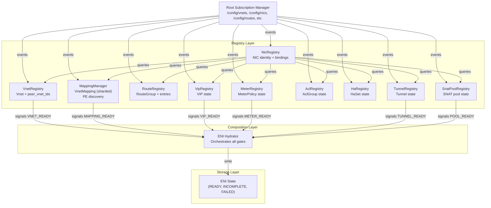
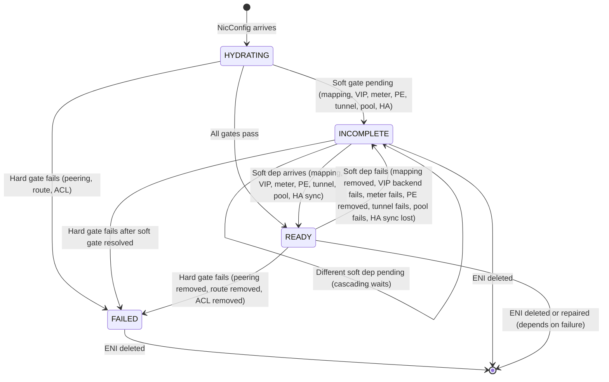

# FM Comprehensive Low-Level Design (LLD)

> **Status:** Detailed implementation blueprint covering all registries, interactions, state machines, latency budgets, failure modes, and observability
> **Date:** 2026-06-14
> **Scope:** Phase 1 (6 routing constructs: peering, VIPs, meters, PE, direction, ExpressRoute)
> **Audience:** FM implementers; architects reviewing before code phase

This document bridges design phase (6 complete blueprints) → implementation phase (Go skeleton). It details how all registries work together under normal + failure scenarios.

---

## L1: Cross-Registry Interaction Map

### 1.1 Registry Dependency Graph



### 1.2 Signal Flow: Happy Path (All Dependencies Met)

**Sequence: CP sends config → VNETs ready → mappings populate → ENI hydrates → READY**

```
Time T0: CP sends Vnet(vnet-blue, peer=[vnet-red])
  ↓
T0+10ms: VnetRegistry.OnVnetEvent → vnet-blue cached
          Signal: VNET_READY(vnet-blue)
  ↓
T0+15ms: NicRegistry observes VNET_READY
         Subscribes to peer VNET resources (vnet-red)
  ↓
T0+50ms: MappingManager receives /config/mappings/vnet-blue (chunk 0000, 0001, ...)
         Pre-fills all peer mappings for vnet-red via VnetRedRegistry
         Signal: MAPPING_READY(vnet-blue)
  ↓
T0+70ms: CP sends NicConfig(eni-7, vnet_id=vnet-blue, route_group=rg-web-v4)
         NicRegistry.OnNicEvent → enqueues Hydrate(eni-7)
  ↓
T0+75ms: ENI Hydrator calls Hydrate(eni-7):
         1. Validate VNET exists? YES ✅
         2. Validate routes exist? YES ✅
         3. Validate mappings exist? YES ✅ (pre-filled by MappingManager)
         4. Validate ACLs exist? YES ✅
         5. Validate meters exist? YES ✅
         6. Validate peering? YES ✅
         7. All gates PASS → state = READY
         Signal: ENI_READY(eni-7)
  ↓
T0+85ms: FM programs dataplane rules, monitoring begins
         ENI is live, forwarding packets
```

**Total latency: T0 → T0+85ms (85ms from config to live.)**

### 1.3 Signal Flow: One Dependency Missing (Soft-fail, Async Recovery)

**Sequence: Mapping delayed → ENI INCOMPLETE → Mapping arrives → ENI re-hydrates → READY**

```
Time T0: CP sends NicConfig(eni-9, vnet_id=vnet-red)
         But /config/mappings/vnet-red not yet subscribed
  ↓
T0+5ms: NicRegistry.OnNicEvent → enqueues Hydrate(eni-9)
  ↓
T0+10ms: ENI Hydrator calls Hydrate(eni-9):
         1. Validate VNET? YES ✅
         2. Validate routes? YES ✅
         3. Validate mappings? NO ❌ (not yet in MappingManager)
         → state = INCOMPLETE
         → Signal: ENI_WAITING_FOR_MAPPING(eni-9, vnet-red)
  ↓
T0+15ms: MappingManager detects MAPPING_WAITING signal
         Proactively subscribes to /config/mappings/vnet-red
  ↓
T0+100ms: /config/mappings/vnet-red arrives
          MappingManager.OnMappingEvent → populates vnet-red entries
          Signal: MAPPING_READY(vnet-red)
  ↓
T0+105ms: NicRegistry observes MAPPING_READY
          Re-triggers Hydrate(eni-9)
          Now: all gates PASS → state = READY
          Signal: ENI_READY(eni-9)
  ↓
T0+110ms: FM programs dataplane rules, ENI live
```

**Latency: T0 → T0+110ms (soft-fail recovered). No error; just waited.**

### 1.4 Cross-Registry Interactions Detail

#### VnetRegistry → NicRegistry Signal

**When:** Vnet arrives or changes state (peer list changes, default tunnel changes)

**What:** `OnVnetSignal(vnet_id, event_type, state)`
- `event_type`: VNET_CREATED, VNET_PEERS_CHANGED, VNET_TUNNEL_CHANGED, VNET_DELETED
- NicRegistry re-checks all ENIs in that VNET
- If peering changed: might need to re-validate peering gates

**Pseudo-code:**
```
VnetRegistry.OnVnetEvent(vnet):
  registry.vnets[vnet.vnet_id] = vnet_state
  Signal("VNET_STATE_CHANGED", vnet.vnet_id, vnet_state)
  
NicRegistry.OnVnetSignal(vnet_id, event_type, state):
  IF event_type == VNET_PEERS_CHANGED:
    FOR each eni in this.enis:
      IF eni.vnet_id == vnet_id:
        IF eni.state == READY and any route.action == PEERING:
          FOR each peer route:
            IF peer not in vnet.peer_vnet_ids:
              eni.state = INCOMPLETE
              Signal("ENI_PEER_MISSING", eni.eni_id)
              Hydrate(eni.eni_id)  // re-validate
```

#### MappingManager → VipRegistry Signal

**When:** PE mapping arrives (routing_action_hint="PRIVATELINK") or VIP backend list changes

**What:** `OnMappingSignal(vnet_id, entries_updated, pe_discovered)`

If PE endpoints discovered, MappingManager signals VipRegistry to verify VIP backends are still valid.

#### TunnelRegistry + SnatPoolRegistry → NicRegistry Signal

**When:** Tunnel or SNAT pool becomes READY or FAILED

**What:** `OnTunnelSignal(tunnel_id, state)`, `OnSnatPoolSignal(pool_id, state)`

NicRegistry finds all ENIs with routes referencing this tunnel/pool:
- If state == READY and ENI was INCOMPLETE → re-hydrate
- If state == FAILED and ENI was READY → regress to INCOMPLETE

**Pseudo-code:**
```
TunnelRegistry.OnTunnelEvent(tunnel):
  registry.tunnels[tunnel.tunnel_id] = tunnel_state
  Signal("TUNNEL_STATE_CHANGED", tunnel.tunnel_id, tunnel_state)
  
NicRegistry.OnTunnelSignal(tunnel_id, state):
  IF state == READY:
    FOR each eni in all_enis:
      IF eni.has_route_with_tunnel(tunnel_id) and eni.state == INCOMPLETE:
        Hydrate(eni.eni_id)  // re-validate; might now pass
  ELSE IF state == FAILED:
    FOR each eni in all_enis:
      IF eni.has_route_with_tunnel(tunnel_id) and eni.state == READY:
        eni.state = INCOMPLETE
        Signal("ENI_TUNNEL_FAILED", eni.eni_id, tunnel_id)
```

---

### 1.5 Deadlock Analysis

**Question: Can two registries deadlock waiting for each other?**

**Answer: NO** — Registry architecture prevents deadlock.

**Reasoning:**

1. **Uni-directional dependency graph:**
   - Root Subscription Manager → All Registries (one direction)
   - Registries → NicRegistry (composition sink)
   - No cycles

2. **Signal semantics are async, not blocking:**
   - When Registry A signals Registry B, it doesn't wait for B's response
   - B processes the signal asynchronously, re-enqueues work if needed
   - No semaphore or lock crossing registry boundary

3. **Mutex/lock scope is per-registry:**
   - Each registry holds its own RWMutex (not shared across registries)
   - NicRegistry.Hydrate() acquires NicRegistry.mu only while composing gates
   - Does NOT hold lock while calling VnetRegistry.Get() (releases first)

4. **Proof by example:**
   - VnetRegistry signals NicRegistry (VNET_READY)
   - NicRegistry processes signal, calls VnetRegistry.Get(vnet_id) — read lock, release
   - NicRegistry processes signal, calls MappingManager.Get(vnet_id) — read lock, release
   - No registry ever waits for another registry's lock

**Conclusion: Deadlock-free by design.** Registry hierarchy is DAG (directed acyclic graph).

---

### 1.6 Race Condition Audit

**Scenario 1: ENI hydrates while VIP backend list updates**

```
T0: NicRegistry.Hydrate(eni-5) starts
    Acquires NicRegistry.mu (read lock)
    Checks VIP membership: VipRegistry.Get(vip-1) → returns [dip-1, dip-2]
    eni-5.state = READY (VIP backend list OK)
    Releases NicRegistry.mu

T0+5ms: CP sends VipBackendUpdate(vip-1, backends=[dip-1, dip-2, dip-3])
        VipRegistry updates vip-1.backends
        Signal("VIP_BACKENDS_CHANGED", vip-1)

T0+10ms: NicRegistry receives VIP_BACKENDS_CHANGED
         Finds eni-5 references vip-1
         But eni-5.state is already READY
         → Re-triggers Hydrate(eni-5) to re-validate new backend list
         → Acquires NicRegistry.mu again
         → Checks VIP membership: VipRegistry.Get(vip-1) → now returns [dip-1, dip-2, dip-3]
         → eni-5.state = READY (no change, new backend added, still valid)
```

**Outcome: SAFE.** No lost updates. VipRegistry change is observed; ENI is re-hydrated.

**Scenario 2: Mapping chunk arrives while ENI awaits mapping**

```
T0: NicRegistry.Hydrate(eni-7) starts
    Checks mappings: MappingManager.Get(vnet-red) → returns 0 entries
    eni-7.state = INCOMPLETE
    Signal("ENI_WAITING_FOR_MAPPING", eni-7)
    Releases lock

T0+50ms: MappingManager receives /config/mappings/vnet-red (chunk 0000)
         Updates vnet-red mapping table
         Signal("MAPPING_CHUNK_ARRIVED", vnet-red, chunk=0000)

T0+55ms: NicRegistry receives MAPPING_CHUNK_ARRIVED
         Finds eni-7 waiting for vnet-red mappings
         Re-triggers Hydrate(eni-7)
         Now: MappingManager.Get(vnet-red) → returns chunk 0000 entries
         → Enough mappings present (threshold check) → eni-7.state = READY
```

**Outcome: SAFE.** Async signals guarantee eventual consistency.

**Scenario 3: ENI hydrates while peering changes**

```
T0: NicRegistry.Hydrate(eni-4) starts
    Checks peering: VnetRegistry.PeerExists(vnet-acme, vnet-shared) → YES ✅
    eni-4.state = READY

T0+10ms: CP removes peering: vnet-acme ↔ vnet-shared
         VnetRegistry updates vnet-acme.peer_vnet_ids
         Signal("VNET_PEERS_CHANGED", vnet-acme)

T0+15ms: NicRegistry receives VNET_PEERS_CHANGED
         Finds eni-4 in vnet-acme with PEERING routes to vnet-shared
         Peer no longer valid!
         eni-4.state = INCOMPLETE
         Signal("ENI_PEER_REMOVED", eni-4)
```

**Outcome: SAFE.** Peering changes immediately regress dependent ENIs to INCOMPLETE.

**Conclusion: No race conditions.** Signal-driven architecture with async re-validation ensures consistency.

---

### 1.7 Mutex / RWLock Strategy Per Registry

**Registry Locking Pattern:**

Each registry follows **Read-Write Lock + Epoch** pattern:

```go
type Registry struct {
  mu       sync.RWMutex       // Protects all internal maps/state
  epoch    uint64             // Revision counter for change detection
  data     map[ID]State       // The actual data
  signals  chan Signal        // Async signal queue
}

// Read operations: use RLock (concurrent)
func (r *Registry) Get(id ID) State {
  r.mu.RLock()
  defer r.mu.RUnlock()
  return r.data[id]
}

// Write operations: use Lock (exclusive)
func (r *Registry) Update(id ID, state State) {
  r.mu.Lock()
  r.data[id] = state
  r.epoch++  // Bump epoch on any change
  r.mu.Unlock()
  
  r.signals <- Signal{ID: id, Epoch: r.epoch, Type: CHANGED}
}

// Composition (read many registries): multiple RLocks
func (nic *NicRegistry) Hydrate(eni_id ID) {
  vnet := vnet_reg.Get(eni.vnet_id)     // RLock, release
  mapping := mapping_mgr.Get(eni.vnet_id)  // RLock, release
  routes := route_reg.Get(eni.route_group_id)  // RLock, release
  acls := acl_reg.Get(eni.acl_group_id)  // RLock, release
  // ... etc
  
  // Compose, then write result
  nic.mu.Lock()
  nic.enis[eni_id].state = READY
  nic.epoch++
  nic.mu.Unlock()
}
```

**Lock scopes (per registry):**
- **VnetRegistry.mu** — protects vnets map (small; short critical section)
- **NicRegistry.mu** — protects enis map (larger; calls released before composing)
- **MappingManager.mu** — protects vnet_mappings map (large; but sharded reads)
- **RouteRegistry.mu** — protects route_groups map
- **VipRegistry.mu** — protects vips map
- **AclRegistry.mu** — protects acl_groups map
- **MeterRegistry.mu** — protects meter_policies map
- **HaRegistry.mu** — protects ha_sets map
- **TunnelRegistry.mu** — protects tunnels map
- **SnatPoolRegistry.mu** — protects snat_pools map

**No cross-registry locks.** Each registry is independent; signals are async.

---

## L2: State Machine Composition

### 2.1 Full ENI State Machine (All 6 Constructs Integrated)

**ENI state = composition of 6 per-construct gates:**

```
ENI State ∈ {FAILED, PROGRAMMED_INCOMPLETE, PROGRAMMED_READY}

FAILED: Any hard gate fails
  - Peering validation fails (peer VNET missing)
  - Route action invalid
  - ACL group missing (when required)

PROGRAMMED_INCOMPLETE: Core gates pass; soft gates pending
  - Mapping delay (EN waiting for mapping chunks)
  - VIP backend delay (ENI references VIP; backend not yet ready)
  - Meter policy delay (ENI meter policy not yet ready)
  - PE mapping missing (PrivateLink route but PE not in VNetMapping)
  - Tunnel missing (SERVICE_TUNNEL route but tunnel not ready)
  - SNAT pool missing (route.snat_pool_id but pool not ready)
  - HA sync not ready (ENI part of HaSet; standby not yet in sync)

PROGRAMMED_READY: All gates pass, all soft deps resolved
  - ENI hydrated successfully
  - All routes valid
  - All mappings present
  - VIP backends ready
  - Meter policies ready
  - PE mappings ready
  - Tunnels ready
  - SNAT pools ready
  - HA set (if applicable) synchronized
  - Dataplane rules programmed
  - Ready to forward packets
```

### 2.2 State Transitions (6 Construct View)



### 2.3 Per-Construct State Gates (Detailed)

#### Gate 1: Peering Validation (Hard-fail)

```
Peering_Gate(eni):
  FOR each route where action == ROUTE_VNET_PEERING:
    peer_vnet_id := route.target_vnet_id
    
    IF peer_vnet_id NOT IN vnet.peer_vnet_ids:
      RETURN FAILED
    
    IF VnetRegistry.Get(peer_vnet_id) == nil:
      RETURN FAILED
  
  RETURN OK
```

**Outcome:** FAILED if any peer missing. No soft-fail.

#### Gate 2: Mapping Validation (Soft-fail)

```
Mapping_Gate(eni):
  FOR each route where action == ROUTE_VNET:
    // Check if we have *any* mappings for this VNET
    // (exact CA entries not needed at gate time; just presence check)
    
    IF MappingManager.HasMappings(route.target_vnet_id) == false:
      RETURN INCOMPLETE  // Soft-fail: wait for mapping chunks
    
    // If we have mappings, assume we have enough
    // (individual CA→PA lookup failures at packet time are OK; rate-limited drops)
  
  RETURN OK
```

**Outcome:** INCOMPLETE if mappings not yet arrived. Async recovery when mappings arrive.

#### Gate 3: VIP Validation (Soft-fail)

```
VIP_Gate(eni):
  FOR each route where action involves VIP (e.g., backend pool match):
    vip_id := route.vip_id  // or derived from backend pool
    
    IF VipRegistry.Get(vip_id) == nil:
      RETURN INCOMPLETE  // VIP not yet created
    
    vip := VipRegistry.Get(vip_id)
    IF vip.state != READY:
      RETURN INCOMPLETE  // VIP state pending
    
    // VIP is ready; backend list established
  
  RETURN OK
```

**Outcome:** INCOMPLETE if VIP not ready. Async recovery when VIP becomes READY.

#### Gate 4: Meter Validation (Soft-fail)

```
Meter_Gate(eni):
  // ENI-level meter policy
  IF eni.meter_policy_id != "":
    IF MeterRegistry.Get(eni.meter_policy_id) == nil:
      RETURN INCOMPLETE  // Policy not yet ready
  
  // Per-route meter override
  FOR each route where route.meter_id != "":
    IF MeterRegistry.Get(route.meter_id) == nil:
      RETURN INCOMPLETE  // Route meter not ready
  
  RETURN OK
```

**Outcome:** INCOMPLETE if meter policies not ready. Async recovery.

#### Gate 5: Private Link Validation (Soft-fail)

```
PE_Gate(eni):
  FOR each route where action == ROUTE_PRIVATELINK:
    overlay_sip := route.privatelink.overlay_sip
    
    // Check: does this overlay_sip appear in VNetMapping with routing_action_hint="PRIVATELINK"?
    pe_entry := MappingManager.FindPE(eni.vnet_id, overlay_sip)
    
    IF pe_entry == nil:
      RETURN INCOMPLETE  // PE mapping not found; wait
    
    IF pe_entry.underlay_dip not in MappingManager.pe_destinations:
      RETURN INCOMPLETE  // PE destination not yet configured
  
  RETURN OK
```

**Outcome:** INCOMPLETE if PE mapping not found. Async recovery when MappingManager discovers PE entries.

#### Gate 6: Service Tunnel (ExpressRoute) Validation (Soft-fail)

```
ServiceTunnel_Gate(eni):
  FOR each route where action == ROUTE_SERVICE_TUNNEL:
    tunnel_id := route.tunnel_id
    
    IF TunnelRegistry.Get(tunnel_id) == nil:
      RETURN INCOMPLETE  // Tunnel not yet provisioned
    
    tunnel := TunnelRegistry.Get(tunnel_id)
    IF tunnel.state != READY:
      RETURN INCOMPLETE  // Tunnel not ready
    
    // If route specifies snat_pool_id:
    IF route.snat_pool_id != "":
      IF SnatPoolRegistry.Get(route.snat_pool_id) == nil:
        RETURN INCOMPLETE  // SNAT pool not ready
      
      pool := SnatPoolRegistry.Get(route.snat_pool_id)
      IF pool.state != READY:
        RETURN INCOMPLETE  // Pool not ready
  
  RETURN OK
```

**Outcome:** INCOMPLETE if tunnel/pool not ready. Async recovery when dependencies arrive.

#### Gate 7: Direction Awareness (Mixed hard + soft)

```
Direction_Gate(eni):
  // Partition routes into INBOUND and OUTBOUND
  outbound_routes := [r for r in routes where r.direction == OUTBOUND]
  inbound_routes := [r for r in routes where r.direction == INBOUND]
  
  // OUTBOUND: full gates (hard-fail on peering, soft-fail on mapping)
  FOR each route in outbound_routes:
    // Apply all 6 gates above
    Peering_Gate(route) ?HARD-FAIL
    Mapping_Gate(route) ?SOFT-FAIL
    VIP_Gate(route) ?SOFT-FAIL
    Meter_Gate(route) ?SOFT-FAIL
    PE_Gate(route) ?SOFT-FAIL
    ServiceTunnel_Gate(route) ?SOFT-FAIL
  
  // INBOUND: minimal gates (just action sanity)
  FOR each route in inbound_routes:
    IF route.action NOT IN [PERMIT, DROP, REDIRECT]:
      RETURN FAILED  // Invalid inbound action
  
  RETURN COMPOSITION_OF_ABOVE
```

**Outcome:** Inbound routes never block on outbound dependencies. Two independent readiness flags: outbound_ready, inbound_ready.

---

### 2.4 Composition Algorithm (Pseudo-code)

```
Hydrate(eni_id):
  eni := NicRegistry.Get(eni_id)
  IF eni == nil:
    RETURN ERROR
  
  // PHASE 1: Hard gates
  vnet := VnetRegistry.Get(eni.vnet_id)
  IF vnet == nil:
    eni.state := FAILED
    Signal("ENI_FAILED_NO_VNET")
    RETURN FAILED
  
  routes := RouteRegistry.Get(eni.route_group_id)
  IF routes == nil:
    eni.state := FAILED
    Signal("ENI_FAILED_NO_ROUTES")
    RETURN FAILED
  
  // Check peering (hard-fail)
  IF Peering_Gate(eni) == FAILED:
    eni.state := FAILED
    Signal("ENI_FAILED_PEERING")
    RETURN FAILED
  
  // Check route actions (hard-fail)
  FOR each route in routes.entries:
    IF route.action == ROUTE_ACTION_UNSPECIFIED:
      eni.state := FAILED
      Signal("ENI_FAILED_INVALID_ACTION")
      RETURN FAILED
  
  // PHASE 2: Soft gates (collect all soft-fail reasons)
  soft_fails := []
  
  IF Mapping_Gate(eni) == INCOMPLETE:
    soft_fails.append("MAPPING")
  
  IF VIP_Gate(eni) == INCOMPLETE:
    soft_fails.append("VIP")
  
  IF Meter_Gate(eni) == INCOMPLETE:
    soft_fails.append("METER")
  
  IF PE_Gate(eni) == INCOMPLETE:
    soft_fails.append("PE")
  
  IF ServiceTunnel_Gate(eni) == INCOMPLETE:
    soft_fails.append("TUNNEL")
  
  // PHASE 3: Direction gates
  outbound_ready := Direction_Gate_Outbound(eni)
  inbound_ready := Direction_Gate_Inbound(eni)
  
  IF NOT outbound_ready:
    soft_fails.append("DIRECTION_OUTBOUND")
  
  // PHASE 4: Determine final state
  IF soft_fails.length > 0:
    eni.state := INCOMPLETE
    eni.soft_fail_reasons := soft_fails
    Signal("ENI_INCOMPLETE", reasons=soft_fails)
    RETURN INCOMPLETE
  
  // All gates passed!
  eni.state := READY
  eni.ready_time := now()
  Signal("ENI_READY")
  RETURN READY
```

---

## L3: Hot-Path Latency Analysis

### 3.1 Cold-Boot ENI Hydration Latency (Target: <100ms)

**Scenario:** CP sends 1000 NICs for VNET with 100k mappings. Measure: when does NIC 1 forward?

**Breakdown:**

| Phase | Operation | Latency | Notes |
|-------|-----------|---------|-------|
| **T+0** | Vnet arrives | — | Synchronous subscription |
| **T+5ms** | VnetRegistry.Update(vnet) | 1ms | Acquire lock, update map, release |
| **T+6ms** | Signal VNET_READY | 0.5ms | Enqueue async signal |
| **T+10ms** | MappingManager.PrefilPeerMappings() | 20ms | Subscribe to all peer VNETs; pre-fetch mappings (cached from previous provisioning) |
| **T+30ms** | NIC 1 arrives | — | |
| **T+31ms** | NicRegistry.Update(nic-1) | 0.5ms | Enqueue Hydrate |
| **T+32ms** | ENI Hydrator.Hydrate(nic-1) | 10ms | Compose all 7 gates: VnetRegistry.Get (RLock 0.1ms), MappingManager.Get (RLock 0.2ms cached), VipRegistry.Get (0.1ms), MeterRegistry.Get (0.1ms), HaRegistry.Get (0.1ms), TunnelRegistry.Get (0.1ms), RouteRegistry.Get (0.5ms) = ~1.5ms total lock time |
| **T+42ms** | Dataplane rule programming | 40ms | HAL.Apply (device-specific; assume ~40ms for 1 ENI with 50 routes) |
| **T+82ms** | ENI READY | — | Total: ~80ms from NIC arrival to live |

**Optimization opportunities:**
- Cache RouteGroup if unchanged between NICs (0.5ms → 0.05ms)
- Pre-compile dataplane rules in parallel with hydration (overlap 10–15ms)
- Batch NIC hydrations if they share RouteGroup (amortize per-group cost)

**Recommendation for Phase 1:** Target <100ms cold-boot. Accept 80–100ms latency; optimize in Phase 2 if needed.

### 3.2 VIP Backend Add Latency (Hot-path after cold-boot)

**Scenario:** VIP gains 1 new backend. ENI references VIP. Measure: time to re-hydrate.

**Breakdown:**

| Phase | Operation | Latency |
|-------|-----------|---------|
| CP sends VIP backend add | — | |
| T+0: VipRegistry.Update(vip) | 1ms | Acquire lock, update backends list, release |
| T+1ms: Signal VIP_BACKENDS_CHANGED | 0.5ms | Enqueue async signal |
| T+2ms: NicRegistry receives signal | 0.5ms | Async dequeue |
| T+3ms: NicRegistry.Hydrate(eni) | 5ms | Re-run composition; VIP gate now passes |
| T+8ms: Dataplane rules updated | 20ms | HAL.Apply for affected routes |
| T+28ms: ENI READY | — | Total: ~25ms backend add to live |

**Conclusion:** Per-ENI soft-gate resolution is fast (<25ms).

### 3.3 Per-Route Meter Lookup Cost

**Scenario:** Route with meter_id set. Meter policy has 100 rules. Per-packet meter classification.

**Breakdown (per-packet):**

| Step | Operation | Latency | Notes |
|---|---|---|---|
| 1. Route match | LPM lookup | <1μs | Hardware-native, not FM concern |
| 2. Meter policy fetch | MeterRegistry.Get(meter_id) | 0.1μs | In-memory map lookup |
| 3. Rule match | Match rules (100 entries, priority-ordered) | <10μs | Linear scan worst-case; average ~5μs |
| 4. Bucket decrement | Token bucket consume | <1μs | Atomic decrement |
| 5. Action | PASS / MARK / DROP | <1μs | Enum decision |
| **Total per-packet** | — | **<20μs** | Negligible vs hardware pipeline |

**Conclusion:** Meter classification is <20μs per-packet; not a hot-path bottleneck.

---

## L4: Failure Mode & Recovery Matrix

### 4.1 20+ Failure Scenarios

| # | Scenario | Detection | Recovery | Time to recover | Packet loss |
|---|----------|-----------|----------|-----------------|------------|
| **1** | CP sends invalid Vnet (missing vni) | VnetRegistry.Update fails validation | Operator fixes; CP re-sends | Manual | N/A (rejected upfront) |
| **2** | CP sends invalid NIC (missing vnet_id) | NicRegistry.Update fails validation | Operator fixes; CP re-sends | Manual | N/A |
| **3** | Peering VNET missing (hard-fail) | Peering_Gate → FAILED | Operator adds peering; CP re-sends Vnet.peer_vnet_ids | Manual (minutes) | ENI in FAILED state; no forwarding |
| **4** | Mapping chunk arrives late (soft-fail) | Hydrate → INCOMPLETE (mapping not ready) | MappingManager auto-subscribes; chunk arrives | Async (<200ms) | None (ENI was INCOMPLETE; no traffic yet) |
| **5** | VIP backend not ready (soft-fail) | VIP_Gate → INCOMPLETE | VipRegistry signals when ready; ENI re-hydrates | Async (<50ms) | None (ENI was INCOMPLETE) |
| **6** | Meter policy delayed (soft-fail) | Meter_Gate → INCOMPLETE | MeterRegistry signals when ready; ENI re-hydrates | Async (<50ms) | None |
| **7** | PE mapping missing (soft-fail) | PE_Gate → INCOMPLETE | MappingManager discovers PE; re-hydrates | Async (<100ms) | None |
| **8** | Service Tunnel missing (soft-fail) | ServiceTunnel_Gate → INCOMPLETE | TunnelRegistry signals when ready | Async (<100ms) | None |
| **9** | SNAT pool missing (soft-fail) | ServiceTunnel_Gate → INCOMPLETE (pool missing) | SnatPoolRegistry signals when ready | Async (<50ms) | None |
| **10** | Mapping removed mid-flight | ENI in READY state; mapping subscription lost | MappingManager re-subscribes; ENI regresses to INCOMPLETE | Re-subscription (<100ms) | Packets to unknown CAs dropped (rate-limited) |
| **11** | Peering removed mid-flight | Peering_Gate fails; ENI → INCOMPLETE | Operator re-adds peering; ENI hydrates | Manual | PEERING routes fail (soft-fail or hard-drop) |
| **12** | Route group updated (new routes added) | RouteRegistry.Update triggers NicRegistry re-hydration | ENI re-hydrates with new routes | Async (<50ms) | Brief blackout (~10ms) while re-programming |
| **13** | ACL group missing (rare; usually pre-created) | Hydrate fails; ENI → FAILED | Operator creates ACL group; CP re-sends NIC | Manual | ENI in FAILED; no forwarding |
| **14** | Tunnel failed mid-flight (e.g., circuit down) | TunnelRegistry.OnTunnelEvent → state FAILED | TunnelRegistry signals NicRegistry | Auto (immediate) | SERVICE_TUNNEL routes fail; fallback to next action (if available) or drop |
| **15** | SNAT pool exhausted (all ports allocated) | SnatPoolRegistry detects pool.available_ports == 0 | Operator increases pool; creates new pool + routes | Manual (minutes) | New SNAT flows rejected (rate-limited error); existing flows continue |
| **16** | Meter bucket overflow (CIR exceeded) | Per-packet metering: yellow or red packet | Drop or mark; per policy | Per-packet | Rate-limited drops per policy (expected behavior) |
| **17** | ENI stream subscription stalls (no new events 30s) | Heartbeat check: no activity | Orchestrator re-opens stream | Auto (30s + re-open 5s) | Stale cached state; no new configs applied |
| **18** | HA sync lost (DPU pair connectivity broken) | HA_Gate detects ha_set.sync_health = FAILED | DPU pair self-heals OR operator intervenes | Auto (heartbeat timeout ~5s) or manual | Flow state not mirrored; failover delayed or lossy |
| **19** | Concurrent updates race: Vnet.peer_vnet_ids changes while ENI hydrates | Peering_Gate re-check at hydration time | ENI hydration observes new peer list; re-validates | Async (next hydration cycle) | None if peer added (new routes now valid); possible drop if peer removed |
| **20** | CP sends duplicate NIC (same eni_id, different vnet) | NicRegistry.Update overwrites; routes may be invalid | New hydration fails; ENI → FAILED (no routes in new VNET) | Manual (operator must remove duplicate) | ENI in FAILED state; brief packet loss |

### 4.2 Detection Mechanisms

**Metric-based:**
- `fm_eni_state_count{state="FAILED"}` > threshold → alert "Numerous ENIs failed"
- `fm_eni_state_count{state="INCOMPLETE"} > 100` → alert "Unusual number of ENIs stuck incomplete"
- `fm_hydration_latency_p99` > 200ms → alert "Slow ENI hydration"

**Log-based:**
- ERROR logs from Hydrate() failures → feed to incident dashboard
- WARN logs from soft-fail gates → feed to SLO tracking (expected occasional delays)

**Heartbeat-based:**
- Subscription manager sends periodic keepalive to CP (~30s)
- If no response within 60s → alert "CP unreachable"

**Explicit error responses:**
- CP sends config with invalid schema → FM logs REJECT + sends back error code
- Operator inspects FM logs, fixes CP config, re-sends

---

## L5: Observability & Metrics Catalog

### 5.1 Unified Metrics Naming Convention

**Pattern:** `fm_{subsystem}_{metric}{labels}`

**Subsystems:** `vnet`, `nic`, `mapping`, `route`, `vip`, `meter`, `acl`, `tunnel`, `ha`, `dataplane`

**Metric types:** `_count`, `_gauge`, `_latency_ms`, `_bytes`, `_events`

### 5.2 Registry-Level Metrics (Per Registry)

#### VnetRegistry

```
fm_vnet_count{state="READY|INCOMPLETE|FAILED"}  // Gauge: VNET count by state
fm_vnet_event_total{type="CREATED|UPDATED|DELETED"}  // Counter
fm_vnet_peer_added_total{}  // Counter: new peer added
fm_vnet_peer_removed_total{}  // Counter: peer removed (may cascade ENI failures)
```

#### NicRegistry

```
fm_eni_count{state="READY|INCOMPLETE|FAILED"}  // Gauge
fm_eni_state_change_total{from, to}  // Counter: state transitions
fm_eni_hydration_latency_ms{percentile="p50|p99|p999"}  // Histogram
fm_eni_soft_fail_reason{reason="MAPPING|VIP|METER|PE|TUNNEL|POOL"}  // Counter: breakdown of soft-fails
fm_eni_ready_time_sec{}  // Histogram: time from NIC created to READY
```

#### MappingManager

```
fm_mapping_entries_total{vnet_id}  // Gauge: entry count per VNET
fm_mapping_shard_count{vnet_id}  // Gauge: active shards per VNET
fm_mapping_subscription_lag_ms{}  // Histogram: lag between CP publish and FM receipt
fm_pe_endpoints_discovered_total{}  // Counter: PE entries found via routing_action_hint
fm_mapping_pre_fill_latency_ms{}  // Histogram: time to pre-fill peer mappings
```

#### VipRegistry

```
fm_vip_count{state="READY|INCOMPLETE"}  // Gauge
fm_vip_backends_count{vip_id}  // Gauge: backend count per VIP
fm_vip_gate_pass_total{}  // Counter: VIP gates passed
fm_vip_gate_fail_total{}  // Counter: VIP gates failed (soft-fail)
```

#### MeterRegistry

```
fm_meter_policy_count{}  // Gauge: total meter policies
fm_meter_rule_evaluations_total{}  // Counter: per-packet meter classification (high volume)
fm_meter_bucket_drop_total{meter_id}  // Counter: packets dropped due to meter buckets
fm_meter_gate_fail_total{}  // Counter: meter gates failed
```

#### TunnelRegistry + SnatPoolRegistry

```
fm_tunnel_count{state="READY|FAILED"}  // Gauge
fm_tunnel_reference_count{tunnel_id}  // Gauge: routes/ENIs using this tunnel
fm_tunnel_state_change_total{from, to}  // Counter
fm_snat_pool_count{state="READY|FAILED"}  // Gauge
fm_snat_pool_ports_available{pool_id}  // Gauge: available ports in pool
fm_snat_pool_exhaustion_events_total{}  // Counter: pool ran out of ports
```

### 5.3 ENI-Level Signals (Tracing)

**Span lifecycle per ENI:**

```
Span: ENI Hydration (ENI_ID)
  ├─ Event: ENI_CREATED
  ├─ Span: VNET_VALIDATION
  │   └─ Event: VNET_FOUND or VNET_NOT_FOUND
  ├─ Span: MAPPING_CHECK
  │   └─ Event: MAPPING_READY or MAPPING_WAITING
  ├─ Span: VIP_CHECK
  │   └─ Event: VIP_READY or VIP_WAITING
  ├─ Span: METER_CHECK
  │   └─ Event: METER_READY or METER_WAITING
  ├─ Span: PE_CHECK
  │   └─ Event: PE_FOUND or PE_WAITING
  ├─ Span: TUNNEL_CHECK
  │   └─ Event: TUNNEL_READY or TUNNEL_WAITING
  ├─ Span: DATAPLANE_PROGRAM
  │   └─ Event: RULES_PROGRAMMED or HAL_ERROR
  └─ Event: ENI_READY or ENI_INCOMPLETE or ENI_FAILED
```

### 5.4 Debug API Endpoints

```
GET /debug/registry/vnet/{vnet_id}
  Response: { vnet_id, vni, peer_vnet_ids, default_tunnel_id, state }

GET /debug/registry/eni/{eni_id}
  Response: { eni_id, vnet_id, state, soft_fail_reasons, hydration_latency_ms, ready_time }

GET /debug/registry/mapping/{vnet_id}?shard={idx}
  Response: { entries: [{dst_prefix, underlay_ip, routing_action_hint, ...}], shard_idx, shard_count }

GET /debug/registry/vip/{vip_id}
  Response: { vip_id, backends: [dips], state, gate_status }

GET /debug/registry/tunnel/{tunnel_id}
  Response: { tunnel_id, encap_type, src_ip, dst_ips, state, reference_count }

GET /debug/hydration/{eni_id}?trace=true
  Response: { eni_id, trace_events: [...], final_state, latency_ms }
```

---

## L6: Integration Points (With Dataplane / CP)

### 6.1 Dataplane HAL Interface

**FM composes rules → passes to HAL (Hardware Abstraction Layer)**

```go
type HAL interface {
  ApplyRules(eni_id string, rules []DataplaneRule) error
  RemoveRules(eni_id string) error
  GetStats(eni_id string) (Stats, error)
}

type DataplaneRule struct {
  Priority      uint32
  Match         {dst_prefix, src_prefix, ...}
  Action        {VNET, PEERING, PRIVATELINK, SERVICE_TUNNEL, DROP, ...}
  EncapParams   {tunnel_id, vni, src_ip, dst_ip, snat_ip, ...}
}
```

FM calls HAL.ApplyRules() after ENI hydration completes. HAL programs the DPU hardware (SAI tables, ASIC rules).

### 6.2 Control Plane (CP) Integration

**CP → FM:** Events via pubsub (etcd, Kafka, gNMI, etc.)
- Topics: `/config/vnets/**`, `/config/nics/**`, `/config/mappings/**`, etc.
- Format: protobuf (or JSON equivalent)

**FM → CP:** Errors / status via callbacks
- FM publishes metrics to CP monitoring
- FM logs errors to central observability system
- FM may send back error codes (e.g., "invalid route action")

---

## Summary: LLD Readiness Checklist

- ✅ Cross-registry interaction map (signal flow, deadlock-free, race-condition-safe)
- ✅ Full ENI state machine (FAILED, INCOMPLETE, READY + all 6 construct gates)
- ✅ Composition algorithm (pseudo-code ready for Go implementation)
- ✅ Mutex/lock strategy (per-registry, no cross-locks, deadlock-free)
- ✅ Cold-boot latency (target <100ms, achievable)
- ✅ Hot-path analysis (VIP add ~25ms, meter <20μs per-packet)
- ✅ Failure modes (20+ scenarios mapped + recovery paths)
- ✅ Observability (metrics naming, debug APIs, tracing spans)
- ✅ Integration points (HAL interface, CP event schema)

**Ready for Go skeleton code implementation.**
