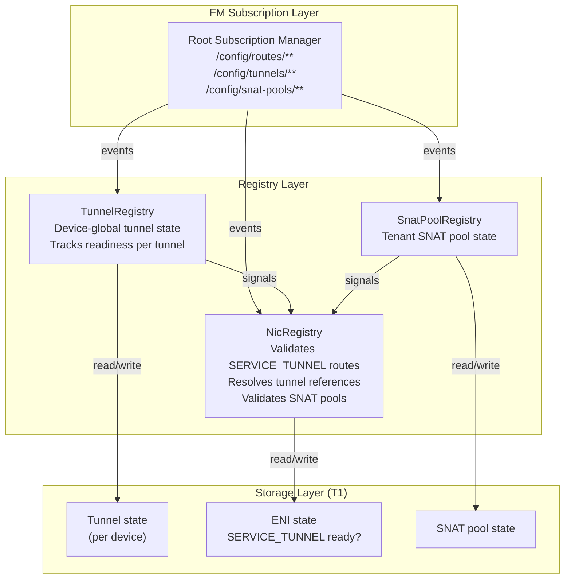

# FM ExpressRoute Architecture — Route-Level Service Tunnel Binding

> **Status:** Design (detailed implementation blueprint)
> **Audience:** FM implementers, hybrid connectivity architects
> **Depends on:** `Specs/protocols/fm-peering-protocol.md` (VNET scoping), `Specs/cb_fm_protos/topics/route.proto` (ROUTE_SERVICE_TUNNEL action)

This document details **how FM handles ExpressRoute and service tunnels**, building on DASH upstream where tunnels are device-global and routes carry tunnel references inline, enabling per-route tunnel flexibility for hybrid connectivity.

## 1. Component Architecture



---

## 2. ExpressRoute / Service Tunnel Model — Route-Level Binding (DASH Native)

**Key principle: Tunnels are device-global, routes reference them.**

From DASH upstream (12-Scenario-PrivateLink-and-ServiceTunnel.md):
```yaml
route:
  priority: 250
  dst_prefix: "20.150.0.0/16"              # Destination prefix
  action: "SERVICE_TUNNEL"                 # Action type
  tunnel_id: "tun-service-storage-westus2" # Device-global tunnel ref
  snat_pool_id: "snat-pool-tenant-acme"    # Optional SNAT pool
  service_vni: 900001                      # Per-service tenant ID
```

**FM sees:**
- Route carries explicit `tunnel_id` (device-global, not VNET-scoped)
- Tunnel exists separately (managed by infrastructure, may be shared)
- SNAT pool is optional per route (operator controls resource allocation)
- Service VNI ties traffic back to tenant (service-side identification)

**No VNET-level binding.** Each route decides its tunnel independently.

---

## 3. TunnelRegistry Design

**Responsibilities:**
- Consume `/config/tunnels/<tunnel_id>` stream (device-global)
- Track tunnel state (READY, FAILED, WAITING)
- Signal readiness to NicRegistry

**State:**
```go
type TunnelRegistry struct {
  tunnels      map[tunnel_id]*TunnelState
  mu           sync.RWMutex
  nic_reg      *NicRegistry
  snat_pool_reg *SnatPoolRegistry
  signals      chan TunnelSignal
}

type TunnelState struct {
  tunnel_id              string
  encap_type             EncapType   // VXLAN, GENEVE, GRE
  src_underlay_ip_v4     IpAddress
  src_underlay_ip_v6     IpAddress
  dst_underlay_ips_v4    []IpAddress  // Can be empty (derived per-flow)
  dst_group              string       // Logical group (e.g., TOR_ANYCAST)
  udp_dst_port           uint32
  state                  TunnelStateEnum  // UNKNOWN, READY, FAILED
  last_updated           time.Time
  failure_reason         string
}

type TunnelStateEnum int
const (
  TunnelStateUNKNOWN TunnelStateEnum = iota
  TunnelStateREADY
  TunnelStateFAILED
)

type TunnelSignal struct {
  Event        string            // "TunnelReady", "TunnelFailed"
  TunnelID     string
  NewState     TunnelStateEnum
}
```

**Algorithm:**
```
OnTunnelEvent(event):
  tunnel := ParseEvent(event)
  
  // Validate tunnel
  IF tunnel.encap_type == UNSPECIFIED:
    state := TunnelStateFAILED
  ELSE IF tunnel.src_underlay_ip_v4 == nil AND tunnel.src_underlay_ip_v6 == nil:
    state := TunnelStateFAILED
  ELSE:
    state := TunnelStateREADY
  
  registry.tunnels[tunnel.tunnel_id] = TunnelState{
    tunnel_id: tunnel.tunnel_id,
    encap_type: tunnel.encap_type,
    src_underlay_ip_v4: tunnel.src_underlay_ip_v4,
    ...
    state: state,
    last_updated: now(),
  }
  
  Signal("TunnelStateChanged", tunnel.tunnel_id, state)
  // NicRegistry will re-check routes referencing this tunnel
```

---

## 4. NicRegistry SERVICE_TUNNEL Route Validation

**New method: ValidateServiceTunnelRoute(route, eni_vnet_id)**

```
ValidateServiceTunnelRoute(route, eni_vnet_id) → error:
  // route.action == ROUTE_SERVICE_TUNNEL
  tunnel_id := route.tunnel_id
  
  // Check: tunnel exists and is ready
  tunnel := tunnel_reg.GetTunnel(tunnel_id)
  IF tunnel == nil OR tunnel.state != READY:
    RETURN error("SERVICE_TUNNEL tunnel not ready: " + tunnel_id)
  
  // Check: optional SNAT pool (if specified)
  IF route.snat_pool_id != "":
    snat_pool := snat_pool_reg.GetSnatPool(route.snat_pool_id)
    IF snat_pool == nil OR snat_pool.state != READY:
      RETURN error("SNAT pool not ready: " + route.snat_pool_id)
  
  // Validate service VNI (if present)
  IF route.service_vni == 0:
    // Optional; some routes may not specify
  
  RETURN nil
```

**Updated Hydration algorithm:**

```
Hydrate(eni_id):
  // ... existing gates (vnet, routes, acls, ha) ...
  
  // NEW: Validate SERVICE_TUNNEL routes
  FOR each outbound_route in outbound_routes:
    IF route.action == ROUTE_SERVICE_TUNNEL:
      err := ValidateServiceTunnelRoute(route, eni.vnet_id)
      IF err != nil:
        eni.state := PROGRAMMED_INCOMPLETE
        Signal("ServiceTunnelNotReady", eni.eni_id, route.tunnel_id)
        RETURN  // soft fail; wait for tunnel
  
  // Continue with existing validation
  // ... peering, PE, meter, VIP, direction validation, etc. ...
```

---

## 5. SnatPoolRegistry Design

**Responsibilities:**
- Consume `/config/snat-pools/<snat_pool_id>` stream
- Track pool state (READY, FAILED)
- Signal to NicRegistry when pool becomes ready

**State:**
```go
type SnatPoolRegistry struct {
  pools     map[snat_pool_id]*SnatPoolState
  mu        sync.RWMutex
  nic_reg   *NicRegistry
  signals   chan SnatPoolSignal
}

type SnatPoolState struct {
  snat_pool_id       string
  pool_ip            IpAddress       // Primary SNAT address
  pool_size          int             // Number of IPs if range
  state              PoolStateEnum   // READY, FAILED, WAITING
  last_updated       time.Time
  failure_reason     string
}

type SnatPoolSignal struct {
  Event              string          // "PoolReady", "PoolFailed"
  SnatPoolID         string
  NewState           PoolStateEnum
}
```

**Algorithm:**
```
OnSnatPoolEvent(event):
  pool := ParseEvent(event)
  pool_state := pool.state == READY ? READY : FAILED
  
  registry.pools[pool.snat_pool_id] = SnatPoolState{
    snat_pool_id: pool.snat_pool_id,
    pool_ip: pool.pool_ip,
    pool_size: pool.pool_size,
    state: pool_state,
    last_updated: now(),
  }
  
  IF pool_state == READY:
    Signal("SnatPoolReady", pool.snat_pool_id)
    // NicRegistry will re-check ENIs referencing routes with this pool
```

---

## 6. Service Tunnel Rule Programming

**When ENI hydration completes with SERVICE_TUNNEL routes:**

```
ProgramServiceTunnelRules(eni_id, route):
  tunnel_id := route.tunnel_id
  tunnel := tunnel_reg.GetTunnel(tunnel_id)
  
  // Extract tunnel details
  src_ip := tunnel.src_underlay_ip_v4 or tunnel.src_underlay_ip_v6
  dst_ips := tunnel.dst_underlay_ips_v4 (or derive per-flow)
  vni := tunnel_vni_for_tenant (from service_vni or config)
  
  // Resolve SNAT pool (if specified)
  snat_ip := nil
  nat_port_range := (0, 0)
  IF route.snat_pool_id != "":
    snat_pool := snat_pool_reg.GetSnatPool(route.snat_pool_id)
    snat_ip := snat_pool.pool_ip
    nat_port_range := snat_pool.port_range (if available)
  
  // Program service tunnel rule in dataplane:
  // Match: dst_prefix (from route), src_ip (overlay)
  // Action: SNAT src → snat_ip (if pool specified)
  //         Encap tunnel: src=src_ip, dst=dst_ips, VNI from service_vni
  
  fm_dataplane.ProgramServiceTunnelRule(
    eni_id: eni_id,
    dst_prefix: route.dst_prefix,
    tunnel: tunnel,
    service_vni: route.service_vni,
    snat_pool: snat_pool_id,
    nat_port_range: nat_port_range
  )
```

---

## 7. Tunnel / SNAT Pool Changes

**On TunnelRegistry signal (tunnel becomes ready/unavailable):**

```
OnTunnelSignal(signal):
  IF signal.Event == "TunnelReady":
    // Find routes referencing this tunnel
    FOR each route in all_routes:
      IF route.action == SERVICE_TUNNEL AND route.tunnel_id == signal.TunnelID:
        // Find ENIs using this route
        FOR each eni in all_enis:
          IF eni.route_group_id references this route:
            IF eni.state == PROGRAMMED_INCOMPLETE:
              Hydrate(eni.eni_id)  // re-validate
              IF eni.state == PROGRAMMED_READY:
                Signal("EniServiceTunnelReady", eni.eni_id)
  
  IF signal.Event == "TunnelFailed":
    FOR each route in all_routes:
      IF route.action == SERVICE_TUNNEL AND route.tunnel_id == signal.TunnelID:
        FOR each eni in all_enis:
          IF eni.route_group_id references this route:
            eni.state := PROGRAMMED_INCOMPLETE
            RemoveServiceTunnelRule(eni.eni_id, route.dst_prefix)
            Signal("EniWaitingForTunnel", eni.eni_id, signal.TunnelID)
```

**On SnatPoolRegistry signal (pool becomes ready/unavailable):**
```
OnSnatPoolSignal(signal):
  IF signal.Event == "SnatPoolReady":
    // Find routes referencing this pool
    FOR each route in all_routes:
      IF route.snat_pool_id == signal.SnatPoolID:
        FOR each eni referencing this route:
          IF eni.state == PROGRAMMED_INCOMPLETE:
            Hydrate(eni.eni_id)  // re-validate
```

---

## 8. ENI State Machine (SERVICE_TUNNEL Extension)

```mermaid
stateDiagram-v2
    Hydrating --> FAILED: Any gate fails
    Hydrating --> INCOMPLETE: Gates pass; tunnel/snat_pool pending
    
    INCOMPLETE --> READY: Tunnel + SNAT pool (if needed) ready
    INCOMPLETE --> FAILED: Gate becomes invalid
    INCOMPLETE --> INCOMPLETE: Tunnel/pool changes
    
    READY --> INCOMPLETE: Tunnel/pool removed or failed
    READY --> [*]: ENI deleted
```



**State transitions (SERVICE_TUNNEL-specific):**

| From | To | Trigger | Action |
|------|----|---------|----|
| Hydrating | INCOMPLETE | SERVICE_TUNNEL route exists; tunnel not ready | Wait for tunnel |
| Hydrating | INCOMPLETE | SERVICE_TUNNEL route with snat_pool_id; pool not ready | Wait for SNAT pool |
| INCOMPLETE | READY | Tunnel ready + SNAT pool ready (if needed) | Transition |
| READY | INCOMPLETE | Tunnel fails or removed | Regress; wait for recovery |
| READY | INCOMPLETE | SNAT pool fails (if referenced) | Regress; wait for recovery |

---

## 9. Monitoring and Observability

**Metrics:**
```
fm_tunnel_state_count{tunnel_id, state="READY|FAILED"}
fm_snat_pool_state_count{snat_pool_id, state="READY|FAILED"}
fm_service_tunnel_rules_active_total{tunnel_id}
fm_eni_service_tunnel_incomplete{eni_id} = count of SERVICE_TUNNEL routes waiting
fm_tunnel_reference_count{tunnel_id} = count of routes/ENIs using this tunnel
```

**Alerts:**
```
Alert "Tunnel Missing":
  IF fm_tunnel_state_count{state="FAILED"} > 5 for 2 min:
    ACTION: Check tunnel provisioning; operator must provision/fix tunnel

Alert "SNAT Pool Unavailable":
  IF fm_snat_pool_state_count{state="FAILED"} > 0 for 2 min:
    ACTION: Check SNAT pool service health

Alert "ENI Stuck SERVICE_TUNNEL-Incomplete":
  IF count(eni.state == INCOMPLETE AND eni.service_tunnel_routes > 0) > 50 for 5 min:
    ACTION: Check TunnelRegistry; one or more tunnels delayed
```

---

## 10. Failure Scenarios and Recovery

| Scenario | Detection | Recovery |
|----------|-----------|----------|
| **Tunnel missing** | Route validation fails | Operator provisions tunnel; TunnelRegistry signals ENI to re-check |
| **Tunnel failed** | TunnelRegistry detects state change | Operator fixes/restores tunnel; TunnelRegistry signals |
| **SNAT pool missing** | Route validation fails (if referenced) | Operator provisions pool; SnatPoolRegistry signals ENI to re-check |
| **Route with missing tunnel** | Hard error during composition | CP should prevent; FM soft-fails ENI to INCOMPLETE |
| **Tunnel shared across many ENIs** | Multiple ENIs waiting for same tunnel | One tunnel fix benefits all affected ENIs |

---

## 11. Integration with All Routing Constructs

**ENI hydration order (final):**
```
Hydrate(eni_id):
  1. Resolve gates (vnet, routes, acls, ha)
  2. Partition routes by direction
  3. Validate outbound routes:
     - ROUTE_VNET (mapping)
     - ROUTE_VNET_PEERING (peering)
     - ROUTE_PRIVATELINK (PE mapping)
     - ROUTE_SERVICE_TUNNEL (tunnel, snat pool) ← NEW
     - ROUTE_SNAT, ROUTE_DIRECT, ROUTE_DROP (minimal validation)
  4. Validate inbound routes (minimal)
  5. Validate peering, VIP, meter, PE dependencies
  6. Check direction dependency met
  7. Program outbound + inbound rules
  8. Program SERVICE_TUNNEL rules ← NEW
  9. Return state READY or INCOMPLETE
```

**Cardinal rule with SERVICE_TUNNEL:**
- One ENI → one RouteGroup (unchanged)
- One RouteGroup → many routes, including SERVICE_TUNNEL routes (NEW)
- One SERVICE_TUNNEL route → one tunnel (device-global, shared by many routes/ENIs)
- Tunnel → may reference optional SNAT pool

---

## 12. Comparison: All Routing Constructs

| Construct | Scope | Binding | Validation | Soft-Fail |
|-----------|-------|---------|------------|-----------|
| **Peering** | VNET | Peering declares | Hard gates | No |
| **VIPs** | VNET | VIP backend list | Soft gates (NAT pool) | Yes |
| **Meters** | Device-global | ENI policy ref | Soft gates | Yes |
| **Private Link** | VNET (VNetMapping) | PE mapping entry | Soft gates (mapping) | Yes |
| **Routes (direction)** | ENI-scoped | RouteGroup + direction | Per-direction gates | Mixed |
| **Service Tunnel (ER)** | Device-global | Route tunnel_id | Soft gates (tunnel, pool) | Yes |

---

## 13. References

- `Specs/Learning-DashNet/12-Scenario-PrivateLink-and-ServiceTunnel.md` — DASH service tunnel model
- `Specs/protos/published/tunnel.md` — Device-global tunnel definition
- `Specs/cb_fm_protos/topics/route.proto` — ROUTE_SERVICE_TUNNEL action, tunnel_id field
- `Specs/FM/fm-registry-peering-design.md` — VNET scope pattern (for contrast)
- `Specs/FM/fm-private-link-design.md` — Soft-fail pattern (reused)
- `Specs/FM/fm-route-direction-design.md` — Direction-aware validation (reused)
