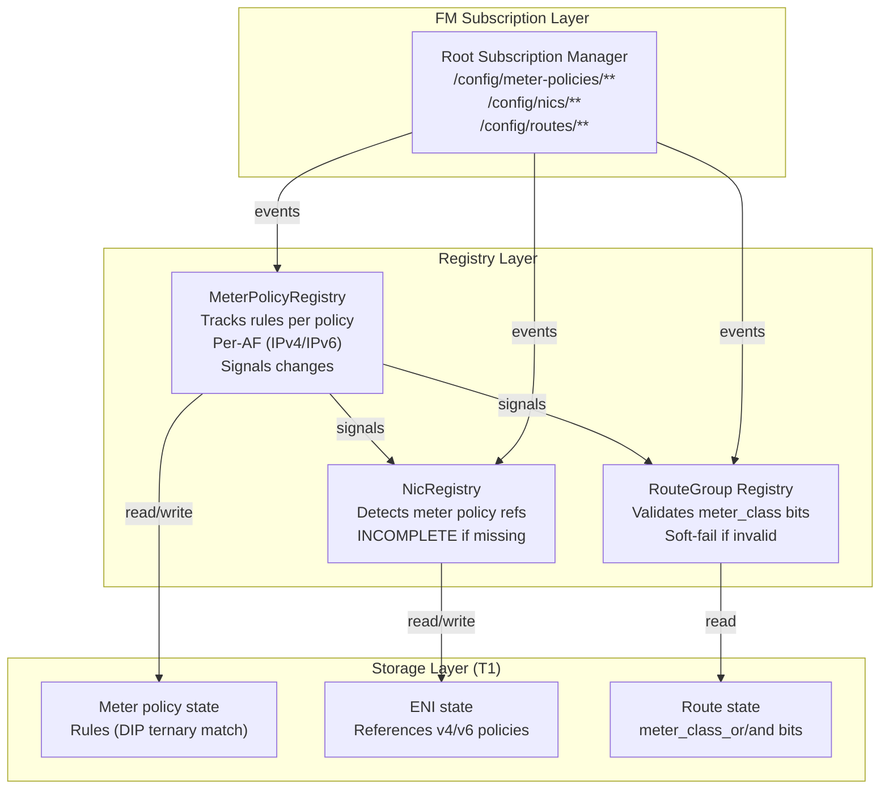

# FM Meter Architecture — Policy Binding & Route-Level Override

> **Status:** Design (detailed implementation blueprint)
> **Audience:** FM implementers, billing/metering architects
> **Depends on:** `Specs/protocols/fm-peering-protocol.md`, `Specs/cb_fm_protos/topics/meter.proto`

This document details **how FM's registries implement meter policy binding and route-level meter selection**, building on the hybrid model: per-ENI meter policy (Case 2) + route-level meter class override (Case 3).

## 1. Component Architecture



---

## 2. MeterPolicyRegistry Design

**Responsibilities:**
- Consume `/config/meter-policies/<policy_id>` stream
- Track rules per policy (ternary match on DIP → meter class)
- Track per-AF policies (IPv4, IPv6 separate)
- Signal state changes to NicRegistry and RouteRegistry

**State:**
```go
type MeterPolicyRegistry struct {
  policies       map[policy_id]*MeterPolicyState
  mu             sync.RWMutex
  nic_reg        *NicRegistry
  route_reg      *RouteRegistry  // for validation
  signals        chan MeterPolicySignal
}

type MeterPolicyState struct {
  policy_id       string
  address_family  AddressFamily     // IPv4 or IPv6
  rules           []MeterRule       // ternary match rules
  state           PolicyStateEnum   // UNKNOWN, READY, FAILED
  last_updated    time.Time
  failure_reason  string            // if state == FAILED
}

type MeterRule struct {
  rule_id         string
  dip             IpAddress         // destination IP for ternary match
  dip_mask        IpAddress         // mask
  meter_class     uint32            // class when matched
  priority        uint32            // higher = better match
}

type PolicyStateEnum int
const (
  PolicyStateUNKNOWN PolicyStateEnum = iota
  PolicyStateREADY
  PolicyStateFAILED
)

type MeterPolicySignal struct {
  Event           string            // "PolicyReady", "PolicyFailed", "RulesChanged"
  PolicyID        string
  AddressFamily   AddressFamily
  NewState        PolicyStateEnum
}
```

**Algorithm:**
```
OnMeterPolicyEvent(event):
  policy := ParseEvent(event)
  
  // Validate policy (basic checks)
  IF policy.address_family == UNSPECIFIED:
    state := PolicyStateFAILED
    reason := "address_family required"
  ELSE:
    // Validate rules (DIP/mask valid, priority unique)
    FOR each rule in policy.rules:
      IF !ValidateRule(rule):
        state := PolicyStateFAILED
        reason := "invalid rule"
        BREAK
    
    IF state != FAILED:
      state := PolicyStateREADY

  registry.policies[policy.policy_id] = MeterPolicyState{
    policy_id: policy.policy_id,
    address_family: policy.address_family,
    rules: policy.rules,
    state: state,
    last_updated: now(),
    failure_reason: reason,
  }
  
  Signal("PolicyStateChanged", policy.policy_id, state)
  // NicRegistry will re-check ENIs referencing this policy
```

---

## 3. NicRegistry Meter Policy Binding

**New fields in ENIState:**
```go
type ENIState struct {
  // ... existing fields ...
  v4_meter_policy_id    string          // from ENI config
  v6_meter_policy_id    string          // from ENI config
  v4_policy_state       MeterPolicyState
  v6_policy_state       MeterPolicyState
  meter_dependency_met  bool            // both policies ready?
}
```

**Updated Hydration:**
```
Hydrate(eni_id):
  // ... existing gates (vnet, routes, acls, ha, peers) ...
  
  // NEW: Resolve meter policies
  eni := lookup(eni_id)
  
  // Resolve IPv4 meter policy (if specified)
  IF eni.v4_meter_policy_id != "":
    policy := meter_policy_reg.Get(eni.v4_meter_policy_id)
    IF policy == nil OR policy.state != READY:
      eni.state := PROGRAMMED_INCOMPLETE
      Signal("NeedsV4MeterPolicy", eni_id, eni.v4_meter_policy_id)
      eni.v4_policy_state := policy
      eni.meter_dependency_met := false
      RETURN  // soft fail; wait for policy
    eni.v4_policy_state := policy
  
  // Resolve IPv6 meter policy (if specified)
  IF eni.v6_meter_policy_id != "":
    policy := meter_policy_reg.Get(eni.v6_meter_policy_id)
    IF policy == nil OR policy.state != READY:
      eni.state := PROGRAMMED_INCOMPLETE
      Signal("NeedsV6MeterPolicy", eni_id, eni.v6_meter_policy_id)
      eni.v6_policy_state := policy
      eni.meter_dependency_met := false
      RETURN  // soft fail; wait for policy
    eni.v6_policy_state := policy
  
  // All meter policies ready
  eni.meter_dependency_met := true
  
  // Continue with state determination
  IF all_gates_pass AND all_peer_mappings_ready AND all_vips_ready AND meter_dependency_met:
    eni.state := PROGRAMMED_READY
  ELSE:
    eni.state := PROGRAMMED_INCOMPLETE
```

**On MeterPolicy signal (from MeterPolicyRegistry):**
```
OnMeterPolicySignal(signal):
  IF signal.Event == "PolicyReady":
    // Find ENIs referencing this policy
    FOR each eni in registry.enis:
      IF (signal.AddressFamily == IPv4 AND eni.v4_meter_policy_id == signal.PolicyID) OR
         (signal.AddressFamily == IPv6 AND eni.v6_meter_policy_id == signal.PolicyID):
        
        // Re-check ENI readiness
        IF eni.state == PROGRAMMED_INCOMPLETE:
          Hydrate(eni.eni_id)  // re-validate
          IF eni.state == PROGRAMMED_READY:
            Signal("EniMeterPolicyReady", eni.eni_id)
  
  IF signal.Event == "PolicyFailed":
    // Find affected ENIs
    FOR each eni in registry.enis:
      IF (signal.AddressFamily == IPv4 AND eni.v4_meter_policy_id == signal.PolicyID) OR
         (signal.AddressFamily == IPv6 AND eni.v6_meter_policy_id == signal.PolicyID):
        
        eni.state := PROGRAMMED_INCOMPLETE
        Signal("EniWaitingForMeterPolicy", eni.eni_id, signal.PolicyID)
```

---

## 4. RouteGroup Meter Class Validation

**Route-level meter override (Case 3):**

Routes carry `meter_class_or` and `meter_class_and` bits. During route validation:

```
ValidateRouteMetering(route, eni_vnet_id):
  // Routes don't reference meter policies directly
  // They carry meter_class_or and meter_class_and bits
  // These bits override the ENI's policy ternary match
  
  // Validation: just check bits are valid UINT32
  IF route.meter_class_or > UINT32_MAX OR route.meter_class_and > UINT32_MAX:
    RETURN error("invalid meter class bits")
  
  // No resource dependency: meter_class bits are local to route
  // They will be combined with ENI's meter policy during packet processing
  RETURN nil
```

**Meter class selection (algorithm from DASH section 4):**
```
When packet arrives at ENI:
  1. aggregated_or := 0, aggregated_and := UINT32_MAX
  2. For each policy match stage (routing, mapping, etc):
       aggregated_or |= stage.meter_class_or
       aggregated_and &= stage.meter_class_and
  3. final_meter_class := aggregated_or & aggregated_and
  4. If final_meter_class == 0:
       Use ENI's meter policy (ternary match on DIP)
  5. final_meter_class → update meter bucket
```

**FM's responsibility (NicRegistry):**
- Validate route meter_class_or/and bits are valid (soft-fail if not)
- Don't create dependencies on meter_class bits (they're configuration, not resources)
- Leave actual meter selection to dataplane (not FM)

---

## 5. ENI State Machine (Meters Extension)

```mermaid
stateDiagram-v2
    Hydrating --> FAILED: Gate fails
    Hydrating --> INCOMPLETE: Gates pass; meters/peers/VIPs pending
    
    INCOMPLETE --> READY: All deps ready (peers, VIPs, meters)
    INCOMPLETE --> FAILED: Gate becomes invalid
    INCOMPLETE --> INCOMPLETE: Meter policy state changes
    
    READY --> INCOMPLETE: Meter policy fails
    READY --> [*]: ENI deleted
```



**State transitions (meters specific):**

| From | To | Trigger | Action |
|------|----|---------|----|
| Hydrating | INCOMPLETE | v4/v6 meter policy missing | Wait for policy |
| INCOMPLETE | READY | Meter policies ready (+ other deps) | Transition |
| READY | INCOMPLETE | Meter policy state → FAILED | Regress; wait for recovery |
| INCOMPLETE | INCOMPLETE | Meter policy rules changed | Re-validate (no state change) |

---

## 6. Monitoring and Observability

**Metrics:**
```
fm_meter_policy_state_count{policy_id, address_family, state="READY|FAILED"}
fm_eni_meter_policy_ready{eni_id} = 1 if both v4/v6 policies ready, else 0
fm_meter_policy_eni_subscribers{policy_id} = count of ENIs referencing this policy
fm_meter_policy_rule_count{policy_id}
fm_eni_meter_dependency_met_total{eni_id}
```

**Alerts:**
```
Alert "Meter Policy Missing":
  IF fm_meter_policy_state_count{state="FAILED"} > 10 for 2 min:
    ACTION: Check meter policy stream; operator must provision valid policy

Alert "ENIs Waiting for Meter Policy":
  IF count(eni.state == INCOMPLETE AND meter_policy_missing) > 50 for 5 min:
    ACTION: Check MeterPolicyRegistry; one or more ENIs stuck waiting
```

---

## 7. Failure Scenarios and Recovery

| Scenario | Detection | Recovery |
|----------|-----------|----------|
| **Meter policy invalid** | Policy validation fails on arrival | Operator fixes policy rules; MeterPolicyRegistry re-validates |
| **ENI references missing policy** | During hydration, policy lookup fails | Operator provisions policy; signal ENI to re-check |
| **Meter policy rules change** | OnMeterPolicyEvent with updated rules | NicRegistry re-validates ENIs (soft-fail if rules invalid) |
| **DIP ternary match conflict** | Rules have overlapping DIP/mask | Operator must fix (higher priority wins) |
| **ENI loses meter policy** | CP removes v4/v6_meter_policy_id from ENI | ENI re-hydrates; meter_dependency_met := false; ENI → INCOMPLETE |

---

## 8. Comparison to Peering & VIPs

| Aspect | Peering | VIPs | Meters |
|--------|---------|------|--------|
| **Scope** | VNET-scoped | VNET-scoped | Device/global |
| **Subscription** | Per-VNET (peering declares) | Per-ENI (via route/VIP ref) | Per-ENI (policy assignment) |
| **Binding** | Peering creates subscriptions | Backend list on VIP | Policy ref on ENI |
| **State** | Hard gates (invalid = FAILED) | Soft gates (missing = INCOMPLETE) | Soft gates (missing = INCOMPLETE) |
| **Route interaction** | Routes must target peered VNETs | Routes → VIPs (one-way) | Routes carry meter_class bits (override) |
| **Dataplane role** | Validate peering before route | SNAT translation | Meter selection (policy + bits) |

---

## 9. Integration with Prior Designs

**ENI hydration order:**
```
Hydrate(eni_id):
  1. Resolve gates (vnet, routes, acls, ha)
  2. Validate peer targets (peering)
  3. Detect VIP membership (if applicable)
  4. Resolve meter policies (NEW)
  5. Check peer mappings ready
  6. Check VIP dependencies ready
  7. Check meter policies ready
  8. Program SNAT rules (for VIPs)
  9. Return state READY or INCOMPLETE
```

**Cardinal rule with meters:**
- One ENI → one RouteGroup (unchanged)
- One ENI → one or two meter policies (v4, v6) (NEW)
- Many ENIs can share same meter policy (refcounted)

---

## 10. References

- `Specs/protocols/fm-peering-protocol.md` — Hard gates for peering
- `Specs/FM/fm-vip-design.md` — Soft gates for VIPs (pattern reused)
- `Specs/cb_fm_protos/topics/meter.proto` — Meter policy config
- DASH metering.md — Meter policy + route-level override model
- `Specs/me-and-ai/meter-policy-scoping-decision.md` — Why Case 2 + Case 3
