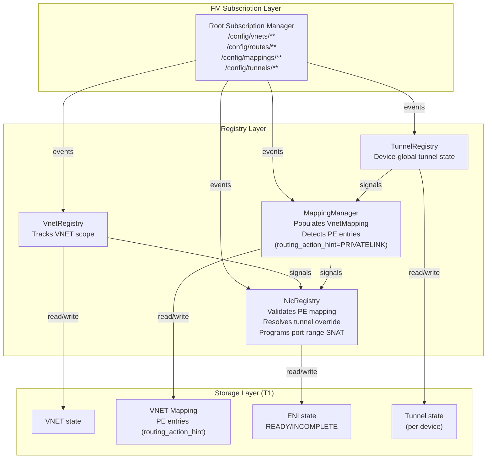

# FM Private Link Architecture — PE Mapping & Route-Level Tunneling

> **Status:** Design (detailed implementation blueprint)
> **Audience:** FM implementers, Private Link / Private Endpoint architects
> **Depends on:** `Specs/protocols/fm-peering-protocol.md` (VNET subscriptions), `Specs/cb_fm_protos/topics/route.proto` (ROUTE_PRIVATELINK action)

This document details **how FM's registries handle Private Link (PE) endpoints**, building on DASH upstream where PE mappings are VNET-scoped (stored in VnetMapping) and routes carry PE-specific encap details inline.

## 1. Component Architecture



---

## 2. Private Link Model — VNET-Scoped via VnetMapping

**Key insight (from DASH upstream):**
- PE endpoints are **allocated IPs within the VNET** (e.g., `10.42.99.100/32`)
- Each PE endpoint = **one entry in VnetMappingChunk** with `routing_action_hint="PRIVATELINK"`
- Routes reference PE via `RouteAction=ROUTE_PRIVATELINK` (not a separate PE ID)
- Tunnels are device-global and can be overridden per mapping via `tunnel_override_id`

**No separate PeRegistry needed.** FM reuses MappingManager's existing VnetMapping infrastructure.

---

## 3. MappingManager PE Detection

**Enhanced to detect PE entries:**

```
OnMappingChunkEvent(chunk):
  FOR each entry in chunk.entries:
    IF entry.routing_action_hint == "PRIVATELINK":
      pe := {
        overlay_ip: entry.overlay_ip,
        underlay_ip: entry.underlay_ip,
        tunnel_override_id: entry.tunnel_override_id,
        vnet_id: chunk.vnet_id,
      }
      mapping_mgr.pe_entries[chunk.vnet_id].append(pe)
      Signal("PeMappingAdded", chunk.vnet_id, pe.overlay_ip)
    ELSE IF entry.routing_action_hint == "VNET":
      // existing logic for regular VNET mappings
```

**State:**
```go
type MappingManager struct {
  // ... existing fields ...
  pe_entries map[vnet_id][]PeMapping  // PE overlays by VNET
  
  mu sync.RWMutex
  nic_reg *NicRegistry
  tunnel_reg *TunnelRegistry
  signals chan MappingSignal
}

type PeMapping struct {
  overlay_ip        IpAddress
  underlay_ip       IpAddress
  tunnel_override_id string  // if set, overrides VNET default tunnel
  vnet_id           string
  state             PeStateEnum  // READY (mapping complete), WAITING (mapping pending)
}

type PeStateEnum int
const (
  PeStateREADY PeStateEnum = iota
  PeStateWAITING
)
```

---

## 4. NicRegistry PE Mapping Validation

**New method: ValidatePeLinkRoute(route, eni_vnet_id)**

```
ValidatePeLinkRoute(route, eni_vnet_id) → error:
  // route.action == ROUTE_PRIVATELINK
  // route.privatelink contains PrivateLinkDetails
  
  pe_overlay_sip := route.privatelink.overlay_sip
  
  // Check: does PE mapping exist in this VNET?
  pe_mapping := mapping_mgr.GetPeMapping(eni_vnet_id, pe_overlay_sip)
  IF pe_mapping == nil:
    RETURN error("PE mapping missing: " + pe_overlay_sip)
  
  // Check: tunnel override (if specified)
  tunnel_id := pe_mapping.tunnel_override_id
  IF tunnel_id == "":
    // Use VNET default tunnel
    vnet := vnet_reg.GetVnet(eni_vnet_id)
    tunnel_id = vnet.tunnel_id
  
  tunnel := tunnel_reg.GetTunnel(tunnel_id)
  IF tunnel == nil OR tunnel.state != READY:
    RETURN error("Tunnel not ready: " + tunnel_id)
  
  // Validate PrivateLinkDetails fields
  IF route.privatelink.vni == 0:
    RETURN error("PE VNI required")
  IF route.privatelink.nat_port_range_start == 0 OR route.privatelink.nat_port_range_end == 0:
    RETURN error("PE port range required")
  
  RETURN nil
```

**Updated Hydration algorithm:**

```
Hydrate(eni_id):
  // ... existing gates (vnet, routes, acls, ha) ...
  
  // NEW: Validate routes with ROUTE_PRIVATELINK action
  FOR each route in eni.route_group.routes:
    IF route.action == ROUTE_PRIVATELINK:
      err := ValidatePeLinkRoute(route, eni.vnet_id)
      IF err != nil:
        eni.state := PROGRAMMED_INCOMPLETE
        Signal("NeedsPrivateLinkMapping", eni.eni_id, route.privatelink.overlay_sip)
        RETURN  // soft fail; wait for PE mapping
  
  // Continue with existing logic
  // ... peering validation, VIP membership, meter policies, etc. ...
```

---

## 5. PE Route Programming

**When ENI hydration completes with PE routes:**

```
ProgramPrivateLinkRules(eni_id, route):
  route_details := route.privatelink
  
  // Extract PE details from route
  overlay_sip := route_details.overlay_sip        // source IP (overlay)
  underlay_dip := route_details.underlay_dip      // destination IP (PE ingress)
  vni := route_details.vni                        // VNI for encap
  nat_port_start := route_details.nat_port_range_start
  nat_port_end := route_details.nat_port_range_end
  
  // Resolve tunnel
  pe_mapping := mapping_mgr.GetPeMapping(eni.vnet_id, overlay_sip)
  tunnel_id := pe_mapping.tunnel_override_id
  IF tunnel_id == "":
    tunnel_id = vnet_reg.GetVnet(eni.vnet_id).tunnel_id
  tunnel := tunnel_reg.GetTunnel(tunnel_id)
  
  // Program PE rule in dataplane:
  // Match: src_ip == eni.overlay_ip AND dst_ip == overlay_sip (dest PE endpoint)
  // Action: SNAT src → underlay_sip (from tunnel), encap VXLAN to underlay_dip with VNI
  //         Port rewrite: src_port ∈ [nat_port_start, nat_port_end] (NAT'd on reverse path)
  
  fm_dataplane.ProgramPeRule(
    eni_id: eni_id,
    overlay_sip: overlay_sip,
    underlay_dip: underlay_dip,
    vni: vni,
    tunnel: tunnel,
    nat_port_range: (nat_port_start, nat_port_end)
  )
```

---

## 6. PE Mapping Changes

**On MappingManager signal (PE added/removed):**

```
OnPeMappingSignal(signal):
  IF signal.Event == "PeMappingAdded":
    // Find routes targeting this PE overlay IP
    FOR each route in all_routes:
      IF route.action == ROUTE_PRIVATELINK AND route.privatelink.overlay_sip == signal.overlay_ip:
        // Find ENIs that use this route
        FOR each eni in enis_in_vnet(signal.vnet_id):
          IF eni.route_group_id references this route:
            IF eni.state == PROGRAMMED_INCOMPLETE:
              Hydrate(eni.eni_id)  // re-validate
              IF eni.state == PROGRAMMED_READY:
                Signal("EniPrivateLinkReady", eni.eni_id)
  
  IF signal.Event == "PeMappingRemoved":
    // Find routes targeting this PE overlay IP
    FOR each route in all_routes:
      IF route.action == ROUTE_PRIVATELINK AND route.privatelink.overlay_sip == signal.overlay_ip:
        FOR each eni in enis_in_vnet(signal.vnet_id):
          IF eni.route_group_id references this route:
            eni.state := PROGRAMMED_INCOMPLETE
            RemovePeRule(eni.eni_id, signal.overlay_ip)
            Signal("EniWaitingForPrivateLink", eni.eni_id)
```

---

## 7. ENI State Machine (PE Extension)

```mermaid
stateDiagram-v2
    Hydrating --> FAILED: Gate fails
    Hydrating --> INCOMPLETE: Gates pass; PE mappings pending
    
    INCOMPLETE --> READY: All PE mappings + other deps ready
    INCOMPLETE --> FAILED: Gate becomes invalid
    INCOMPLETE --> INCOMPLETE: PE mapping change
    
    READY --> INCOMPLETE: PE mapping removed
    READY --> [*]: ENI deleted
```



**State transitions (PE-specific):**

| From | To | Trigger | Action |
|------|----|---------|----|
| Hydrating | INCOMPLETE | PE route exists but mapping missing | Wait for PE mapping arrival |
| INCOMPLETE | READY | PE mapping arrives (+ other deps ready) | Transition |
| READY | INCOMPLETE | PE mapping removed | Regress; wait for recovery |
| INCOMPLETE | INCOMPLETE | PE mapping content changes | Re-validate (no state change) |

---

## 8. Tunnel Override Handling

**When PE mapping specifies tunnel_override_id:**

```
ValidatePeTunnel(pe_mapping):
  tunnel_id := pe_mapping.tunnel_override_id
  IF tunnel_id == "":
    // Use VNET default
    tunnel_id = vnet_reg.GetVnet(pe_mapping.vnet_id).tunnel_id
  
  tunnel := tunnel_reg.GetTunnel(tunnel_id)
  IF tunnel == nil:
    RETURN error("Tunnel not found")
  
  IF tunnel.state != READY:
    RETURN error("Tunnel not ready")
  
  RETURN nil
```

**Signal chain on tunnel change:**
```
OnTunnelSignal(signal):
  IF signal.Event == "TunnelReady":
    // Find all PE mappings using this tunnel
    FOR each vnet_id in all_vnets:
      FOR each pe_mapping in mapping_mgr.pe_entries[vnet_id]:
        IF pe_mapping.tunnel_override_id == signal.tunnel_id:
          // Re-validate PE routes using this tunnel
          FOR each route with this PE overlay IP:
            FOR each eni using route:
              IF eni.state == PROGRAMMED_INCOMPLETE:
                Hydrate(eni.eni_id)
```

---

## 9. Monitoring and Observability

**Metrics:**
```
fm_pe_mapping_state_count{vnet_id, overlay_ip, state="READY|WAITING"}
fm_pe_routes_active_total{vnet_id}
fm_pe_tunnel_override_active_count{tunnel_id}
fm_eni_pe_route_incomplete{eni_id} = count of PE routes waiting for mapping
fm_pe_port_range_allocation_total{vnet_id}
```

**Alerts:**
```
Alert "PE Mapping Missing":
  IF fm_pe_mapping_state_count{state="WAITING"} > 10 for 2 min:
    ACTION: Check if PE mappings stream stalled; operator must provision PE

Alert "ENI Stuck PE-Incomplete":
  IF count(eni.state == INCOMPLETE AND eni.pe_routes > 0) > 50 for 5 min:
    ACTION: Check MappingManager; one or more PE mappings delayed
```

---

## 10. Failure Scenarios and Recovery

| Scenario | Detection | Recovery |
|----------|-----------|----------|
| **PE mapping missing** | Route validation fails on hydration | Operator provisions PE mapping entry in VnetMapping; MappingManager signals ENI to re-check |
| **PE tunnel missing** | Tunnel lookup fails | Operator provisions Tunnel; TunnelRegistry signals ENI to re-validate |
| **PE mapping removed** | MappingManager signal | ENI re-hydrates; regresses to INCOMPLETE; re-check when mapping returns |
| **Route without PE mapping** | Hard error during compose (CP should prevent) | Operator fixes route (removes ROUTE_PRIVATELINK or ensures mapping exists) |
| **Port range conflict** | Multiple routes with overlapping port ranges (rare) | Port ranges are per-route; HAL ensures SNAT uniqueness per ENI/destination pair |

---

## 11. Integration with Prior Designs

**ENI hydration order (extended):**
```
Hydrate(eni_id):
  1. Resolve gates (vnet, routes, acls, ha)
  2. Validate peer targets (peering)
  3. Detect VIP membership (if applicable)
  4. Validate PE routes (NEW)
  5. Resolve meter policies
  6. Check peer mappings ready
  7. Check VIP dependencies ready
  8. Check PE mappings ready
  9. Check meter policies ready
  10. Program SNAT rules (for VIPs)
  11. Program PE rules (NEW)
  12. Return state READY or INCOMPLETE
```

**Cardinal rule with PE:**
- One ENI → one RouteGroup (unchanged)
- One RouteGroup → many routes, including PE routes (ROUTE_PRIVATELINK)
- One PE route → one PE mapping (overlay_sip → underlay mapping in VnetMapping)
- PE mappings are VNET-scoped (shared by all ENIs in VNET)

---

## 12. Comparison to Peering, VIPs, Meters

| Aspect | Peering | VIPs | Meters | PE |
|--------|---------|------|--------|-----|
| **Scope** | VNET-scoped | VNET-scoped | Device-global | VNET-scoped (via VnetMapping) |
| **Subscription** | Peering declares | Per-ENI (via route/VIP ref) | Per-ENI (policy assignment) | VnetMapping chunks (MappingManager) |
| **Binding** | Peering creates subscriptions | Backend list on VIP | Policy ref on ENI | Mapping entry (routing_action_hint) |
| **State** | Hard gates (invalid = FAILED) | Soft gates (missing = INCOMPLETE) | Soft gates (missing = INCOMPLETE) | Soft gates (missing = INCOMPLETE) |
| **Route interaction** | Routes must target peered VNETs | Routes → VIPs (one-way) | Routes carry meter_class bits (override) | Routes carry PE details (inline) |
| **Dataplane role** | Validate peering before route | SNAT translation | Meter selection (policy + bits) | Encap + SNAT (port range) to PE |

---

## 13. References

- `Specs/Learning-DashNet/12-Scenario-PrivateLink-and-ServiceTunnel.md` — DASH Private Link walkthrough
- `Specs/protos/published/vnet-mapping.md` — VnetMapping structure (PE entries with routing_action_hint)
- `Specs/protos/published/tunnel.md` — Device-global tunnel definition
- `Specs/cb_fm_protos/topics/route.proto` — RouteAction.ROUTE_PRIVATELINK, PrivateLinkDetails
- `Specs/FM/fm-registry-peering-design.md` — VNET subscription pattern (reused)
- `Specs/FM/fm-vip-design.md` — Soft-fail gate pattern (reused)
