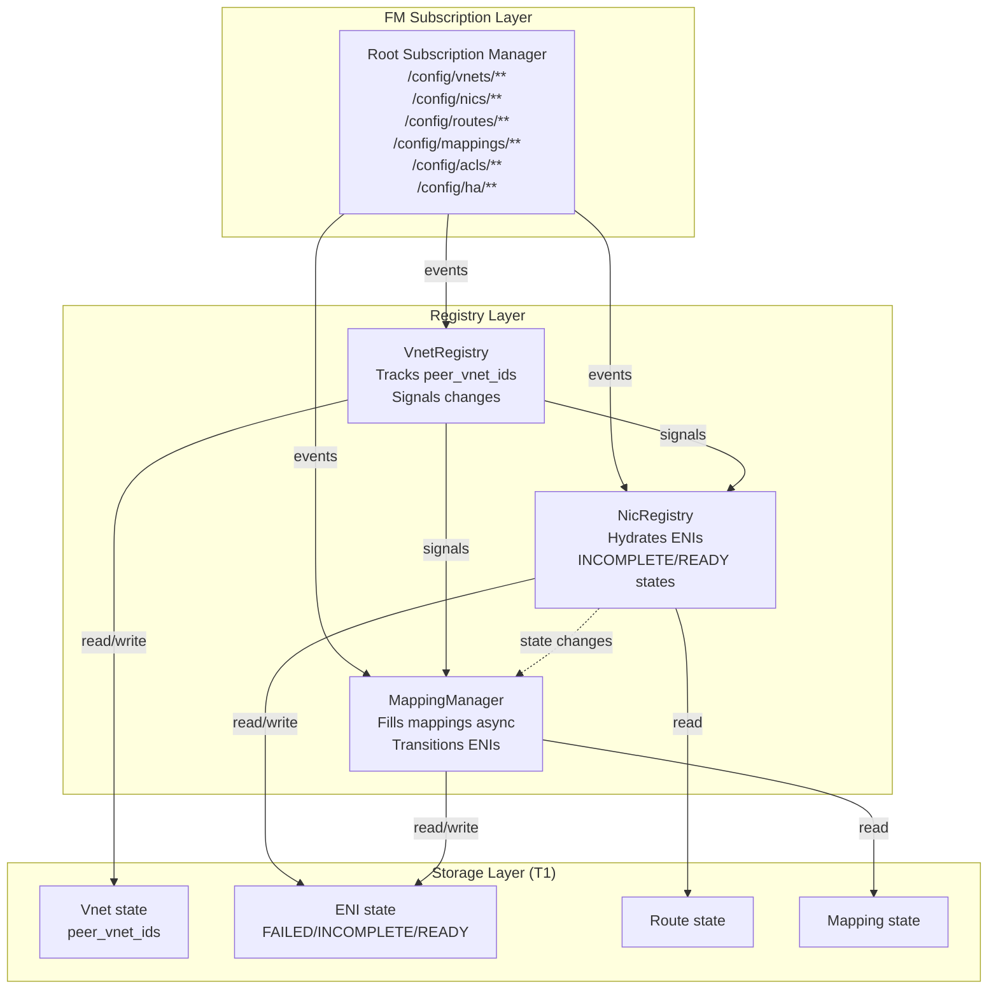
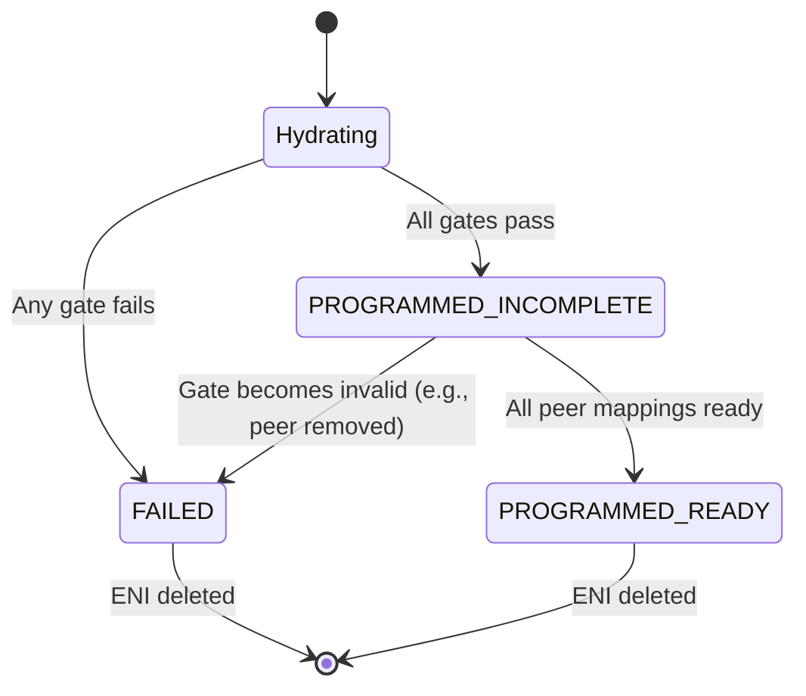

# FM Registry Architecture — Peering Design

> **Status:** Design (detailed implementation blueprint)
> **Audience:** FM implementers, registry architects
> **Depends on:** `Specs/protocols/fm-peering-protocol.md` (design decisions)

This document details **how FM's registries implement peering**, building on the hybrid
model: proactive subscriptions + reactive ENI state tracking + async mapping fill.

## 1. Component architecture



## 2. VnetRegistry design

**Responsibilities:**
- Consume `/config/vnets/**` stream
- Track `peer_vnet_ids` for each VNET
- Signal peering changes to downstream systems

**State:**
```go
type VnetRegistry struct {
  vnets    map[vnet_id]*VnetState
  mu       sync.RWMutex
  signals  chan VnetSignal
}

type VnetState struct {
  vnet_id          string
  vni              uint32
  peer_vnet_ids    []string   // latest declaration
  last_updated     time.Time
}

type VnetSignal struct {
  Event      string  // "PeerAdded", "PeerRemoved", "VnetDeleted"
  VnetID     string
  Peers      []string
}
```

**Algorithm:**
```
OnVnetEvent(event):
  vnet := ParseEvent(event)
  old_peers := registry.vnets[vnet.vnet_id].peer_vnet_ids
  new_peers := vnet.peer_vnet_ids
  
  registry.vnets[vnet.vnet_id] = VnetState{
    vnet_id: vnet.vnet_id,
    vni: vnet.vni,
    peer_vnet_ids: new_peers,
    last_updated: now(),
  }
  
  // Detect changes
  added := new_peers - old_peers
  removed := old_peers - new_peers
  
  FOR each peer in added:
    Signal("PeerAdded", vnet.vnet_id, peer)
  
  FOR each peer in removed:
    Signal("PeerRemoved", vnet.vnet_id, peer)
    // Will trigger ENI re-validation in NicRegistry
```

## 3. NicRegistry design

**Responsibilities:**
- Consume `/config/nics/**` stream
- Hydrate ENIs through gates
- Track ENI state: FAILED, PROGRAMMED_INCOMPLETE, PROGRAMMED_READY
- Signal NeedsMappings to MappingManager

**State:**
```go
type NicRegistry struct {
  enis     map[eni_id]*ENIState
  mu       sync.RWMutex
  vnet_reg *VnetRegistry  // for peer lookups
  signals  chan ENISignal
}

type ENIState struct {
  eni_id                 string
  vnet_id                string
  state                  ENIState_Enum  // FAILED, INCOMPLETE, READY
  routes_to_peers        []string       // peer_vnet_ids this ENI references
  mappings_ready_for     map[string]bool // peer_vnet_id → is_ready
  last_state_change      time.Time
}

type ENIState_Enum int
const (
  FAILED ENIState_Enum = iota
  PROGRAMMED_INCOMPLETE
  PROGRAMMED_READY
)

type ENISignal struct {
  Event     string  // "NeedsMappings", "StateChange"
  ENIID     string
  NewState  ENIState_Enum
  NeededPeers []string
}
```

**Hydration algorithm:**
```
Hydrate(eni_id):
  // Gate 1: Resolve required objects
  vnet := Lookup(eni.vnet_id)
  IF vnet == nil:
    setState(eni_id, FAILED)
    RETURN
  
  routes := Lookup(eni.route_group_id)
  IF routes == nil:
    setState(eni_id, FAILED)
    RETURN
  
  FOR each acl_group in eni.acl_groups:
    IF Lookup(acl_group) == nil:
      setState(eni_id, FAILED)
      RETURN
  
  // Gate 2: Validate route targets are peered
  peers_needed := {}
  FOR each route in routes:
    IF route.action == ROUTE_VNET:
      target := route.target_vnet_id
      IF target != eni.vnet_id:
        // Cross-VNET route; target must be peered
        IF target NOT IN vnet.peer_vnet_ids:
          setState(eni_id, FAILED)
          RETURN
        peers_needed.add(target)
  
  // All gates pass; mappings are async
  setState(eni_id, PROGRAMMED_INCOMPLETE)
  Signal("NeedsMappings", eni_id, peers_needed)
```

**On peering change (signal from VnetRegistry):**
```
OnPeerSignal(signal):
  FOR each eni in vnets[signal.VnetID]:
    Hydrate(eni.eni_id)  // Re-validate
```

## 4. MappingManager design

**Responsibilities:**
- Consume `/config/mappings/**` stream
- Track which mappings have arrived for each VNET
- Update ENI state when all peer mappings are ready
- Expose mapping availability queries

**State:**
```go
type MappingManager struct {
  mappings_by_vnet  map[vnet_id]MappingState
  eni_waiting_for   map[eni_id][]string  // eni_id → list of peer_vnet_ids it needs
  mu                sync.RWMutex
  nic_reg           *NicRegistry
}

type MappingState struct {
  vnet_id      string
  arrivals     []time.Time  // when mappings started flowing
  is_complete  bool
}
```

**Algorithm:**
```
OnMappingEvent(event):
  vnet_id := ExtractVnetID(event.topic)
  
  IF mappings_by_vnet[vnet_id] == nil:
    mappings_by_vnet[vnet_id] = MappingState{
      vnet_id: vnet_id,
      arrivals: [now()],
      is_complete: true,  // assume complete until we know better
    }
  ELSE:
    // Update completion based on event count / heuristics
    IF AllMappingsReceived(vnet_id):
      mappings_by_vnet[vnet_id].is_complete = true
  
  // Signal affected ENIs: "your peer is now ready"
  FOR each eni_id, peers in eni_waiting_for:
    IF vnet_id IN peers:
      CheckENIReady(eni_id)

CheckENIReady(eni_id):
  eni := nic_reg.enis[eni_id]
  FOR each peer in eni.routes_to_peers:
    IF !mappings_by_vnet[peer].is_complete:
      RETURN  // Still waiting
  
  // All peers ready
  IF eni.state == PROGRAMMED_INCOMPLETE:
    nic_reg.setState(eni_id, PROGRAMMED_READY)
    REMOVE eni_id from eni_waiting_for
```

## 5. ENI state machine (detailed)



**Transitions and actions:**

| From | To | Trigger | Action |
|------|----|---------|----|
| Hydrating | FAILED | Gate fails | Log error; alert operator |
| Hydrating | INCOMPLETE | Gates pass | Signal MappingManager; start monitoring |
| INCOMPLETE | READY | All peer mappings ready | Update state; clear waiting flags |
| INCOMPLETE | FAILED | Gate becomes invalid (peer removed) | Log error; trigger re-hydration |
| READY/FAILED | [*] | ENI delete event | Clean up state |

## 6. Monitoring and observability

**Metrics:**
```
fm_eni_state_count{state="FAILED"}
fm_eni_state_count{state="INCOMPLETE"}
fm_eni_state_count{state="READY"}

fm_eni_incomplete_duration_seconds  // histogram; alerts if > 5 min
fm_mapping_arrival_latency_seconds  // peer mapping latency
```

**Alerts:**
```
Alert "ENI stuck INCOMPLETE":
  IF count(eni.state == INCOMPLETE) > 100 for 5 minutes:
    → Check MappingManager logs; likely mapping stream stalled

Alert "ENI programmed FAILED":
  IF eni.state == FAILED AND route targets non-peer:
    → Vendor error; check route declarations vs peering
```

## 7. Failure scenarios and recovery

| Scenario | Detection | Recovery |
|----------|-----------|----------|
| **Mapping stream stalls** | ENIs stuck in INCOMPLETE for 5+ min | Check CB logs; is CB streaming mappings? |
| **Peer removed with active routes** | ENI transitions to FAILED | Operator must remove route from CP or re-add peer |
| **Vendor emits non-peered route** | ENI hydration fails immediately | Vendor must fix route; FM marks FAILED |
| **Out-of-order events** | Route arrives before peering declared | NicRegistry queues hydration; VnetRegistry signal triggers retry |

## 8. References

- `Specs/protocols/fm-peering-protocol.md` — Design decisions
- `Specs/FM/registry-pattern-design.md` — General registry pattern (to be updated with this design)
- `Specs/me-and-ai/next_plan.md` — Implementation tasks
