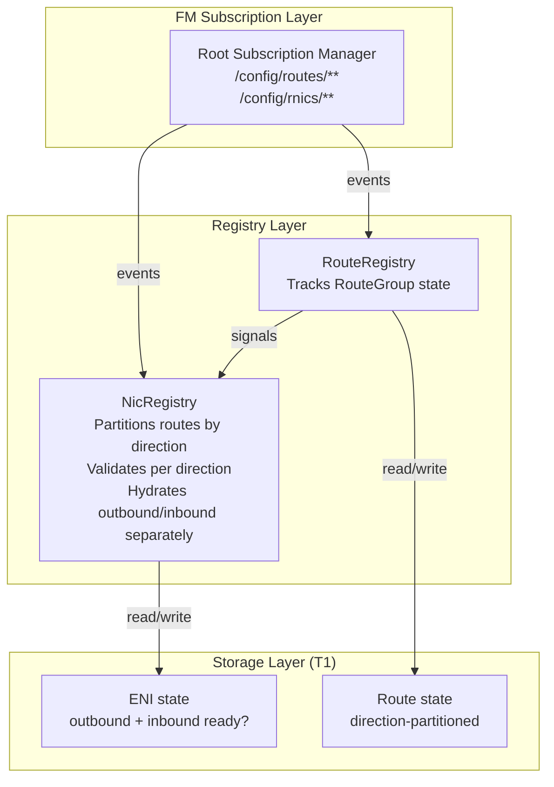

# FM Route Direction Architecture — Inbound vs Outbound Programming

> **Status:** Design (detailed implementation blueprint)
> **Audience:** FM implementers, routing architects
> **Depends on:** `Specs/protocols/fm-peering-protocol.md` (peering gates), `Specs/cb_fm_protos/topics/route.proto` (RouteDirection enum)

This document details **how FM handles inbound and outbound routes**, building on DASH upstream where routes are direction-aware and program into separate SAI tables with different validation gates.

## 1. Component Architecture



---

## 2. Route Direction Model (DASH Alignment)

**Two routing pipelines with different purposes:**

| Aspect | Outbound | Inbound |
|--------|----------|---------|
| **Purpose** | "Where should I send this?" | "Should I accept this?" |
| **Input** | Dest CA (after ACL allows) | Inner dest CA (after decap) |
| **Output** | Action (VNET, PEERING, PRIVATELINK, etc.) | Allow/Deny/Redirect |
| **Complexity** | High (mapping lookups, encap, tunneling) | Low (mostly identity/filter) |
| **SAI Table** | SAI_OUTBOUND_ROUTING_TABLE | SAI_INBOUND_ROUTING_TABLE |
| **Validation Gates** | Hard (peering, mapping, tunnel) | Soft (ACL, basic sanity) |

**CP sends mixed route list with direction discriminator:**
```yaml
routes:
  outbound_routing_group_id: "rg-egress-v4"    # Target group for OUTBOUND
  inbound_routing_group_id: "rg-ingress-v4"    # Target group for INBOUND
  entries:
    - prefix: "10.1.0.0/16"
      action: "LOCAL"
      direction: "OUTBOUND"                    # Explicit direction
    
    - prefix: "10.200.0.0/16"
      action: "PEERING"
      target_vnet_id: "vnet-shared"
      direction: "OUTBOUND"
    
    - prefix: "10.1.0.0/16"
      action: "PERMIT"
      direction: "INBOUND"                     # Separate entry for inbound
```

**No BIDIR concept.** Same prefix = separate entries with different directions.

---

## 3. NicRegistry Route Partitioning

**New method: PartitionRoutes(route_list)**

```
PartitionRoutes(route_list) → (outbound_routes, inbound_routes):
  outbound := []
  inbound := []
  
  FOR each route in route_list:
    IF route.direction == OUTBOUND:
      outbound.append(route)
    ELSE IF route.direction == INBOUND:
      inbound.append(route)
    ELSE:
      // direction field missing; CP error
      RETURN error("route missing direction field")
  
  RETURN (outbound, inbound)
```

**Enhanced ENIState:**

```go
type ENIState struct {
  // ... existing fields ...
  
  // Route partitioning
  outbound_route_group_id  string
  inbound_route_group_id   string
  outbound_routes          []RouteEntry
  inbound_routes           []RouteEntry
  
  // Direction-specific readiness
  outbound_ready           bool        // all outbound gates pass + mappings ready
  inbound_ready            bool        // all inbound gates pass
  direction_dependency_met bool        // both outbound AND inbound ready
}
```

---

## 4. Outbound Route Validation (Full Gates)

**Outbound routes require all dependency validation** (peering, mapping, tunnel, meters, VIPs, PE):

```
ValidateOutboundRoute(route, eni_vnet_id) → error:
  // Outbound routes are "actions" — must validate all references
  
  SWITCH route.action:
    CASE ROUTE_VNET:
      // Intra-VNET forward; must have mapping
      RETURN ValidateVnetMapping(eni_vnet_id)
    
    CASE ROUTE_VNET_PEERING:
      // Cross-VNET forward; must validate peering + mapping
      peer_vnet_id := route.target_vnet_id
      RETURN ValidatePeeringGate(eni_vnet_id, peer_vnet_id)
      // (also require mapping for peer VNET, but MappingManager handles async)
    
    CASE ROUTE_PRIVATELINK:
      // PE endpoint; must validate PE mapping exists
      RETURN ValidatePeLinkRoute(route, eni_vnet_id)
    
    CASE ROUTE_SNAT:
      // SNAT pool reference
      RETURN ValidateSnatPool(route.snat_pool_id)
    
    CASE ROUTE_SERVICE_TUNNEL:
      // Tunnel reference
      RETURN ValidateTunnel(route.tunnel_id)
    
    CASE ROUTE_DIRECT:
      // Underlay next-hop; minimal validation
      IF route.underlay_ip == nil:
        RETURN error("underlay_ip required")
      RETURN nil
    
    CASE ROUTE_DROP:
      RETURN nil  // No deps
    
    DEFAULT:
      RETURN error("unknown route action")
```

---

## 5. Inbound Route Validation (Minimal Gates)

**Inbound routes are mostly "filters" — minimal validation:**

```
ValidateInboundRoute(route, eni_vnet_id) → error:
  // Inbound routes are "accept/deny/redirect" — minimal gates
  
  SWITCH route.action:
    CASE ROUTE_PERMIT:
      // Allow traffic to this prefix
      IF route.prefix == nil:
        RETURN error("prefix required")
      RETURN nil
    
    CASE ROUTE_DROP:
      // Deny traffic to this prefix
      IF route.prefix == nil:
        RETURN error("prefix required")
      RETURN nil
    
    CASE ROUTE_DENY:
      // Explicit deny (like DROP but with explicit semantics)
      IF route.prefix == nil:
        RETURN error("prefix required")
      RETURN nil
    
    CASE ROUTE_REDIRECT_LOCAL:
      // Redirect to local service on DPU (e.g., 169.254.169.254)
      IF route.redirect_target == nil:
        RETURN error("redirect_target required")
      RETURN nil
    
    DEFAULT:
      // Inbound route with complex action (e.g., PEERING) is misconfiguration
      RETURN error("inbound route cannot use action " + route.action)
```

---

## 6. Updated ENI Hydration Algorithm

**Hydrate() now partitions and validates both directions:**

```
Hydrate(eni_id):
  // ... existing gates (vnet, acls, ha) ...
  
  // NEW: Partition routes by direction
  outbound_routes, inbound_routes := PartitionRoutes(eni.route_group.routes)
  eni.outbound_routes = outbound_routes
  eni.inbound_routes = inbound_routes
  
  eni.outbound_route_group_id = eni.route_config.outbound_routing_group_id
  eni.inbound_route_group_id = eni.route_config.inbound_routing_group_id
  
  // OUTBOUND VALIDATION: Full gates (peering, mapping, tunnel, etc.)
  outbound_ready := true
  FOR each outbound_route in outbound_routes:
    err := ValidateOutboundRoute(outbound_route, eni.vnet_id)
    IF err != nil:
      eni.state := PROGRAMMED_INCOMPLETE
      Signal("OutboundRouteInvalid", eni.eni_id, outbound_route.dst_prefix)
      outbound_ready = false
      BREAK  // Stop at first outbound error; hard-fail
  
  // INBOUND VALIDATION: Minimal gates (just action sanity)
  inbound_ready := true
  FOR each inbound_route in inbound_routes:
    err := ValidateInboundRoute(inbound_route, eni.vnet_id)
    IF err != nil:
      eni.state := PROGRAMMED_INCOMPLETE
      Signal("InboundRouteInvalid", eni.eni_id, inbound_route.dst_prefix)
      inbound_ready = false
      BREAK  // Stop at first inbound error
  
  eni.outbound_ready = outbound_ready
  eni.inbound_ready = inbound_ready
  eni.direction_dependency_met = (outbound_ready AND inbound_ready)
  
  // Continue with existing dependency checks
  // ... peering mappings, VIP dependencies, meter policies, PE mappings, etc. ...
  
  IF all_gates_pass AND direction_dependency_met AND all_peer_mappings_ready \
     AND all_vips_ready AND meter_dependency_met:
    eni.state := PROGRAMMED_READY
  ELSE:
    eni.state := PROGRAMMED_INCOMPLETE
```

---

## 7. Route Programming (Direction-Aware)

**Program outbound and inbound rules separately into SAI tables:**

```
ProgramRoutes(eni_id):
  // Program OUTBOUND routes into SAI_OUTBOUND_ROUTING_TABLE
  FOR each outbound_route in eni.outbound_routes:
    fm_dataplane.ProgramOutboundRoute(
      eni_id: eni_id,
      routing_group_id: eni.outbound_route_group_id,
      dst_prefix: outbound_route.dst_prefix,
      action: outbound_route.action,
      action_params: outbound_route  // action-specific params (vnet_id, tunnel_id, etc.)
    )
  
  // Program INBOUND rules into SAI_INBOUND_ROUTING_TABLE
  FOR each inbound_route in eni.inbound_routes:
    fm_dataplane.ProgramInboundRoute(
      eni_id: eni_id,
      routing_group_id: eni.inbound_route_group_id,
      dst_prefix: inbound_route.dst_prefix,
      action: inbound_route.action
    )
```

---

## 8. Direction and Peering Interaction

**For VNET-VNET peering to work, both directions needed:**

```
Scenario: ENI in vnet-acme wants to reach vnet-shared (peered)

Outbound (vnet-acme side):
  Route: prefix=10.200.0.0/16, action=PEERING, target_vnet_id=vnet-shared, direction=OUTBOUND
  FM validates: is vnet-shared peered? Yes → READY
  Dataplane: encap dest to vnet-shared PA, use vnet-shared VNI

Inbound (vnet-shared side):
  Route: prefix=10.0.0.0/16, action=PERMIT, direction=INBOUND
  FM validates: basic sanity → READY
  Dataplane: accept (permit) inbound traffic from that prefix
```

**Without inbound PERMIT rule:** vnet-acme can send east-west, but vnet-shared drops return traffic (inbound validation fails).

---

## 9. ENI State Machine (Direction Extension)

```mermaid
stateDiagram-v2
    Hydrating --> FAILED: Any gate fails (hard-fail)
    Hydrating --> INCOMPLETE: Gates pass; outbound/inbound or deps pending
    
    INCOMPLETE --> READY: Outbound + inbound ready; all other deps ready
    INCOMPLETE --> FAILED: Gate becomes invalid
    INCOMPLETE --> INCOMPLETE: Route direction change
    
    READY --> INCOMPLETE: Inbound/outbound route removed or invalidated
    READY --> [*]: ENI deleted
```



**State transitions (direction-specific):**

| From | To | Trigger | Action |
|------|----|---------|----|
| Hydrating | INCOMPLETE | Outbound route requires peering (waiting for peer mapping) | Signal; wait |
| Hydrating | INCOMPLETE | Inbound route present but action invalid | Hard-fail or soft-fail? |
| INCOMPLETE | READY | All outbound + inbound routes ready + other deps | Transition |
| INCOMPLETE | INCOMPLETE | Outbound route added/removed | Re-validate (soft) |
| READY | INCOMPLETE | Inbound route removed (breaks return path) | Regress; wait for recovery |

---

## 10. Monitoring and Observability

**Metrics:**
```
fm_eni_outbound_ready{eni_id} = 1 if outbound routes valid, else 0
fm_eni_inbound_ready{eni_id} = 1 if inbound routes valid, else 0
fm_eni_direction_dependency_met{eni_id} = 1 if both ready, else 0
fm_outbound_route_count{routing_group_id}
fm_inbound_route_count{routing_group_id}
fm_route_invalid_total{direction, reason}
```

**Alerts:**
```
Alert "ENI Stuck Outbound-Incomplete":
  IF count(eni.outbound_ready == false AND eni.state == INCOMPLETE) > 50 for 5 min:
    ACTION: Check outbound route validation; likely peering/mapping issue

Alert "ENI Missing Inbound Rules":
  IF count(eni.inbound_ready == false AND eni.inbound_routes.size() > 0) > 10 for 2 min:
    ACTION: Check inbound route syntax; possibly invalid action
```

---

## 11. Failure Scenarios and Recovery

| Scenario | Detection | Recovery |
|----------|-----------|----------|
| **Outbound route references missing peer** | Route validation fails | Operator provisions peering; FM re-validates |
| **Inbound route with invalid action** | Hard syntax error | Operator fixes route action (PERMIT/DROP only) |
| **Route direction field missing** | Partition fails on parse | CP bug; operator must fix payload |
| **PE route without mapping** | Outbound validation fails | Operator provisions PE mapping; FM re-validates |
| **Tunnel missing for outbound route** | Outbound validation fails | Operator provisions tunnel; FM re-validates |
| **Inbound route added to prevent return path** | ENI regresses INCOMPLETE | Operator removes invalid inbound rule |

---

## 12. Integration with Prior Designs

**ENI hydration order (extended):**
```
Hydrate(eni_id):
  1. Resolve gates (vnet, routes, acls, ha)
  2. Partition routes by direction (NEW)
  3. Validate outbound routes (NEW) — peering, mapping, tunnel, meter, PE, VIP
  4. Validate inbound routes (NEW) — minimal gates
  5. Validate peer targets (peering)
  6. Detect VIP membership
  7. Validate PE routes
  8. Resolve meter policies
  9. Check peer mappings ready
  10. Check direction dependency met (NEW)
  11. Check VIP dependencies ready
  12. Check PE mappings ready
  13. Check meter policies ready
  14. Program outbound + inbound routes (NEW)
  15. Return state READY or INCOMPLETE
```

**Cardinal rule with direction:**
- One ENI → one RouteGroup (unchanged)
- One RouteGroup → mixed outbound + inbound routes (NEW)
- Each route has explicit direction field (NEW)
- No BIDIR routes; same prefix = two separate entries (NEW)

---

## 13. Comparison to All Routing Constructs

| Construct | Scope | Binding | Gates | Direction |
|-----------|-------|---------|-------|-----------|
| **Peering** | VNET-scoped | Peering declares | Hard gates | Both |
| **VIPs** | VNET-scoped | VIP backend list | Soft gates (NAT pool) | Outbound only |
| **Meters** | Device-global | ENI policy ref | Soft gates (policy) | Outbound only |
| **Private Link** | VNET-scoped | VNetMapping entry | Soft gates (mapping) | Outbound only |
| **Routes** | ENI-scoped | RouteGroup ref | Per-direction gates | Outbound + Inbound |

---

## 14. References

- `Specs/Learning-DashNet/06-Routing-Pipeline.md` — DASH routing pipelines (outbound vs inbound)
- `Specs/cb_fm_protos/topics/route.proto` — RouteDirection enum, RouteEntry structure
- `Specs/FM/fm-registry-peering-design.md` — Peering validation gates
- `Specs/FM/fm-vip-design.md` — Soft-gate pattern (reused for direction readiness)
- `Specs/FM/fm-meter-design.md` — Per-ENI dependencies (reused for direction split)
