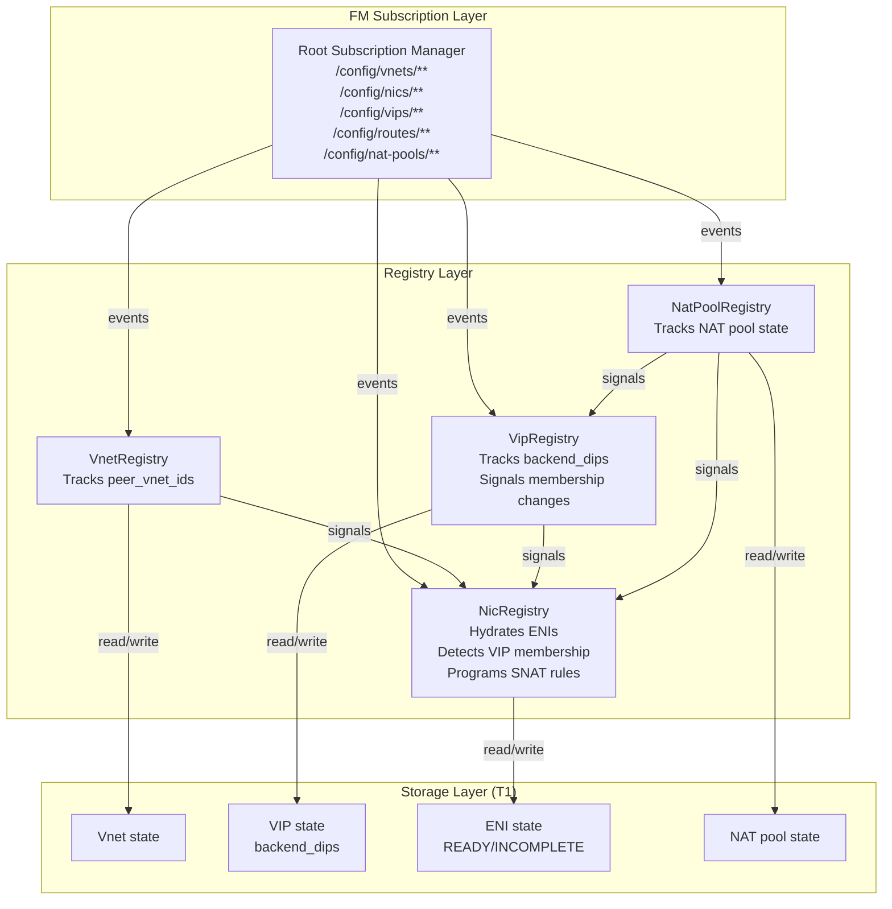

# FM VIP Architecture — Backend Pool & NAT Programming

> **Status:** Design (detailed implementation blueprint)
> **Audience:** FM implementers, backend pool architects
> **Depends on:** `Specs/protocols/fm-peering-protocol.md` (peering validation), `Specs/cb_fm_protos/topics/vip.proto` (VIP config)

This document details **how FM's registries implement VIP backend pool management and NAT rule programming**, building on the VNET-scoped VIP model: VIP declares backends (DIPs), FM detects membership and programs SNAT rules at two triggers (ENI hydration and VIP update).

## 1. Component Architecture



---

## 2. VipRegistry Design

**Responsibilities:**
- Consume `/config/vnets/<vnet_id>/vips/<vip_id>` stream
- Track `backend_dips` for each VIP
- Track `nat_pool_id` reference
- Track `gateway_id` reference
- Signal membership changes to NicRegistry

**State:**
```go
type VipRegistry struct {
  vips_by_vnet  map[vnet_id]map[vip_id]*VipState
  mu            sync.RWMutex
  nic_reg       *NicRegistry
  nat_pool_reg  *NatPoolRegistry
  signals       chan VipSignal
}

type VipState struct {
  vip_id           string
  vnet_id          string
  vip              IpAddress
  type             VipType        // LB_FRONTEND, GATEWAY, SERVICE_TUNNEL
  direction        VipDirection   // INBOUND, OUTBOUND, BIDIR
  backend_dips     []IpAddress    // sorted for deterministic diffs
  nat_pool_id      string         // optional
  gateway_id       string         // optional
  state            VipStateEnum   // UNKNOWN, READY, WAITING, FAILED
  last_updated     time.Time
  failure_reason   string         // if state == FAILED
}

type VipStateEnum int
const (
  VipStateUNKNOWN VipStateEnum = iota
  VipStateREADY
  VipStateWAITING
  VipStateFAILED
)

type VipSignal struct {
  Event              string        // "BackendAdded", "BackendRemoved", "VipReady", "VipFailed"
  VipID              string
  VnetID             string
  AddedBackends      []IpAddress   // newly added to backend_dips
  RemovedBackends    []IpAddress   // newly removed from backend_dips
  NewState           VipStateEnum
}
```

**Algorithm:**
```
OnVipEvent(event):
  vip := ParseEvent(event)
  old_state := registry.vips_by_vnet[vip.vnet_id][vip.vip_id]
  old_backends := []IpAddress{}
  if old_state != nil:
    old_backends := old_state.backend_dips
  
  new_backends := vip.backend_dips
  sort(new_backends)  // ensure sorted
  
  registry.vips_by_vnet[vip.vnet_id][vip.vip_id] = VipState{
    vip_id: vip.vip_id,
    vnet_id: vip.vnet_id,
    vip: vip.vip,
    type: vip.type,
    direction: vip.direction,
    backend_dips: new_backends,
    nat_pool_id: vip.nat_pool_id,
    gateway_id: vip.gateway_id,
    state: ValidateVip(vip),
    last_updated: now(),
  }
  
  // Detect backend changes
  added := setDiff(new_backends, old_backends)
  removed := setDiff(old_backends, new_backends)
  
  IF len(added) > 0:
    Signal("BackendAdded", vip.vip_id, added)
    // NicRegistry will find ENIs with these DIPs and program SNAT
  
  IF len(removed) > 0:
    Signal("BackendRemoved", vip.vip_id, removed)
    // NicRegistry will find ENIs with these DIPs and remove SNAT
  
  // Check dependency state
  new_state := ValidateVip(vip)
  IF new_state != old_state.state:
    Signal(StateChangeEvent, vip.vip_id, new_state)
```

**Validation (ValidateVip):**
```
ValidateVip(vip) → VipStateEnum:
  // Gate 1: NAT pool (if referenced)
  IF vip.nat_pool_id != "":
    nat_pool := nat_pool_reg.Get(vip.nat_pool_id)
    IF nat_pool == nil OR nat_pool.state != READY:
      RETURN VipStateWAITING  // soft fail; retry when NAT pool ready

  // Gate 2: Gateway (if referenced)
  IF vip.gateway_id != "":
    gateway := gateway_reg.Get(vip.gateway_id)
    IF gateway == nil OR gateway.state != READY:
      RETURN VipStateWAITING  // soft fail

  // All dependencies ready
  RETURN VipStateREADY
```

---

## 3. NicRegistry VIP Membership Detection

**New method: DetectVipMembership(eni_id, overlay_ip)**

```
DetectVipMembership(eni_id, overlay_ip, vnet_id):
  vip_memberships := []string{}  // vip_ids this ENI is backend for
  
  FOR each vip in vips_by_vnet[vnet_id]:
    IF overlay_ip IN vip.backend_dips:
      vip_memberships.append(vip.vip_id)
  
  eni.vip_memberships := vip_memberships
  RETURN vip_memberships
```

**Updated Hydration algorithm:**
```
Hydrate(eni_id):
  // ... existing gates (vnet, routes, acls, ha, peers) ...
  
  // Gate 3: Resolve overlay_ip
  overlay_ip := eni.primary_ip  // or read from NIC config
  
  // NEW: Detect VIP membership
  vip_memberships := DetectVipMembership(eni_id, overlay_ip, eni.vnet_id)
  eni.vip_memberships := vip_memberships
  
  // Check if any VIP dependencies missing
  for each vip_id in vip_memberships:
    vip := vip_reg.Get(vip_id)
    IF vip.state != READY:
      eni.state := PROGRAMMED_INCOMPLETE
      Signal("NeedsVipReady", eni_id, vip_id)
      RETURN  // soft fail; wait for VIP
  
  // All VIP dependencies ready
  IF vip_memberships.size() > 0:
    ProgramSnatRules(eni_id, overlay_ip, vip_memberships)
    Signal("VipMembershipReady", eni_id, vip_memberships)
  
  RETURN PROGRAMMED_READY  // or INCOMPLETE if peers still pending
```

**New method: ProgramSnatRules(eni_id, overlay_ip, vip_ids)**

```
ProgramSnatRules(eni_id, overlay_ip, vip_ids):
  FOR each vip_id in vip_ids:
    vip := vip_reg.Get(vip_id)
    
    // Determine SNAT target
    snat_ip := vip.vip  // usually the VIP itself
    IF vip.nat_pool_id != "":
      nat_pool := nat_pool_reg.Get(vip.nat_pool_id)
      snat_ip := nat_pool.pool_ip  // or pick from pool
    
    // Program SNAT rule:
    // Outbound traffic from overlay_ip destined to any external target
    // with return VIP = snat_ip gets rewritten to SNAT address
    
    fm_dataplane.ProgramSnatRule(
      eni_id: eni_id,
      src_ip: overlay_ip,
      vip: vip.vip,
      snat_ip: snat_ip,
      direction: vip.direction  // INBOUND, OUTBOUND, BIDIR
    )
```

**On VIP signal (from VipRegistry):**
```
OnVipSignal(signal):
  IF signal.Event == "BackendAdded":
    FOR each added_dip in signal.AddedBackends:
      eni := FindEniBySrcIp(added_dip)  // search by overlay IP
      IF eni != nil AND eni.vnet_id == signal.VnetID:
        eni.vip_memberships.append(signal.VipID)
        vip := vip_reg.Get(signal.VipID)
        IF vip.state == READY:
          ProgramSnatRules(eni.eni_id, added_dip, [signal.VipID])
        ELSE:
          eni.state := PROGRAMMED_INCOMPLETE
  
  IF signal.Event == "BackendRemoved":
    FOR each removed_dip in signal.RemovedBackends:
      eni := FindEniBySrcIp(removed_dip)
      IF eni != nil:
        eni.vip_memberships.remove(signal.VipID)
        fm_dataplane.RemoveSnatRule(eni.eni_id, removed_dip, signal.VipID)
  
  IF signal.Event == "VipReady":
    // Find all ENIs that are backends for this VIP
    vip := vip_reg.Get(signal.VipID)
    FOR each backend_dip in vip.backend_dips:
      eni := FindEniBySrcIp(backend_dip)
      IF eni != nil:
        IF eni.state == PROGRAMMED_INCOMPLETE:
          eni.state := PROGRAMMED_READY  // transition
          Signal("EniBecameReady", eni.eni_id)
```

---

## 4. NAT Pool Registry

**Responsibilities:**
- Consume `/config/nat-pools/<nat_pool_id>` stream
- Track pool state (READY, FAILED)
- Signal VipRegistry when pool becomes ready/unavailable

**State:**
```go
type NatPoolRegistry struct {
  pools     map[nat_pool_id]*NatPoolState
  mu        sync.RWMutex
  vip_reg   *VipRegistry
  nic_reg   *NicRegistry
  signals   chan NatPoolSignal
}

type NatPoolState struct {
  nat_pool_id    string
  pool_ip        IpAddress      // the SNAT address
  pool_size      int            // number of IPs if pool
  state          PoolStateEnum  // READY, FAILED, WAITING
  last_updated   time.Time
}

type NatPoolSignal struct {
  Event          string         // "PoolReady", "PoolFailed"
  NatPoolID      string
  NewState       PoolStateEnum
}
```

**Algorithm:**
```
OnNatPoolEvent(event):
  pool := ParseEvent(event)
  pool_state := pool.state == READY ? READY : FAILED
  
  registry.pools[pool.nat_pool_id] = NatPoolState{
    nat_pool_id: pool.nat_pool_id,
    pool_ip: pool.pool_ip,
    pool_size: pool.pool_size,
    state: pool_state,
    last_updated: now(),
  }
  
  IF pool_state == READY:
    Signal("PoolReady", pool.nat_pool_id)
    // VipRegistry will re-validate VIPs referencing this pool
    // NicRegistry will update ENIs referencing VIPs with this pool
```

---

## 5. ENI State Machine (VIP Extension)

```mermaid
stateDiagram-v2
    [*] --> Hydrating
    Hydrating --> FAILED: Any gate fails
    Hydrating --> PROGRAMMED_INCOMPLETE: Gates pass; peer/VIP mappings pending
    
    PROGRAMMED_INCOMPLETE --> PROGRAMMED_READY: All peer mappings AND VIPs ready
    PROGRAMMED_INCOMPLETE --> FAILED: Gate becomes invalid
    
    FAILED --> [*]: ENI deleted
    PROGRAMMED_READY --> [*]: ENI deleted
    
    PROGRAMMED_READY --> PROGRAMMED_INCOMPLETE: VIP becomes FAILED/WAITING
    PROGRAMMED_INCOMPLETE --> PROGRAMMED_READY: VIP becomes READY
```



**State transitions (detailed):**

| From | To | Trigger | Action |
|------|----|---------|----|
| Hydrating | FAILED | Gate fails (vnet, routes, acls, ha, peer validation) | Log error; mark FAILED |
| Hydrating | INCOMPLETE | Gates pass; peers OR VIPs pending | Signal MappingManager & VipRegistry; wait |
| INCOMPLETE | READY | All peer mappings ready AND all VIPs ready | Update state; clear waiting flags |
| INCOMPLETE | FAILED | Gate becomes invalid (peer removed, VIP backend removed) | Log error; transition to FAILED |
| READY | INCOMPLETE | VIP backend_dips changed (removed this DIP) OR NAT pool failed | Regress state; monitor recovery |
| READY/FAILED | [*] | ENI delete event | Clean up state; remove SNAT rules |

---

## 6. Two-Trigger SNAT Rule Programming

### Trigger 1: ENI Hydration (Cold Boot)

```
When: New ENI with overlay_ip arrives
Flow:
  1. NicRegistry.Hydrate(eni_id)
  2. Detect overlay_ip
  3. DetectVipMembership(eni_id, overlay_ip)
  4. For each VIP: check if state == READY
  5. If all READY: ProgramSnatRules(eni_id, overlay_ip, vip_ids)
  6. ENI → READY (or INCOMPLETE if VIP missing)
```

### Trigger 2: VIP Update (Late Binding)

```
When: VIP.backend_dips changes (add/remove DIP)
Flow:
  1. VipRegistry.OnVipEvent()
  2. Detect added/removed backends
  3. For each added DIP: find ENI, ProgramSnatRules()
  4. For each removed DIP: find ENI, RemoveSnatRule()
  5. Signal NicRegistry to re-check ENI state
```

---

## 7. Monitoring and Observability

**Metrics:**
```
fm_vip_state_count{state="READY|WAITING|FAILED"}
fm_vip_backends_count{vip_id}
fm_eni_vip_memberships{eni_id} = count of VIPs this ENI is backend for
fm_nat_pool_ready{nat_pool_id} = 1 if READY, 0 if not

fm_snat_rules_programmed_total{eni_id, vip_id}
fm_snat_rules_failed_total{eni_id, reason}
fm_vip_backend_membership_changes_total{vip_id, event="added|removed"}
```

**Alerts:**
```
Alert "VIP Missing NAT Pool":
  IF fm_vip_state_count{state="WAITING"} > 10 for 5 min:
    ACTION: Check if NAT pool stream stalled; operator must provision

Alert "NAT Pool Unavailable":
  IF fm_nat_pool_ready == 0 for 2 min:
    ACTION: Check NAT pool service health

Alert "ENI Stuck VIP-Incomplete":
  IF count(eni.state == INCOMPLETE AND eni.vip_memberships.size() > 0) > 50 for 5 min:
    ACTION: Check VipRegistry; likely NAT pool or gateway delay
```

---

## 8. Failure Scenarios and Recovery

| Scenario | Detection | Recovery |
|----------|-----------|----------|
| **NAT pool missing** | VIP.state → WAITING | Operator provisions pool; VipRegistry re-validates; ENI transitions READY |
| **Gateway missing** | VIP.state → WAITING | Same as NAT pool |
| **DIP removed from VIP backend_dips** | VipRegistry signal | NicRegistry finds ENI; removes SNAT rule |
| **DIP added to VIP backend_dips** | VipRegistry signal | NicRegistry finds ENI; programs SNAT rule (if VIP READY) |
| **VIP becomes FAILED** | VipRegistry signal | ENIs regress INCOMPLETE; wait for recovery |
| **ENI deleted while VIP backend** | NicRegistry cleanup | Remove SNAT rules; decrement refcount on VIP |

---

## 9. Integration with Prior Designs

### Peering + VIP Ordering

```
Hydrate(eni_id):
  1. Resolve gates (vnet, routes, acls, ha)
  2. Validate peer targets (peering gate)
  3. Detect VIP membership (NEW)
  4. Check peer mappings ready
  5. Check VIP dependencies ready
  6. Program SNAT rules (NEW)
  7. Return state READY or INCOMPLETE
```

### Cardinal Rule with VIPs

One ENI routes to one RouteGroup (unchanged). But ENI can be a backend for **multiple VIPs**:
```
RouteGroup A (many routes)
  ↙ ↖
ENI-1  ENI-2  (route to same group, share mapping state)

VIP-1 (backends: ENI-1, ENI-3)
VIP-2 (backends: ENI-1, ENI-2)  ← ENI-1 is backend for both

Each ENI separately detects membership via overlay_ip matching
```

---

## 10. References

- `Specs/protocols/fm-peering-protocol.md` — Peering validation gates
- `Specs/cb_fm_protos/topics/vip.proto` — VIP config with backend_dips field
- `Specs/FM/fm-registry-peering-design.md` — VnetRegistry + MappingManager pattern
- `Specs/FM/registry-pattern-design.md` — Base registry pattern (Acquire/Release/Read)
- `Specs/me-and-ai/vip-dip-binding-decision.md` — Design decision: why VIP-driven model
