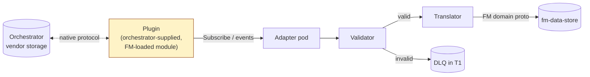
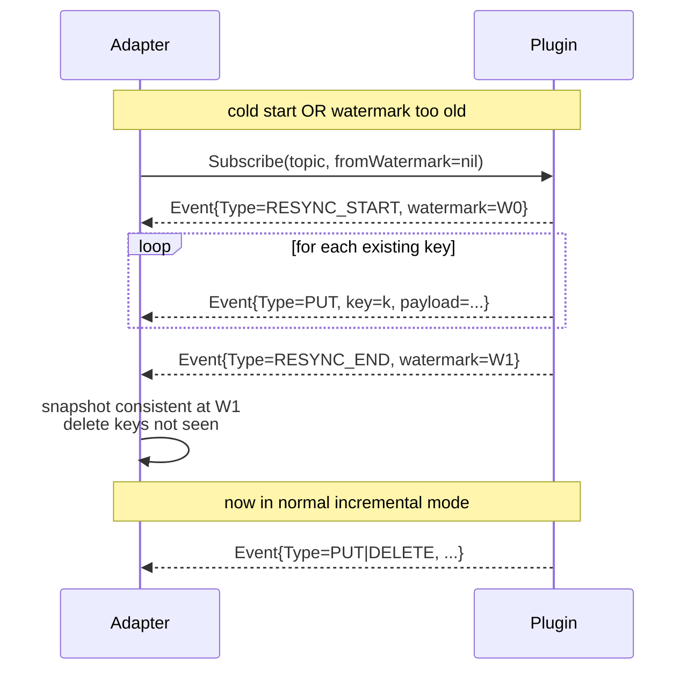
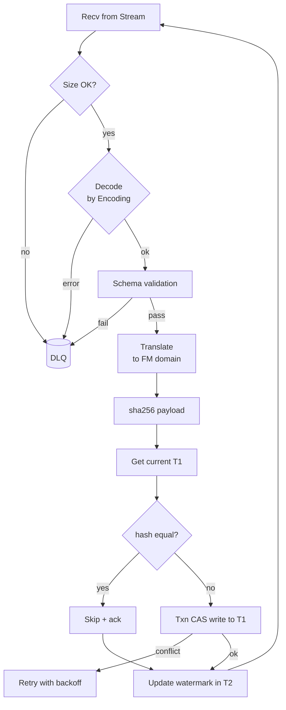

# FleetManager — Orchestrator Subscription Plugin Interface

> **TL;DR:** FM does **not** know what storage backend the
> orchestrator/control plane uses. The orchestrator (or its operator)
> ships FM a **plugin** that implements a small Go interface; FM loads
> it at startup and uses it to **subscribe to topics, receive events,
> and replay from a watermark**. Events that arrive are validated,
> translated to FM's domain model, and written to `fm-data-store` (T1)
> via the adapter pod.

---

## 1. Goals

1. **Vendor-neutrality** — orchestrator can be backed by etcd, K8s
   informers, Kafka, Pub/Sub, ZooKeeper, NATS, Redis Streams, plain
   REST polling, or anything else. FM never depends on the choice.
2. **Replay safety** — FM must be able to resume from a saved cursor
   (watermark) after pod restart, leader handoff, or plugin
   reconnect. No event loss, at-least-once delivery.
3. **Deterministic translation** — the orchestrator's native shape is
   translated to FM's domain model in one well-defined place
   (the adapter pod), not scattered across actors.
4. **Backpressure-aware** — FM must be able to slow ingestion when
   T1 writes are saturating, without dropping events.
5. **Vendor self-test** — every plugin ships with a conformance suite
   so deployment teams can verify their integration before production.

## 2. Non-goals

- The plugin does **not** implement FM's domain logic. It is purely a
  delivery channel.
- The plugin does **not** write to T1. The adapter does, after
  validation.
- The plugin does **not** need to know FM's domain types. It speaks
  in **opaque payload bytes** under well-known **topic strings**.

---

## 3. Conceptual model



The plugin sits **at the edge** of FM. Everything inside FM speaks the
FM domain model.

---

## 4. Plugin contract — Go interface

```go
// pkg/plugin/orchestrator/plugin.go
package orchestrator

import (
    "context"
    "io"
)

// Plugin is implemented by an orchestrator vendor or operator
// and loaded by FM at startup.
type Plugin interface {
    // Init is called once at startup with parsed plugin config and
    // FM-side hooks (logger, metrics, tracer). The plugin must
    // establish its connection lazily — Init must return quickly.
    Init(ctx context.Context, cfg PluginConfig, hooks Hooks) error

    // Topics returns the set of topic patterns this plugin will
    // deliver events for. The adapter cross-checks against the
    // FM-required topic taxonomy at startup.
    Topics() []TopicSpec

    // Subscribe opens a stream for the given topic pattern,
    // optionally resuming from a saved watermark. Implementations
    // MUST honor backpressure: when the consumer stops calling
    // Recv, the plugin must stop pulling from upstream.
    //
    // The returned Stream is closed by the caller via Stream.Close().
    Subscribe(ctx context.Context, topic string, fromWatermark Watermark) (Stream, error)

    // Get fetches a single value by topic. Used for cold-start
    // hydration and gap-fill after an Out-Of-Order or Compacted hint.
    Get(ctx context.Context, topic string) (Event, error)

    // List enumerates all topics matching prefix. Used by the
    // adapter to validate that the orchestrator actually has the
    // data FM expects, and for full re-list after watermark loss.
    // Implementations MUST stream — large prefixes can be millions.
    List(ctx context.Context, prefix string) (ListIterator, error)

    // Health reports plugin liveness. Called every N seconds.
    Health(ctx context.Context) HealthStatus

    // Close releases all resources. After Close the plugin must
    // not deliver further events.
    Close() error
}

type Stream interface {
    // Recv blocks until the next event or stream end.
    // Returns io.EOF if the stream is intentionally closed by the plugin.
    Recv() (Event, error)
    // Close terminates the stream.
    Close() error
}

type ListIterator interface {
    Next() (Event, error)   // returns io.EOF at end
    Close() error
}

type Event struct {
    Topic     string      // matches a TopicSpec pattern
    Key       string      // unique key within the topic (e.g., vnet_id)
    Payload   []byte      // opaque to FM; interpreted by the translator
    Encoding  Encoding    // PROTO | JSON | AVRO | RAW
    Schema    string      // optional schema id (e.g., proto FQN)
    Type      EventType   // PUT | DELETE | TOMBSTONE | RESYNC_START | RESYNC_END
    Watermark Watermark   // resume cursor for this stream
    Timestamp int64       // unix nanos at orchestrator
    SourceRev int64       // orchestrator's native revision (for ordering hints)
    Hint      EventHint   // OOO | COMPACTED | NORMAL
}

type Watermark []byte    // opaque token; FM stores in T2 verbatim

type EventType int
const (
    EventPut EventType = iota
    EventDelete
    EventTombstone
    EventResyncStart   // signals "I am about to re-list this topic"
    EventResyncEnd     // signals "re-list complete; resume normal stream"
)

type EventHint int
const (
    HintNormal     EventHint = iota
    HintOutOfOrder           // FM should sort by SourceRev before applying
    HintCompacted            // intermediate state was lost; full Get/List recommended
)

type Encoding int
const (
    EncodingProto Encoding = iota
    EncodingJSON
    EncodingAvro
    EncodingRaw
)

type TopicSpec struct {
    Pattern    string   // e.g. "vnet/*", "device/*/eni/*"
    Cardinality string  // "small" | "medium" | "large" — sizing hint
    Encoding   Encoding
    Schema     string
}

type HealthStatus struct {
    Up           bool
    LastEventAge time.Duration
    BacklogDepth int64    // -1 if unknown
    Details      string
}

type Hooks struct {
    Logger   Logger
    Metrics  Metrics
    Tracer   Tracer
}

type PluginConfig struct {
    Name    string
    Raw     []byte           // YAML/JSON; plugin parses
    Secrets SecretProvider   // for password/token retrieval
}
```

---

## 5. Required topics (FM consumer side)

FM expects the plugin to deliver events on these topic patterns. The
plugin advertises them via `Topics()`; FM verifies coverage at startup.

| Topic pattern | FM kind | Cardinality | Notes |
|---------------|---------|-------------|-------|
| `global/routing_type/<name>` | RoutingType | small (5–20) | Rare changes |
| `vnet/<vnet_id>` | Vnet | medium (1k–100k) | Adds/edits frequent |
| `vnet/<vnet_id>/mapping/_manifest` | VnetMappingManifest | medium | Per-VNET |
| `vnet/<vnet_id>/mapping/<chunk_id>` | VnetMappingChunk | large (millions across all VNETs) | High volume |
| `group/route/<group_id>` | RouteGroup | medium | |
| `group/acl/<group_id>` | AclGroup | medium | |
| `device/<device_id>` | Device | small-medium (100–10k) | DPU registration / capability |
| `eni/<eni_id>` | NicSpec | large (100k–10M) | Highest churn |
| `tunnel/<tunnel_id>` | Tunnel | small | |
| `pa_validation/<list_id>` | PaValidation | small | |
| `ha_set/<ha_set_id>` | HaSet | small-medium | |

**Cross-check:** at startup the adapter compares `plugin.Topics()`
against this required set. Missing patterns cause startup failure
with a clear log message.

---

## 6. Event semantics

### 6.1 Delivery guarantees

- **At-least-once.** The plugin may deliver duplicates after
  reconnect; FM dedups via content hash on T1 write.
- **In-order per key.** Events for the same `(topic, key)` arrive in
  order according to `SourceRev`. FM may, but need not, batch.
- **No cross-key ordering guarantee.** Events for different keys can
  interleave arbitrarily. FM's domain model tolerates this (Wave
  ordering is enforced inside FM on apply).

### 6.2 Watermark contract

- The plugin chooses the watermark format (etcd revision, Kafka
  offset, Kinesis sequence, K8s `resourceVersion`, …).
- FM stores it verbatim in T2 (`/fm/cs/watermark/<topic>`) after the
  *batch* of events is durably applied to T1.
- On reconnect, FM passes the saved watermark back via
  `Subscribe(..., fromWatermark)`.
- If the plugin can no longer honor the watermark (compaction,
  retention truncation), it MUST emit a `RESYNC_START` event,
  re-list the topic, then `RESYNC_END`. FM treats this as: clear
  prior state for the topic and reconcile to delivered.

### 6.3 Resync flow



### 6.4 Out-of-order hint

If the upstream protocol (e.g., a poll-based REST translation) cannot
guarantee per-key ordering, the plugin sets `Hint=OOO` on each event
in the affected window. FM then *sorts by SourceRev within a debounce
window* before applying.

### 6.5 Compaction hint

If the plugin observed a gap (the source compacted intermediate
revisions), it sets `Hint=COMPACTED`. FM will issue a `Get(topic)` to
reconcile against the *latest* state for that key and discard any
pending older events for the same key.

---

## 7. Plugin loading

### 7.1 Mechanism

Two supported loading modes:

| Mode | When | How |
|------|------|-----|
| **Static link** | Default; recommended | Plugin Go module is added to FM's `go.mod`; binary built with `-tags=plugin_<name>`. Fastest, no IPC. |
| **gRPC sidecar** | Vendor distribution / closed source | Plugin runs as a sidecar implementing the same interface as a gRPC service (`OrchestratorPlugin.proto`). FM loads a thin gRPC client. |

A future **WASM mode** is on the roadmap but out of scope today.

### 7.2 Configuration

```yaml
fm:
  plugin:
    name: "etcd-watch"             # or "k8s-informer", "kafka", "grpc-sidecar", ...
    config_file: "/etc/fm/plugin.yaml"
    secrets_provider: "env"        # env | vault | file | aws-sm
    grpc_endpoint: ""              # only for grpc-sidecar mode
    reconnect_backoff_ms: [100, 500, 2000, 10000]
    max_in_flight: 10000
    max_event_size_bytes: 1048576  # 1 MiB; rejected with DLQ entry
    health_check_interval_sec: 10
```

### 7.3 Reference adapters shipped in tree

| Plugin | Use case | Status |
|--------|----------|--------|
| `etcd-watch` | Orchestrator stores DASH-shaped objects in etcd | reference |
| `k8s-informer` | Orchestrator is a K8s controller publishing CRDs | reference |
| `kafka` | Orchestrator publishes to a Kafka topic | reference |
| `nats-jetstream` | Orchestrator on NATS | community |
| `rest-poll` | Last-resort: polls a REST endpoint with ETag | community |
| `grpc-sidecar` | Generic shim for closed-source plugins | reference |

---

## 8. Adapter pod responsibilities



### 8.1 Adapter responsibilities

1. **Decode** payload according to `Event.Encoding`.
2. **Validate** against the FM proto schema (`Vnet`, `NicSpec`, …).
3. **Translate** orchestrator-native fields to FM canonical form
   (e.g., normalize ID casing, fill defaults).
4. **Idempotency** — content-hash the FM-canonical payload, skip if
   unchanged.
5. **CAS write** to T1.
6. **Watermark advance** in T2 only after T1 ack.
7. **DLQ** any event that fails validation, with original payload +
   error reason.
8. **Backpressure** — stop calling `Stream.Recv` when T1 write queue
   exceeds `max_in_flight`.

### 8.2 Leadership

Only one adapter pod is the **active ingestor** at a time. Election
is via T2 lease at `/fm/cs/leader/adapter`. Other pods run the
adapter code in *standby*, ready to take over within `lease_ttl_sec`.

---

## 9. Translation rules (orchestrator → FM)

The **translator** is the place where vendor-specific quirks live.
Reference rules:

| Rule | Why |
|------|-----|
| Normalize IDs to lowercase. | Avoid case-sensitivity bugs across vendors. |
| Fill `Envelope.kind` from topic. | Self-describing T1 entries. |
| Reject events whose `Topic` doesn't match `Topics()` claim. | Plugin contract guard. |
| Emit `audit_log` entry per write. | Cross-vendor traceability. |
| Map vendor-native enums to FM enums via a per-plugin lookup table. | Decouple. |
| Reject payloads >1 MiB unless they're mapping chunks (≤900 KiB hard cap). | etcd value limit. |
| Convert all timestamps to UTC unix nanos. | Single time format. |

Translator config lives at `/etc/fm/translators/<plugin-name>.yaml`
and is hot-reloadable via SIGHUP.

---

## 10. Conformance suite

Every plugin ships with — and FM provides scaffolding for — a
**conformance suite** that the operator runs before production:

```
fm-plugin-conformance --plugin=./my-plugin.so --config=plugin.yaml
```

### Tests run

1. **Topic coverage** — `Topics()` includes every required pattern.
2. **Roundtrip** — write a value upstream, observe `Subscribe` event
   within 5s, payload decodes.
3. **Watermark replay** — disconnect, reconnect with saved watermark,
   no events lost.
4. **Resync** — force a watermark-too-old condition, verify
   `RESYNC_START` / `RESYNC_END` flow.
5. **Delete** — delete upstream, observe `EventDelete`.
6. **Backpressure** — slow consumer, verify plugin stops pulling and
   doesn't OOM.
7. **Large payload** — 900 KiB chunk, verify delivery.
8. **Concurrency** — 1000 parallel writes, verify per-key ordering
   preserved.
9. **Outage** — kill upstream for 60s, verify health flips and
   recovers.
10. **Schema rejection** — push malformed payload, verify DLQ.

A plugin that passes all 10 is "FM-Conformant".

---

## 11. Observability

### 11.1 Metrics

| Metric | Type | Labels |
|--------|------|--------|
| `fm_plugin_events_total` | counter | topic, type |
| `fm_plugin_event_lag_seconds` | histogram | topic |
| `fm_plugin_backlog_depth` | gauge | topic |
| `fm_plugin_disconnects_total` | counter | reason |
| `fm_plugin_resync_total` | counter | topic |
| `fm_plugin_dlq_total` | counter | topic, reason |
| `fm_plugin_translate_errors_total` | counter | topic, error |
| `fm_adapter_t1_write_duration_seconds` | histogram | kind |
| `fm_adapter_watermark_lag_seconds` | gauge | topic |

### 11.2 Tracing

Each event carries an `Event.Timestamp` (orchestrator) and an
`Event.SourceRev`. The adapter creates a span `fm.adapter.ingest`
with these as attributes plus the T1 revision after CAS. End-to-end
trace: orchestrator → plugin → adapter → T1 → registry → NicActor →
DPU.

### 11.3 Health endpoints

`GET /healthz/plugin` returns:

```json
{
  "plugin": "etcd-watch",
  "up": true,
  "last_event_age_ms": 350,
  "backlog_depth": 12,
  "active_subscriptions": ["vnet/*", "eni/*", "..."],
  "watermark_lag": {
    "vnet/*": "0.2s",
    "eni/*": "1.1s"
  }
}
```

---

## 12. Security

| Concern | Mitigation |
|---------|------------|
| **Untrusted plugin code** | Static-link mode runs in-process (audited code only). gRPC sidecar mode runs in a separate sandbox container with its own service account. WASM mode (future) gives true sandboxing. |
| **Credential leakage** | Plugin reads secrets only via `SecretProvider`, never from raw config. Vault / AWS SM / file-with-mode-0600. |
| **Replay attacks** | Adapter dedups by content hash; replayed events are no-ops. |
| **Malicious payload (oversize / pathological)** | `max_event_size_bytes` cap; deep-decode timeout; DLQ for outliers. |
| **Topic spoofing** | Adapter rejects events whose `Topic` is not in declared `Topics()`. |
| **TLS** | Plugins MUST use TLS to upstream; FM provides client cert injection via `cfg.Secrets`. |

---

## 13. Versioning

The plugin interface is a **stable Go module** at
`github.com/dashfabric/fm/pkg/plugin/orchestrator/v1`.
Breaking changes go to `/v2` with a migration window.

The `Event.Schema` field lets a plugin advertise its payload schema
version; the adapter's translator selects the matching translator
revision.

---

## 14. Worked examples

### 14.1 etcd-watch reference plugin

```go
func (p *EtcdWatchPlugin) Subscribe(ctx context.Context, topic string, wm Watermark) (Stream, error) {
    rev := int64(0)
    if len(wm) > 0 {
        rev = decodeRev(wm)
    }
    prefix := topicToEtcdPrefix(topic)   // "vnet/*" → "/orch/vnet/"
    ch := p.client.Watch(ctx, prefix, clientv3.WithPrefix(), clientv3.WithRev(rev+1))
    return &etcdStream{ch: ch, topic: topic}, nil
}
```

Watermark is the etcd revision; resync handled via
`ErrCompacted` → emit `RESYNC_START` + List + `RESYNC_END`.

### 14.2 K8s-informer reference plugin

CRD `Vnet` informer feeds an event channel; watermark is
`resourceVersion`. Compaction maps to K8s `Gone` (HTTP 410) →
restart informer with `resourceVersion=""` (full re-list) and emit
`RESYNC_*`.

### 14.3 Kafka reference plugin

One Kafka topic per FM topic pattern (or a single topic with
key-prefixed messages). Watermark is the Kafka offset. No native
delete; orchestrator sends a tombstone payload that the translator
recognizes. Resync = consumer restart from earliest offset.

### 14.4 REST-poll reference plugin

Polls `GET /vnets?since=<etag>` every N seconds. Synthesizes
`PUT`/`DELETE` events by diffing successive responses. Watermark is
the server-returned ETag. `Hint=OOO` because polling has no
ordering guarantee. Heaviest CPU; lowest fidelity; intended only
for legacy orchestrators.

---

## 15. FAQ

**Q: Can multiple plugins run side by side?**
A: Yes — `fm.plugin` accepts an array. Each plugin owns a disjoint
set of topic patterns. The adapter merges streams.

**Q: What if the orchestrator's native model doesn't match FM's
topic taxonomy?**
A: The translator is where you bridge it. Worked examples in the
reference plugins show CRD-shaped, etcd-key-shaped, and
Kafka-message-shaped sources mapped to FM topics.

**Q: Can the plugin push events that FM doesn't expect?**
A: Yes — the adapter logs them at WARN and counts them, but does
not reject the connection. Use the conformance suite to discover
mismatches early.

**Q: What if the orchestrator pushes events faster than FM can
ingest?**
A: Backpressure. The adapter stops calling `Recv` until the T1 write
queue drains. Plugins MUST honor this contract.

**Q: How does FM bootstrap an empty cluster?**
A: Cold-start adapter calls `List(prefix)` for each required topic
and feeds the iterator through the same translate→T1-write pipeline.
Then transitions to `Subscribe` with the watermark of the last item.

---

## See also

- [storage-architecture.md](./storage-architecture.md) — three-tier model.
- [registry-pattern-design.md](./registry-pattern-design.md) — what consumes T1 after the adapter writes.
- [recovery-and-failover-design.md](./recovery-and-failover-design.md) — adapter leader handoff, plugin reconnect.
- [deployment-tiers.md](./deployment-tiers.md) — example plugin configs per tier.
