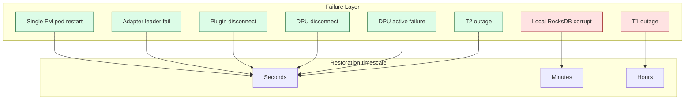
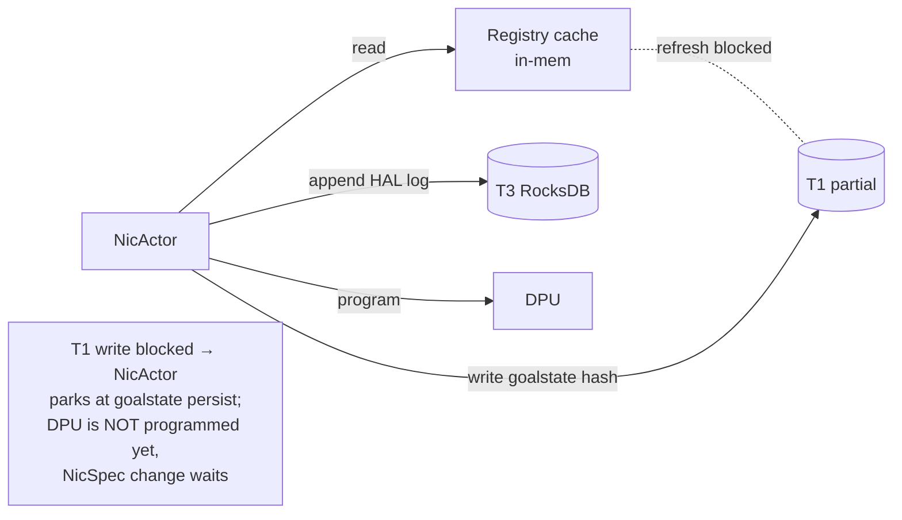
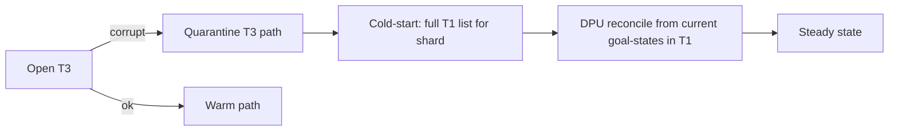
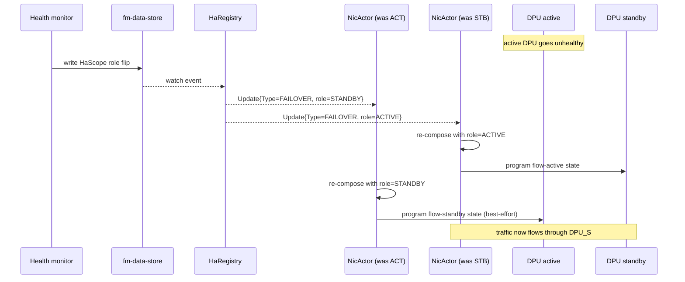

# FleetManager — Recovery & Failover Design

> **TL;DR:** Every failure mode (pod restart, adapter leader death, T1
> outage, T2 outage, plugin disconnect, DPU disconnect, local disk
> corruption) has a defined recovery procedure with bounded RPO/RTO.
> The three-tier storage gives us strict layering: T1 is the truth, T2
> is coordination, T3 is per-pod warm cache. Recovery is always
> "rehydrate from a higher-numbered tier or from T1".

---

## 1. Scope

This document covers:

- FM-pod restart (cold and warm).
- Adapter leader handoff.
- Plugin reconnect / resync.
- T1 (`fm-data-store`) outage and partial unavailability.
- T2 (`fm-cluster-state`) outage.
- Local RocksDB (T3) corruption.
- Shard rebalance (planned and unplanned).
- DPU-side disconnect (HAL session loss).
- Data-plane HA (HaSet/HaScope active/standby).
- Cluster-wide disaster (T1 quorum loss).

Out of scope: cross-region failover, full DR drill scripts (covered
elsewhere), multi-tenant isolation breaches (security topic).

---

## 2. Layered recovery model



**Principle:** the higher up the stack a tier sits, the faster it
recovers. Local + in-memory state is reconstructible in seconds; T1
quorum loss is a real outage requiring operator action.

---

## 3. Single FM pod restart

### 3.1 Warm restart (T3 RocksDB intact)

```mermaid
sequenceDiagram
    participant K as Kubernetes / orchestrator
    participant POD as FM pod
    participant T3 as Local RocksDB
    participant T2 as fm-cluster-state
    participant T1 as fm-data-store
    participant DPU as DPUs in shard

    K->>POD: start container (same node, PV intact)
    POD->>T3: open / verify integrity
    T3-->>POD: hot cache + last cursors
    POD->>T2: register pod + claim shard
    T2-->>POD: shard assignment confirmed
    POD->>POD: rebuild registries from T3 snapshot
    POD->>T1: watch from saved cursors
    T1-->>POD: deltas since cursor
    POD->>POD: spawn NicActors for owned ENIs
    POD->>DPU: reconcile against HAL apply log
    DPU-->>POD: current content_hashes
    Note over POD: differences trigger re-program;<br/>matches confirm steady state
```

**Targets:**

| Stage | Time |
|-------|------|
| T3 open + verify | <1s |
| Registry warm-load | <5s |
| T2 shard claim | <2s |
| T1 catch-up watch | <30s typical, <5min worst-case |
| DPU reconcile | <60s for 5k ENI shard |
| **End-to-end RTO** | **<2 min** for typical shard |

### 3.2 Cold start (no T3, fresh disk)

- Skip T3 hot-load.
- Full prefix-list of T1 for owned shard.
- 5–15 min for a 100k-ENI shard.

### 3.3 Restart while shard is hot

If a pod restarts and its replacement arrives before TTL expires
(T2 lease still valid), the replacement re-claims the same shard and
no rebalance happens. If the lease expires, T2 reassigns the shard
(see §7) and the original ENIs may move to other pods — those pods
warm-load from their own T3 + T1.

---

## 4. Adapter leader handoff

### 4.1 Why a single adapter at a time

The adapter is the **only writer** to T1 from the orchestrator side.
A single writer makes content-hash dedup and watermark advancement
trivial. Multiple writers would need a distributed lock per topic —
not worth the complexity at FM's scale.

### 4.2 Election

- Lease at `/fm/cs/leader/adapter` in T2.
- Default lease TTL: 15s; heartbeat every 5s.
- All FM pods run the adapter code in standby.
- The standby that wins the next CAS on the lease becomes leader.

### 4.3 Handoff sequence

```mermaid
sequenceDiagram
    participant L1 as Adapter (old leader)
    participant T2 as fm-cluster-state
    participant L2 as Adapter (standby → new leader)
    participant PLG as Plugin
    participant T1 as fm-data-store

    Note over L1,T1: steady state — L1 is leader
    L1->>T2: heartbeat lease
    L1->>PLG: Subscribe + Recv
    L1->>T1: CAS write events

    Note over L1: pod dies / network partition
    L1--xT2: heartbeat times out (15s)
    T2->>L2: lease available; CAS-claim
    L2->>T2: claim succeeded — new leader
    L2->>T2: read /fm/cs/watermark/* (saved by L1)
    L2->>PLG: Subscribe(topic, fromWatermark)
    PLG-->>L2: stream resumes
    L2->>T1: idempotent CAS writes (dedup by hash)
```

**Properties:**

- **At most one active adapter** at any time (lease is exclusive).
- **No event loss** — watermarks were advanced after T1 ack, so the
  new leader resumes from the last-known-good point.
- **Possible duplicates** during handoff window — T1's content-hash
  dedup absorbs them.
- **Bounded blast radius** — orchestrator-side ingest pauses for at
  most `lease_ttl_sec` (15s). DPU programming continues from existing
  T1 state during the gap.

### 4.4 Standby readiness

Each pod periodically refreshes its plugin connection and verifies
it can List the required topics — readiness gate to avoid a "newly
elected leader can't talk to upstream" scenario.

---

## 5. Plugin disconnect & resync

### 5.1 Reconnect

The adapter's plugin client implements bounded exponential backoff
(`reconnect_backoff_ms: [100, 500, 2000, 10000]`).
Reconnect re-issues `Subscribe(topic, fromWatermark)` for every
required topic. The plugin must honor the watermark (per its
contract).

### 5.2 Watermark too old

If the plugin reports the watermark is no longer honorable
(compaction, retention truncation), it emits `RESYNC_START` →
re-list → `RESYNC_END`.

```mermaid
sequenceDiagram
    participant ADP as Adapter
    participant PLG as Plugin
    participant T1 as fm-data-store

    ADP->>PLG: Subscribe(topic, watermark)
    PLG-->>ADP: Event{Type=RESYNC_START}
    ADP->>ADP: enter RESYNC mode for topic;<br/>mark all keys "candidate-stale"
    loop for each existing upstream key
        PLG-->>ADP: Event{Type=PUT, key=k, value=v}
        ADP->>T1: CAS write (idempotent on hash)
        ADP->>ADP: mark k "fresh"
    end
    PLG-->>ADP: Event{Type=RESYNC_END, watermark=W'}
    ADP->>ADP: any "candidate-stale" key not seen → DELETE in T1
    ADP->>T2: advance watermark to W'
```

### 5.3 Plugin outage tolerance

- DPU programming **does not pause** when the plugin is down.
- New ENIs being created upstream just don't arrive in T1 yet.
- Existing ENIs continue with their last-known goal-state.
- After threshold (`plugin_max_disconnect_minutes` — default 30),
  ops alarm fires and reconciliation against orchestrator is
  flagged.

---

## 6. T1 (`fm-data-store`) outage

### 6.1 Severity classes

| Class | Definition | Effect |
|-------|------------|--------|
| **Read-only** | Quorum lost; followers serve reads | Hot path mostly unaffected (in-mem & T3 caches); no new programming, no adapter ingest |
| **Quorum loss** | No leader; reads & writes fail | Hot path uses caches; new programming halted; alarms |
| **Total outage** | All replicas unreachable | Hot path uses caches; everything else halts |

### 6.2 Behavior under partial T1 unavailability



- Existing ENIs continue with their existing programmed state.
- A NicActor that needs to compose a *new* goalstate revision will
  park at the "persist hash to T1" step until T1 returns. DPU is
  **not** programmed from a goalstate that hasn't been durably
  recorded.
- Adapter halts ingest; events backpressure into the plugin.

### 6.3 Recovery

1. Operator restores quorum (etcd snapshot recovery / TiKV PD
   restart / etc.).
2. Adapter reconnects, replays from saved watermarks in T2.
3. Pods catch up via T1 watches from saved cursors.
4. NicActors flush parked goalstate writes.

**Restore-from-snapshot RTO target:** 30 min for a 10M-ENI fleet
(etcd: snapshot copy + verify + restart 5-node cluster + warm clients).

### 6.4 Backup cadence

| Backup type | Frequency | Retention |
|-------------|-----------|-----------|
| Snapshot | Hourly | 7 days |
| Snapshot | Daily | 4 weeks |
| Snapshot | Weekly | 12 months |

Snapshots stored in object storage (S3/GCS/Azure Blob); bucket lock
prevents accidental deletion.

---

## 7. T2 (`fm-cluster-state`) outage

### 7.1 Effect

- Pods cannot heartbeat → leadership leases expire → adapter goes
  offline; shard assignments freeze.
- Existing pods keep serving their existing shards (no new claims).
- New programming continues for in-flight NicActors that already
  have what they need from registries.
- Adapter halts (no leader → no ingest).

### 7.2 Recovery

T2 restored → pods re-register, new adapter elected, shards
re-confirmed (idempotent), watermarks resume.

### 7.3 Bootstrap / co-located T2

In small/medium tiers T2 shares a cluster with T1. A T2 outage in
that case implies a T1 outage — fall back to §6.

---

## 8. Local RocksDB (T3) corruption

### 8.1 Detection

- Open-time integrity check (RocksDB checksum verify).
- Failed read of HAL apply log latest record on startup.
- Mismatch between T3 cached `content_hash` and T1 `content_hash`
  for a key that the pod claims to have written recently.

### 8.2 Recovery



Cold-start: identical to §3.2. Quarantined T3 is preserved for
post-mortem at `/var/lib/fm/local-quarantine/<timestamp>/`.

### 8.3 HAL apply log replay

When T3 is intact, pod restart re-applies pending HAL writes that
hadn't been acked by the DPU before the restart. The log is
append-only with sequence numbers; the pod resumes from the
last-acked sequence.

---

## 9. Shard rebalance

### 9.1 Triggers

- Pod added (scale up).
- Pod removed (scale down or unrecoverable failure).
- Skew detected (load metric beyond `shards.rebalance_threshold`).

### 9.2 Strategy: rendezvous hashing (default)

Every (ENI, pod) pair has a deterministic score from
`H(eni_id, pod_id, salt)`; the pod with the highest score for an ENI
owns it. Adding/removing a pod moves only `1/N` of the keyspace, not
the whole map.

### 9.3 Move sequence

```mermaid
sequenceDiagram
    participant T2 as fm-cluster-state
    participant SRC as Source pod
    participant DST as Destination pod
    participant T1 as fm-data-store

    T2->>SRC: shard reassignment notification
    T2->>DST: shard reassignment notification

    SRC->>SRC: stop spawning NEW NicActors for moving ENIs
    SRC->>SRC: drain in-flight programs (best-effort, capped 10s)
    SRC->>T1: ensure goal-state hash persisted for each moving ENI
    SRC->>T2: ack drain complete
    DST->>T1: read NicSpec + goal-state hash for each moving ENI
    DST->>DST: spawn NicActor; Acquire registries
    DST->>DST: reconcile DPU (no-op if hashes match — common case)
    DST->>T2: ack ownership

    Note over SRC,DST: critical invariant — at most one pod<br/>programs a given ENI at a time
```

**Critical invariant:** an ENI is never programmed by two pods
concurrently. Achieved by:

- T2 holds the authoritative shard map.
- HDO sessions to a DPU are serialized via T2 lease per `device_id`
  (only the shard owner's pod can hold the gNMI session for that
  DPU's ENIs).
- During move, source releases the per-ENI lease before destination
  claims it.

### 9.4 Rebalance batching

Rebalance is batched and rate-limited (`rebalance.max_concurrent_moves: 100`)
to avoid stampedes.

---

## 10. DPU disconnect (HAL session loss)

### 10.1 Effect

- HDO's gNMI session breaks.
- In-flight writes time out; their `command_id`s remain pending in
  T3 HAL log.
- Existing programmed state on the DPU continues to forward traffic
  (DASH dataplane is independent of control session).

### 10.2 Reconnect

- HDO reconnects with exponential backoff (`hal.reconnect_backoff_ms`).
- On session re-establish, HDO performs **content-hash reconcile**:
  reads current hashes from DPU per table; compares to expected
  hashes in T3 HAL log; re-issues only the missing/different writes.
- NicActors that were waiting for ack are unblocked.

### 10.3 Long disconnects

If a DPU is offline > `dpu_dead_threshold_minutes` (default 10),
its Device record is marked `DEGRADED` in T1. Operators alarm.
Alarms cleared on successful reconcile.

---

## 11. Data-plane HA (HaSet / HaScope active/standby)

This is **DPU-level** HA — orthogonal to FM-pod HA above.

### 11.1 Setup

A `HaSet` declares a pair of DPUs (active, standby). Each ENI in
the set has a `HaScope` declaring which DPU is currently active for
that ENI's flow domain.

### 11.2 Failover



### 11.3 Properties

- HaRegistry is the single source of role updates; both NicActors
  see the same revision so they cannot disagree.
- Failover decision is owned by the orchestrator's health monitor,
  not by FM (FM only programs the result).

---

## 12. Cluster-wide disaster

### 12.1 Scenarios

- T1 quorum permanently lost (multiple replicas dead).
- Object-store backups corrupted / unavailable.
- Region-wide outage.

### 12.2 Recovery

1. Restore most recent valid T1 snapshot to a fresh quorum.
2. If snapshot age exceeds RPO, replay plugin events from
   `now - RPO_minutes` (orchestrator's retention permitting).
3. Rebuild T2 from scratch (it's coordination only — no domain data
   lost).
4. Pods cold-start; cold-list T1; reconcile against DPUs (DPUs
   typically still hold last-programmed state from before the
   outage).
5. Audit: compare T1 (now) against orchestrator (now); orchestrator
   re-publishes any drift.

### 12.3 Drill cadence

- Quarterly: simulated T1 restore in a staging env.
- Annual: regional failover exercise (when multi-region is in scope).

---

## 13. Recovery time objectives (RTO) summary

| Failure | RTO target | RPO target |
|---------|------------|------------|
| Single FM pod restart (warm) | 2 min | 0 (durable in T1) |
| Single FM pod restart (cold) | 15 min | 0 |
| Adapter leader handoff | 15s | 0 |
| Plugin disconnect (with watermark) | 60s | 0 |
| Plugin disconnect (RESYNC) | 5 min for 1M VNETs | 0 |
| T1 outage → restore | 30 min | 1h |
| T2 outage | 5 min | 0 (reconstructible) |
| T3 corruption | Same as cold pod restart | 0 |
| Shard rebalance | per-ENI move <1s, full pod join <10 min | 0 |
| DPU reconnect | <30s plus reconcile | 0 |
| Data-plane HA failover | <2s end-to-end | n/a |

---

## 14. Observability of recovery

### 14.1 Critical metrics

```
fm_pod_restart_total{pod_id, type=warm|cold}
fm_adapter_leader_election_total{outcome=won|lost|expired}
fm_adapter_handoff_duration_seconds
fm_plugin_disconnect_total
fm_plugin_resync_duration_seconds{topic}
fm_t1_unavailability_seconds_total
fm_t2_lease_renew_failures_total
fm_t3_corruption_events_total
fm_shard_rebalance_active_moves
fm_dpu_disconnect_total{device_id}
fm_ha_failover_total{ha_set_id, direction}
fm_reconcile_drift_total{kind}
```

### 14.2 Required alarms

| Alarm | Threshold | Severity |
|-------|-----------|----------|
| Adapter leader missing | >30s | warn |
| Adapter leader missing | >5 min | critical |
| Plugin disconnected | >5 min | warn |
| Plugin disconnected | >30 min | critical |
| T1 reads failing | >10s | warn |
| T1 writes failing | >10s | critical |
| Pod missing heartbeat | >2× lease TTL | warn |
| DPU degraded | >10 min | warn |
| Shard rebalance > 30 min | running | warn |

### 14.3 Runbook references

Each alarm page links to a runbook; runbooks live alongside this
doc in [11-failure-modes-and-runbooks.md](../11-failure-modes-and-runbooks.md)
(per-step procedures with concrete commands).

---

## 15. Testing

| Test | Method | Frequency |
|------|--------|-----------|
| Pod restart (warm) | Chaos kill of one FM pod | Weekly automated |
| Pod restart (cold) | Wipe T3 PV before restart | Weekly automated |
| Adapter leader kill | Kill leader pod | Weekly automated |
| Plugin disconnect | Block egress to plugin | Weekly automated |
| Plugin RESYNC | Force compaction event upstream | Monthly |
| T1 quorum loss | Stop majority of T1 replicas | Monthly (staging) |
| T1 restore from snapshot | Drill in staging | Quarterly |
| Shard rebalance | Add/remove pods | Weekly automated |
| DPU disconnect | Block egress to DPU | Weekly automated |
| HA failover | Force HaSet flip | Daily automated |

CI gates promotion on the weekly suite passing in staging.

---

## See also

- [storage-architecture.md](./storage-architecture.md) — three-tier model.
- [orchestrator-plugin-interface.md](./orchestrator-plugin-interface.md) — plugin reconnect contract.
- [registry-pattern-design.md](./registry-pattern-design.md) — registry warm-restart from T3.
- [deployment-tiers.md](./deployment-tiers.md) — tier-specific HA expectations.
- [fleet-manager-hld.md §8 HA](./fleet-manager-hld.md#8-ha--failover) — original HA narrative.
