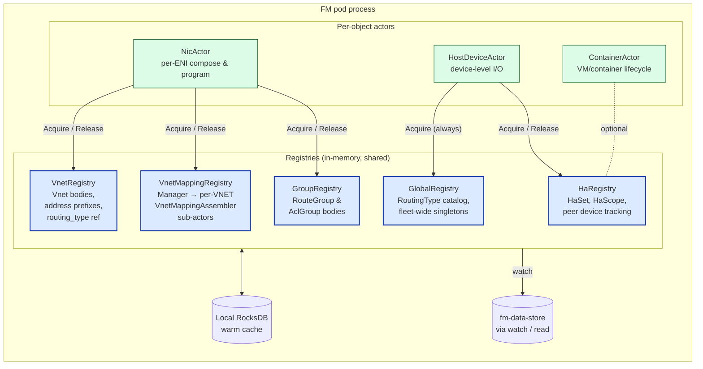
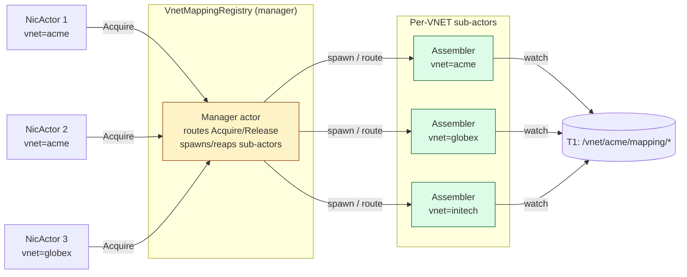
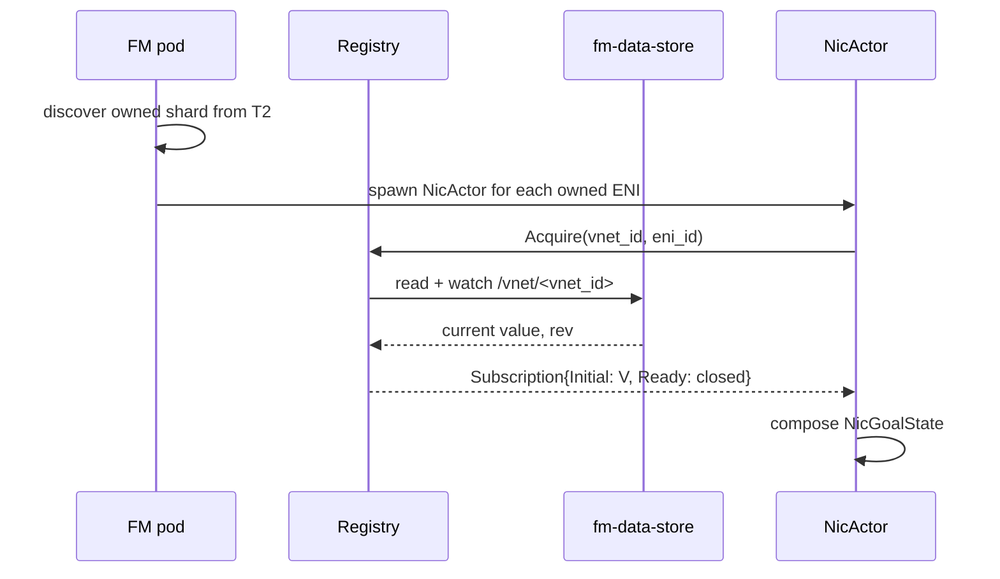

# FleetManager — Registry Pattern Design

> **TL;DR:** Per-NIC actors do **not** subscribe to VNETs, mappings,
> or groups directly. They **register their interest** with five
> shared **Registries** (Global, Vnet, VnetMapping, Group, Ha). Each
> registry holds a single shared cache, refcounts subscribers, and
> manages T1 watches. Subscribe-on-first-need, unsubscribe-on-zero,
> notify-on-change. This converts O(NICs × refs) work into
> O(unique refs) work and removes the per-NIC redundancy that the
> earlier HDO-owned-the-cache model had.

---

## 1. The problem this solves

In the earlier model:

- Every `HostDeviceActor` (HDO) — one per DPU — independently
  subscribed to **every** VNET, RoutingType, mapping, RouteGroup,
  AclGroup, and Tunnel that any NIC on its DPU referenced.
- A 5,000-DPU cluster where each DPU hosts 30 ENIs across 100 unique
  VNETs would mean **500,000** redundant T1 watches and **5,000×**
  duplicated mapping caches in memory. Mapping tables are the
  expensive ones — millions of rows per VNET.
- A change to one VNET woke up every HDO that referenced it, each
  re-validating, each re-composing every NIC.

The Registry Pattern centralizes the cache **inside the FM pod
process** so:

- One copy of each VNET / mapping / group lives per pod, regardless
  of how many ENIs reference it.
- One T1 watch per (pod, ref) pair, regardless of NIC count.
- A single change fans out exactly once to the in-process subscriber
  list.
- Drop-to-zero subscribers releases the cache and unsubscribes from
  T1 — memory tracks demand.

---

## 2. The five registries



| Registry | Holds | Subscriber identity | Lifetime |
|----------|-------|---------------------|----------|
| **GlobalRegistry** | RoutingType catalog, fleet-wide singletons | `pod_id` (always 1) | pod lifetime |
| **VnetRegistry** | `Vnet` bodies, address prefix lookups | `eni_id` | refcounted per `vnet_id` |
| **VnetMappingRegistry** | Manifest + chunks (assembled), self-entries | `eni_id` | refcounted per `vnet_id` |
| **GroupRegistry** | `RouteGroup`, `AclGroup` bodies | `eni_id` | refcounted per `group_id` |
| **HaRegistry** | `HaSet`, `HaScope`, peer DPU tracking | `eni_id` | refcounted per `ha_set_id` |

---

## 3. The Acquire / Release / Read contract

Every registry implements the same three-method contract:

```go
type Registry[K comparable, V any] interface {
    // Acquire registers a subscriber's interest in key K.
    // - First subscriber for K: opens a T1 watch, hydrates from T1 (or T3),
    //   returns a Subscription that delivers updates.
    // - Nth subscriber for K: returns a Subscription bound to the existing entry,
    //   no extra watch.
    // The returned cancel func is what Release calls; idempotent.
    Acquire(ctx context.Context, key K, sub SubscriberID) (Subscription[V], cancel func())

    // Release decrements the refcount; if 0, schedules a debounced unsubscribe
    // (default 30s grace period to absorb churn).
    Release(key K, sub SubscriberID)

    // Read returns the current cached value or ErrMiss. Does NOT register
    // interest. Used for read-only audit / debug paths.
    Read(key K) (V, bool)
}

type SubscriberID struct {
    Kind  SubscriberKind  // ENI | DEVICE | POD
    Value string          // eni_id | device_id | pod_id
}

type Subscription[V any] struct {
    Updates <-chan Update[V]   // PUT / DELETE / RESYNC
    Initial V                  // current value at acquire time
    Ready   <-chan struct{}    // closed when first hydration is complete
}

type Update[V any] struct {
    Type    UpdateType   // PUT | DELETE | RESYNC
    Value   V            // current
    Prev    V            // previous (zero on first PUT)
    Rev     int64        // T1 revision
}
```

### Why a single contract

- One mental model for every actor.
- Registries can be tested with the same harness.
- Future registries (e.g., `MeterPolicyRegistry`) plug in unchanged.

---

## 4. Subscriber identity = `eni_id`

Earlier discussion considered `device/vnet-id/nic-name`. We landed on
**`eni_id`** as the canonical subscriber identity for these reasons:

- `eni_id` (`ENI_<DPU>_<MAC>`, Decision #13) is **already canonical**
  throughout FM — used in T1 keys, NicGoalState, telemetry, audit.
- It's globally unique without needing the `vnet_id` to disambiguate
  (an ENI moves between VNETs at most via re-create, never in place).
- It's a short, stable string — no pointer hazards, easy to log.
- Per-VNET indexing (the "association list" idea) is built **on top**
  by the registry as a secondary index, not as the identity itself.

```go
type SubscriberID struct {
    Kind  SubscriberKind   // ENI for NIC actors, DEVICE for HDO, POD for pod-level
    Value string            // eni_id, device_id, or pod_id
}
```

The `VnetRegistry` (and others) keep an internal index:

```
vnet_id → {set of subscribed eni_ids}
```

so a notification fan-out is O(subscribers-for-this-vnet), not
O(all ENIs).

---

## 5. VnetMappingRegistry — special case (manager + sub-actors)

Mapping tables are the heaviest object: up to 1M entries per VNET,
sharded across many chunks, with a manifest that gates completeness.
Doing this in a **single registry actor** would head-of-line block
every other VNET's mapping update behind one slow VNET's chunk
arrival.

### 5.1 Manager + per-VNET sub-actors



- **Manager** is a singleton per pod. Stateless except for the
  `vnet_id → sub_actor` map. Routes every `Acquire`/`Release`.
- **Assembler** is one actor per actively-subscribed VNET. Owns:
  - Watch on `/vnet/<id>/mapping/_manifest`.
  - Watches on each chunk in the manifest's table of contents.
  - Content-hash validation on each chunk arrival.
  - Assembled-state machine (INCOMPLETE → COMPLETE → INCOMPLETE on
    new manifest revision).
  - The notification fan-out to subscribed `eni_id`s.
- **Reaping** — Manager removes the sub-actor 30s after refcount → 0
  (debounce; immediate reap on explicit `ForceRelease`).

### 5.2 Why per-VNET sub-actors

- **No head-of-line blocking** — VNET A's slow chunk arrival doesn't
  delay VNET B.
- **Parallelism** — N VNETs validate in parallel up to GOMAXPROCS.
- **Locality** — chunk assembly state lives in one place; fail-stop
  resets that one VNET only.
- **Bounded memory** — only actively-subscribed VNETs occupy memory;
  reap on idle.

### 5.3 Self-entry injection

For each NIC, the registry also injects a synthetic mapping entry
pointing the NIC's overlay IP at its own DPU's PA — see
[nic-spec.md](../protos/published/nic-spec.md) "Upstream DASH
alignment" for why. The Assembler exposes a hook the NicActor calls:

```go
assembler.UpsertSelfEntry(eni_id, overlay_ip, mac, local_pa)
assembler.RemoveSelfEntry(eni_id)
```

These appear as additional rows in the assembled mapping; they are
not persisted to T1 — they are derived from `NicSpec.primary_ip_*`.

---

## 6. State machine — registry entry lifecycle

```mermaid
stateDiagram-v2
    [*] --> NEW: first Acquire
    NEW --> HYDRATING: open T1 watch + initial read
    HYDRATING --> READY: data present & validated
    HYDRATING --> WAITING: refs missing (e.g., mapping incomplete)
    READY --> WAITING: dependency went incomplete
    WAITING --> READY: deps satisfied
    READY --> RESYNCING: T1 watch reset (resync)
    RESYNCING --> READY: resync complete
    READY --> COOLDOWN: refcount → 0
    COOLDOWN --> READY: new Acquire within grace
    COOLDOWN --> [*]: grace expires; close watch, free memory
```



- **NEW → HYDRATING** — seed value loaded from T3 RocksDB if present
  (warm restart shortcut), else from T1.
- **WAITING** — the entry is materialized but a referenced object is
  missing or incomplete. Subscribers receive `Update{Type=WAITING}`
  so they can hold off composing.
- **COOLDOWN grace = 30s** — absorbs churn (NIC restart, brief
  config flap) without re-hydration cost.

---

## 7. Notification semantics

### 7.1 Delivery

- **Bounded channel per subscriber.** Default depth 16. If full,
  the registry switches to **coalescing mode**: it drops intermediate
  updates and delivers only the latest. Dropped events are logged
  and counted (`fm_registry_coalesced_total`).
- **Order preserved per (key, subscriber).**
- **At-most-once for delivery, at-least-once for state.** A
  subscriber that recovers from a missed update reads the current
  value via `Read()` or trusts the `Update.Value` (always current).

### 7.2 Backpressure

A slow subscriber cannot block the registry from servicing fast
ones. Coalescing (above) is the mechanism. The slow subscriber is
flagged via metric `fm_registry_slow_subscriber{kind, key, sub_id}`
so ops can investigate.

### 7.3 Dependency cascades

When a `RouteGroup` referenced by a `Vnet` changes, the GroupRegistry
notifies its subscribers (the NicActors that referenced *that group*
via the VNET). The registry does NOT chase indirect dependencies —
each NicActor's compose function re-evaluates from current registry
reads.

---

## 8. Per-registry detail

### 8.1 GlobalRegistry

**Holds:** RoutingType catalog (fleet-wide singletons).
**Subscribers:** every pod has exactly one — itself. Acquired at
process startup, never released until shutdown.
**Watch:** `/fm/v1/global/`.
**Special:** all writes are read-only from FM's perspective —
orchestrator owns these. Validation is strict.

### 8.2 VnetRegistry

**Holds:** `Vnet` bodies keyed by `vnet_id`.
**Subscribers:** each NicActor whose NIC references this VNET.
**Watch:** one per actively-subscribed `vnet_id`, on `/fm/v1/vnet/<vnet_id>`.
**Index:** `vnet_id → {eni_ids}`.
**Notify on change:**
- Address prefix list change → all subscribers (each NicActor
  re-validates `primary_ip_*`).
- `routing_type` change → all subscribers (rare; treated as
  fleet-wide event).
- VNET delete with subscribers present → reject in adapter (orphan
  protection); audit log + alarm.

### 8.3 VnetMappingRegistry

Detailed in §5 above. Two-level: manager + assembler-per-VNET.

### 8.4 GroupRegistry

**Holds:** `RouteGroup` and `AclGroup` bodies. Two namespaces (route
and acl) but one registry struct with kind-tagged keys.
**Subscribers:** each NicActor whose NIC references this group.
**Watch:** one per actively-subscribed `group_id`.
**Notify on change:** subscribers re-compose; if the group is large
(thousands of routes), the registry compares `content_hash` and
suppresses no-op notifications.

### 8.5 HaRegistry

**Holds:** `HaSet`, `HaScope`, peer DPU mapping.
**Subscribers:** each NicActor whose NIC participates in HA. Optionally
the ContainerActor when the container has HA-aware orchestration.
**Watch:** one per active `ha_set_id`.
**Special:** failover events are first-class — the registry emits a
distinguished `Update{Type=FAILOVER, Role=ACTIVE|STANDBY, Reason=...}`.
NicActors react by recomputing the appropriate scope.

---

## 9. Pod boundaries

A registry is **per-pod**. Two pods caching the same VNET each have
their own copy and their own watch. This is intentional:

- Pods are independent failure domains.
- A pod owns a shard of ENIs; cross-pod sharing of caches would
  require a distributed cache layer (Redis/memcached) with its own
  failure modes.
- T1 (etcd default) handles N-pod-watching-same-key scaling well up
  to a few hundred pods on a 5-node cluster. Beyond that, point pods
  at follower replicas.

If pod count grows beyond what T1 can support, a future enhancement
is **registry sharing across pods on a node** via a sidecar — out of
scope today.

---

## 10. Cold start vs warm restart

### 10.1 Cold start (no T3 RocksDB content)



- All registries hydrate from T1 directly.
- For mappings, the assembler reads manifest first, then in parallel
  reads each chunk listed in the manifest.

### 10.2 Warm restart (T3 RocksDB present)

```mermaid
sequenceDiagram
    participant POD as FM pod (restart)
    participant REG as Registry
    participant T3 as Local RocksDB
    participant T1 as fm-data-store

    POD->>REG: pre-load from T3 snapshot
    REG->>T3: read all cached entries + revs
    T3-->>REG: cached values
    REG->>T1: watch from saved cursor
    T1-->>REG: deltas since cursor
    REG->>REG: merge deltas; if revision skipped, full re-list per entry
```

T3 is a snapshot of the registry's view at last shutdown. Warm
restart is **seconds**; cold start can be minutes for a large
shard. T3 contents are validated against `content_hash` on load —
corruption falls back to cold path.

---

## 11. Concrete data structures

### 11.1 VnetRegistry (sketch)

```go
type VnetRegistry struct {
    mu       sync.RWMutex
    entries  map[VnetID]*vnetEntry
    watch    DataStore        // T1 client
    coolDown time.Duration    // default 30s
    log      Logger
}

type vnetEntry struct {
    mu      sync.RWMutex
    value   *Vnet
    rev     int64
    state   EntryState        // NEW|HYDRATING|READY|WAITING|COOLDOWN
    refs    map[SubscriberID]chan Update[*Vnet]
    cancel  context.CancelFunc
    lastUse time.Time
}

func (r *VnetRegistry) Acquire(ctx context.Context, vid VnetID, sub SubscriberID) (Subscription[*Vnet], func()) {
    r.mu.Lock()
    e, ok := r.entries[vid]
    if !ok {
        e = newVnetEntry(vid, r.watch)
        r.entries[vid] = e
        go e.hydrateAndWatch(ctx)
    }
    r.mu.Unlock()

    e.mu.Lock()
    ch := make(chan Update[*Vnet], 16)
    e.refs[sub] = ch
    initial := e.value
    rev := e.rev
    e.mu.Unlock()

    cancel := func() { r.Release(vid, sub) }
    return Subscription[*Vnet]{Updates: ch, Initial: initial, Ready: e.readyCh, Rev: rev}, cancel
}

func (r *VnetRegistry) Release(vid VnetID, sub SubscriberID) {
    r.mu.RLock()
    e := r.entries[vid]
    r.mu.RUnlock()
    if e == nil { return }

    e.mu.Lock()
    if ch, ok := e.refs[sub]; ok {
        close(ch); delete(e.refs, sub)
    }
    empty := len(e.refs) == 0
    e.lastUse = time.Now()
    e.mu.Unlock()

    if empty {
        time.AfterFunc(r.coolDown, func() { r.maybeReap(vid) })
    }
}
```

### 11.2 VnetMappingRegistry — manager (sketch)

```go
type VnetMappingRegistry struct {
    mu         sync.RWMutex
    assemblers map[VnetID]*MappingAssembler
    watch      DataStore
    log        Logger
}

func (r *VnetMappingRegistry) Acquire(ctx context.Context, vid VnetID, sub SubscriberID) (Subscription[*AssembledMapping], func()) {
    r.mu.Lock()
    a, ok := r.assemblers[vid]
    if !ok {
        a = NewMappingAssembler(vid, r.watch, r.log)
        r.assemblers[vid] = a
        go a.Run(ctx)
    }
    r.mu.Unlock()
    return a.Subscribe(sub)
}
```

The Assembler internally runs the manifest+chunks state machine
described in [vnet-mapping.md](../protos/published/vnet-mapping.md)
"HDO assembly lifecycle" — but here it's per-VNET inside the manager,
not per-DPU.

---

## 12. Refcount accounting examples

| Scenario | Acquire / Release flow |
|----------|------------------------|
| First VM in a fresh VNET arrives on this pod | `VnetRegistry.Acquire(vnet=V1, eni=E1)` → entry NEW → HYDRATING → READY. `MappingRegistry.Acquire(vnet=V1, eni=E1)` → spawn Assembler V1 → INCOMPLETE → COMPLETE. NicActor composes once mapping is COMPLETE. |
| 2nd VM in the same VNET on same pod | `Acquire(vnet=V1, eni=E2)` finds entry READY; returns subscription bound to existing entry. **No extra watch, no extra cache.** Mapping likewise. |
| 1st VM in a fresh VNET on a *different* pod | That pod's registry is independent — opens its own watch. (Not de-duped across pods; see §9.) |
| VM destroyed, last on pod for VNET | `Release(vnet=V1, eni=E1)`. refcount → 0. Entry enters COOLDOWN for 30s. If no Acquire arrives, watch closes, cache freed, T3 entry retained for warm-restart. |
| VNET edited while subscribers present | T1 watch fires on assembler/entry → notify all subscribed `eni_id`s in O(subs). Each NicActor re-composes if its inputs actually changed (content-hash compare avoids no-op). |
| VNET deleted while subscribers present | Adapter REJECTS the delete (orphan protection); audit + alarm. Operator must drain ENIs first. |

---

## 13. Error handling

| Failure | Effect |
|---------|--------|
| T1 watch dies | Registry retries with exponential backoff; entries enter `RESYNCING`; subscribers continue to read last-known value from `Read()`. |
| T1 returns "compacted/too-old" | Registry forces a full re-list of the affected prefix; subscribers receive `Update{Type=RESYNC}`. |
| Validation failure on incoming value | Old value retained; entry stays READY; failure surfaced as `fm_registry_validation_errors_total{kind, key}` and audit log entry. Operator must fix orchestrator data. |
| Local T3 corruption on warm restart | Fall back to cold-start (full T1 list). |
| Registry sub-actor (Assembler) panic | Recovered by manager; sub-actor restarts; its subscribers see a `Update{Type=RESYNC}`. |
| Slow subscriber | Coalescing mode; metric raised; no impact on other subscribers. |

---

## 14. Observability

### 14.1 Metrics (Prometheus)

```
fm_registry_entries{kind="vnet|mapping|group_route|group_acl|ha"}
fm_registry_subscribers{kind, key}
fm_registry_acquire_total{kind, result="hit|miss"}
fm_registry_release_total{kind}
fm_registry_hydration_duration_seconds{kind}
fm_registry_state_transitions_total{kind, from, to}
fm_registry_validation_errors_total{kind, error}
fm_registry_coalesced_total{kind}
fm_registry_slow_subscribers{kind}
fm_registry_t1_watches{kind, state="open|reconnecting|closed"}
fm_registry_cooldown_pending{kind}
```

### 14.2 Tracing

Each `Acquire` opens a span. The span follows the hydration through
to `READY` or `WAITING`. NicActor's compose span is a child of its
acquire span — clear cause-and-effect when investigating slow
provisioning.

### 14.3 Debug API

`GET /debug/registry/<kind>/<key>` returns:

```json
{
  "kind": "vnet",
  "key": "vnet-acme-prod",
  "state": "READY",
  "rev": 18742,
  "subscribers": ["ENI_dpu7_aabbcc", "ENI_dpu7_aabbdd"],
  "last_update_age_ms": 4200,
  "coalesced_in_last_minute": 0,
  "memory_estimate_bytes": 12834
}
```

---

## 15. Why these five and not more / fewer

| Considered | Outcome |
|------------|---------|
| **One uber-registry** | Rejected — different objects have different lifecycles (mappings need assembly, groups don't), different cardinalities (mappings huge, RoutingType tiny). One struct with 5 method paths is just 5 registries hidden. |
| **Per-actor caches (status quo)** | Rejected — that's the redundancy this design fixes. |
| **Split RouteGroup vs AclGroup into separate registries** | Considered; unified into GroupRegistry because their lifecycles and refcount semantics are identical. Internally indexed by `(kind, group_id)`. |
| **Tunnel registry** | Folded into VnetRegistry's referenced-data set (Tunnel is small and rarely changes; preferred to keep registry count low). Could be split out later if Tunnel churn rises. |
| **MeterPolicy registry** | Future. Trivial to add when MeterPolicy becomes a top-level FM object. |

Five is the smallest set that covers the dependency layers in
[11A-ENI-Dependency-Graph.md](../Learning-DashNet/11A-ENI-Dependency-Graph.md)
(Layer 0 → GlobalRegistry, Layer 1 → VnetRegistry +
VnetMappingRegistry, Layer 2 → GroupRegistry, Layer 4 fan-out → HaRegistry)
without forcing unrelated objects into a single struct.

---

## 16. Mapping to the dependency graph

| Layer (from 11A) | Registry | Acquire timing |
|------------------|----------|----------------|
| Layer 0 — per-device foundation (RoutingType) | GlobalRegistry | Pod startup |
| Layer 1 — per-VNET foundation (Vnet, mapping, PA validation) | VnetRegistry + VnetMappingRegistry | NicActor's first Acquire on its `vnet_id` |
| Layer 2 — reusable policy groups (RouteGroup, AclGroup) | GroupRegistry | NicActor's Acquire after VNET is READY |
| Layer 3 — ENI itself | (lives in T1 + per-pod NicActor; no registry) | n/a |
| Layer 4 — per-ENI bindings + HA scope | HaRegistry (HA only); inline scopes are NIC-local | NicActor compose-time |

This is exactly the topological order in §7 of 11A.

---

## 17. Migration from the old per-HDO model

The HDO previously owned subscribe/cache for everything its DPU
referenced. The migration:

1. HDO becomes a **thin device-I/O actor**: gNMI/SAI session,
   ack/diag handling, telemetry rollup.
2. Each NIC's compose path (now in NicActor) calls `Registry.Acquire`
   instead of HDO-internal cache lookups.
3. HDO retains an `Acquire(GlobalRegistry, pod)` and `Acquire(HaRegistry, ha_set_id)`
   when its device participates in HA — those are device-scope
   concerns the NicActor doesn't own.

Detailed before/after wiring is in
[fleet-manager-hld.md](./fleet-manager-hld.md) §3 component diagram.

---

## 18. Peering Extension: VnetRegistry + NicRegistry + MappingManager

The registry pattern scales horizontally to support VNET peering as a first-class reachability dependency. Three registries are extended (VnetRegistry, NicRegistry, MappingManager) to form a peering-aware subsystem.

### 18.1 Why peering requires registry augmentation

In a peered VNET environment, ENI hydration depends not only on the ENI's own VNET state, but also on:
1. **Peer VNET declarations** — which remote VNETs this VNET routes to
2. **Peer mapping availability** — whether mappings for those peer VNETs have arrived

The base registry pattern (§2–6) handles dependency-chasing within a single VNET. Peering extends this to **cross-VNET dependencies** while maintaining the O(unique refs) cost model.

### 18.2 Signal-driven architecture

**VnetRegistry extension:**
- On VNET config update: detect peer additions/removals
- Broadcast `VnetSignal` ("PeerAdded", "PeerRemoved") to downstream listeners
- Allow NicRegistry to re-validate ENIs when peers change

**NicRegistry extension:**
- **Hydration gates** (synchronous, fast): vnet, routes, acls, ha + **peer validation**
  - Hard-fail if ENI routes target non-peered VNETs (vendor config error)
  - Collect set of peer VNET IDs this ENI routes to
- **Three-tier ENI state** (not binary):
  - `FAILED` — hydration gate failed (vendor error, no retry)
  - `PROGRAMMED_INCOMPLETE` — gates pass; peer mappings pending
  - `PROGRAMMED_READY` — gates pass; all peer mappings hydrated
- On peer change signal: re-validate all ENIs in affected VNET (peer removal may invalidate routes)

**MappingManager (new component):**
- Proactive manager that tracks mapping completeness per peer VNET
- Reactive state updater: when all peer mappings ready, transitions waiting ENIs to READY
- Decouples mapping fill (async, heavyweight) from ENI hydration (sync, lightweight)

### 18.3 Integration with Acquire/Release

The peering subsystem augments the base Acquire/Release contract:

```
NicActor.Acquire(vnet_id, eni_id)
  → VnetRegistry.Acquire(vnet_id)
  → [peering signal on peer declaration]
    → NicRegistry.OnPeerSignal() re-validates routes
    → MappingManager.SignalENINeedsMappings(eni_id, peers)
  → MappingManager tracks mapping completeness
  → [when peer mappings arrive]
    → MappingManager.CheckENIReady(eni_id)
    → [if all peers ready]
      → NicRegistry.setState(eni_id, PROGRAMMED_READY)
  → NicActor.compose() can now program ENI
```

The Acquire method's return is unchanged: `Subscription[*Vnet]` with `Ready` channel. The peering subsystem runs *inside* the registry as parallel signal handling, not visible to callers.

### 18.4 Conformance guarantees

The peering extension enforces three conformance rules:

| Rule | Trigger | Action |
|------|---------|--------|
| **T10: Peer validation** | ENI routes to non-peered VNET | Mark ENI FAILED; log vendor error; operator must fix |
| **T11: Mapping consistency** | All peer mappings arrive | Transition ENI to READY; no traffic loss window |
| **T12: Peer removal detection** | Peer removed; routes still target it | Mark ENI FAILED; alert operator |

### 18.5 Scalability model

Peering maintains O(unique refs) cost:

- **VnetRegistry**: One watch per peer VNET, regardless of how many ENIs in peering VNETs reference it
- **MappingManager**: One mapping tracker per peer VNET; ENI wait-list is indexed by eni_id
- **Signal propagation**: O(ENIs in affected VNET) when peer changes; O(waiting ENIs) when mappings arrive

At 10k VNETs with average 5 peers each, the root FM subscription opens:
- `/config/vnets/**` (1 stream, all VNETs' peer declarations)
- `/config/mappings/**` (1 stream, all peer mappings)
- No per-VNET fan-out; no per-ENI subscription overhead

### 18.6 Failure recovery

**Hard failures** (T10, T12):
- ENI marked FAILED immediately
- No retry loop
- Operator must fix vendor config (remove route or re-add peer)
- Monitoring alert raised

**Soft failures** (T11):
- ENI enters INCOMPLETE; stays there until peer mappings arrive
- MappingManager monitors for mapping arrival (no active retry)
- If mappings never arrive: monitoring alert after timeout (default 5+ minutes)
- Recovery: operator investigates CB mapping stream health

### 18.7 Cross-reference

- **Design document**: [fm-peering-protocol.md](../protocols/fm-peering-protocol.md) (hybrid model, cascading subscriptions, conformance suite)
- **Implementation blueprint**: [fm-registry-peering-design.md](./fm-registry-peering-design.md) (component architecture, algorithms, observability)
- **Code skeleton**: [registry-go-skeleton.md](./registry-go-skeleton.md) (Go struct definitions, method signatures, pseudocode)
- **Decision rationale**: [me-and-ai/fm-peering-hybrid-model-decision.md](../me-and-ai/fm-peering-hybrid-model-decision.md) (reactive vs hybrid trade-offs, hyperscale risk analysis)

---

## See also

- [storage-architecture.md](./storage-architecture.md) — T1/T2/T3.
- [orchestrator-plugin-interface.md](./orchestrator-plugin-interface.md) — what feeds T1.
- [fleet-manager-hld.md](./fleet-manager-hld.md) — pod-level component diagram.
- [vm-eni-provisioning-design.md](./vm-eni-provisioning-design.md) — Acquire timing in the provisioning waves.
- [11A-ENI-Dependency-Graph.md](../Learning-DashNet/11A-ENI-Dependency-Graph.md) — the dependency layers these registries serve.
- [protocols/fm-peering-protocol.md](../protocols/fm-peering-protocol.md) — Peering as a reachability dependency; hybrid subscription model.
