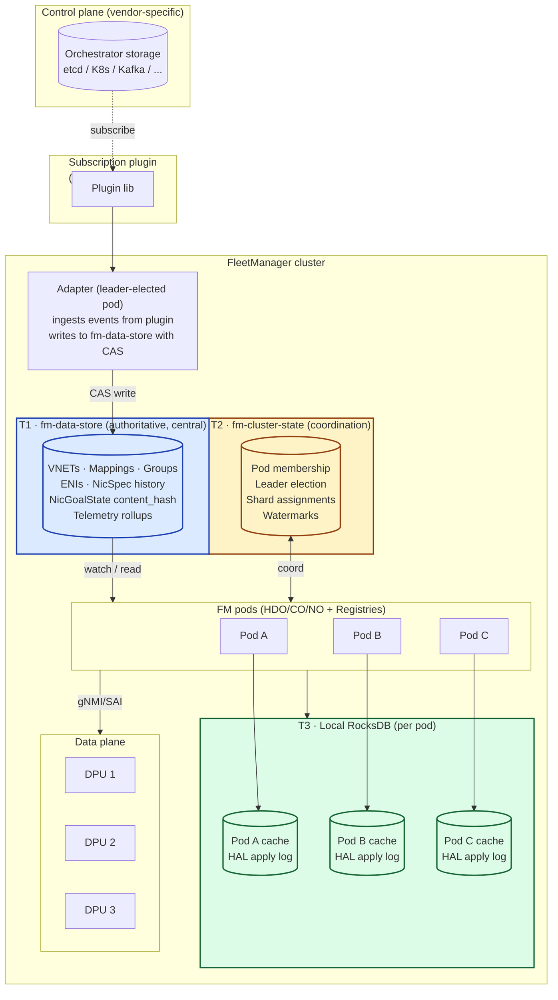
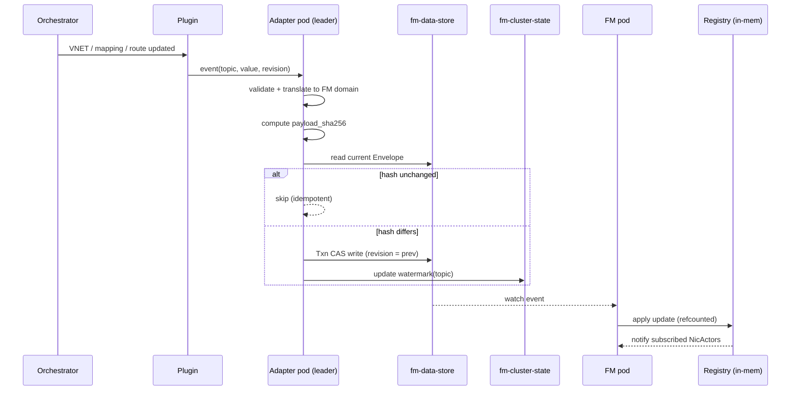
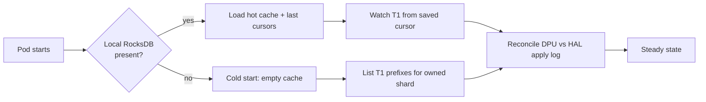

# FleetManager — Storage Architecture

> **TL;DR:** FM uses **three storage tiers** with distinct roles and
> independently pluggable backends. The control plane vendor's storage
> is *not* one of them — orchestrator data arrives via a subscription
> plugin and is **landed into FM's own authoritative store** so FM is
> coherent regardless of upstream choice.
>
> | Tier | Name | Purpose | Default backend | Pluggable |
> |------|------|---------|-----------------|-----------|
> | T1 | **`fm-data-store`** | Authoritative central store of *all* FM domain objects (VNETs, mappings, ENIs, groups, NicSpec history, NicGoalState hashes, telemetry) | **etcd** | yes (SQLite/RocksDB → etcd → TiKV/FoundationDB) |
> | T2 | **`fm-cluster-state`** | Tiny coordination store: pod membership, leader election, shard assignments, watermarks | **etcd** (can share T1's cluster) | yes |
> | T3 | **Local RocksDB** | Per-pod hot cache + HAL apply log + watch resume cursors | **RocksDB** | swappable to BadgerDB/LMDB |
>
> Customer deployment tiers (ultra-small docker-compose → large K8s+
> distributed DB) all run the **same FM binary**; only backend
> config differs.

---

## 1. Goals and non-goals

### Goals

1. **Single source of truth for FM** — every FM-managed object lives in
   one queryable store with strong consistency. Reconciliation,
   debuggability, audit, backfill, and cross-pod coordination all
   derive from this single store.
2. **Vendor-neutral** — FM does not assume orchestrator runs etcd, K8s,
   Kafka, ZooKeeper, Consul, or anything else. Subscription is via a
   plugin (see [orchestrator-plugin-interface.md](./orchestrator-plugin-interface.md)).
3. **Tier-flexible** — same binary, same code paths, multiple backends.
   A 50-DPU customer runs everything in a single docker-compose file.
   A 10,000-DPU customer runs FM pods on K8s with TiKV behind them.
4. **Hot-path latency budget preserved** — programming a NIC must read
   from in-memory or local RocksDB. Central store is *never* on the
   per-NIC apply path.
5. **Recovery without orchestrator** — if the orchestrator's plugin is
   temporarily down, FM keeps programming DPUs from `fm-data-store`.

### Non-goals

- We do not replicate the orchestrator's full schema. We translate it
  into FM's domain model at ingest.
- We do not aim to be a generic distributed database. Backend swap is
  by configuration, not runtime hot-swap.
- We do not provide multi-region active-active. A single FM cluster
  manages a single regional fleet; cross-region is a future concern.

---

## 2. Three-tier overview



**Read paths:**

- **Hot (µs)** — In-memory registry caches inside each pod (warmed from T1/T3).
- **Warm (ms)** — T3 RocksDB on the pod's local disk.
- **Cold (10s of ms – seconds)** — T1 `fm-data-store`.

**Write paths:**

- **Ingest** — Adapter pod writes T1 with CAS based on content hash.
- **Compose** — NicActor produces NicGoalState, content-hashes it,
  writes hash + bundle to T1, programs DPU.
- **Telemetry** — Rolled up by an aggregator and written to T1
  out-of-band of the data path.

---

## 3. T1 — `fm-data-store`

### 3.1 Role

The **authoritative central store** of every FM-managed object. If FM
were rebuilt from cold metal, T1 is the only thing it needs. T1 is the
reconciliation truth, the backfill source, and the audit log surface.

### 3.2 What lives here

| Prefix | Object | Cardinality (rough) | Hot? |
|--------|--------|---------------------|------|
| `/fm/v1/global/routing_type/<name>` | RoutingType catalog | 5–20 | No (cached) |
| `/fm/v1/vnet/<vnet_id>` | Vnet | 1k–100k | Cached per pod |
| `/fm/v1/vnet/<vnet_id>/mapping/_manifest` | VnetMappingManifest | same | Cached per pod with subscriber |
| `/fm/v1/vnet/<vnet_id>/mapping/<chunk_id>` | VnetMappingChunk | up to 1M total | Cached per pod with subscriber |
| `/fm/v1/group/route/<group_id>` | RouteGroup | 1k–100k | Cached |
| `/fm/v1/group/acl/<group_id>` | AclGroup | 1k–100k | Cached |
| `/fm/v1/device/<device_id>` | Device record | 100–10000 | Cached on owning pod |
| `/fm/v1/eni/<eni_id>` | NicSpec (current) | 100k–10M | Cached on owning pod |
| `/fm/v1/eni/<eni_id>/history/<rev>` | NicSpec history (last N) | bounded | No (audit only) |
| `/fm/v1/goalstate/<eni_id>/<rev>/hash` | NicGoalState content hash + sketch | 100k–10M | Indexed by adapter |
| `/fm/v1/telemetry/eni/<eni_id>/<bucket>` | Counters rollup | bounded | No |

**Note:** FM does not store the full NicGoalState payload in T1 by
default — only the hash, revision, and a structural sketch. The
authoritative payload is reconstructible at any time from VNET +
mapping + groups + NicSpec; storing only the hash keeps T1 size bounded.
See "Goal-state durability mode" config knob below.

### 3.3 Backend interface

```go
// pkg/storage/datastore/datastore.go
type DataStore interface {
    // Get returns the current value and revision for a key.
    Get(ctx context.Context, key string) (value []byte, rev int64, err error)

    // Put writes a value with optimistic concurrency. If casRev is non-zero,
    // the write fails with ErrConflict unless the current revision matches.
    Put(ctx context.Context, key string, value []byte, casRev int64) (newRev int64, err error)

    // Delete removes a key with optional CAS guard.
    Delete(ctx context.Context, key string, casRev int64) error

    // List returns all (key, value, rev) tuples whose key starts with prefix.
    // Backends MUST stream; large prefixes can have millions of entries.
    List(ctx context.Context, prefix string) (Iterator, error)

    // Watch streams change events for a prefix, starting at fromRev (0 = current).
    // Implementations MUST support resume after disconnect via fromRev.
    Watch(ctx context.Context, prefix string, fromRev int64) (<-chan Event, error)

    // Txn executes an atomic compare-and-swap multi-write.
    Txn(ctx context.Context, conds []Condition, ops []Op) (TxnResult, error)

    // Lease leases a TTL key (used for ephemeral session, leadership, etc.)
    // — typically routed to T2, but the interface lets a single backend serve both.
    Lease(ctx context.Context, ttlSec int) (Lease, error)

    // Health returns backend liveness.
    Health(ctx context.Context) error

    // Close releases resources.
    Close() error
}

type Event struct {
    Type     EventType // PUT / DELETE
    Key      string
    Value    []byte
    Revision int64
    PrevRev  int64
}
```

### 3.4 Default backend: **etcd**

Why etcd as default:

- Mature, K8s-native, well-known to operators.
- Supports CAS, prefix watch with resume cursor, TTL leases.
- Tunable: in-process embedded mode (ultra-small), 3-node cluster
  (small/medium), 5-node cluster (large).
- Mature backup tooling (`etcdctl snapshot`).

**Constraint:** etcd has a hard 8 GiB recommended DB size and 1 MiB
per-value cap. The mapping chunk design (≤900 KiB per chunk) and the
"hash-only" goal-state mode keep us well below this. For >10M ENI
fleets, we recommend TiKV.

### 3.5 Pluggable backends

| Backend | Tier | Why |
|---------|------|-----|
| **SQLite (single-file)** | Ultra-small | docker-compose, single-host; no cluster; FM pod and DB co-located. |
| **RocksDB (embedded)** | Ultra-small / dev | Same as SQLite but LSM; great for write-heavy. |
| **embedded etcd** | Small dev/test | etcd library linked into FM pod, single-node. |
| **etcd (3-node)** | Small / medium production | Default. |
| **etcd (5-node)** | Medium / large production | Higher write availability. |
| **TiKV / FoundationDB** | Large (>10M ENIs) | Horizontal scale, multi-TB datasets. |
| **PostgreSQL (LISTEN/NOTIFY)** | Brownfield | For shops that already operate Postgres at scale. |

The `DataStore` interface above is small enough that any of these can
back it. Adapters live under `pkg/storage/datastore/<backend>/`.

### 3.6 Schema versioning

Every value in T1 is wrapped in an `Envelope`:

```proto
message Envelope {
  uint32  schema_version = 1;  // FM schema generation
  string  kind           = 2;  // CONFIG_KIND_*
  uint64  revision       = 3;  // mirrors backend rev for self-containment
  bytes   payload        = 4;  // proto-encoded body
  bytes   payload_sha256 = 5;  // for adapter dedup and goal-state hashing
  google.protobuf.Timestamp written_at = 6;
}
```

Schema upgrades are forward-compatible: readers tolerant to unknown
fields, additive-only changes, breaking changes via new prefix.

---

## 4. T2 — `fm-cluster-state`

### 4.1 Role

The **coordination store**. Holds tiny, frequently-updated state that
needs strong consistency and TTL semantics: who is the adapter leader,
which pod owns which shard, where each watch is up to.

### 4.2 What lives here

| Key | Purpose | Size | Update freq |
|-----|---------|------|-------------|
| `/fm/cs/membership/<pod_id>` | Pod liveness (TTL lease) | <1 KiB | Heartbeat every 5s |
| `/fm/cs/leader/<role>` | Leader election (adapter, gc, telemetry) | <1 KiB | Lease renew |
| `/fm/cs/shard/<pod_id>` | Shard assignment list | KiB | On rebalance |
| `/fm/cs/watermark/<adapter_topic>` | Plugin replay cursor | <1 KiB | Per ingest batch |
| `/fm/cs/watermark/<pod_id>/<watch_prefix>` | T1 watch resume cursor | <1 KiB | Per batch |
| `/fm/cs/maintenance/freeze` | Global change freeze flag | <1 KiB | Rare |

### 4.3 Why separate from T1

- **Different consistency / latency profile.** T2 is small and chatty
  (every 5s heartbeats). Mixing it with T1 (millions of objects) makes
  T1 backups noisy and T2 operations slower than necessary.
- **Different blast radius.** T2 outage halts new programming but does
  not corrupt domain data. T1 outage is a real outage.
- **Different backend choices may apply.** A customer could use a
  managed Postgres for T1 but co-located embedded etcd for T2.

### 4.4 Default backend: **etcd**

Same `DataStore` interface; can share the same etcd cluster as T1 in
small/medium tiers (different prefix), or be a separate 3-node etcd in
large tier for isolation.

### 4.5 Combined-cluster mode

A config knob `cluster_state.share_with_data_store: true` collapses T2
and T1 onto the same backend cluster (different prefix). Recommended
for tiers ≤ medium; large tiers should split.

---

## 5. T3 — Local RocksDB (per pod)

### 5.1 Role

Each FM pod runs a **local embedded RocksDB** that holds:

1. **Hot cache** — in-RAM-backed warm cache of registry contents this
   pod currently subscribes to (VNETs/mappings/groups for ENIs the pod
   owns). Survives pod restart so the pod doesn't need to refetch
   everything from T1.
2. **HAL apply log** — append-only log of every gNMI/SAI write the pod
   has issued to its DPUs, with goal-state hash and DPU ack/diag. Used
   for replay-on-restart and for reconciliation diff against actual DPU
   state.
3. **Watch resume cursors** — last revision applied per T1 prefix.
4. **Throttle / circuit-breaker counters** — per DPU, transient state.

### 5.2 Why on local disk

- Restart recovery without thrashing T1: a pod restart loads its hot
  set from local RocksDB, then catches up via T1 watch from the saved
  cursor — typically seconds, not minutes.
- HAL apply log is a *log*, not a database. It needs sequential append
  and crash safety; RocksDB's WAL is purpose-built for this.
- Per-pod isolation — no shared dependency in the hot path.

### 5.3 Pluggable

| Backend | When |
|---------|------|
| **RocksDB** | Default. |
| **BadgerDB** | Pure-Go shop wanting cgo-free build. |
| **LMDB** | Read-heavy tiers; tighter memory. |

Interface mirrors `DataStore` minus `Watch` (local has no watch).

### 5.4 Sizing

| Customer tier | Local RocksDB per pod | Reason |
|--------------|----------------------|--------|
| Ultra-small  | 256 MiB              | A few hundred ENIs |
| Small        | 2 GiB                | Few thousand ENIs |
| Medium       | 16 GiB               | Up to 100k ENIs / pod |
| Large        | 64 GiB               | Up to 1M ENIs / pod |

---

## 6. Cross-tier data flow

### 6.1 Ingest path (orchestrator → FM)



### 6.2 Compose / program path (NIC creation)

```mermaid
sequenceDiagram
    participant CO as ContainerActor
    participant NO as NicActor
    participant REG as Registries (in-mem)
    participant T1 as fm-data-store
    participant T3 as Local RocksDB
    participant DPU as DPU (HAL)

    CO->>NO: create NicSpec(eni_id, vnet_id, ...)
    NO->>T1: persist NicSpec (CAS)
    NO->>REG: Acquire(vnet_id, eni_id) on Vnet/Mapping/Group registries
    REG->>REG: subscribe if first; share cache otherwise
    REG-->>NO: ready (or waiting on mapping completeness)
    NO->>NO: compose NicGoalState
    NO->>NO: sha256(goalstate)
    NO->>T1: write goalstate hash + sketch
    NO->>T3: append to HAL apply log
    NO->>DPU: gNMI/SAI write
    DPU-->>NO: ack + diag
    NO->>T3: mark applied + diag
    NO->>T1: update Device telemetry rollup
```

### 6.3 Restart recovery



---

## 7. Pluggability matrix per customer tier

| Tier | Customer profile | T1 (data) | T2 (coord) | T3 (local) | FM topology |
|------|------------------|-----------|------------|------------|-------------|
| **Ultra-small** | <100 DPUs, single host, lab/edge | Embedded etcd OR SQLite | Same as T1 (shared) | RocksDB | 1 FM container in docker-compose |
| **Small** | 100–500 DPUs, regional pop | etcd 3-node co-located | Shared with T1 (prefix split) | RocksDB | 2–3 FM pods on small K8s/Nomad |
| **Medium** | 500–5k DPUs | etcd 3-node dedicated | etcd 3-node shared with T1 | RocksDB | 5–20 FM pods on K8s |
| **Large** | 5k–10k+ DPUs | etcd 5-node OR TiKV 5-node | etcd 3-node *separate* | RocksDB | 20–100 FM pods on K8s w/ HPA |

The **same FM binary** runs in all tiers; deployment differs by config.

---

## 8. Configuration knobs

A flat YAML/TOML config; the same shape is used by every tier.

```yaml
fm:
  cluster:
    cluster_id: "fm-region-eu-west"
    pod_id: "fm-0"             # injected by deployment
    pod_role: ["adapter", "hdo", "co", "no"]   # any subset; default = all

  storage:
    data_store:
      backend: "etcd"          # etcd | embedded_etcd | sqlite | rocksdb | tikv | postgres
      endpoints: ["etcd-0:2379", "etcd-1:2379", "etcd-2:2379"]
      tls:
        ca_file: "/etc/fm/tls/ca.pem"
        cert_file: "/etc/fm/tls/client.pem"
        key_file:  "/etc/fm/tls/client-key.pem"
      auth:
        username: "fm"
        password_file: "/etc/fm/secret/etcd-password"
      prefix: "/fm/v1"
      timeout_ms: 2000
      retry:
        max_attempts: 5
        backoff_ms: [50, 100, 250, 500, 1000]
      goalstate_durability: "hash_only"   # hash_only | full | hybrid
      history_retention:
        nic_spec_revisions: 50
        goalstate_revisions: 10

    cluster_state:
      backend: "etcd"
      share_with_data_store: true        # true → reuse data_store cluster, different prefix
      prefix: "/fm/cs"
      lease_ttl_sec: 15
      heartbeat_interval_sec: 5

    local:
      backend: "rocksdb"       # rocksdb | badgerdb | lmdb
      path: "/var/lib/fm/local"
      max_size_bytes: 17179869184    # 16 GiB
      hal_log_retention_hours: 168   # 7 days
      compaction:
        style: "level"
        max_background_jobs: 4

  plugin:
    name: "etcd-watch"         # plugin module to load
    config_file: "/etc/fm/plugin.yaml"
    reconnect_backoff_ms: [100, 500, 2000, 10000]
    max_in_flight: 10000

  shards:
    strategy: "rendezvous_hash"   # rendezvous_hash | range | static
    target_per_pod: 5000          # ENIs per pod target
    rebalance_threshold: 0.15     # 15 percent skew triggers rebalance

  observability:
    metrics_addr: ":9090"
    log_level: "info"
    trace:
      otlp_endpoint: "otel-collector:4317"
      sample_rate: 0.01
```

### Critical knobs explained

| Knob | Effect | Default | When to change |
|------|--------|---------|----------------|
| `data_store.backend` | Which T1 implementation | `etcd` | Customer constraint (Postgres shop, ultra-small SQLite, large-tier TiKV) |
| `data_store.goalstate_durability` | What we persist for goal-state | `hash_only` | `full` for forensics; `hybrid` keeps full for last N revisions |
| `cluster_state.share_with_data_store` | Collapse T1+T2 onto one cluster | `true` | `false` for large tiers needing isolation |
| `local.backend` | T3 implementation | `rocksdb` | `badgerdb` for cgo-free builds |
| `shards.strategy` | How ENIs map to pods | `rendezvous_hash` | `range` for predictable mapping; `static` for tests |
| `pod_role` | Which actors run in this pod | all | Disaggregate roles in large tier |

---

## 9. Failure semantics

| Failure | Effect on hot path | Effect on ingest | Effect on recovery |
|---------|--------------------|------------------|--------------------|
| Plugin disconnects from orchestrator | None (FM keeps programming from T1) | Paused; backlog grows in plugin or skipped (plugin's choice) | Auto-reconnect with watermark replay |
| Adapter leader dies | None | Paused until new leader elected (T2 lease TTL) | New leader picks up from watermark in T2 |
| T1 quorum loss | Reads served from in-mem & T3 caches; new programs delayed | Halted | Resumes when T1 returns; CAS retries |
| T2 quorum loss | None for in-flight; no new shard rebalance | Halted | Resumes when T2 returns |
| Single FM pod restart | None for other pods; that pod's NICs continue from sibling shard if restart >TTL | None | T3 hot-load + T1 watch catch-up (seconds) |
| Local RocksDB corrupt | Pod refuses to start until repaired or wiped (cold start from T1) | None | Cold rebuild from T1 (minutes for large shard) |
| Plugin sends bad data | Adapter rejects in validation, writes to DLQ in T1 | Bad event drops; sane events flow | Manual orchestrator fix or replay |

---

## 10. Backup & disaster recovery

| What | How | RPO / RTO target |
|------|-----|------------------|
| T1 (`fm-data-store`) | Backend-native snapshot (etcdctl snapshot / TiKV BR / pg_dump) every 1h; retain 7d, 4w, 12m | RPO 1h, RTO 30m |
| T2 (`fm-cluster-state`) | Reconstructible from T1 + pod restart; no formal backup | n/a |
| T3 (per-pod local) | Ephemeral; reconstructible from T1 | n/a |
| Plugin watermarks | Stored in T2; if lost, full re-list from orchestrator | RTO ~ list time |

A **bootstrap restore drill** runs in CI weekly: nuke T1, restore from
snapshot, replay plugin events from `now - 1h`, verify NicGoalState
hashes match.

---

## 11. Why three tiers (vs. fewer)

| Alternative | Why we rejected |
|-------------|-----------------|
| **Single tier (everything in one cluster)** | Mixing 1M VNET-mapping rows with 5s heartbeat lease churn slows both. Different backup/scaling profiles. |
| **Two tiers (drop T3 local RocksDB)** | Pod restart would re-hydrate from T1 every time → minutes of warmup on a 10k-pod cluster, plus thundering-herd on T1. HAL apply log needs durable local-only sequential append. |
| **Two tiers (drop T1, keep plugin + local RocksDB)** | Each pod would independently translate orchestrator schema; no single FM truth → no fleet-wide reconciliation, no audit trail, no debuggability for ops, plugin outage = data loss. |
| **Two tiers (drop T2, put coord in T1)** | etcd lease churn on a multi-million-key cluster degrades latency on the actual data path. |

Three tiers map cleanly to the three latency tiers (cold/warm/hot) and
the three change frequencies (rare/medium/chatty).

---

## 12. Migration & schema evolution

- **Within a backend:** schema changes are additive in `Envelope`;
  readers ignore unknown fields.
- **Across backends:** export from old backend's iterator → import into
  new backend's batched put. A `fmctl migrate-data-store --from=etcd --to=tikv`
  CLI ships with the binary. FM pods drain to a single adapter, freeze,
  migrate, unfreeze. Designed to take <30 minutes for 10M-ENI fleets.

---

## 13. Open questions / future work

1. **Multi-region** — Is T1 a per-region store with a higher-level
   replication layer, or is it globally consistent? Defer; today's scope
   is single-region.
2. **Tiered storage inside T1** — Should historical NicSpec history
   be offloaded to object storage (S3) after N days? Likely yes for
   large tier.
3. **Read replicas of T1** — For large tier, point read-heavy
   registries at follower replicas to reduce leader pressure.
4. **CRDT-style merge** — For cross-region eventual consistency,
   consider per-key CRDT semantics. Out of scope today.

---

## See also

- [orchestrator-plugin-interface.md](./orchestrator-plugin-interface.md) — how data enters the system.
- [registry-pattern-design.md](./registry-pattern-design.md) — how pods consume T1.
- [fleet-manager-hld.md](./fleet-manager-hld.md) — cluster topology.
- [recovery-and-failover-design.md](./recovery-and-failover-design.md) — pod restart, leader handoff.
- [deployment-tiers.md](./deployment-tiers.md) — concrete config recipes.
