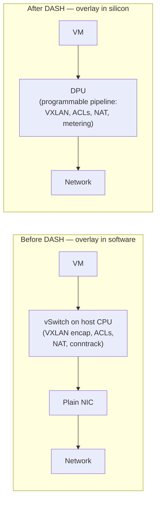
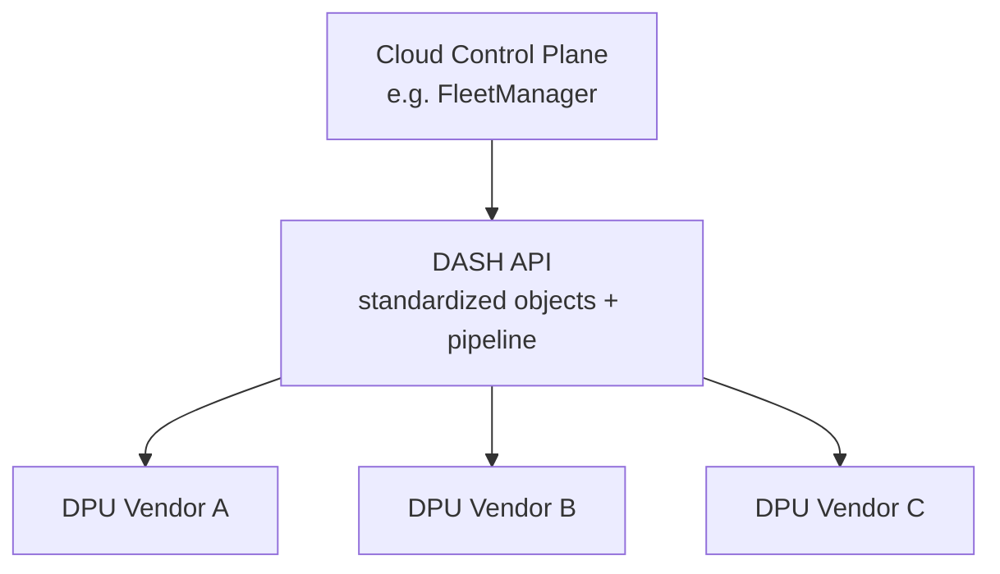

# 01 — Introduction & Motivation

> **TL;DR:** Cloud datacenters run millions of virtual networks across
> hundreds of thousands of hosts. Doing all the per-flow overlay
> processing (encap, routing, ACLs, NAT) on the host CPU burns expensive
> compute cycles that should be selling to customers. DASH defines a
> standard way to push that work down into a DPU — a programmable NIC
> with its own CPUs and packet-processing silicon — so the host CPU
> stays focused on running tenant VMs.

---

## The problem in one picture

In the "before" world, the hypervisor's virtual switch (Open vSwitch,
Hyper-V vSwitch, etc.) does the heavy lifting. At 100 Gbps line rate,
this can consume 4–8 host CPU cores **per server, full time**. Multiply
by 100,000 servers and that's a lot of CPU you'd rather sell to
customers.

In the "after" world, those cores are free. The DPU does it.

---

## Why a *standard* (DASH) matters

Cloud providers have been building SmartNIC offload for years (Azure
Accelerated Networking, AWS Nitro, GCP IPU). But each used proprietary
APIs locked to one vendor's silicon.

DASH solves three coupling problems at once:

1. **Control plane ↔ DPU vendor coupling.** Without DASH, an Azure
   control plane that programs ENIs would have a different code path
   for every DPU vendor. With DASH, it speaks one API; vendors
   implement the same SAI extensions on their silicon.
2. **Pipeline definition ↔ silicon coupling.** DASH ships a reference
   P4 model of the pipeline. Vendors must match its behavior even if
   their hardware uses different match-action tables internally.
3. **Test ↔ implementation coupling.** DASH ships conformance tests
   so a control plane can verify any DPU behaves identically.

One API; many silicon back ends.

---

## What DASH defines (and what it doesn't)

### DASH **defines**

| Category | Examples |
|----------|----------|
| **Object model** | `ENI`, `VNET`, `VNET_MAPPING`, `OUTBOUND_ROUTING`, `INBOUND_ROUTING`, `ACL_GROUP`, `ACL_RULE`, `METER_POLICY`, `METER_RULE`, `PA_VALIDATION`, `TUNNEL`, `QOS`, `HA_SET`, `OUTBOUND_PORT_MAP`, `PREFIX_TAG`, `ROUTING_TYPE` |
| **Packet-processing pipeline** | The order in which an ingress packet hits ACL stages, routing, mapping lookup, encap, metering |
| **Southbound API** | gNMI + protobuf (sonic-dash-api), plus SAI DASH headers |
| **State semantics** | Idempotent CREATE/UPDATE/DELETE, set-membership, refcounting |
| **HA model** | Active/standby ENI pairs with DPU-to-DPU sync channels |

### DASH **does not** define

| Out of scope | Why |
|--------------|-----|
| Northbound API to the cloud | Each cloud has its own (Azure RP, AWS internal) |
| The control plane itself | DASH is the *interface*, not the orchestrator |
| Where the DPU sits physically | Could be inline NIC, BMC card, or bump-in-the-wire |
| Underlay routing protocols | BGP/IS-IS on the fabric is a separate concern |
| L2 bridging on the underlay | Underlay is pure L3 routing |

---

## The three audiences this codebase serves

1. **DPU vendors** implement the southbound. They take the pipeline
   spec + SAI headers and build silicon and an agent that runs on the
   DPU's management CPU.
2. **Cloud control-plane teams** consume the northbound side of DASH.
   They build the orchestrator that decides "ENI 42 belongs to VNET
   blue, has these ACL rules, talks via this tunnel," and ships that
   intent down to every relevant DPU.
3. **SONiC distribution teams** package the agent (gNMI server,
   reconciler) and ship it on the DPU as part of the SONiC image.

This learning series is written primarily for **audience 2** — people
building or integrating with the cloud control plane — but the
hardware/pipeline chapters (02, 09, 10) are essential for everyone.

---

## A motivating scenario — what does "VM NIC provisioning" actually mean?

Setting the stage for [chapter 11](./11-Scenario-VM-NIC-Provisioning.md):

A tenant launches a VM in their VNET. Behind the scenes:

1. Orchestrator picks a host with capacity, allocates the VM.
2. The VM has one virtual NIC. In DASH terms, **this NIC is an ENI**
   on the host's DPU.
3. Provisioning that ENI means creating ~12 DASH objects (or
   referencing existing ones):
   - The **ENI** itself (MAC, primary IP, underlay PA).
   - A **VNET** binding (which overlay tenant network it joins).
   - A **VNET mapping** populated with every other VM in that VNET
     (potentially millions of entries).
   - An **outbound routing table** (LPM rules: where does each dest CA
     get sent — VNET? peering? private link?).
   - **Inbound routing rules** for return traffic.
   - **ACL stages** (often 3 outbound + 3 inbound).
   - **Metering policies** (rate limits per traffic class).
   - **QoS** (bandwidth cap, queue count).
   - **Service tunnels** for managed-service traffic.
   - **PA validation** allowlist (anti-spoofing).
   - Possibly an **HA pair** binding to a standby DPU.
4. The control plane composes this into a programming bundle and
   pushes it to the DPU.
5. The DPU's agent translates to SAI and programs the pipeline.
6. The VM's first packet now hits hardware-accelerated overlay.

Every chapter that follows is a deeper look at one piece of this
picture.

---

## Where to go next

- Don't know what a DPU physically is? → [02 — Hardware Foundation](./02-Hardware-Foundation-DPU-Appliance.md)
- Already know DPUs, want the object model? → [03 — Object Model & Scopes](./03-Object-Model-and-Scopes.md)
- Want to see the packet flow first? → [10 — Packet Processing Lifecycle](./10-Packet-Processing-Lifecycle.md)

---

## See also

- [00 — README](./00-README.md) — the full index.
- DASH HLD: <https://github.com/sonic-net/DASH/tree/main/documentation/general>
