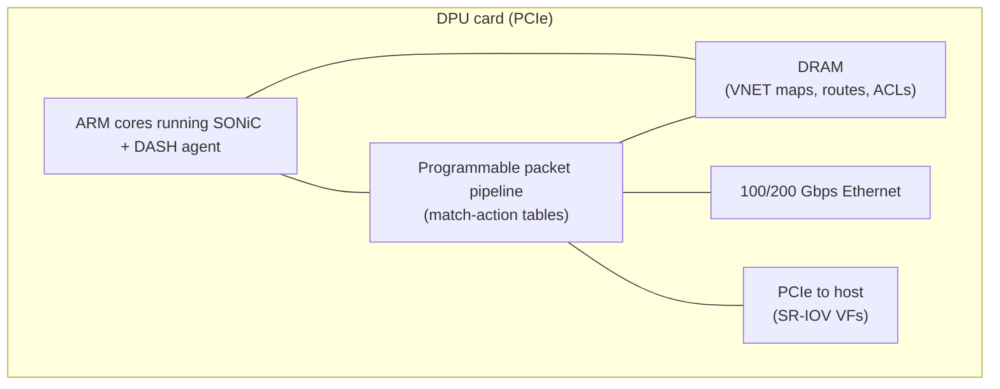
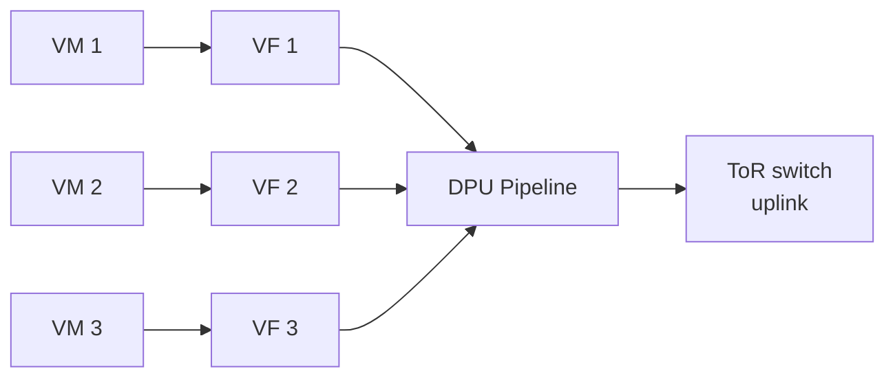
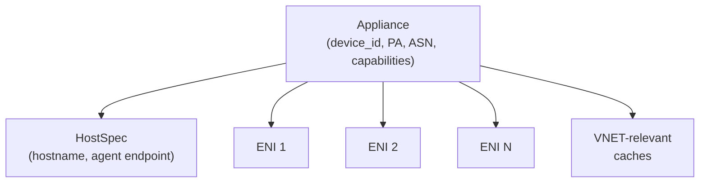
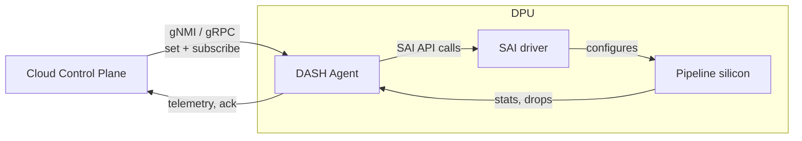
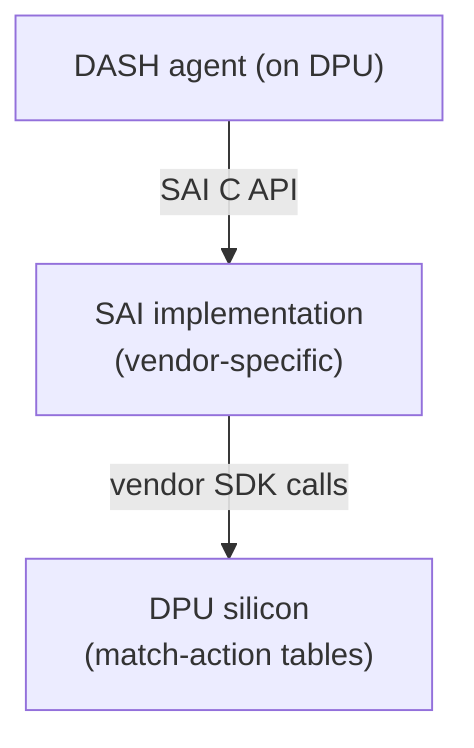
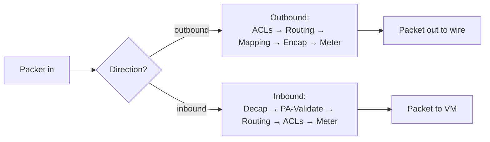

# 02 — Hardware Foundation: DPU & Appliance

> **TL;DR:** A DPU is a NIC with its own CPUs, memory, and a
> programmable packet-processing pipeline. DASH treats one DPU as one
> "appliance" — a programmable network device. This chapter shows what
> a DPU physically is, how it sits between a host and the network, and
> what "appliance" means in DASH.

---

## What is a DPU?

A **DPU** (Data Processing Unit) — sometimes called a SmartNIC or IPU —
is a PCIe card that combines:

| Component | Purpose |
|-----------|---------|
| **Network ports** | Usually 2× 100/200 Gbps to the top-of-rack switch |
| **Packet-processing pipeline** | Match-action tables in silicon (P4-programmable on many DPUs) |
| **ARM/x86 CPU cores** | A small Linux runs here; hosts the DASH agent |
| **DRAM (8–64 GiB typical)** | Holds large tables: VNET mappings, routes, ACLs |
| **PCIe interface to host** | Exposes virtual NICs (SR-IOV VFs) to VMs |
| **Optional: BMC** | Out-of-band management |

Common examples: NVIDIA BlueField-2/3, AMD Pensando Elba, Intel IPU
E2000, Marvell Octeon. SONiC + DASH abstracts over all of them.

---

## Where the DPU sits in the host

Three deployment patterns are common; DASH supports all three:

### Pattern 1 — Inline NIC (most common)

VMs talk to the DPU directly via SR-IOV virtual functions. The DPU is
the only network device the VM sees. The hypervisor's vSwitch is
bypassed entirely for overlay processing.

### Pattern 2 — Bump-in-the-wire

The DPU sits between a regular NIC and the host CPU. Useful for legacy
hosts that can't be re-cabled.

### Pattern 3 — Appliance / dedicated box

A 1U/2U box with multiple DPUs and no host VMs of its own — used as a
shared service (for example, a centralized gateway or a load balancer
front-end).

For all three, the DASH object model is the same. From the control
plane's perspective, "appliance" = one logical DPU.

---

## The "appliance" abstraction

In DASH, an **appliance** is one programmable network device — usually
one DPU. It has:

- A globally unique `device_id` (often the DPU's BMC serial).
- One or more underlay (PA) IP addresses, used as the source for VXLAN
  encap.
- An ASN if it participates in BGP on the underlay.
- Hard limits: max ENIs, max routes per ENI, max ACL rules per group,
  max mapping entries per VNET.
- A set of capabilities: does it support HA? PA validation? GENEVE?

The control plane reads the appliance's capabilities before pushing
any programming — never send 64K ACL rules to a device that supports
8K.

Important: **VNETs and groups are not appliance-scoped, but their
*materialization* is**. A VNET object describes a logical overlay; the
mapping table for that VNET is replicated on every appliance that
hosts an ENI in that VNET. See [chapter 04](./04-VNET-and-Address-Mapping.md).

---

## The DASH agent on the DPU

Running on the DPU's management cores is a small Linux (SONiC) that
hosts the **DASH agent**. The agent's responsibilities:

1. **Receive** programming intent over gNMI (the control plane
   subscribes/publishes to a tree of paths matching DASH objects).
2. **Translate** intent into SAI calls (`sai_eni`, `sai_vnet`,
   `sai_outbound_routing_entry`, etc.).
3. **Persist** state for warm restart.
4. **Report** counters, drop reasons, and pipeline health back up.
5. **Reconcile** — compare desired state vs device state, repair drift.

The agent is the only piece of "software" in the fast path's
neighborhood. Once a flow is programmed into the pipeline, the agent
is out of the loop until something changes.

---

## SAI — the bottom-most API

**SAI** (Switch Abstraction Interface) is a vendor-neutral C API for
configuring switching silicon. SONiC was built on SAI from day one.

For DASH, SAI gained new object types: `SAI_OBJECT_TYPE_ENI`,
`SAI_OBJECT_TYPE_VNET`, `SAI_OBJECT_TYPE_OUTBOUND_ROUTING_ENTRY`, and
so on. Every DPU vendor implements these in their SAI driver.

You generally don't write SAI calls directly when building a control
plane — you write gNMI/protobuf payloads against the DASH object model,
and the agent does the SAI translation for you.

---

## Pipeline at a glance

The DPU's packet pipeline is a series of match-action tables in a
fixed order. DASH specifies this order (chapter 10 walks it
step-by-step). At a high level:

The pipeline runs at **line rate** in silicon — tens to hundreds of
millions of packets per second per port. The control plane never
touches the data path; it only configures the tables.

---

## Hardware limits to internalize

Real DPUs have real limits. A few representative numbers (vary by
vendor):

| Resource | Typical limit |
|----------|--------------|
| ENIs per appliance | 16K – 64K |
| ACL rules per ENI per stage | 4K – 16K |
| Outbound routes per ENI | 1K – 8K |
| VNET mapping entries (per appliance) | 1M – 4M |
| Bandwidth | 100–400 Gbps aggregate |
| Pipeline latency added | 1–5 µs |

When you read [chapter 03 (object model)](./03-Object-Model-and-Scopes.md),
keep these in mind — the *reason* DASH bundles rules into shared
groups (route-group, acl-group, etc.) is to amortize these limits
across many ENIs that share the same intent.

---

## Where to go next

- Object model and scopes → [03 — Object Model & Scopes](./03-Object-Model-and-Scopes.md)
- Skip to packet flow → [10 — Packet Processing Lifecycle](./10-Packet-Processing-Lifecycle.md)

---

## See also

- [DASH HLD — Pipeline overview](https://github.com/sonic-net/DASH/blob/main/documentation/general/dash-high-level-design.md)
- [SAI DASH headers](https://github.com/opencomputeproject/SAI/tree/master/inc/saiexperimentaldash*.h)
- [00 — README](./00-README.md)
