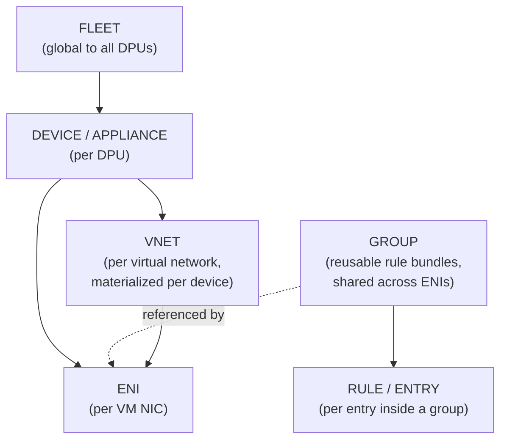
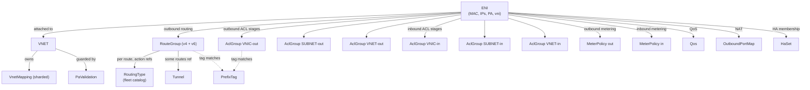

# 03 — Object Model & Scopes

> **TL;DR:** DASH has ~15 object types organized in a strict scope
> hierarchy. The scope tells you *who owns the object, how widely it's
> shared, and which other objects can reference it*. Getting scope
> right is the most important mental model in DASH — almost every
> design decision flows from it.

---

## The scope ladder

Every DASH object lives at exactly one scope level. From narrowest to
broadest:

| Scope | What lives here | Examples |
|-------|----------------|----------|
| **Fleet** | Catalogs reused everywhere | `RoutingType` registry, vendor-wide defaults |
| **Device / Appliance** | Per-DPU records | `Appliance`, `HostSpec`, `PaValidation` |
| **VNET** | Per-tenant-overlay records | `Vnet`, `VnetMapping` |
| **Group** | Reusable rule bundles | `RouteGroup`, `AclGroup`, `MeterPolicy`, `OutboundPortMap`, `PrefixTag`, `Tunnel`, `HaSet`, `Qos` |
| **ENI** | Per-NIC records & bindings | `Eni`, `InboundRoutingRule`, group bindings |
| **Rule** | A single match-action row | `RouteEntry`, `AclRule`, `MeterRule`, `MappingEntry` |

The crucial insight: **groups exist so that many ENIs can share one set
of rules**. If 10,000 web-tier VMs all need the same egress ACL, you
build the rules **once** as an `AclGroup`, then **bind** that group's
id from each ENI. The DPU stores one copy; ENIs reference it.

---

## Why scope matters: a worked example

Suppose VNET `blue` has 5,000 VMs and lives on 200 appliances.

- The **`Vnet`** record (vni, address prefixes, peering refs) is **one
  logical object** at fleet level — but it is **materialized as a
  cache entry on every appliance** that hosts an ENI in VNET `blue`.
  That's 200 copies in DRAM across the fleet, but it's the **same
  data**, identified by the same `vnet_id`.
- The **`VnetMapping`** for VNET `blue` (CA→PA for all 5,000 VMs) is
  also materialized per appliance, but only on appliances that have
  an ENI in `blue`. It's huge (5,000 entries × ~100 bytes = 500 KiB),
  so it's chunked.
- A given **`Eni`** lives on **exactly one appliance** (its owner).
- An **`AclGroup`** named `web-egress-strict` is a fleet-level
  template; appliances cache it only if at least one local ENI binds
  to it.
- A `PaValidation` list lives at **VNET scope** (it's about which
  underlay sources may decap into this overlay).

This is why the design splits objects: **wide-scope objects must be
small and stable; narrow-scope objects can be hot and frequently
churned.**

---

## The complete object catalog

The 15 DASH objects, grouped by scope:

### Fleet scope

| Object | One-line purpose |
|--------|------------------|
| `RoutingType` | Named pipelines (`privatelink`, `vnet_direct`, `service_tunnel`, …). Catalog of *what an action does*, referenced by route entries. |

### Device / Appliance scope

| Object | One-line purpose |
|--------|------------------|
| `Appliance` | The DPU itself — id, PAs, ASN, capability limits. |
| `HostSpec` | The host the DPU is plugged into — hostname, agent endpoint, feature flags. |

### VNET scope (materialized per device-that-has-an-ENI)

| Object | One-line purpose |
|--------|------------------|
| `Vnet` | The overlay tenant network — vni, address prefixes, peering refs. |
| `VnetMapping` | Overlay CA → underlay PA table for all CAs in this VNET. Sharded into chunks. |
| `PaValidation` | Whitelist of underlay source PAs allowed to decap into this VNET (anti-spoofing). |

### Group scope (shared, referenced by ENIs)

| Object | One-line purpose |
|--------|------------------|
| `RouteGroup` | Bundle of LPM routes (priority, prefix, action). |
| `AclGroup` | Bundle of ACL rules for one stage + one direction. |
| `MeterPolicy` | Bundle of meter rules (token-bucket rates) plus default action. |
| `OutboundPortMap` | Port pool for SNAT-style outbound NAT. |
| `PrefixTag` | Named list of IP prefixes (e.g., `tag-azure-storage`) — used in rule matches. |
| `Tunnel` | Encap parameters: type, src/dst underlay IPs, UDP port. |
| `HaSet` | A pair of ENIs (primary + standby) on two appliances. |
| `Qos` | Bandwidth caps, queue counts, DSCP remap. |

### ENI scope

| Object | One-line purpose |
|--------|------------------|
| `Eni` | The per-VM NIC — MAC, primary IP, underlay PA. Carries bindings to all the groups above. |
| `InboundRoutingRule` | Per-ENI overrides for inbound routing (rare; usually inherited from VNET). |

### Rule / entry scope (inside groups)

These are not standalone — they appear inside their parent group:
`RouteEntry`, `AclRule`, `MeterRule`, `MappingEntry`, `PortRange`.

---

## How an ENI binds to everything else

An ENI is mostly a **reference bundle** — its job is to point at the
right groups/VNET/tunnels.

This is dense. Two takeaways:

1. **The ENI's "identity" is small** — just a handful of fields.
   Almost all of an ENI's behavior comes from what it binds to.
2. **A single ENI can pull ~12 different group/VNET references**.
   That's why the control plane needs a *composer* (see
   [`NicGoalState`](../protos/published/nic-goal-state.md) in the
   sibling design) to resolve all those references before talking to
   the DPU.

---

## Scope rules — the "what can reference what" matrix

| From → To | Fleet | Device | VNET | Group | ENI |
|-----------|:-----:|:------:|:----:|:-----:|:---:|
| **ENI** | ✓ (via RouteEntry → RoutingType) | ✓ (lives on one) | ✓ (joins one) | ✓ (binds many) | — |
| **Group** | ✓ | — | — | ✓ (PrefixTag inside AclGroup) | — |
| **VNET** | — | — | ✓ (peering) | — | — |
| **Device** | — | — | — | — | — |

Rules:
- A narrower-scope object may reference a broader-scope one. **The
  reverse is forbidden** — a `Vnet` cannot list its ENIs (that would
  pin the VNET's revision to every ENI churn).
- All references are **by id**, never by inline copy. This is what
  keeps DASH wire payloads small and updates incremental.
- A reference to a missing object is a **transient waiting state**,
  not an error. The control plane retries.

---

## Naming conventions you'll see

| Name | Meaning |
|------|---------|
| `*_id` | A string handle pointing at another object. Always 1–64 ASCII chars. |
| `*_ref` | A reference field that holds a single `_id`. |
| `*_refs` | A repeated reference field (list of ids). |
| `revision` | Monotonic counter on every object; bumped on each write. |
| `manifest` | A table-of-contents object listing many chunk objects (for sharded data). |
| `chunk` | A piece of a sharded payload, under ~1 MiB each. |
| `tag` | A named prefix list (`PrefixTag`) used inline in matches. |
| `stage` | One of three ACL pipeline positions: VNIC, SUBNET, VNET. |
| `direction` | `OUTBOUND` (VM → wire) or `INBOUND` (wire → VM). |

---

## Quick self-test

Match the object to its scope. (Answers below the line.)

1. `VnetMapping`
2. `Eni`
3. `RoutingType`
4. `AclGroup`
5. `PaValidation`
6. `Tunnel`
7. `OutboundPortMap`
8. `Appliance`

---

Answers: 1—VNET (per device), 2—ENI, 3—Fleet, 4—Group, 5—VNET,
6—Group, 7—Group, 8—Device.

If you got >6 right, move on. If not, re-read the [object catalog](#the-complete-object-catalog).

---

## Where to go next

- VNETs in depth → [04 — VNET & Address Mapping](./04-VNET-and-Address-Mapping.md)
- The ENI structure → [05 — ENI Deep Dive](./05-ENI-Deep-Dive.md)

---

## See also

- [DASH object model HLD](https://github.com/sonic-net/DASH/tree/main/documentation/general)
- Sibling design's per-kind schemas: [`Specs/protos/published/`](../protos/published/)
- [00 — README](./00-README.md)
