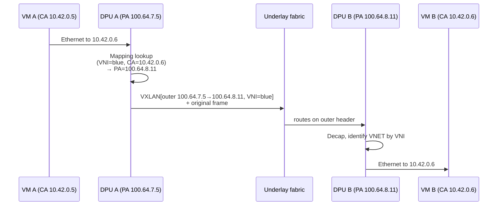
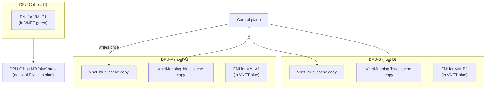
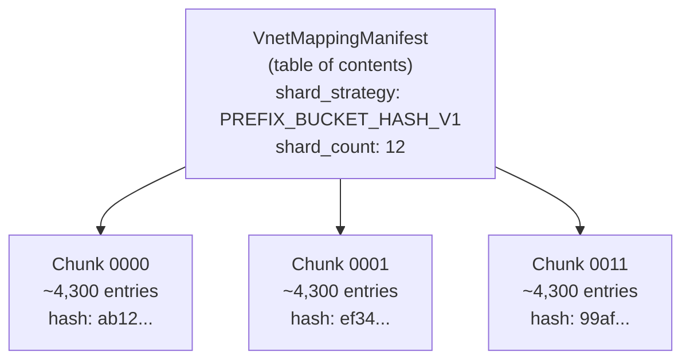
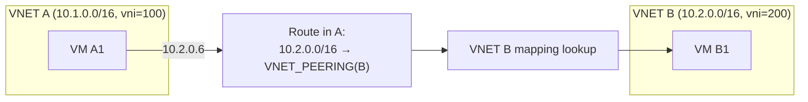

# 04 — VNET & Address Mapping

> **TL;DR:** A VNET is a tenant's private overlay network — its own IP
> address space, identified by a 24-bit VXLAN VNI. The mapping table
> turns an overlay IP (the address the VM uses) into an underlay IP
> (the physical address of the DPU hosting the destination VM), so the
> source DPU knows where to send the encapsulated packet. Mapping
> tables get huge — millions of entries per VNET — so DASH chunks them.

---

## The two address spaces

This is the single most important concept in overlay networking. Burn
it into memory:

| Space | Also called | Who sees it | Example |
|-------|------------|-------------|---------|
| **Overlay / CA** | Customer Address, tenant IP | VMs, tenants | `10.42.0.5` |
| **Underlay / PA** | Provider Address, physical IP | DPUs, fabric, ToRs | `100.64.7.5` |

The VM at `10.42.0.5` *thinks* it's just sending an Ethernet frame to
`10.42.0.6`. But there's no router on the underlay that knows about
`10.42.0.x` — that's a tenant-private range. The DPU must:

1. Look up `10.42.0.6` in the VNET mapping table.
2. Find the **underlay PA** of the DPU that hosts the VM with CA
   `10.42.0.6` — say, `100.64.8.11`.
3. Wrap the original frame in VXLAN: outer IP src = local PA
   (`100.64.7.5`), outer IP dst = `100.64.8.11`, VNI = blue VNET's vni.
4. Hand it to the underlay fabric, which routes on the **outer**
   header.

The destination DPU receives the VXLAN packet on its underlay PA, strips
the encap, sees the inner Ethernet frame for `10.42.0.6`, and hands it
to the right VM.



---

## The `Vnet` object — small and stable

A `Vnet` carries the tenant network's *identity and configuration*,
not its data:

| Field | What it carries |
|-------|----------------|
| `vnet_id` | String handle (e.g., `vnet-tenant-acme-prod`) |
| `vni` | 24-bit VXLAN id (e.g., `78215`) |
| `address_prefixes_v4 / _v6` | CIDRs defining the overlay address space (`10.42.0.0/16`) |
| `routing_type_default` | Which RoutingType to use for unmatched dest CAs |
| `peering_vnet_ids[]` | Other VNETs that may exchange traffic |
| `default_tunnel_id` | Default Tunnel used for encap |
| `pa_validation_required` | Toggles the anti-spoof guard |
| `attributes` | Free-form labels (tenant id, environment, …) |

This object is **small and rarely changes**. It is *not* the mapping
table — that's a separate object so it can churn independently.

---

## Why VNETs are "device-scoped" (in materialization)

The `Vnet` object is logically a single fleet-wide thing — "VNET blue
has VNI 78215." But it is **physically replicated on every DPU that
hosts an ENI in VNET blue**:



Rules:
- A DPU caches a VNET (and its mapping) **only if** at least one local
  ENI binds to it.
- When the last ENI in VNET X is removed from a DPU, that DPU drops
  the VNET and mapping from cache (refcounted).
- All caching DPUs see the **same** Vnet contents (the source of truth
  is the control plane); the per-DPU copies are pure read replicas.

This is why "VNET is device-scoped" — not because the *intent* is per
device, but because the *materialization* is. The control plane writes
once; many DPUs subscribe.

---

## The mapping table — and why it's huge

For each CA in the VNET, the mapping table holds:

| Field | What it carries |
|-------|----------------|
| `overlay_ip_v4 / v6` | Tenant address (`10.42.1.7`) |
| `overlay_mac` | Optional, for L2-aware behavior |
| `underlay_ip_v4 / v6` | PA of the hosting DPU (`100.64.8.11`) |
| `tunnel_override_id` | Optional: use a non-default tunnel |
| `routing_action_hint` | Hint of the action that should fire (VNET, PRIVATELINK, …) |

For a VNET with 1 million VMs, that's 1M entries. Each entry is ~80
bytes → **80 MB per VNET, per appliance**. Too big for a single
config message (etcd cap = 1 MiB; gNMI message caps vary).

DASH solves this with **sharding**:



Subscriber flow:
1. Watch the manifest path.
2. On a new manifest revision, open watches on each `chunk_id` it
   lists.
3. Validate each arriving chunk's content hash against the manifest.
4. Once all chunks are present and valid → VNET mapping is COMPLETE.
5. NIC programming for ENIs in that VNET is gated on completeness.

Touching a single entry → re-publish only the chunk that contains it
(plus a manifest bump for that chunk's new hash). The other chunks are
untouched.

See the per-kind schema: [`vnet-mapping.md`](../protos/published/vnet-mapping.md).

---

## `PaValidation` — the anti-spoof sibling

When a DPU decaps a VXLAN packet, by default it trusts the inner
frame. A misbehaving (or malicious) neighbor on the underlay could
inject packets with arbitrary VNI and inner CA — bypassing tenant
isolation.

`PaValidation` is a sibling of `Vnet` (same VNET subtree, separate
object) that holds the **allowlist of outer PA sources** permitted to
decap into this VNET:

```
allowed_pa_v4: [ "100.64.0.0/12", "172.20.0.0/16" ]
default_action: DROP
```

When `Vnet.pa_validation_required = true`, the DPU verifies every
inbound VXLAN packet's **outer source IP** is in the allowlist. Source
not in the list → drop.

PaValidation is separated from `Vnet` because the lists update at a
different cadence: PA pools change as the fleet grows, but the VNET
spec itself rarely changes.

---

## VNET peering

Two VNETs can be **peered**, allowing traffic between them under
controlled conditions. In DASH, peering is expressed by listing the
peer's `vnet_id` in `Vnet.peering_vnet_ids[]`, and by configuring
routes that point at a `VNET_PEERING` action.

Important: peering is **per-direction declared** — A peering B is not
automatic from B peering A. Both VNETs must declare each other for
bidirectional flow.



Peering does **not** merge address spaces — each VNET keeps its own
prefixes and VNI. Overlapping CIDRs between peered VNETs are usually
disallowed at the orchestrator (DASH itself doesn't enforce this).

---

## When a CA isn't in the mapping

What happens if a VM sends to a CA that isn't in the local VNET's
mapping?

The route lookup happens **first**:
- If the dest CA matches a `VNET` route → mapping lookup → if **miss**,
  the packet is dropped (and a counter increments). This means the
  destination VM doesn't exist (or hasn't been provisioned yet).
- If it matches a `DEFAULT_TUNNEL` route → encap to a default
  upstream (no mapping needed — the upstream knows where to forward).
- If it matches `DROP` → dropped.
- If nothing matches → use `Vnet.routing_type_default` action.

This is why **routing is an LPM lookup, not a mapping-table-first
lookup** — routes encode *intent* (this CIDR goes to peering, this
CIDR goes to private link, this CIDR goes to the internet). The
mapping table is consulted only after routing has decided "this is
local VNET traffic."

---

## Lifecycle of a VNET mapping

Five typical events:

1. **VM added to VNET (somewhere in the fleet):** orchestrator computes
   which chunk that VM's CA falls into, updates the chunk + manifest,
   pushes to every appliance subscribed to this VNET.
2. **VM moved (live migration):** old entry's `underlay_ip_v4` changes
   to the new DPU's PA; chunk re-published.
3. **VM deleted:** entry removed from chunk; chunk re-published.
4. **First ENI in this VNET lands on appliance X:** X starts
   subscribing to the manifest + chunks; programming gated until
   complete.
5. **Last ENI in this VNET leaves appliance X:** X drops the cached
   mapping (refcount → 0).

---

## Where to go next

- The ENI that consumes all this → [05 — ENI Deep Dive](./05-ENI-Deep-Dive.md)
- How routes use mapping → [06 — Routing Pipeline](./06-Routing-Pipeline.md)

---

## See also

- [`vnet.md`](../protos/published/vnet.md) — the proto schema
- [`vnet-mapping.md`](../protos/published/vnet-mapping.md) — sharded mapping schema
- [`pa-validation.md`](../protos/published/pa-validation.md)
- [DASH VNET documentation](https://github.com/sonic-net/DASH/tree/main/documentation/general)
- [00 — README](./00-README.md)
