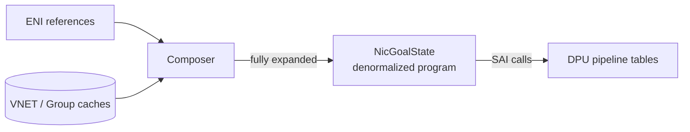

# 05 — ENI Deep Dive

> **TL;DR:** An ENI is the per-VM-NIC object in DASH. It is mostly a
> **reference bundle**: a small identity record (MAC, IP, PA) plus
> pointers to a VNET, route groups, ACL groups, meter policies, QoS,
> NAT pool, HA pair, and tunnels. The DPU never sees this composition
> step — the control plane resolves all references into a
> fully-denormalized program before sending it down.

---

## What an ENI represents

| Concept | DASH analog |
|---------|------------|
| A tenant's VM has one virtual NIC | One **ENI** on the DPU hosting the VM |
| A VM with two NICs | Two ENIs (likely in different VNETs) |
| A container with its own pod-level NIC | One ENI |
| A bare-metal server consuming an overlay | One ENI per uplink |

An ENI **always belongs to exactly one DPU** (the appliance it lives
on) and **exactly one VNET** (its overlay tenant network). Even in HA
configurations (covered in [chapter 13](./13-Scenario-HA-and-Failover.md)),
there are two ENIs in an `HaSet` — one per DPU — not one ENI on two
DPUs.

---

## ENI identity — the *minimal* fields

The truly per-ENI data is tiny:

```json
{
  "eni_id": "ENI_dpu-007_aabbccddeeff",
  "mac_address": "aa:bb:cc:dd:ee:ff",
  "vnet_id": "vnet-tenant-acme-prod",
  "primary_ip_v4": "10.42.0.5",
  "primary_ip_v6": "2001:db8::5",
  "underlay_ip_v4": "100.64.7.5",
  "admin_state": "ENABLED"
}
```

That's it for identity. Everything else is **a reference** to a
shared object.

A common naming convention: `eni_id = "ENI_<device_id>_<mac>"`, which
guarantees uniqueness without a central allocator. The DASH spec
doesn't mandate this format — vendors and clouds can pick their own —
but it's a clean default.

---

## The references an ENI carries

This is the "bundle" part. An ENI declares:

```mermaid
flowchart TD
    Eni["ENI<br/>(id, MAC, IP, PA, vnet_id)"]

    Eni -->|outbound routing| OBroute["route_group_v4_id<br/>route_group_v6_id"]
    Eni -->|outbound ACLs| OBacls["acl_group_ids_v4[VNIC, SUBNET, VNET]<br/>acl_group_ids_v6[VNIC, SUBNET, VNET]"]
    Eni -->|inbound ACLs| IBacls["acl_group_ids_v4_in[…]<br/>acl_group_ids_v6_in[…]"]
    Eni -->|outbound metering| OBmeter["meter_policy_id_out"]
    Eni -->|inbound metering| IBmeter["meter_policy_id_in"]
    Eni -->|QoS| Q["qos_id"]
    Eni -->|NAT pool| NAT["outbound_port_map_id"]
    Eni -->|encap| Tun["tunnel_id (optional override<br/>of VNET's default)"]
    Eni -->|HA membership| HA["ha_scope:<br/>ha_set_id, role"]
    Eni -->|tag references<br/>(via rules)| Tags["prefix_tag_refs[]"]

    Eni -->|inline overrides| Overrides["route_rules[]<br/>(per-ENI exceptions)"]
```

Every reference is **just a string id**. The ENI record itself stays
under a few hundred bytes regardless of how many rules ultimately
apply.

### Why so many separate references instead of inline data?

Two reasons:

1. **Reuse.** 10,000 web-tier ENIs share the same egress ACL group →
   one copy of the rules in DPU memory, not 10,000.
2. **Independent update cadence.** Changing one ACL rule only requires
   re-publishing the affected `AclGroup` — every binding ENI picks it
   up via revision tracking, no per-ENI rewrite.

---

## The `route_rules[]` field — per-ENI exceptions

While most routes live in shared `RouteGroup`s, an ENI can carry a
*small* inline list of **override rules** that take precedence:

```json
"route_rules": [
  { "match": { "dst_prefix": "169.254.169.254/32" },
    "action": { "kind": "REDIRECT_LOCAL_METADATA" } },
  { "match": { "dst_prefix": "10.99.0.0/24" },
    "action": { "kind": "DROP" } }
]
```

Typical uses:
- Redirecting the cloud metadata IP (`169.254.169.254`) to a local
  service.
- Pinning a tiny CIDR to a different action than the group's general
  rule.

These overrides are **always per-ENI** because they encode a unique
constraint — putting them in a shared group would defeat the purpose.
Keep them short (≤16 typical).

---

## ENI admin state and lifecycle

| State | Meaning | Pipeline behavior |
|-------|---------|------------------|
| `ENABLED` | Normal operation | Pipeline processes packets |
| `DISABLED` | Administratively down | Pipeline drops all packets |
| `DRAINING` | Being decommissioned | New flows dropped, existing flows allowed to complete |

Lifecycle states tracked by the orchestrator (not in DASH proper, but
referenced by the FleetManager design):

```mermaid
stateDiagram-v2
    [*] --> WAITING_SPEC: ENI created in control plane
    WAITING_SPEC --> WAITING_REFS: NicSpec arrived; some refs unresolved
    WAITING_REFS --> COMPOSING: all refs resolved
    COMPOSING --> PROGRAMMING: NicGoalState built, content hash new
    PROGRAMMING --> READY: HAL.Apply succeeded
    READY --> COMPOSING: any source object revision bumps
    READY --> DRAINING: ENI removed by orchestrator
    DRAINING --> [*]: pipeline emptied, deleted
```



This is where the [`NicGoalState`](../protos/published/nic-goal-state.md)
abstraction comes in — it's the *fully resolved* form the DPU
actually programs.

---

## The composition step — how references become a program

The DPU does **not** understand `route_group_v4_id = "rg-web-egress"`.
It needs concrete rules. So somewhere between intent (the ENI's refs)
and silicon, a composer runs:



The composer does these jobs:

1. Reads every referenced object from the local cache.
2. Expands every `prefix_tag_ref` inside ACL/route rules into the
   actual prefix list (the DPU's match tables hold prefixes, not tag
   names).
3. Resolves every `*_id` to the denormalized body.
4. Builds the full `NicGoalState` struct.
5. Computes a `content_hash` (SHA-256 of canonical serialization).
6. If the hash hasn't changed since last apply → no-op (idempotent).
7. Otherwise, diffs against the previous state and issues the smallest
   SAI delta needed.

That last point is critical: even though composition produces a big
struct, the **change delta** is usually tiny (one ACL rule changed →
one SAI call). DASH preserves O(small change → small wire traffic)
through the whole stack.

---

## Capacity constraints — the limits an ENI must fit

When you draft an ENI, you commit to fitting within the appliance's
capabilities. Common checks:

| Constraint | Source | Check |
|-----------|--------|-------|
| Total routes across all bound groups + inline rules | `Appliance.capabilities.max_routes_per_eni` | sum ≤ limit |
| ACL rules per stage per direction | `Appliance.capabilities.max_acl_rules_per_stage` | each group ≤ limit |
| Meter rules per direction | `max_meter_rules_per_eni` | sum ≤ limit |
| ENI count on this DPU | `max_enis` | total ≤ limit |

If composition produces an over-capacity ENI, it's a **hard
rejection** (`OVER_CAPACITY` status) — the control plane never sends
something the DPU can't fit.

---

## Worked example — a fully-bound ENI

A small web-server VM in tenant `acme-prod`:

```json
{
  "eni_id": "ENI_dpu-007_aabbccddeeff",
  "mac_address": "aa:bb:cc:dd:ee:ff",
  "vnet_id": "vnet-tenant-acme-prod",
  "primary_ip_v4": "10.42.0.5",
  "underlay_ip_v4": "100.64.7.5",
  "admin_state": "ENABLED",

  "route_group_v4_id": "rg-web-egress-v4",
  "route_group_v6_id": "rg-web-egress-v6",

  "acl_group_ids_v4_out": ["ag-web-vnic-out", "ag-web-subnet-out", ""],
  "acl_group_ids_v4_in":  ["ag-web-vnic-in",  "ag-web-subnet-in",  ""],

  "meter_policy_id_out": "mp-web-egress",
  "meter_policy_id_in":  "mp-web-ingress",

  "qos_id": "qos-25g-8q",
  "outbound_port_map_id": "",
  "tunnel_id_override": "",

  "ha_scope": {
    "ha_set_id": "haset-westus2-pair-7",
    "role": "PRIMARY"
  },

  "route_rules": [
    { "match": { "dst_prefix": "169.254.169.254/32" },
      "action": { "kind": "REDIRECT_LOCAL_METADATA" } }
  ]
}
```

Note:
- VNET-stage ACLs are empty (`""`) — this tenant doesn't use them.
- No outbound NAT (`outbound_port_map_id = ""`) — egress is direct.
- HA is on; this ENI is the primary of a westus2 pair.
- One inline override (metadata redirect).

Composition will resolve `rg-web-egress-v4` to its full route list,
each `ag-*` to its rule list, the meter policies and QoS, and the
HaSet — produce a `NicGoalState` of, say, 80 KiB — hash it, diff
against the last apply, and program the delta.

---

## Where to go next

- How outbound routes get evaluated → [06 — Routing Pipeline](./06-Routing-Pipeline.md)
- ACL stages in detail → [07 — ACL Pipeline](./07-ACL-Pipeline.md)
- The composed program → [`nic-goal-state.md`](../protos/published/nic-goal-state.md)

---

## See also

- [`nic-spec.md`](../protos/published/nic-spec.md) — the ENI proto schema
- [`nic-goal-state.md`](../protos/published/nic-goal-state.md) — composed form
- [DASH ENI HLD](https://github.com/sonic-net/DASH/tree/main/documentation/general)
- [00 — README](./00-README.md)
