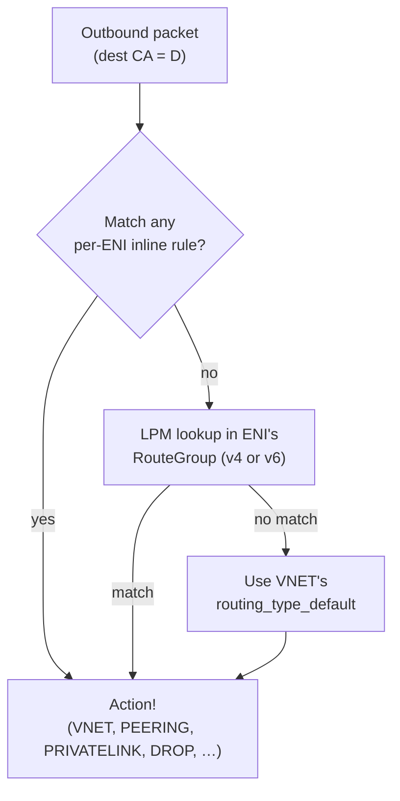
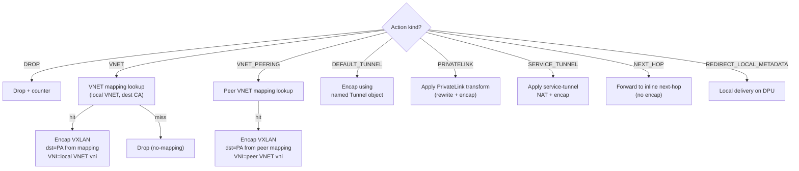
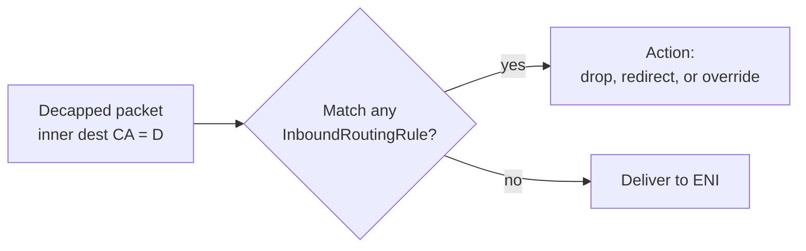

# 06 — Routing Pipeline

> **TL;DR:** The routing pipeline decides **what to do** with each
> outbound packet — encap into the local VNET? Send to a peered VNET?
> Tunnel to a private link? Drop? Inbound is mostly pre-decided by the
> VNET binding, but inbound rules can override. Routes are LPM-matched
> on destination IP, evaluated highest-priority first, and grouped
> into `RouteGroup`s that many ENIs can share.

---

## Two routing pipelines, two purposes

| Direction | Decides | Input | Output |
|-----------|---------|-------|--------|
| **Outbound** (VM → wire) | "Which routing action fires for this dest CA?" | Dest CA (after ACL allows) | An *action* (VNET, peering, private link, drop, …) |
| **Inbound** (wire → VM) | "Should this decap'd packet reach the VM, or be redirected?" | Inner dest CA (after PA validation) | Either deliver to ENI, redirect, or drop |

Outbound routing is the heart of overlay forwarding. Inbound routing
is mostly identity (deliver), with occasional overrides.

---

## The outbound routing lookup

For each outbound packet:



Order:
1. **Inline `route_rules[]`** on the ENI (per-ENI overrides — small
   list, scanned in priority order).
2. **`RouteGroup`** bound to the ENI (one for v4, one for v6) —
   longest-prefix match by destination, ties broken by `priority` (lower
   = higher precedence).
3. **`Vnet.routing_type_default`** if nothing matches.

The matched route carries an **action** that decides what happens
next.

---

## Route actions — the action catalog

DASH defines a fixed set of action types. Each action has its own
post-processing pipeline.

| Action `kind` | What it does | Next step |
|---------------|--------------|-----------|
| `DROP` | Drop the packet; increment drop counter | done |
| `VNET` | Forward inside the local VNET | VNET mapping lookup → encap → wire |
| `VNET_PEERING` | Forward into a peered VNET | Peer VNET's mapping lookup → encap (peer VNI) → wire |
| `VNET_DIRECT` | Send to a specific PA bypassing the mapping table | encap directly using the route's inline next-hop |
| `DEFAULT_TUNNEL` | Hand off to a default-route tunnel (e.g., internet gateway) | encap via the named Tunnel → wire |
| `NEXT_HOP` | Forward to a specific underlay next-hop without re-encap | direct send |
| `PRIVATELINK` | Talk to a managed service via PrivateLink | encap with PrivateLink-specific transform |
| `SERVICE_TUNNEL` | Talk to a managed service via Service Tunnel | encap with NAT + tunnel transform |
| `MAPPING_LOOKUP` | Force mapping lookup with a different VNI | mapping lookup against a non-local VNET |
| `REDIRECT_LOCAL_METADATA` | Hand to a local service on the DPU (e.g., 169.254.169.254) | local delivery, no encap |
| `NAT` | Apply SNAT/DNAT then continue routing | NAT translation → re-route |

The set is extensible: vendors and clouds can add new `RoutingType`
entries to the fleet-wide catalog.

---

## RoutingType — the catalog of action templates

`RoutingType` lives at **fleet scope** (chapter 03). It's a named
catalog of action behaviors:

```json
{
  "routing_type_id": "privatelink-v1",
  "items": [
    { "action_name": "privatelink",
      "action_type": "PRIVATELINK",
      "encap_type": "VXLAN",
      "extra_attributes": {
        "transform_class": "PRIVATELINK_TRANSFORM"
      }
    }
  ]
}
```

A route entry's action references a routing type by name:

```json
{ "priority": 100, "dst_prefix": "10.99.0.0/16",
  "action": { "kind": "PRIVATELINK",
              "routing_type": "privatelink-v1",
              "extra": { "service_endpoint_pa": "100.65.1.1" } } }
```

This indirection lets new action behaviors be added centrally without
re-versioning every RouteGroup.

---

## `RouteGroup` — shared LPM tables

A `RouteGroup` is a list of route entries, identified by id, shared by
many ENIs. Header/body split (covered in
[`route-group.md`](../protos/published/route-group.md)):

| Object | Contents |
|--------|---------|
| `RouteGroup` (header) | id, family (v4/v6), `route_count`, attributes |
| `RouteList` (body) | the actual `RouteEntry[]` |

Why the split? The header is tiny and stable; the body is hot and
frequently re-published. Subscribers care about both, but the header
is what changes group membership.

A typical `RouteList`:

```json
{
  "route_group_id": "rg-web-egress-v4",
  "routes": [
    { "priority": 100, "dst_prefix": "10.42.0.0/16",
      "action": { "kind": "VNET" } },
    { "priority": 200, "dst_prefix": "10.50.0.0/16",
      "action": { "kind": "VNET_PEERING",
                  "peer_vnet_id": "vnet-acme-shared" } },
    { "priority": 250, "dst_prefix": "100.65.0.0/16",
      "action": { "kind": "PRIVATELINK",
                  "routing_type": "privatelink-v1" } },
    { "priority": 300, "dst_prefix": "0.0.0.0/0",
      "action": { "kind": "DEFAULT_TUNNEL",
                  "tunnel_id": "tun-internet-westus2" } }
  ]
}
```

The DPU loads these into its LPM table. Per-packet, it gets:
- `10.42.0.5` → VNET (intra-VNET — go look up mapping)
- `10.50.1.7` → VNET_PEERING (cross-VNET to acme-shared)
- `100.65.2.4` → PRIVATELINK (managed service)
- `8.8.8.8` → DEFAULT_TUNNEL (internet egress via gateway)

---

## How the action chooses what to do next



Each branch is a different post-routing pipeline. The pipeline knows
which branch to take from the action kind alone.

---

## Inbound routing

Inbound is simpler. After VXLAN decap and PA validation, the DPU
looks up the **inner destination CA** against the ENI's inbound
routing rules.

In the common case, there are zero per-ENI inbound rules — the packet
just gets delivered. Rare uses for inbound rules:

- **Redirect** all inbound to a packet-capture function on the DPU.
- **Drop** packets from a specific source as a hot mitigation.
- **Force NAT** on inbound (rare; mostly a load-balancer pattern).



---

## Worked example — east-west, peering, internet

ENI for VM `web-1` (CA `10.42.0.5`) sends three packets:

| Packet | Dest CA | LPM match | Action | Outcome |
|--------|---------|-----------|--------|---------|
| 1 | `10.42.10.7` | `10.42.0.0/16` (priority 100) | `VNET` | Mapping lookup, encap to dest VM's DPU PA |
| 2 | `10.50.5.4` | `10.50.0.0/16` (priority 200) | `VNET_PEERING` to `vnet-acme-shared` | Peer VNET mapping lookup, encap with peer VNI |
| 3 | `8.8.8.8` | `0.0.0.0/0` (priority 300) | `DEFAULT_TUNNEL` to internet gateway | Encap to gateway PA using named Tunnel |

All three are matched against the **same** RouteGroup. The action
kind alone steers post-routing behavior. No per-packet config-plane
involvement.

---

## Edge cases worth knowing

- **Equal-prefix-length ties:** broken by `priority` (lower wins).
  If priorities also tie, the implementation chooses deterministically
  (usually first-defined). Avoid creating ties by using non-equal
  priorities.
- **Route → action with missing references** (e.g., `tunnel_id` that
  doesn't exist): composition status becomes `WAITING_REFS`; the ENI
  doesn't program until the ref is resolvable.
- **Route to a `VNET` action with empty mapping:** route lookup
  succeeds, mapping lookup misses, packet drops with `no-mapping`
  counter increment.
- **More routes than the DPU can hold:** composition rejects with
  `OVER_CAPACITY`; orchestrator must split the ENI's intent across
  multiple route groups (rare; usually solved by prefix aggregation).

---

## Where to go next

- ACL stages that fire **before** routing → [07 — ACL Pipeline](./07-ACL-Pipeline.md)
- Mapping lookup details → [04 — VNET & Address Mapping](./04-VNET-and-Address-Mapping.md)
- Full packet walkthrough → [10 — Packet Processing Lifecycle](./10-Packet-Processing-Lifecycle.md)

---

## See also

- [`route-group.md`](../protos/published/route-group.md)
- [`routing-type.md`](../protos/published/routing-type.md)
- [DASH routing HLD](https://github.com/sonic-net/DASH/tree/main/documentation/general)
- [00 — README](./00-README.md)
