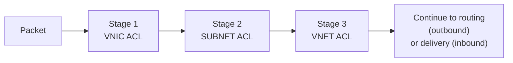
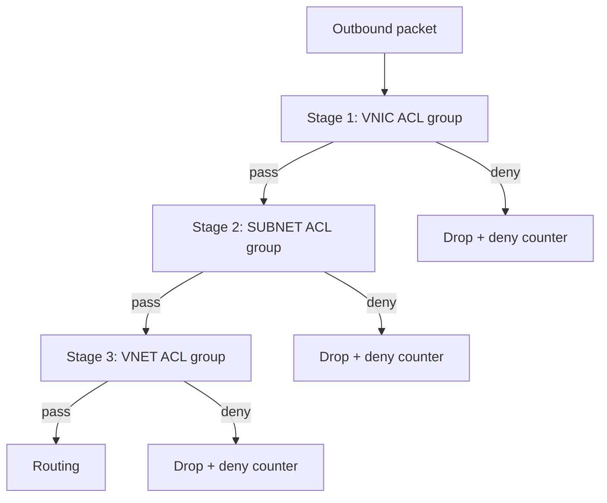
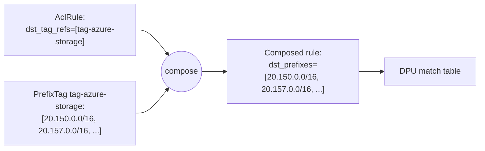

# 07 — ACL Pipeline

> **TL;DR:** Every ENI runs traffic through **three ACL stages** —
> conceptually VNIC → Subnet → VNET — in both outbound and inbound
> directions. Each stage holds a list of rules with an action
> (`ALLOW`, `DENY`, `ALLOW_AND_CONTINUE`, `DENY_AND_CONTINUE`). Rules
> live in shared `AclGroup`s; the ENI binds **3 groups per direction**.
> Stage chaining gives you defense-in-depth: a deny anywhere stops the
> packet (unless `_AND_CONTINUE`), an allow proceeds to the next stage.

---

## Why three stages?

The three-stage chain mirrors the conceptual responsibility split in
cloud networking:

| Stage | Conceptually owned by | Typical scope |
|-------|----------------------|---------------|
| **Stage 1 — VNIC** | The VM owner (tenant) | "What this specific NIC may send/receive." NSGs, security groups. |
| **Stage 2 — Subnet** | The tenant's network admin | "What this subnet allows." Often broader than VNIC. |
| **Stage 3 — VNET** | The platform/provider | "What this VNET allows globally." Compliance, fabric-wide guards. |

In practice, many tenants only populate stage 1, leaving stages 2 and
3 empty (an empty stage is an implicit pass-through). But all three
slots are *always* in the pipeline — it's the binding that's optional.



Same shape for both directions.

---

## What each stage holds

A stage is a list of **`AclRule`**s, evaluated in **priority order
(lowest priority value wins)** within the stage. The first matching
rule's action determines the stage's outcome.

A typical rule:

```json
{
  "priority": 100,
  "match": {
    "src_prefixes":  ["10.42.0.0/16"],
    "dst_prefixes":  ["0.0.0.0/0"],
    "src_tag_refs":  [],
    "dst_tag_refs":  ["tag-azure-storage"],
    "src_ports":     [{"lo": 1024, "hi": 65535}],
    "dst_ports":     [{"lo": 443,  "hi": 443}],
    "protocols":     ["TCP"]
  },
  "action": "ALLOW"
}
```

Match fields can be by literal prefix, by `PrefixTag` reference, by
port range, by protocol. Tag refs are expanded to prefix lists during
composition (see [chapter 05](./05-ENI-Deep-Dive.md)).

---

## The four action types — and `_AND_CONTINUE`

| Action | Within the stage | Between stages |
|--------|------------------|----------------|
| `ALLOW` | Packet passes this stage; **stop** evaluating remaining rules in this stage | Proceed to next stage |
| `DENY` | Packet rejected; **stop** evaluating remaining rules | Pipeline **halts**, packet dropped, deny-counter increments |
| `ALLOW_AND_CONTINUE` | Packet allowed by this rule; **continue** evaluating remaining rules in this stage | Pipeline-stage outcome is "allow" unless a later rule denies |
| `DENY_AND_CONTINUE` | Packet provisionally denied; **continue** evaluating | If no later rule allows, stage outcome is "deny" |

The `_AND_CONTINUE` actions are how you build **layered rule sets** —
e.g., "allow anyone in the VNET to port 80, but log the traffic that
matches our compliance tag too, and reject if it also matches a
blocklist."

### Stage outcome rules (after all rules in the stage are scanned)

```
stage_outcome = "PASS" if any matched rule's final state is ALLOW
              = "DROP" if no rule matched (implicit deny)
              = "DROP" if the last continuing rule was a DENY/DENY_AND_CONTINUE
```

> Note: the implicit-deny default for "no rule matched" is the most
> common cloud convention. DASH allows a stage to be configured for
> implicit-allow (empty stage = pass), and an empty `acl_group_id`
> binding means "no rules at this stage, pass through." Be explicit
> about which convention your control plane uses.

---

## How the three stages compose



A packet must **pass all three** stages to reach routing. Any stage's
deny halts the pipeline.

---

## `AclGroup` — shared rule bundles

Like `RouteGroup`, an `AclGroup` is a shared bundle that many ENIs can
bind. Header/body split (see [`acl-group.md`](../protos/published/acl-group.md)):

| Object | Contents |
|--------|---------|
| `AclGroup` (header) | id, family (v4/v6), stage_hint, direction_hint, `rule_count` |
| `AclRuleList` (body) | `AclRule[]` |

`stage_hint` and `direction_hint` are *advisory* — they don't enforce
where the group can be bound; they document the group's intended use.
The actual binding is decided by where the ENI puts the group's id in
its `acl_group_ids_v4_out[]` / `acl_group_ids_v4_in[]` arrays.

### Why so many groups?

An ENI binds **6 groups per address family**: 3 outbound + 3 inbound.
For IPv4+IPv6 dual-stack, that's **12 ACL group ids per ENI**. Many
will be empty strings (meaning "no group bound; pass-through").

Common pattern: one group per (stage, direction, tenant-tier) — e.g.,
`ag-web-vnic-out`, `ag-web-subnet-out`. Tens to hundreds of ENIs share
the same group.

---

## Worked example — VNIC stage outbound

A web-tier VM in tenant `acme-prod`. Its `ag-web-vnic-out` group:

```json
{
  "acl_group_id": "ag-web-vnic-out",
  "rules": [
    { "priority": 100,
      "match": { "dst_tag_refs": ["tag-acme-corp-internal"],
                 "dst_ports": [{"lo": 1, "hi": 65535}] },
      "action": "ALLOW" },
    { "priority": 200,
      "match": { "dst_tag_refs": ["tag-azure-storage"],
                 "dst_ports": [{"lo": 443, "hi": 443}] },
      "action": "ALLOW" },
    { "priority": 300,
      "match": { "dst_prefixes": ["0.0.0.0/0"],
                 "dst_ports": [{"lo": 443, "hi": 443}] },
      "action": "ALLOW" },
    { "priority": 400,
      "match": { "dst_prefixes": ["0.0.0.0/0"] },
      "action": "DENY" }
  ]
}
```

Interpretation:
- Allow any traffic to anything in the corp-internal tag.
- Allow HTTPS to Azure Storage.
- Allow HTTPS to anywhere else.
- Deny everything else.

For each outbound packet, stage 1 finds the first matching rule;
action `ALLOW` → proceeds to stage 2.

---

## Prefix tags — the key to scalable ACLs

A `PrefixTag` is a named list of IP prefixes:

```json
{
  "prefix_tag_id": "tag-azure-storage",
  "prefixes_v4": [
    "20.150.0.0/16",
    "20.157.0.0/16",
    "..."
  ]
}
```

Rules reference tags by id (`dst_tag_refs: ["tag-azure-storage"]`)
instead of listing prefixes inline. Benefits:

- **One source of truth** for "where is Azure Storage?"
- When the prefix list changes, **one** PrefixTag update → every rule
  referencing it gets the new prefixes at the next composition.
- Rule definitions stay short and human-readable.

The composer expands tag refs into concrete prefix lists at compose
time. The DPU itself sees plain prefixes — it doesn't know about tag
names.



---

## Inbound ACLs — symmetrical pipeline

Inbound ACLs work the same way: 3 stages, same actions, same priority
semantics. The match fields are evaluated against the **inner header
after decap** (so `src_prefix` is the sender's CA, `dst_prefix` is the
local VM's CA).

The most common inbound pattern:

| Stage | Typical contents |
|-------|------------------|
| **VNIC (in)** | Tenant security group: allow from corp-internal, deny rest. |
| **SUBNET (in)** | Subnet-wide policy: allow same-subnet only, etc. |
| **VNET (in)** | Empty (provider doesn't impose extra inbound limits beyond PA validation). |

---

## Capacity and scaling

Real numbers vary by DPU vendor:

| Resource | Typical limit per ENI per stage |
|----------|--------------------------------|
| ACL rules | 1K – 16K |
| Prefix entries in matches | 32K – 256K (across all rules) |
| Port ranges per rule | 4 – 8 |

Going over a per-stage limit is a **hard rejection** at composition
time. Tag expansion can blow this up surprisingly — a single rule
referencing 10 tags, each with 2K prefixes, expands to 20K prefixes.
Watch your tag sizes.

---

## Common gotchas

1. **Forgetting to bind a stage.** An empty `acl_group_id` slot is
   pass-through. If your security model assumes "all three stages
   filter everything," empty bindings silently disable filtering.
2. **Implicit-deny vs implicit-allow.** Decide once, document
   loudly, and never mix conventions across tenants in the same
   fleet.
3. **Rule order within a stage matters.** Lower priority value wins.
   A blanket `ALLOW` at priority 50 will mask all your later
   `DENY` rules.
4. **`ALLOW_AND_CONTINUE` is rarely what you want.** Use it only
   when you intentionally want layered evaluation (e.g., logging
   tags). Default to plain `ALLOW`/`DENY`.
5. **Cross-stage masking.** Stage 3 (VNET) `ALLOW`s can't override
   Stage 1 (VNIC) `DENY`s — once a stage drops the packet, the
   later stages never see it.

---

## Where to go next

- Metering, which fires after ACLs → [08 — Metering & QoS](./08-Metering-and-QoS.md)
- End-to-end packet flow → [10 — Packet Processing Lifecycle](./10-Packet-Processing-Lifecycle.md)

---

## See also

- [`acl-group.md`](../protos/published/acl-group.md)
- [`prefix-tag.md`](../protos/published/prefix-tag.md)
- [DASH ACL HLD](https://github.com/sonic-net/DASH/tree/main/documentation/general)
- [00 — README](./00-README.md)
