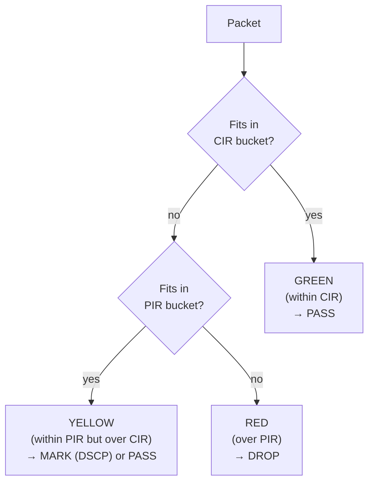
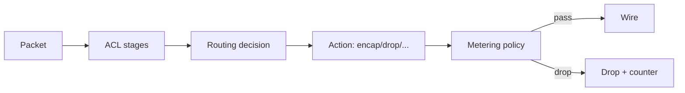

# 08 — Metering & QoS

> **TL;DR:** **Metering** classifies traffic into buckets and applies
> token-bucket rate limits (CIR/PIR), producing PASS/MARK/DROP per
> packet. It runs **after** ACLs and **after** routing. It's policy-
> driven and per-ENI-direction. **QoS** is simpler: per-ENI bandwidth
> caps and queue counts that constrain the whole ENI regardless of
> traffic class. Together they shape the per-tenant traffic profile.

---

## Two different concerns

Before diving in, separate them in your head:

| Concept | Granularity | Mechanism | When it fires |
|---------|-------------|-----------|---------------|
| **QoS** | Whole ENI | Bandwidth cap, queue allocation, DSCP remap | Egress shaping; coarse |
| **Metering** | Per-traffic-class within an ENI | Token-bucket policers; per-class counters | After ACL, after routing; fine-grained |

QoS says "this VM gets at most 25 Gbps with 8 hardware queues." Metering
says "of that traffic, no more than 5 Gbps may go to PrivateLink, and we
track per-class counters for billing."

---

## Metering — the model

DASH metering uses **two-rate three-color marking** (RFC 2698, the
"trTCM" — commonly known as the standard policer model). Per traffic
class, you configure two token buckets:

| Bucket | Rate | Burst | Meaning |
|--------|------|-------|---------|
| Committed (CIR + CBS) | `cir_bps` | `cbs_bytes` | Guaranteed bandwidth + small burst |
| Peak (PIR + PBS) | `pir_bps` | `pbs_bytes` | Maximum bandwidth + larger burst |

Each packet consumes tokens from the buckets. Outcome:



The classifier per packet (sketch):
- ≤ CIR → green → pass.
- > CIR but ≤ PIR → yellow → either pass (with DSCP marking) or drop,
  per policy.
- > PIR → red → drop.

In DASH terms, the policy's `default_action` (`PASS` | `DROP`) governs
unmatched packets, and each rule's metering class drives the bucket.

---

## `MeterPolicy` — the rule bundle

A `MeterPolicy` is per-ENI-direction (`out` or `in`) and contains
rules that classify packets into buckets:

| Object | Contents |
|--------|---------|
| `MeterPolicy` (header) | id, direction_hint, default_action, `rule_count` |
| `MeterRuleList` (body) | `MeterRule[]` |

Each rule:

```json
{
  "priority": 100,
  "match": {
    "dst_tag_refs": ["tag-azure-storage"]
  },
  "bucket": {
    "cir_bps": 5000000000,    // 5 Gbps committed
    "cbs_bytes": 1500000,
    "pir_bps": 8000000000,    // 8 Gbps peak
    "pbs_bytes": 3000000
  },
  "metering_class": "azure-storage-egress"
}
```

The `metering_class` is a string label — the DPU exposes a counter per
(ENI, direction, metering_class) for billing/observability. Use stable
strings; downstream telemetry pipelines key off them.

### How matching works

Matching is conceptually the same as ACLs: priority-ordered, tags
expanded at compose time, first match wins. But the **action** isn't
allow/deny — it's "which bucket to consume from."

Unlike ACLs there are no `_AND_CONTINUE` semantics — the first match
locks in the bucket.

---

## Where metering fires in the pipeline



Metering is **after** ACL (so denied packets aren't metered, which
would skew the bucket) and **after** routing (so the action is already
decided, but the byte counts are still real).

Some implementations meter **per encapsulated byte count** (including
overhead); others meter inner-frame bytes only. The DASH spec is
explicit about this for each metering class — read the implementation
notes for your DPU.

---

## QoS — the simpler half

A `Qos` object describes the **ENI-wide envelope**:

```json
{
  "qos_id": "qos-25g-8q",
  "bw_gbps": 25,
  "burst_size_mb": 64,
  "queue_count": 8,
  "dscp_remap": [
    { "from_dscp": 0,  "to_dscp": 0 },
    { "from_dscp": 26, "to_dscp": 34 }
  ]
}
```

| Field | Effect |
|-------|--------|
| `bw_gbps` | Hard cap on aggregate bandwidth (both directions usually) |
| `burst_size_mb` | Allowed burst over the cap |
| `queue_count` | Number of hardware send queues exposed to the VM |
| `dscp_remap[]` | Rewrites DSCP on egress (priority class mapping) |

QoS is **per-ENI**, not per-traffic-class. It's a coarse outer envelope;
metering is the fine-grained sieve inside it.

---

## When to use metering vs QoS

| Use case | Tool |
|----------|------|
| "This VM gets a 25 Gbps NIC class" | QoS |
| "VM should never exceed 25 Gbps total" | QoS |
| "Of that 25 Gbps, at most 5 Gbps may go to private link" | Metering |
| "Bill per-tenant for traffic to Azure Storage" | Metering (with metering_class) |
| "Mark non-conforming traffic yellow but don't drop" | Metering with PASS-on-yellow |
| "Reorder packets by DSCP into 8 priority queues" | QoS queue_count + DSCP remap |

They compose: the ENI's traffic first hits metering (per-class
policers) then QoS (bandwidth shaper).

---

## Counters — what you get for free

Every `metering_class` produces:
- Bytes-passed (green + yellow)
- Bytes-dropped (red)
- Packets-passed / dropped

Every ENI produces:
- Total bytes/packets in/out
- Per-queue depth and drops (from QoS)
- Per-stage ACL hit counts (from ACL pipeline)

These flow back up to the control plane via the agent's telemetry
channel — typically OpenTelemetry / OTLP push to a collector named in
`HostSpec.telemetry.export_collector`.

---

## Scope notes — why metering is *per-ENI* and QoS is *per-ENI* too

Both Meter policies and Qos are **group-scope** objects (shared,
referenced by id), but each ENI binds **its own** id. The binding is
per-ENI, even when many ENIs share the same policy.

Why not share across many ENIs more aggressively? Because the
**counters** are per-ENI. A meter policy shared by 1,000 ENIs would
need 1,000 separate counter contexts (which is fine — the *policy*
template is shared, but the *runtime state* is per-binding).

This is the same pattern as ACL groups: policy templates are reusable;
runtime state is per-ENI.

---

## Worked example — a tenant with billable PrivateLink

ENI for a financial-services VM. Egress meter policy:

```json
{
  "meter_policy_id": "mp-fin-egress",
  "default_action": "PASS",
  "rules": [
    { "priority": 100,
      "match": { "dst_tag_refs": ["tag-azure-storage"] },
      "bucket": { "cir_bps": 5e9, "pir_bps": 8e9,
                  "cbs_bytes": 1.5e6, "pbs_bytes": 3e6 },
      "metering_class": "storage-egress" },

    { "priority": 200,
      "match": { "dst_tag_refs": ["tag-azure-sql"] },
      "bucket": { "cir_bps": 2e9, "pir_bps": 4e9,
                  "cbs_bytes": 1e6, "pbs_bytes": 2e6 },
      "metering_class": "sql-egress" },

    { "priority": 300,
      "match": { "dst_tag_refs": ["tag-acme-privatelink"] },
      "bucket": { "cir_bps": 10e9, "pir_bps": 12e9,
                  "cbs_bytes": 3e6, "pbs_bytes": 4e6 },
      "metering_class": "privatelink-egress" }
  ]
}
```

QoS:
```json
{ "qos_id": "qos-100g-16q",
  "bw_gbps": 100, "burst_size_mb": 256, "queue_count": 16 }
```

Outcome:
- Whole ENI is capped at 100 Gbps with 16 queues.
- Within that, traffic to Storage gets ≤8 Gbps (peak), SQL ≤4 Gbps,
  PrivateLink ≤12 Gbps. The remaining bandwidth is for non-classified
  egress.
- Per-class counters fund a billing pipeline.

---

## Common gotchas

1. **Forgetting `default_action`.** An empty policy with a missing
   default treats unmatched packets ambiguously. Always set it.
2. **Bursts too small.** TCP loves bursts. A cir of 10 Gbps with a
   1 KiB burst behaves like 1 Mbps in practice. Match burst to
   round-trip × bandwidth (`bw * RTT`).
3. **Counting outer vs inner bytes.** Decide once per class; document
   in the metering_class name (e.g., `*-bytes-outer` vs `*-bytes-inner`).
4. **DSCP remap conflicting with QoS queues.** If queue selection
   uses post-remap DSCP, your remap reshapes queue assignment. Test.
5. **Sharing a policy across ENIs with different capacities.** The
   policy is a template; binding to a small ENI with rates exceeding
   the ENI's QoS does *not* expand the ENI — it just means some
   buckets are never reachable.

---

## Where to go next

- Tunnels and encap formats → [09 — Tunnels & Encap](./09-Tunnels-and-Encap.md)
- Full packet flow including metering → [10 — Packet Processing Lifecycle](./10-Packet-Processing-Lifecycle.md)

---

## See also

- [`meter-policy.md`](../protos/published/meter-policy.md)
- [`qos.md`](../protos/published/qos.md)
- RFC 2698 (trTCM) — the bucket model
- [00 — README](./00-README.md)
