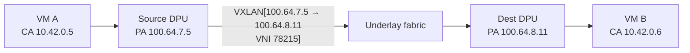
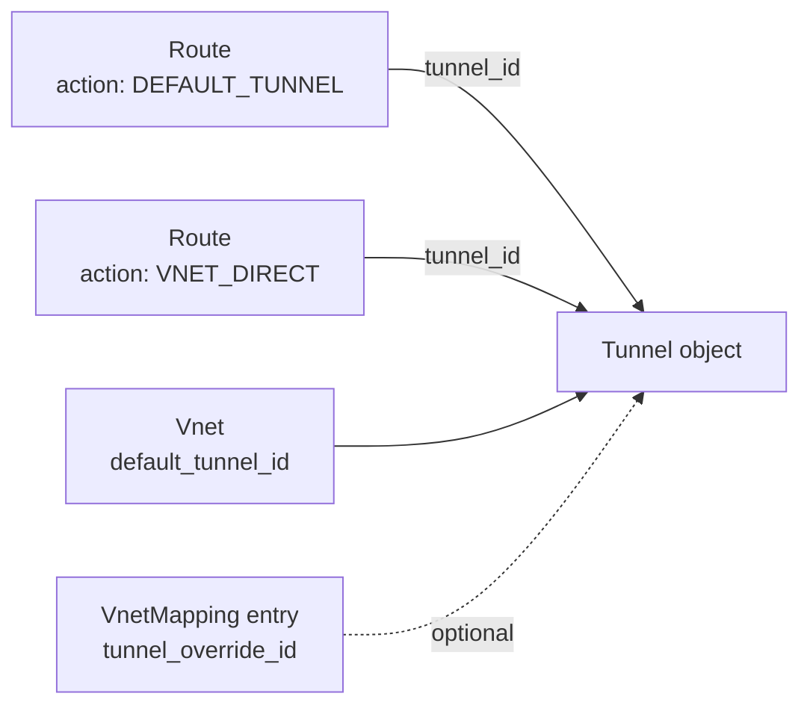
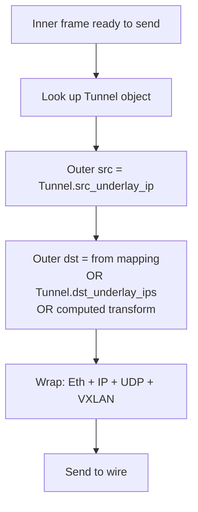
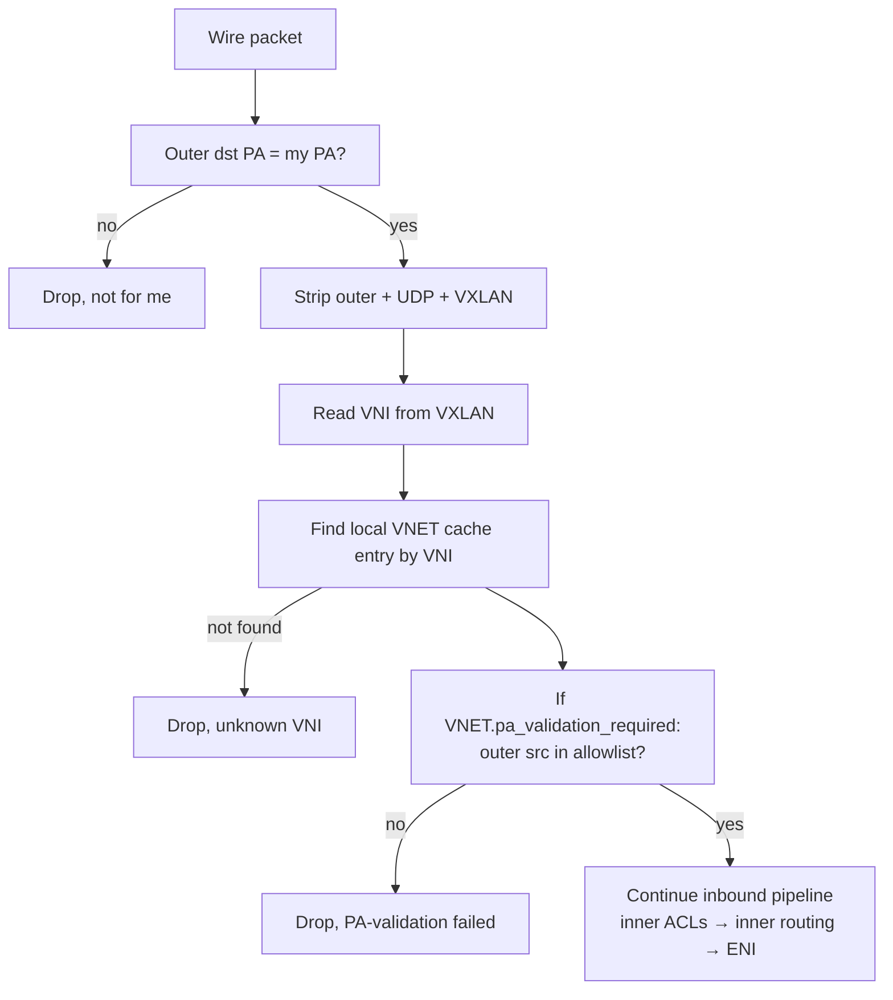

# 09 — Tunnels & Encap

> **TL;DR:** Tunnels are how DASH carries tenant (overlay) traffic
> across the provider (underlay) fabric. The dominant encap is
> **VXLAN** (UDP/4789), with **GENEVE** and **NVGRE** also supported.
> The `Tunnel` object names a reusable encap profile — type, source
> underlay IP, destination underlay IP(s), UDP port. Routes and VNETs
> reference Tunnels by id.

---

## What an encap actually looks like

Take a 1500-byte IPv4 packet leaving VM A (CA `10.42.0.5`) for VM B
(CA `10.42.0.6`). After encap, the wire frame is:

```
+----------------------------------------------------------+
| Outer Ethernet  (dst = ToR MAC,  src = DPU NIC MAC)      |
+----------------------------------------------------------+
| Outer IPv4      (src = 100.64.7.5, dst = 100.64.8.11)    |
+----------------------------------------------------------+
| UDP             (src = ephemeral, dst = 4789)            |
+----------------------------------------------------------+
| VXLAN header    (VNI = 78215, flags)                     |
+----------------------------------------------------------+
| Inner Ethernet  (dst MAC of VM B, src MAC of VM A)       |
+----------------------------------------------------------+
| Inner IPv4      (src = 10.42.0.5, dst = 10.42.0.6)       |
+----------------------------------------------------------+
| Inner payload (TCP/UDP/…)                                |
+----------------------------------------------------------+
```

The **underlay fabric** routes purely on the outer header. The
**overlay** (inner frame) is opaque to it — only the source DPU and
destination DPU touch the inner content.



---

## Encap formats DASH supports

| Format | Wire layout | Default port | Typical use |
|--------|------------|--------------|-------------|
| **VXLAN** | Eth+IP+UDP+VXLAN+inner | UDP/4789 | Default; widely supported |
| **GENEVE** | Eth+IP+UDP+GENEVE+inner | UDP/6081 | Extensible (TLV options); Azure favors |
| **NVGRE** | Eth+IP+GRE+inner | IP proto 47 | Legacy; rare in greenfield |

DASH treats them as interchangeable behaviors with different bit
layouts. The `Tunnel` object's `encap_type` chooses which.

---

## The `Tunnel` object

A reusable encap profile:

```json
{
  "tunnel_id": "tun-vxlan-default-westus2",
  "encap_type": "VXLAN",
  "src_underlay_ip_v4": "100.64.7.5",
  "udp_dst_port": 4789,
  "dst_underlay_ips_v4": ["100.64.10.1", "100.64.10.2"],
  "dst_group": ""
}
```

| Field | Purpose |
|-------|---------|
| `tunnel_id` | Handle referenced by routes and VNETs |
| `encap_type` | `VXLAN` / `GENEVE` / `NVGRE` |
| `src_underlay_ip_*` | Source PA used for the outer header (the local DPU's PA) |
| `udp_dst_port` | Outer UDP destination (4789 = VXLAN default) |
| `dst_underlay_ips_*` | Specific PA targets (used for tunnels with a fixed remote, like an internet gateway) |
| `dst_group` | Reference to a group of equivalent destinations (load-spread) |

When a route fires with action `DEFAULT_TUNNEL` or `VNET_DIRECT`, the
`Tunnel.dst_underlay_ips_*` (or `dst_group`) provides the outer
destination. When the action is `VNET`, the destination comes from
**VNET mapping lookup**, not the tunnel.

---

## PA vs CA — pinning the terminology

This is the single most confused pair in overlay networking. Read
twice:

- **CA (Customer Address)** = overlay = what the **VM** uses.
  - Lives inside the inner header.
  - Tenant-private; not routable on the underlay.
  - Example: `10.42.0.5`.
- **PA (Provider Address)** = underlay = what the **DPU** uses.
  - Lives inside the outer header.
  - Globally routable on the fabric.
  - Example: `100.64.7.5`.

Every VNET has CAs. Every DPU has one or more PAs. The mapping table
turns CAs into PAs.

---

## Why DASH needs a Tunnel object at all

Couldn't you just put `src_underlay_ip` and `udp_dst_port` directly on
the ENI?

Three reasons not to:

1. **Reuse.** All ENIs on the same DPU share the same source PA. One
   Tunnel object; thousands of ENIs reference it.
2. **Independent updates.** Changing the underlay's UDP port for a
   migration → update one Tunnel, every ENI follows. Without the
   indirection, you'd touch every ENI.
3. **Multi-destination encap.** Some flows (e.g., internet gateway
   egress) need to land on one of several remote PAs. The Tunnel
   object holds the list; the pipeline picks one (ECMP).

---

## When tunnels are referenced



- `Route.action.tunnel_id` — explicit tunnel for default-route or
  direct-encap actions.
- `Vnet.default_tunnel_id` — when a route says "VNET" with no specific
  tunnel, this is what's used.
- `VnetMappingEntry.tunnel_override_id` — per-entry exception, rare;
  used when a single destination CA must use a non-default encap.

---

## Service tunnels (a special pattern)

A **service tunnel** is a Tunnel used to reach a managed cloud service
(Azure Storage, SQL, etc.) over the customer's private network rather
than the public internet. From the VM's perspective, it sees a normal
public IP (e.g., `20.150.x.x`); the DPU intercepts via route + encap
and forwards to a service ingress.

Conceptually:
1. VM sends to `20.150.1.7:443`.
2. Outbound route matches `tag-azure-storage` → action `SERVICE_TUNNEL`.
3. DPU applies a SNAT transform (so the service knows which tenant)
   and encaps to the service's PA.
4. Service receives, processes, replies; reply gets decapped and
   delivered to VM.

Service tunnel details vary by cloud. The DASH primitives (Tunnel
object, route action `SERVICE_TUNNEL`, NAT transforms) are the same.
Covered more in [chapter 12](./12-Scenario-PrivateLink-and-ServiceTunnel.md).

---

## ECMP across multiple destination PAs

When a tunnel has multiple `dst_underlay_ips_*`, the DPU picks one
per-flow (5-tuple hash). This is **outer-header ECMP**, not inner —
the underlay fabric still routes each chosen outer destination
independently.

Use cases:
- Internet gateway with 4 anycast PAs in the region.
- HA pair of upstream service ingresses.
- Load spreading across a fleet of egress proxies.

Be aware: ECMP changes if you add/remove a PA, which means in-flight
flows may rehash. For stateful flows that care, use `dst_group` with
**consistent hashing** behavior (vendor-specific in some DPUs).

---

## What the pipeline does on encap



For VXLAN specifically, the VNI in the VXLAN header comes from the
target VNET (`Vnet.vni`), not the Tunnel. For a peering action, it's
the **peer** VNET's vni. For a service tunnel, it's the service's
designated vni.

---

## Decap, on the receiving side

Mirror image:



PA validation (chapter 04) is the anti-spoof guard. Without it,
anyone on the underlay could inject overlay packets with arbitrary
VNI.

---

## MTU considerations

VXLAN adds 50 bytes of overhead (14 outer Eth + 20 IP + 8 UDP + 8
VXLAN). If the underlay MTU is 1500, the maximum inner payload is
1450. Most cloud deployments configure underlay MTU = 9000 (jumbo
frames) precisely to avoid eating tenant MTU.

DASH doesn't fragment in the data path — packets too large for the
underlay path get dropped with an ICMP "too big" emitted upstream
(PMTU discovery). If your overlay isn't seeing connectivity, check
MTU first.

---

## Common gotchas

1. **Wrong source PA.** A Tunnel's `src_underlay_ip` must be a PA
   actually owned by the local DPU. Cross-DPU PA spoofing might pass
   PA validation at the destination, but it's a fabric routing bug
   waiting to happen.
2. **VNI conflicts.** Two VNETs with the same VNI cached on the same
   DPU is undefined behavior. Make VNI globally unique within a
   region.
3. **Default port mismatch.** If you change `udp_dst_port` to a
   non-standard value, the destination DPU must be configured to
   accept it. Standard 4789 unless you have a very good reason.
4. **GENEVE option compatibility.** GENEVE TLVs are powerful but
   vendor-specific in interpretation. Stick to the documented option
   set for portability.

---

## Where to go next

- The full packet flow combining everything → [10 — Packet Processing Lifecycle](./10-Packet-Processing-Lifecycle.md)

---

## See also

- [`tunnel.md`](../protos/published/tunnel.md)
- [`vnet.md`](../protos/published/vnet.md) — `default_tunnel_id` field
- RFC 7348 (VXLAN), RFC 8926 (GENEVE), RFC 7637 (NVGRE)
- [00 — README](./00-README.md)
