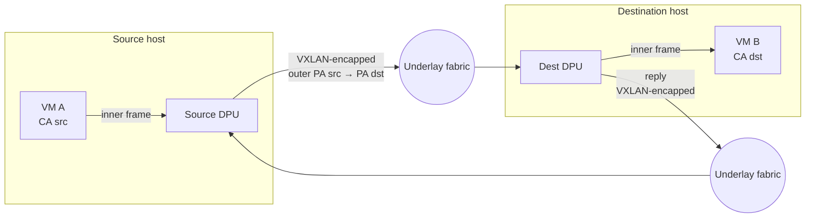
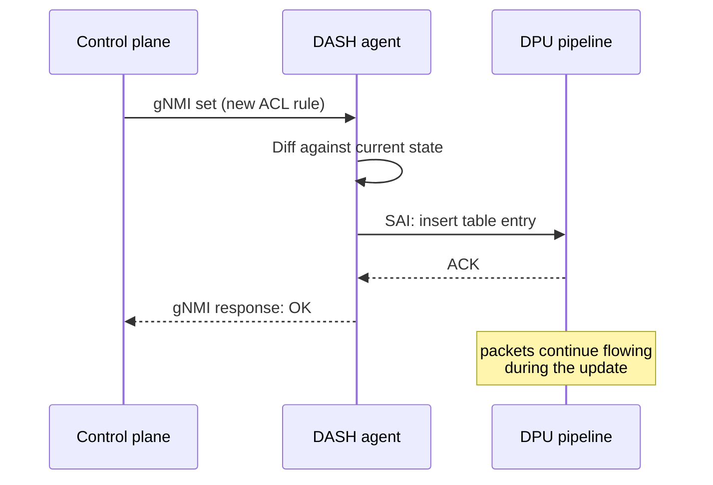

# 10 — Packet Processing Lifecycle

> **TL;DR:** This is the chapter that ties every previous chapter
> together. You'll trace a packet from a VM into the DPU pipeline, out
> onto the wire, across the underlay, into a remote DPU's pipeline,
> and into a remote VM. Both directions. Every match-action stage,
> in order, with the DASH object that controls it.

---

## The big picture — both directions on one diagram

The work happens **inside the two DPU blocks**. The fabric is dumb
plumbing — it just routes outer IP packets.

---

## Pipeline stages — the canonical order

Every DASH-conformant DPU runs the same logical pipeline. Outbound:

```mermaid
flowchart LR
    A["1. Ingress<br/>from VM"] --> B["2. ENI lookup<br/>(by src MAC / port)"]
    B --> C["3. Set direction<br/>= OUTBOUND"]
    C --> D["4. ACL Stage 1<br/>VNIC out"]
    D --> E["5. ACL Stage 2<br/>SUBNET out"]
    E --> F["6. ACL Stage 3<br/>VNET out"]
    F --> G["7. Routing lookup<br/>(LPM on dst CA)"]
    G --> H["8. Action dispatch<br/>(VNET / peering / privatelink / drop / ...)"]
    H --> I["9. Mapping lookup<br/>(if VNET-class action)"]
    I --> J["10. NAT transform<br/>(if needed)"]
    J --> K["11. Metering<br/>(per-class buckets)"]
    K --> L["12. Encap<br/>(VXLAN / GENEVE)"]
    L --> M["13. QoS shaping<br/>(bandwidth, queue)"]
    M --> N["14. Egress to wire"]
```

Inbound:

```mermaid
flowchart LR
    A["1. Ingress<br/>from wire"] --> B["2. Outer header check<br/>(PA dst = mine?)"]
    B --> C["3. Decap"]
    C --> D["4. Identify VNET<br/>by VNI"]
    D --> E["5. PA validation<br/>(if required)"]
    E --> F["6. ENI lookup<br/>(by inner dst MAC / CA)"]
    F --> G["7. Inbound routing rule check<br/>(usually pass-through)"]
    G --> H["8. ACL Stage 1<br/>VNIC in"]
    H --> I["9. ACL Stage 2<br/>SUBNET in"]
    I --> J["10. ACL Stage 3<br/>VNET in"]
    J --> K["11. Metering in"]
    K --> L["12. Deliver to VM<br/>(via SR-IOV VF)"]
```

Read these twice. They're the spine of every chapter that follows.

---

## Outbound walkthrough — east-west to a peer in the same VNET

**Setup.** VM A (CA `10.42.0.5`, MAC `aa:bb:cc:dd:ee:ff`) lives on
DPU-A (PA `100.64.7.5`) in VNET blue (VNI `78215`). VM B (CA
`10.42.0.6`) lives on DPU-B (PA `100.64.8.11`) in the same VNET. VM A
sends a 1400-byte TCP packet to `10.42.0.6:443`.

**Trace.**

| Step | Action | Object involved | Outcome |
|------|--------|-----------------|---------|
| 1 | Packet enters DPU-A via SR-IOV VF for VM A | — | Inner frame in pipeline |
| 2 | ENI lookup: src MAC `aa:bb:...` → ENI for VM A | `Eni` | ENI bound; direction = OUTBOUND |
| 3 | ACL Stage 1 (VNIC out): rules say allow corp-internal + HTTPS | `AclGroup ag-web-vnic-out` | Match priority-100 rule (`dst_tag_refs: tag-acme-internal`) → ALLOW |
| 4 | ACL Stage 2 (SUBNET out): empty | — | Pass-through |
| 5 | ACL Stage 3 (VNET out): empty | — | Pass-through |
| 6 | Routing lookup on `10.42.0.6` → matches `10.42.0.0/16` priority 100 | `RouteGroup rg-web-egress-v4` | Action: `VNET` |
| 7 | Action dispatch: VNET-class → mapping lookup | — | Continue |
| 8 | VNET mapping lookup: `10.42.0.6` in VNET blue → PA `100.64.8.11`, MAC of VM B | `VnetMappingChunk` | Hit |
| 9 | No NAT for this flow | — | Continue |
| 10 | Metering: matches `default_action: PASS` (no specific rule fires) | `MeterPolicy mp-web-egress` | Bytes counted; pass |
| 11 | Encap: outer src=`100.64.7.5`, dst=`100.64.8.11`, UDP/4789, VNI=`78215` | `Tunnel tun-vxlan-default-westus2` | VXLAN frame built |
| 12 | QoS: ENI is under its 25 Gbps cap, hashes to queue 3 | `Qos qos-25g-8q` | Queued |
| 13 | Egress to wire | — | Packet on the fabric |

13 stages, each consulting at most one DASH object. The pipeline does
this at line rate (100s of Mpps), per-packet, in silicon.

---

## Inbound walkthrough — what DPU-B does with the packet

VM B is the same web tenant. ENI on DPU-B has the same group bindings
mirrored for inbound.

| Step | Action | Object involved | Outcome |
|------|--------|-----------------|---------|
| 1 | Packet arrives on DPU-B's NIC, outer dst = `100.64.8.11` | — | Pipeline ingress |
| 2 | Outer header check: dst is my PA | `Appliance.loopback_pa_*` | Yes; proceed |
| 3 | Decap VXLAN | — | Inner frame + VNI=`78215` extracted |
| 4 | VNET lookup by VNI: VNI 78215 → VNET blue | local `Vnet` cache | Hit |
| 5 | PA validation: outer src `100.64.7.5` in allowlist? | `PaValidation` for VNET blue | Yes |
| 6 | ENI lookup: inner dst MAC matches VM B's ENI | `Eni` (DPU-B side) | ENI bound |
| 7 | Inbound routing rule check: no overrides | `Eni.route_rules` | Pass-through |
| 8 | ACL Stage 1 (VNIC in): allow from corp-internal | `AclGroup ag-web-vnic-in` | ALLOW |
| 9 | ACL Stages 2, 3 (SUBNET, VNET in): empty | — | Pass-through |
| 10 | Inbound metering: bytes counted | `MeterPolicy mp-web-ingress` | Pass |
| 11 | Deliver to VM B via its SR-IOV VF | — | VM B receives the frame |

The return path mirrors steps 1–13 of the outbound trace, swapping
source/destination.

---

## What happens when something goes wrong — drop reasons

The DPU exports counters for **every drop reason**. The most common:

| Drop reason | Where it fires | Diagnostic action |
|------------|----------------|-------------------|
| `acl_stage_1_deny` | Outbound or inbound ACL Stage 1 hit DENY | Check `AclGroup` rules bound to the ENI |
| `no_route` | Routing lookup found no matching route | Check `RouteGroup` contents; check `Vnet.routing_type_default` |
| `no_mapping` | Route action `VNET` but mapping lookup missed | Mapping incomplete? Target VM not provisioned? |
| `pa_validation_failed` | Inbound; outer src not in allowlist | Update `PaValidation` or check fabric source |
| `meter_red` | Metering policer dropped (exceeded PIR) | Tune meter bucket sizes or class assignments |
| `qos_queue_full` | Egress queue buffer overflow | Tune QoS queue depth or `bw_gbps` |
| `mtu_exceeded` | Inner frame too large after encap | Reduce overlay MTU or enable jumbo on underlay |
| `eni_disabled` | ENI admin_state = DISABLED | Re-enable ENI or remove |

These counters are essential for debugging. When a tenant says "my VM
can't reach X," the first move is to look at per-reason drop counters
on the ENI.

---

## Where time is spent

A rough budget per packet (varies by vendor and packet size):

| Stage group | Typical time |
|-------------|--------------|
| Ingress + ENI lookup | ~100 ns |
| 3-stage ACL chain | ~300 ns (1K-rule groups, cached) |
| Routing + mapping | ~200 ns |
| NAT (if any) | ~150 ns |
| Encap | ~100 ns |
| QoS + egress | ~150 ns + queue wait |
| **Total fast-path** | **~1 µs** |

At 100 Gbps line rate with 1500-byte packets that's ~8 Mpps per
direction per port. The pipeline keeps up because every stage is a
single-cycle TCAM/SRAM lookup in silicon — no software, no caching
penalty.

---

## What happens during a config update

Critical property: **config updates do not block the data path**.

Rule changes are applied **atomically at the table level** — a packet
either sees the old rule set or the new one, never a half-updated
state. Multi-rule changes are applied as a transaction where possible;
otherwise they're sequenced so behavior never regresses to "deny that
should have been allow."

---

## Putting it all together — a one-page summary

The DPU's job for **every** packet:

**Outbound:** Identify ENI → run 3 ACLs → look up route → execute the
route's action (which usually means mapping lookup + encap) → meter →
QoS → wire.

**Inbound:** Check outer dst → decap → identify VNET → PA-validate →
identify ENI → run 3 ACLs → meter → deliver.

Every step consults a DASH object you now know. The control plane's
entire job is to keep those objects accurate, consistent, and within
hardware limits.

---

## Where to go next

You now have the full conceptual model. The scenarios apply it:

- Full provisioning trace → [11 — VM NIC Provisioning](./11-Scenario-VM-NIC-Provisioning.md)
- Managed-service traffic patterns → [12 — PrivateLink & Service Tunnel](./12-Scenario-PrivateLink-and-ServiceTunnel.md)
- HA and failover → [13 — HA & Failover](./13-Scenario-HA-and-Failover.md)

---

## See also

- [DASH packet flow HLD](https://github.com/sonic-net/DASH/blob/main/documentation/general/dash-high-level-design.md)
- [DASH P4 pipeline reference](https://github.com/sonic-net/DASH/tree/main/dash-pipeline)
- [00 — README](./00-README.md)
