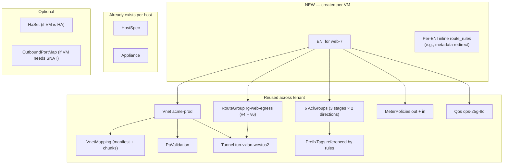
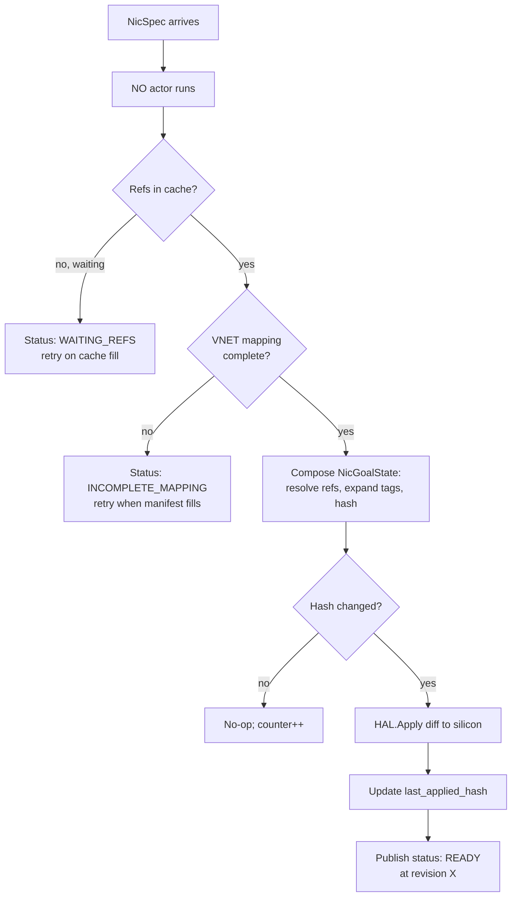
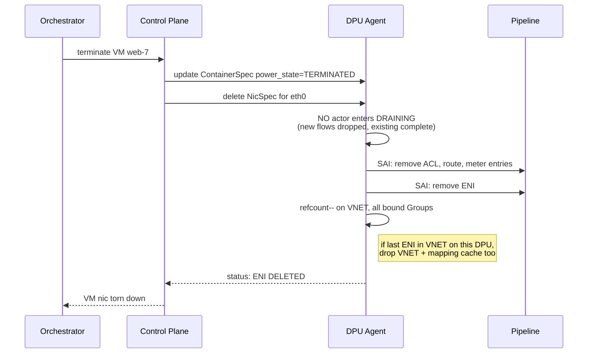

# 11 — Scenario: VM NIC Provisioning

> **TL;DR:** When a tenant launches a VM, ~12 DASH objects must
> exist (or be created) and the DPU on the host must have all of them
> cached and composed before the VM's first packet flows. This chapter
> traces the full provisioning sequence — orchestrator decision → object
> publication → DPU subscription → composition → SAI programming →
> ready ENI — and shows what each step looks like on the wire.

---

## The scenario in one line

> Tenant `acme-corp` launches VM `web-7` in VNET `acme-prod`. The VM
> has one virtual NIC. By the end of this chapter, that NIC is a fully
> programmed ENI on DPU `dpu-007`, accepting and forwarding traffic at
> line rate.

---

## What gets created — the full object set

For this one VM NIC, the orchestrator must ensure these objects exist
(creating them if not):



Most objects are **shared** — already present from prior VMs in the
same tenant/VNET. Truly new for this VM: the `ENI` itself, possibly an
`HaSet` entry, possibly a mapping entry in the VNET map (added to an
existing chunk).

---

## The full provisioning sequence

The whole flow from orchestrator decision to first packet:

```mermaid
sequenceDiagram
    autonumber
    participant Orc as Orchestrator
    participant CP as Control Plane
    participant DPU as DPU-007 Agent
    participant HAL as Pipeline

    Orc->>CP: place VM web-7 on host-007<br/>(tenant=acme-corp, vnet=acme-prod)
    Note over CP: Decide what's missing<br/>(VNET cached? Groups present?)

    rect rgb(245, 250, 245)
        Note over CP,DPU: Phase A — ensure ambient state on DPU
        CP->>DPU: publish HostSpec, Appliance (if new device)
        CP->>DPU: publish Vnet acme-prod (refcount +1)
        CP->>DPU: publish PaValidation
        CP->>DPU: publish VnetMappingManifest + Chunks
        CP->>DPU: publish referenced Groups<br/>(RouteGroup, AclGroups, MeterPolicies, Tunnel, Qos)
        DPU->>DPU: cache all; refcount tracking
    end

    rect rgb(245, 245, 255)
        Note over CP,DPU: Phase B — add the ENI itself
        CP->>DPU: publish ContainerSpec for VM<br/>(nic_ids=[eth0])
        CP->>DPU: publish NicSpec for web-7/eth0<br/>(refs all groups above)
        DPU->>DPU: NO actor created for this NIC
    end

    rect rgb(255, 250, 245)
        Note over DPU,HAL: Phase C — compose and program
        DPU->>DPU: NO actor reads all refs from cache
        DPU->>DPU: composer builds NicGoalState<br/>(SHA-256 content_hash)
        DPU->>DPU: diff vs last_applied (none — new ENI)
        DPU->>HAL: SAI calls: ENI, ACL entries,<br/>route entries, meter entries, mapping entries
        HAL-->>DPU: ACK
    end

    rect rgb(250, 245, 250)
        Note over DPU,Orc: Phase D — ENI ready
        DPU-->>CP: status: ENI READY (revision X applied)
        CP-->>Orc: VM nic provisioned
    end

    Note over HAL: Pipeline now processes web-7's packets at line rate
```

This is **the** end-to-end view. Pin it.

---

## Phase A — Ambient state (often a no-op)

If `acme-prod` is the tenant's hundredth VM in VNET `acme-prod`, almost
nothing new gets published in Phase A. The Vnet, mapping, and groups
are already cached on DPU-007 (refcounted by all prior ENIs). The
control plane checks refcounts and skips redundant publishes.

If, however, this is the **first VM** for `acme-prod` to land on
DPU-007:

| Step | What's published | Why |
|------|------------------|-----|
| A1 | `HostSpec` (if DPU-007 is new) | Agent endpoint, telemetry config |
| A2 | `Appliance` (if DPU-007 is new) | DPU identity, PA, capabilities |
| A3 | `Vnet acme-prod` | Overlay tenant network definition |
| A4 | `PaValidation` for VNET acme-prod | Anti-spoof allowlist |
| A5 | `VnetMappingManifest` + every chunk it lists | The CA→PA table |
| A6 | `RouteGroup rg-web-egress-v4` (+ v6) | Outbound LPM rules |
| A7 | 3–6 `AclGroup`s | ACL stages |
| A8 | `MeterPolicy mp-web-egress` (+ ingress) | Rate-limiting |
| A9 | `Tunnel tun-vxlan-westus2` | Encap profile |
| A10 | `Qos qos-25g-8q` | Bandwidth cap |
| A11 | Any `PrefixTag` referenced by rules in A6–A8 | Tag expansion source |

The agent caches each as it arrives. NO actor for `web-7` does **not**
start composing yet — it's waiting for Phase B.

---

## Phase B — Add the ENI itself

The **only** truly per-VM objects:

| Step | What's published | Contents |
|------|------------------|----------|
| B1 | `ContainerSpec` for the VM | `container_guid`, `tenant_id`, `nic_ids=[eth0]`, `power_state=RUNNING` |
| B2 | `NicSpec` for `web-7/eth0` | MAC, primary IP, PA, all reference ids |

The DPU's agent uses the `ContainerSpec` to spawn one NO (NicObject)
actor per `nic_id`. The NO subscribes to the corresponding `NicSpec`
key — when it arrives, the NO transitions into the composer phase.

`NicSpec` example for this VM:

```json
{
  "nic_id": "eth0",
  "mac_address": "aa:bb:cc:dd:ee:ff",
  "primary_ip_v4": "10.42.0.5",
  "underlay_ip_v4": "100.64.7.5",
  "vnet_id": "vnet-acme-prod",
  "admin_state": "ENABLED",

  "route_group_v4_id": "rg-web-egress-v4",
  "route_group_v6_id": "rg-web-egress-v6",
  "acl_group_ids_v4_out": ["ag-web-vnic-out", "ag-web-subnet-out", ""],
  "acl_group_ids_v4_in":  ["ag-web-vnic-in",  "ag-web-subnet-in",  ""],
  "meter_policy_id_out": "mp-web-egress",
  "meter_policy_id_in":  "mp-web-ingress",
  "qos_id": "qos-25g-8q",

  "route_rules": [
    { "match": { "dst_prefix": "169.254.169.254/32" },
      "action": { "kind": "REDIRECT_LOCAL_METADATA" } }
  ]
}
```

Every `*_id` here points at something published in Phase A.

---

## Phase C — Composition and programming



The composer:
1. Reads every `*_id` from the local HDO cache.
2. Replaces every `prefix_tag_ref` with its concrete prefix list.
3. Reads the VNET mapping refcount and ensures it's COMPLETE.
4. Builds the `NicGoalState` struct fully denormalized.
5. Hashes it; compares to `last_applied_hash`.
6. If new, diffs against the previous (none for first apply — it's a
   full insert).
7. Issues SAI calls in dependency order: ENI first, then ACL entries,
   then routes, then meters, then mapping bindings.
8. Marks the apply succeeded; reports status upward.

The detailed `NicGoalState` shape lives at
[`nic-goal-state.md`](../protos/published/nic-goal-state.md).

---

## Phase D — First packet flows

Once `READY` is reported, the VM can be powered on (if it wasn't
already). The first packet from VM enters the DPU pipeline, hits all
13 outbound stages described in [chapter 10](./10-Packet-Processing-Lifecycle.md),
and exits the wire.

There is **no warmup**, no first-packet learning. Every match-action
table was populated by the SAI calls in Phase C. The pipeline is hot
from packet 1.

---

## Provisioning order matters — failure modes

What if you do things in the wrong order?

| Wrong order | Consequence | Recovery |
|-------------|-------------|----------|
| NicSpec before VNET cached | NO actor stuck in `WAITING_REFS` | Wait for VNET publish; auto-resolves |
| NicSpec before referenced AclGroup published | Same: `WAITING_REFS`, lists the missing id | Auto-resolves on group publish |
| VNET mapping partially populated (some chunks missing) | Status `INCOMPLETE_MAPPING`; programming gated | Auto-resolves when chunks arrive |
| AclGroup ref count exceeded DPU capacity | `OVER_CAPACITY` rejection; ENI never programs | Reshape rules; orchestrator must split |
| Container marked `RUNNING` before NicSpec exists | CO actor waits; ENI not ready; VM packets dropped | Publish NicSpec |

The control plane must handle each gracefully. The DASH model is
**eventually consistent** — refs publish in any order, and the system
converges.

---

## The VM-NIC properties spelled out

Mapping the user's original question to the actual DASH objects:

| VM NIC property mentioned | DASH representation |
|---------------------------|---------------------|
| "Represents an ENI" | `Eni` object on the host's DPU |
| "Attached to a VNET" | `Eni.vnet_id` → `Vnet` |
| "VNI" | `Vnet.vni`, used in VXLAN header |
| "Mapping" | `VnetMapping` (manifest + chunks) for the VNET |
| "Routing table" | `RouteGroup` bound via `Eni.route_group_v4_id` |
| "Private link" | Routes with action `PRIVATELINK` (see chapter 12) |
| "Service tunnel" | Routes with action `SERVICE_TUNNEL` (chapter 12) |
| "NAT" | `OutboundPortMap` bound via `Eni.outbound_port_map_id` |
| "Routes" | Entries inside the `RouteGroup` + per-ENI `route_rules[]` |
| "ACLs" | 6 `AclGroup`s bound (3 stages × 2 directions) |
| "Metering" | `MeterPolicy out` and `in` bindings |
| "QoS" | `Qos` binding |
| "HA" | `HaSet` membership via `Eni.ha_scope` |
| "Anti-spoof" | `PaValidation` on the VNET |

Each property is **one ref on the NicSpec**. The composer turns refs
into a program.

---

## Teardown — what happens when the VM dies

Symmetric to provisioning, but with **drain semantics**:



Drain timeout is a property on `ContainerSpec.lifecycle.drain_on_remove`.
When false, removal is immediate.

---

## What you should be able to do now

After reading this chapter you should be able to:

1. List every DASH object that participates in a single VM NIC's
   provisioning.
2. Explain which objects are reused vs newly created per VM.
3. Walk a colleague through the 4-phase provisioning sequence.
4. Diagnose why an ENI is stuck in `WAITING_REFS` or `INCOMPLETE_MAPPING`.

---

## Where to go next

- Managed service traffic patterns → [12 — PrivateLink & Service Tunnel](./12-Scenario-PrivateLink-and-ServiceTunnel.md)
- HA across two DPUs → [13 — HA & Failover](./13-Scenario-HA-and-Failover.md)
- The big composition picture → [14 — Stitching Everything Together](./14-Stitching-Everything-Together.md)

---

## See also

- All the per-kind schemas: [`Specs/protos/published/`](../protos/published/)
- [00 — README](./00-README.md)
