# 11A — The ENI Dependency Graph

> **TL;DR:** Creating one VM/Container NIC on a DPU is, mechanically, a
> single row write to `DASH_ENI_TABLE` plus six-to-twelve binding rows
> in adjacent tables. But that write is only meaningful if a precise
> tower of prerequisite objects already exists. This document maps
> every dependency, draws the DAG five layers deep, shows the exact
> programming order, and walks through the consequences when any link
> in the chain is missing.

---

## Why this document exists

Books 01–10 introduce DASH objects one at a time. Book 11 walks the
provisioning *story* end-to-end. This chapter is the
**dependency-first reference** — the document you reach for when you
need precise answers to:

| Question | Where in this doc |
|----------|-------------------|
| What must exist before I can write an `ENI` row? | §3, §4, §5 |
| In what order must objects be programmed, and why? | §7, §8 |
| Where are the gates (synchronous waits)? | §6 |
| What can be shared across many ENIs? What is per-ENI? | §3, §10 |
| If I tear down the NIC, what stays vs. goes? | §9 |
| Which failures kick the ENI back to which lifecycle state? | §11 |
| First VM in a fresh VNET vs. Nth VM — how does the path differ? | §12, §13 |
| How does FleetManager's wave/phase model implement this? | §14 |

If you are designing a DASH control plane, you will return to this
document repeatedly.

---

## 1. The cardinal rule of DASH dependency

> **A row whose foreign key points at a non-existent object is
> rejected by the DPU. Programming an ENI in the wrong order is the
> single most common source of "ENI created, traffic drops" bugs.**

DASH tables are *referentially linked* — `DASH_ENI_TABLE` carries a
`vnet_id` foreign key into `DASH_VNET_TABLE`; `DASH_ENI_ROUTE_TABLE`
references both an ENI and a `RouteGroup`; `DASH_VNET_MAPPING_TABLE`
rows reference a `Tunnel`. Either the SAI implementation enforces this
strictly (the well-behaved case), or it accepts the row and the
pipeline silently no-ops on lookup miss (the cruel case).

Either way, the control plane's job is to make sure the dependency
graph is satisfied **before** each write. That graph is the subject of
this document.

---

## 2. The layer-cake mental model

Every object that participates in an ENI lives on one of five layers.
A layer can only be programmed once everything beneath it exists.

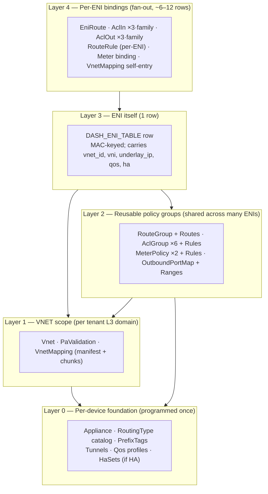

Top-down read: an `EniRoute` only makes sense if the ENI exists; the
ENI only makes sense if the VNET is programmed; the VNET only makes
sense once the Tunnel and RoutingType it references exist. The DAG is
a *forest of pointers* collapsed into a navigable hierarchy.

---

## 3. Layer-by-layer walkthrough

### 3.1 Layer 0 — Per-device foundation

These are programmed once when the device joins the fleet. Every ENI
on this device shares them.

| Object | Upstream table | Cardinality | What it carries | Why ENI needs it |
|--------|----------------|-------------|-----------------|------------------|
| `Appliance` | `DASH_APPLIANCE_TABLE` | 1 per device | Local VTEP IP, base VNI, pipeline limits | Encap source IP, capacity gates |
| `RoutingType` | (FM-only catalog) | ~5 fleet-wide | Action chain per role (`vnet`, `privatelink`, …) | VNETs reference; compiles to upstream enum |
| `PrefixTag` | `DASH_PREFIX_TAG_TABLE` | tens–hundreds | Named prefix groups (`tag-azure-storage`) | ACL/route rules expand against these |
| `Tunnel` | `DASH_TUNNEL_TABLE` | a handful per region | Encap type, src underlay IP, UDP port, VNI base | VNETs and per-row mapping overrides reference |
| `Qos` profile | `DASH_QOS_TABLE` | tier-shaped (gold/silver/…) | Bandwidth, queue count, scheduling | ENI binds one |
| `HaSet` (optional) | (FM control-plane) | per HA pair | Pair identity, peer underlay IP, role assignment | ENI binds one when HA-paired |

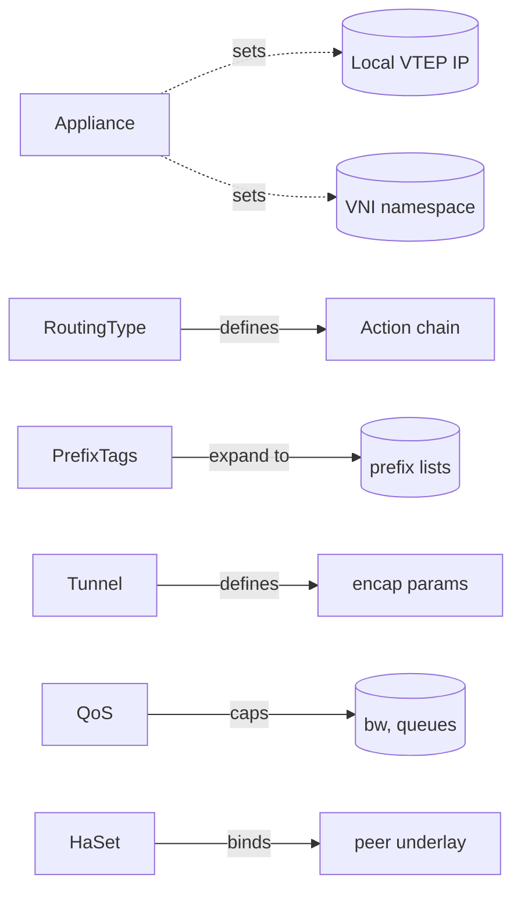

**Failure mode if missing:** the VNET, RouteGroup, AclGroup,
MeterPolicy, or ENI write that references it gets rejected
(`VALIDATION_REJECTED` in FM's lifecycle), or — for FM-side objects
like RoutingType — the compose step parks the ENI in `WAITING_REFS`.

---

### 3.2 Layer 1 — VNET scope

The L3 domain the ENI lives in. Per tenant; many ENIs share one.

| Object | Upstream table | Depends on | What it carries |
|--------|----------------|------------|-----------------|
| `Vnet` | `DASH_VNET_TABLE` | RoutingType, Tunnel | VNI, GUID, address prefixes, default routing-type |
| `PaValidation` | `DASH_PA_VALIDATION_TABLE` | Vnet | Allowed underlay PA list (anti-spoofing) |
| `VnetMapping` (manifest + chunks) | `DASH_VNET_MAPPING_TABLE` | Vnet, Tunnel(s) | CA→PA mappings for every overlay IP in the VNET |

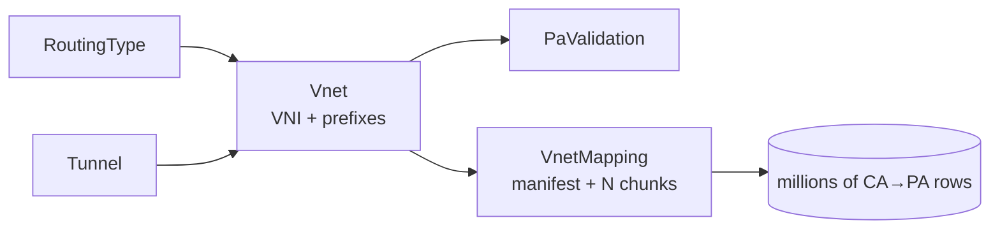

#### The mapping-completeness gate (critical)

`VnetMapping` is the **dominant cold-start blocker**. It can be
millions of rows. FM packages it as a manifest (table-of-contents)
plus <1 MiB chunks; the HDO actor must:

1. Receive the manifest.
2. Open watches on every chunk listed.
3. Validate each chunk's content hash against the manifest.
4. Mark the VNET mapping `COMPLETE` only when all chunks present and verified.

Until COMPLETE, every NIC actor in this VNET parks in
`INCOMPLETE_MAPPING`. **This is the longest typical wait in cold
provisioning** — see §13 for the worked example.

---

### 3.3 Layer 2 — Reusable policy groups

Per tenant; shared across many ENIs. Edits cascade to every ENI that
references the group, which is exactly why these are *groups* and not
inlined into ENI.

| Object | Upstream tables | Depends on | What it binds |
|--------|----------------|------------|---------------|
| `RouteGroup` + rules | `DASH_ROUTE_GROUP_TABLE` + `DASH_ROUTE_TABLE` | Vnet (target peers), Tunnel, PrefixTag | Outbound LPM table for ENIs that bind it |
| `AclGroup` + rules | `DASH_ACL_GROUP_TABLE` + `DASH_ACL_RULE_TABLE` | PrefixTag | One stage's worth of ACL rules |
| `MeterPolicy` + rules | `DASH_METER_POLICY` + `DASH_METER_RULE` | PrefixTag | Token-bucket rate limits, billing classes |
| `OutboundPortMap` + ranges | `DASH_OUTBOUND_PORT_MAP_TABLE` + `..._RANGE_TABLE` | — | NAT/SLB port pool (only for SLB-style ENIs) |

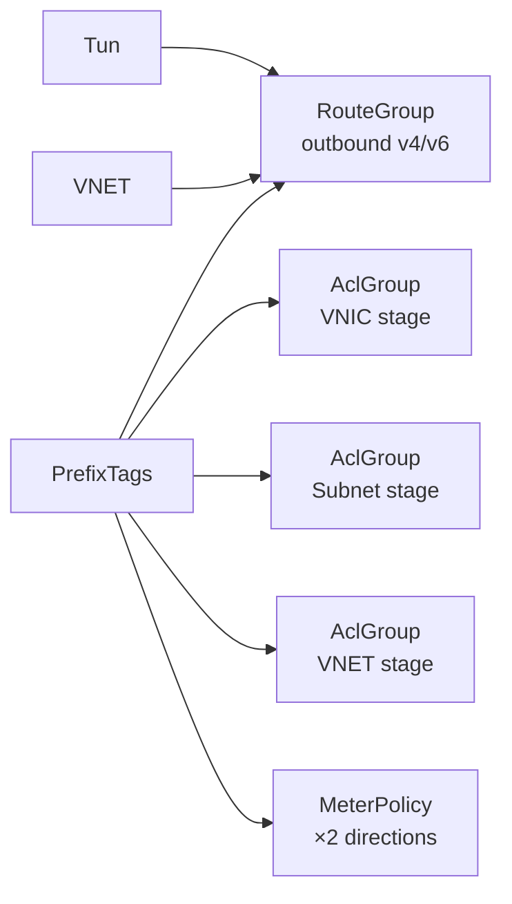

#### The 6-slot ACL binding

Per ENI, ACLs are bound in **6 slots** = 3 stages × 2 directions
(VNIC, Subnet, VNET — all programmable both inbound and outbound).
Per family (v4, v6), that's up to 12 slots.

The 3 stages exist so a tenant can pin tight per-NIC rules at VNIC,
broader per-subnet rules at Subnet, and VNET-wide rules at the VNET
stage — all evaluated in order. This is why `NicSpec.outbound.acl_v4`
is a fixed-length-3 array.

---

### 3.4 Layer 3 — The ENI itself

A single row. MAC-keyed, in upstream DASH:

| Field | Source | Notes |
|-------|--------|-------|
| `mac_address` | `NicSpec.mac_address` | Primary key. ENI ID derived as `ENI_<DPU>_<MAC>`. |
| `vni` | Vnet via `vnet_id` | Inherited; the VXLAN tag for inbound de-mux. |
| `vnet_id` | `NicSpec.vnet_id` | Foreign key into `DASH_VNET_TABLE`. |
| `underlay_ip` | `NicSpec.underlay_ip_v4` | This DPU's PA for this ENI. |
| `qos` | `NicSpec.qos_id` | Bandwidth/queue caps. |
| `ha_scope` | `NicSpec.ha_scope_id` | Optional. |
| `pipeline_role` | derived | `VM_NIC` / `APPLIANCE_NIC` / `SLB_VIP`. |

> **Subtlety #1 — overlay IP.** Upstream `DASH_ENI_TABLE` does **not**
> have an `overlay_ip` field. The ENI's overlay IP exists only as a
> row in `DASH_VNET_MAPPING_TABLE` — the *self-entry*. FM materializes
> this self-entry at compose time (see §3.5).

> **Subtlety #2 — MAC uniqueness.** Two ENIs with the same MAC on the
> same DPU collide; FM rejects the second with
> `VALIDATION_REJECTED{code=MAC_COLLISION}` — see
> [`nic-spec.md`](../protos/published/nic-spec.md) validation rule 5.

---

### 3.5 Layer 4 — Per-ENI bindings (the fan-out)

Once the ENI row exists, **6–12 additional writes** wire it up.

| # | Binding | Upstream table | Per ENI count | Purpose |
|---|---------|----------------|---------------|---------|
| 4.1 | `EniRoute` (out) | `DASH_ENI_ROUTE_TABLE` | 1–2 (v4 + v6) | Binds ENI → outbound RouteGroup |
| 4.2 | `AclOut` per stage | `DASH_ACL_OUT_TABLE` | up to 6 (3 stages × 2 families) | Binds ENI stage → AclGroup |
| 4.3 | `AclIn` per stage | `DASH_ACL_IN_TABLE` | up to 6 | Binds ENI stage → AclGroup |
| 4.4 | `RouteRule` (per-ENI override) | `DASH_ROUTE_RULE_TABLE` | 0–N inline | Inbound override rules (e.g., metadata redirect) |
| 4.5 | Meter binding (in/out) | (SAI attribute on ENI) | 2 | Binds ENI → MeterPolicy |
| 4.6 | **VnetMapping self-entry** | `DASH_VNET_MAPPING_TABLE` | 1+ rows | Injects the ENI's overlay IP→underlay row |

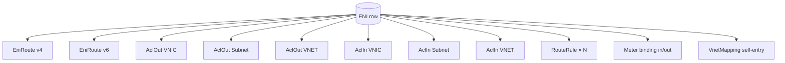

> **Atomicity caveat.** Upstream DASH does not provide a single
> "create-ENI-and-all-bindings" transaction. The HAL must issue the
> writes in safe order *and* be prepared to roll back partial state if
> a later write fails. FM treats this as Wave 5 + Wave 6 of a single
> programming burst — see §7.

---

## 4. The complete dependency DAG

The full picture, including direction of foreign keys.

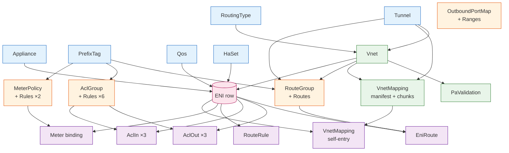

Read every arrow as: *"the source must be programmed and validated
before the target."* The ENI row sits at the convergence of three
chains — device chain (Appliance/QoS/HaSet), VNET chain
(RoutingType→Vnet, plus mapping completeness), and policy-group chain
(PrefixTag→Group). Layer 4 then radiates outward.

---

## 5. Fleet-wide vs. tenant vs. per-ENI

Knowing *who owns* and *who shares* each object is essential for sizing
caches and refcounts.

| Layer | Object | Scope | Sharing |
|-------|--------|-------|---------|
| 0 | Appliance | per-device | 1 per DPU (no sharing) |
| 0 | RoutingType | fleet-wide | every ENI on every DPU |
| 0 | PrefixTag | fleet-wide | many ACL/route rules |
| 0 | Tunnel | per-region | many VNETs and rules |
| 0 | Qos | tier-shaped | many ENIs per tier |
| 0 | HaSet | per HA pair | exactly 2 ENIs |
| 1 | Vnet | per tenant | many ENIs in a tenant |
| 1 | VnetMapping | per VNET | every ENI in the VNET |
| 1 | PaValidation | per VNET | one per VNET |
| 2 | RouteGroup | per tenant or shared | tens to thousands of ENIs |
| 2 | AclGroup | per tenant or shared | tens to thousands of ENIs |
| 2 | MeterPolicy | per tier or per tenant | tens to thousands of ENIs |
| 2 | OutboundPortMap | per SLB instance | one ENI typically |
| 3 | ENI | per VM NIC | not shared |
| 4 | All bindings | per ENI | not shared |

**Implication for control plane caching:** Layers 0–2 sit in long-lived
shared caches (FM's HDO actor); Layer 3–4 are short-lived per-NIC
state (FM's NO actor). Refcount Layers 1–2 against the set of NOs that
need them; evict when the count hits zero.

---

## 6. The gates — where the chain *blocks*

The DAG above is incomplete without marking the points where a control
plane synchronously waits.

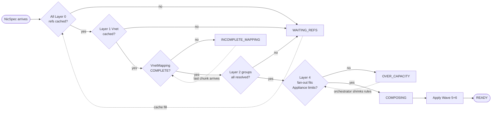

Three gate states are normal/transient: `WAITING_REFS`,
`INCOMPLETE_MAPPING`, `OVER_CAPACITY`. They are *not* errors — the
NicActor keeps re-composing as the cache fills.

---

## 7. Programming order (the FM 7-wave model)

FM (and any well-behaved DASH control plane) programs the dependency
graph as a topologically-sorted burst. The 7-wave order is:

| Wave | Layer | Objects programmed | Why this wave |
|------|-------|--------------------|---------------|
| 0 | 0 | Appliance, RoutingType, PrefixTag, Qos | Globals — must precede everything |
| 1 | 0 | Tunnel, HaSet | Transports & HA — referenced by VNETs and ENIs |
| 2 | 2 | RouteGroup, AclGroup, MeterPolicy, OutboundPortMap (+ rules) | Reusable groups before any consumer binds |
| 3 | 1 | Vnet | The L3 domain frame |
| 4 | 1 | VnetMapping (manifest + chunks) | Mapping rows; gated on COMPLETE |
| 5 | 3 | ENI row | The NIC itself |
| 6 | 4 | EniRoute, AclIn/Out, RouteRule, Meter binding, self-entry | The fan-out wires the ENI to its policies |

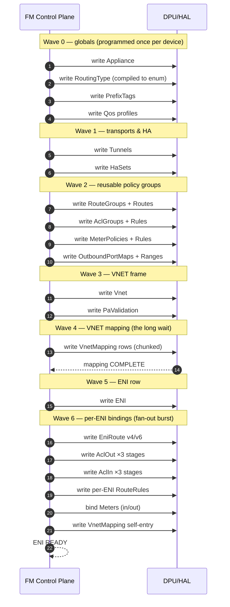

Wave 6 is the only wave that fans **outward** rather than narrowing
downward — it's the one place where a single NicSpec begets ~12 SAI
calls. Failures here are partial-state risks; see §11.

---

## 8. Topological ordering — why it exists

The 7-wave order is not arbitrary; it falls out of the dependency DAG
when you topologically sort it. Each wave is one *anti-chain* — a set
of objects that depend on nothing in the same wave, and only on
objects in earlier waves.

> **Mental shortcut:** "globals first, frames next, fans last." Every
> wave is either a global (Layer 0), a frame (Layers 1–2), or a fan
> (Layers 3–4).

If any wave *reorders into* a later wave, the topological ordering
breaks and a write will reference a non-existent object. That is the
single most common source of integration bugs when porting a control
plane to DASH.

---

## 9. Tear-down — the reverse order

Removing an ENI walks the graph backwards. Each step depends on the
*absence* of references from upstream.

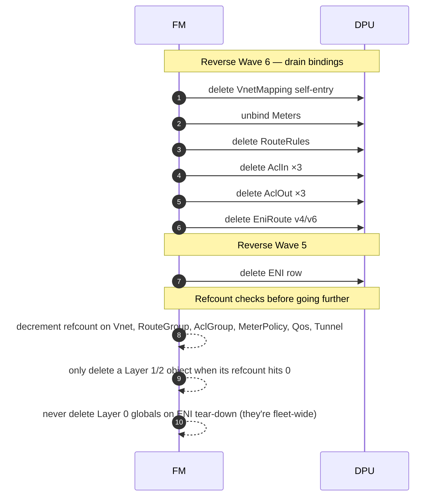

> **Why the reverse order matters.** If you delete the ENI row before
> deleting its bindings, the bindings become orphans pointing at a
> dead ENI. Some SAI implementations cascade-delete; many do not.
> Always tear down Layer 4 before Layer 3.

> **Why refcount matters.** Many ENIs share Layer 1–2 objects.
> Deleting a `Vnet` because the *first* ENI in it tore down would
> delete it for everyone. Refcount on every shared object; delete
> only when the count hits zero.

---

## 10. Sharing matrix — what's reused, what's per-ENI

Knowing which objects are *first-time-creates* vs. *cache hits* is the
key to understanding why the Nth VM in a tenant is so much faster
than the first.

| Layer | Object | First VM in fresh tenant | Nth VM in same tenant | Tenant teardown |
|-------|--------|---------------------------|------------------------|------------------|
| 0 | Appliance | already exists (device join) | already exists | survives |
| 0 | RoutingType | already exists (fleet boot) | already exists | survives |
| 0 | PrefixTag | maybe — if new tag | cache hit | refcount drops |
| 0 | Tunnel | already exists | already exists | survives |
| 0 | Qos | already exists | already exists | survives |
| 0 | HaSet | created if first HA NIC | cache hit | deleted with last NIC |
| 1 | Vnet | **CREATED** | cache hit | deleted with last ENI |
| 1 | PaValidation | **CREATED** | cache hit | deleted with VNET |
| 1 | VnetMapping | **CREATED + bulk-loaded** | cache hit (or chunk add) | deleted with VNET |
| 2 | RouteGroup | **CREATED** | cache hit (or rule edit) | refcount drops |
| 2 | AclGroup ×6 | **CREATED** | cache hit | refcount drops |
| 2 | MeterPolicy ×2 | **CREATED** | cache hit | refcount drops |
| 3 | ENI | **CREATED** | **CREATED** | deleted |
| 4 | All bindings | **CREATED** (fan-out) | **CREATED** (fan-out) | deleted (reverse fan-out) |

The first ENI in a fresh VNET pays the full cost of Layers 1+2;
subsequent ENIs only pay Layer 3+4. **This is why mapping-table
warm-up dominates first-VM bring-up time.**

---

## 11. Failure modes per layer

Where each layer can fail, and the lifecycle state the ENI ends in.

| Layer | Failure | FM lifecycle state | Recovery |
|-------|---------|--------------------|----------|
| 0 | Tunnel/RoutingType/Qos missing | `WAITING_REFS` | orchestrator publishes the missing global |
| 0 | Appliance not registered | `WAITING_BOOTSTRAP` | device finishes onboard |
| 1 | Vnet not yet published | `WAITING_REFS` | orchestrator publishes Vnet |
| 1 | VnetMapping incomplete | `INCOMPLETE_MAPPING` | last chunk arrives + content-hash validates |
| 1 | Mapping chunk hash mismatch | `VALIDATION_REJECTED` | orchestrator republishes |
| 2 | RouteGroup/AclGroup/MeterPolicy missing | `WAITING_REFS` | orchestrator publishes group |
| 2 | Group rule count exceeds Appliance limit | `OVER_CAPACITY` | orchestrator shrinks rules |
| 3 | MAC collision | `VALIDATION_REJECTED{MAC_COLLISION}` | orchestrator changes MAC (DELETE+CREATE) |
| 3 | DPU rejects ENI write | `RECONFIGURING` | retry; if persistent, escalate |
| 4 | Partial fan-out (some bindings written, one fails) | `RECONFIGURING` | HAL rolls back applied bindings, retries |
| 4 | Self-entry conflict in VnetMapping | `VALIDATION_REJECTED` | investigate orchestrator double-write |

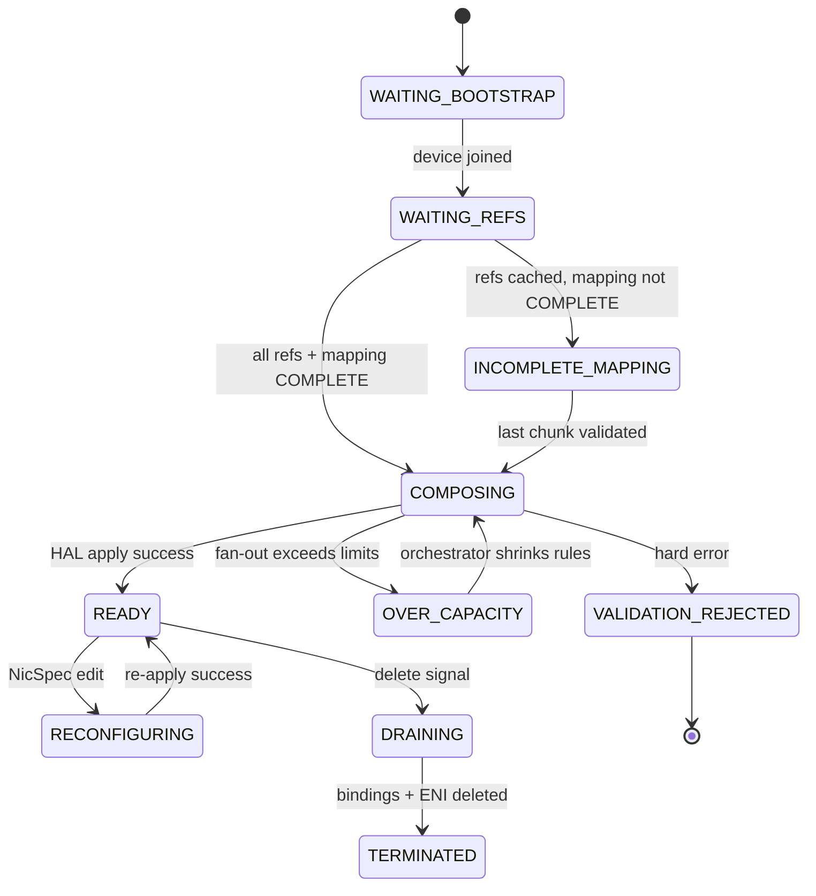

This is the same 10-state lifecycle FM uses end-to-end (see
[`fleet-manager-hld.md`](../FM/fleet-manager-hld.md)).

---

## 12. Worked example — Nth VM in an established VNET

The fast path. Tenant has been running for hours; everything in
Layers 0–2 is cached.

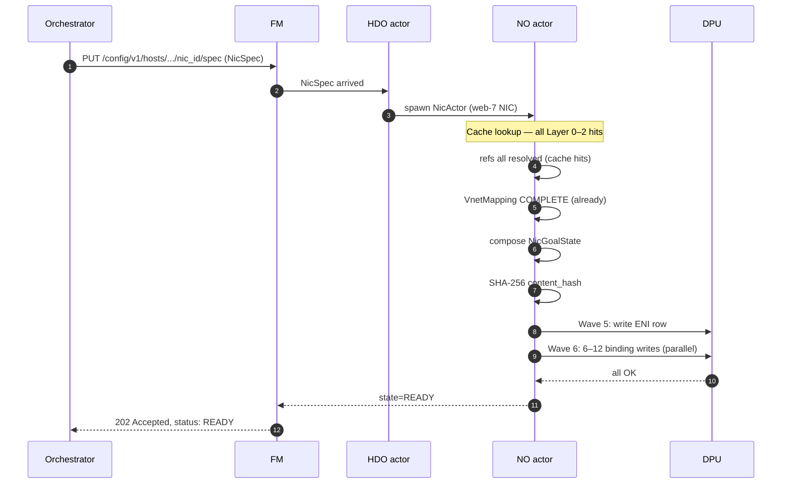

Total time: **tens to hundreds of milliseconds**. No mapping-table
load, no group rebuild — just the per-NIC fan-out.

---

## 13. Worked example — first VM in a fresh tenant/VNET

The cold path. Tenant just signed up; the VNET is brand new; the
mapping table has 500K rows.

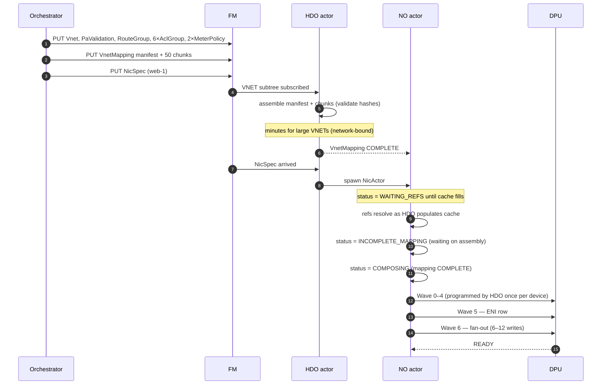

Total time: **dominated by VnetMapping assembly** (Wave 4). The ENI
itself is microseconds; the table that lets it resolve traffic is the
multi-second/minute step. This is why FM caches mapping per-VNET and
why subsequent VMs in the same VNET are 100× faster.

---

## 14. How FleetManager implements this dependency graph

Cross-reference to the FM design docs:

| Layer in this doc | FM concept | FM doc |
|-------------------|------------|--------|
| Layer 0 (globals) | HDO actor cache, fleet-wide subscriptions | [fleet-manager-hld.md](../FM/fleet-manager-hld.md) §3.1 |
| Layer 1 (VNET) | HDO VNET subtree assembly, refcount on first NIC | [fleet-manager-hld.md](../FM/fleet-manager-hld.md), [vm-eni-provisioning-design.md](../FM/vm-eni-provisioning-design.md) §1 |
| Layer 2 (groups) | HDO group cache, refcount per group | [vm-eni-provisioning-design.md](../FM/vm-eni-provisioning-design.md) §1.2 |
| Layer 3 (ENI) | NicActor compose: `NicGoalState` build | [nic-goal-state.md](../protos/published/nic-goal-state.md) |
| Layer 4 (bindings) | Wave-6 HAL fan-out | [nic-goal-state.md](../protos/published/nic-goal-state.md) "Upstream DASH alignment" |
| Gates 6 | NicActor lifecycle: WAITING_REFS / INCOMPLETE_MAPPING / OVER_CAPACITY | [fleet-manager-hld.md](../FM/fleet-manager-hld.md) §6 (state machine) |
| Programming order | Wave 0–6 burst | [fleet-manager-hld.md](../FM/fleet-manager-hld.md) §10 (HAL design) |
| Tear-down (§9) | Reverse-wave drain | [vm-eni-provisioning-design.md](../FM/vm-eni-provisioning-design.md) §3 |

The 4-phase provisioning model in
[`vm-eni-provisioning-design.md`](../FM/vm-eni-provisioning-design.md)
maps cleanly:

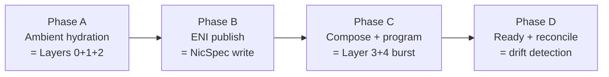

### 14.1 Updated mapping (post-redesign — Registry Pattern + 3-tier storage)

The redesign keeps the layer model unchanged but **moves where the
caches live and how they get populated**. Each dependency layer is
now served by a specific in-pod **registry** backed by FM's own
`fm-data-store` (T1):

| Layer | Registry | Backing tier | Subscriber identity | Acquired at |
|-------|----------|--------------|---------------------|-------------|
| **Layer 0** — fleet-wide foundation (RoutingType, etc.) | `GlobalRegistry` | T1 → in-mem | `pod_id` | Pod startup (always) |
| **Layer 1a** — Vnet body | `VnetRegistry` | T1 → in-mem (warm via T3) | `eni_id` | First NicActor on this pod with this `vnet_id` |
| **Layer 1b** — Vnet mapping (manifest + chunks) | `VnetMappingRegistry` (manager + per-VNET sub-actor) | T1 → in-mem (warm via T3) | `eni_id` | Same — gates programming until COMPLETE |
| **Layer 2** — RouteGroup, AclGroup | `GroupRegistry` | T1 → in-mem (warm via T3) | `eni_id` | NicActor compose for each group ref |
| **Layer 3** — ENI itself (NicSpec) | not a registry — direct T1 read by NicActor | T1 (durable in T1; warm in NicActor) | n/a | Phase B publish |
| **Layer 4** — per-ENI bindings (route/ACL/HA scopes) | inline in NicGoalState; `HaRegistry` for HA only | T1 (NicGoalState hash) + T3 (HAL apply log) | `eni_id` (HaRegistry) | Compose-time; HaRegistry on HA participation |

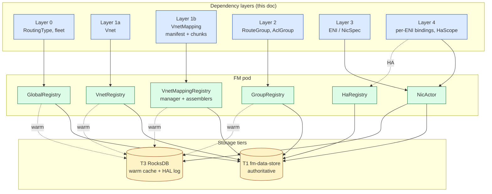

### 14.2 Why this preserves the cardinal rule

The cardinal rule (§1) — "each ENI sits at the top of its
dependency mountain" — is now enforced **at the registry's
`Acquire` boundary**:

- `VnetRegistry.Acquire(vnet_id)` won't return a `Subscription` in
  state `READY` until the Vnet body has been hydrated from T1 *and*
  its referenced `RoutingType` exists in `GlobalRegistry`.
- `VnetMappingRegistry.Acquire(vnet_id)` won't transition `READY`
  until the manifest is loaded and **every chunk's content_hash
  matches** (the `INCOMPLETE_MAPPING` gate).
- `GroupRegistry.Acquire(group_id)` won't return `READY` if the
  group's referenced PrefixTags are missing (`WAITING_REFS` gate).
- `NicActor` parks in `WAITING_REFS` until *every* `Acquire` it
  issued has reached `READY`, then composes. Layer 4 bindings are
  composed in-actor and only emitted to the DPU after Wave 0–2 are
  confirmed in T3's HAL apply log.

So the registry pattern is a *direct mechanical realization* of the
gates described in §6.

### 14.3 Why this is cheaper than per-HDO caches (re-stated for this doc)

A 5,000-DPU shard hosting 30 ENIs/DPU across 100 unique VNETs:

| Cost | Per-HDO model | Registry model |
|------|---------------|----------------|
| VNET watches per pod | 5,000 × 100 = **500,000** | **100** |
| Mapping caches in RAM | 5,000 × 100 = **500,000 copies** | **100 copies** |
| Group watches | similar 500,000 | similar 100 |

Memory and watch-count reduction is **3–4 orders of magnitude** for
the shared dependencies — Layers 0, 1, 2. Layer 3 (per-ENI) and
Layer 4 (per-binding) remain per-NIC because they are inherently
unique to each ENI.

### 14.4 What lives in T1 (the central truth) vs. derived

| In T1 | Derived (not in T1) |
|-------|---------------------|
| RoutingType catalog (Layer 0) | NicGoalState payload (composed; only the **hash** is in T1) |
| Vnet bodies (Layer 1a) | Mapping self-entries (injected from `NicSpec.primary_ip_*` at compose time) |
| VnetMappingManifest + Chunks (Layer 1b) | Wave-ordering decisions (computed by NicActor) |
| RouteGroup, AclGroup (Layer 2) | Per-DPU goal-state diff (computed before HAL apply) |
| NicSpec (Layer 3) | HAL apply log (lives in T3 only — per-pod sequential) |
| Per-ENI binding refs (Layer 4) | DPU-reported counters (telemetry rollup; bounded retention) |
| HaSet, HaScope (Layer 4 HA) | |
| NicGoalState `content_hash` + sketch | |

Storing only the goal-state **hash** (default
`goalstate_durability: hash_only`) keeps T1 size bounded — the full
program is reconstructible at any time from the layered inputs.

For full details on the storage tiers and registries:

- [storage-architecture.md](../FM/storage-architecture.md)
- [registry-pattern-design.md](../FM/registry-pattern-design.md)
- [orchestrator-plugin-interface.md](../FM/orchestrator-plugin-interface.md)
- [recovery-and-failover-design.md](../FM/recovery-and-failover-design.md)

---

## 15. Quick-reference cards

### 15.1 "What must I create before this object?"

| If creating… | These must already exist… |
|---|---|
| `Vnet` | Appliance, RoutingType, Tunnel |
| `PaValidation` | Vnet |
| `VnetMapping` | Vnet, Tunnel(s) |
| `RouteGroup` | PrefixTag(s), Vnet (peer refs), Tunnel |
| `AclGroup` | PrefixTag(s) |
| `MeterPolicy` | PrefixTag(s) |
| `OutboundPortMap` | (no Layer-0 deps) |
| `ENI` | Appliance, Vnet, **VnetMapping COMPLETE**, Qos, HaSet (if HA) |
| `EniRoute` | ENI, RouteGroup |
| `AclIn` / `AclOut` | ENI, AclGroup |
| `RouteRule` (per-ENI) | ENI |
| Meter binding | ENI, MeterPolicy |
| VnetMapping self-entry | ENI, VnetMapping |

### 15.2 "Who points at this object?"

| Object | Pointed at by |
|---|---|
| `RoutingType` | every Vnet |
| `Tunnel` | Vnet (default), VnetMapping rows (override), RouteGroup rules |
| `PrefixTag` | every rule that uses a named prefix |
| `Qos` | every ENI |
| `Vnet` | every ENI in it; every RouteGroup with peer refs |
| `VnetMapping` | every ENI in the VNET (implicit: traffic resolution); FM injects self-entries |
| `RouteGroup` | EniRoute bindings |
| `AclGroup` | AclIn/AclOut bindings |
| `MeterPolicy` | ENI meter bindings |
| `ENI` | every Layer-4 binding |

### 15.3 "Where do edits cascade to?"

| Edit | Triggers re-compose for… |
|---|---|
| `RoutingType` rule changed | every VNET that references; every ENI in those VNETs |
| `Tunnel` changed | every VNET, every RouteGroup rule using it |
| `PrefixTag` changed | every rule expanding it |
| `RouteGroup` rule edit | every ENI binding it (often thousands) |
| `AclGroup` rule edit | every ENI binding it on that stage |
| `MeterPolicy` edit | every ENI binding it |
| `Vnet` edit | every ENI in it |
| `VnetMapping` chunk edit | the VNET's clients re-evaluate; existing ENIs do not re-compose unless self-entry affected |
| `NicSpec` edit | exactly one ENI |

This table is the cost-of-change reference. Layer 0–2 edits are
*broadcast* changes; Layer 3 edits are local.

---

## 16. Common pitfalls

1. **Programming the ENI before VnetMapping is COMPLETE.** The ENI
   row will succeed but inbound packets won't resolve; you'll see
   100% drop on the inbound path until the mapping fills.
2. **Forgetting the self-entry.** Outbound traffic from this VM works
   (it doesn't need its own mapping); inbound traffic from peers
   doesn't resolve to *this* DPU because the VNET map has no row for
   this overlay IP. Symptom: one-way reachability.
3. **Tearing down a Vnet because the first ENI deleted.** Other ENIs
   in other DPUs are still using it. Always refcount.
4. **Treating ACL slots as optional empty-string placeholders.** The
   array is *fixed-length 3*; an empty string disables the stage but
   you cannot omit the slot.
5. **Editing `mac_address` on an existing NicSpec.** This is a
   DELETE+CREATE — the ENI ID changes (`ENI_<DPU>_<MAC>`). Treating it
   as an in-place edit will leave a phantom ENI on the DPU.
6. **Editing `vnet_id` on an existing NicSpec.** This is a *migration*
   — the actor must unsubscribe the old VNET (last-out triggers HDO
   unsub), subscribe the new VNET, and reprogram. Don't treat it as a
   simple field change.
7. **Assuming Layer 0 globals are free to delete.** Removing a
   `RoutingType` referenced by even one VNET will cascade-fail every
   ENI in that VNET. Layer 0 deletes need fleet-wide drain.
8. **Mistaking the mapping table for a per-ENI artifact.** It's
   per-VNET — sized by the VNET's overlay-IP space, not by the number
   of NICs.

---

## 17. See also

- [05 — ENI Deep Dive](./05-ENI-Deep-Dive.md) — every property of the ENI object.
- [04 — VNET & Address Mapping](./04-VNET-and-Address-Mapping.md) — the VnetMapping table in detail.
- [11 — Scenario: VM NIC Provisioning](./11-Scenario-VM-NIC-Provisioning.md) — the same flow as a story.
- [14 — Stitching Everything Together](./14-Stitching-Everything-Together.md) — the runtime composition view.
- [16 — Common Misconceptions](./16-Common-Misconceptions.md) — wrong mental models to unlearn.
- FleetManager design:
  - [fleet-manager-hld.md](../FM/fleet-manager-hld.md) — actors, waves, lifecycle.
  - [vm-eni-provisioning-design.md](../FM/vm-eni-provisioning-design.md) — 4-phase provisioning.
  - [nic-spec.md](../protos/published/nic-spec.md) — input shape.
  - [nic-goal-state.md](../protos/published/nic-goal-state.md) — composed shape (with upstream alignment).
- Upstream DASH:
  - <https://github.com/sonic-net/DASH/tree/main>
  - <https://github.com/sonic-net/sonic-dash-api>
