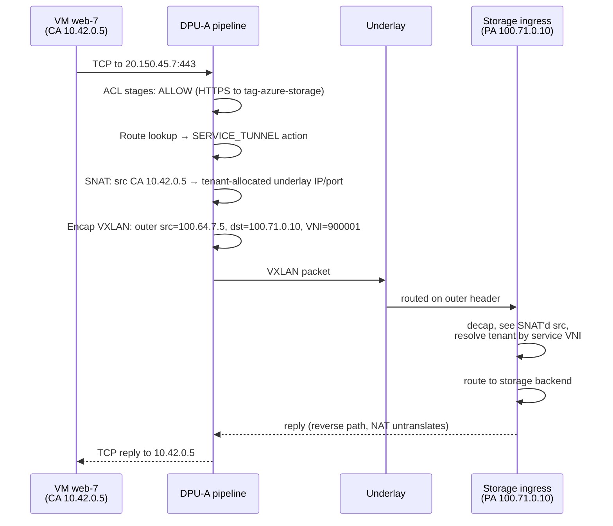
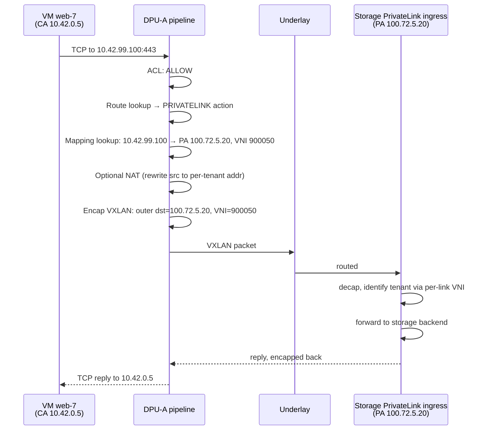

# 12 — Scenario: PrivateLink & Service Tunnel

> **TL;DR:** Tenant VMs often need to talk to managed cloud services
> (storage, SQL, key vault) over private network paths instead of the
> public internet. DASH supports two patterns: **PrivateLink** —
> service appears as a private IP inside the tenant's VNET — and
> **Service Tunnel** — service keeps its public IP, but traffic is
> intercepted, NAT'd, and tunneled directly to the service's ingress.
> Both use route actions plus encap transforms; the difference is
> what address the VM sees and where NAT happens.

---

## Why these patterns exist

A VM in tenant `acme-corp` wants to use Azure Storage. Three options:

1. **Public internet** — VM sends to `20.150.x.x`, hairpins out through
   an internet gateway, traverses the open internet, eventually
   reaches the storage frontend. Slow, billable as egress, security
   nightmare.
2. **Service Tunnel** — VM sends to the **same** public IP
   (`20.150.x.x`); DPU intercepts, NATs, encaps direct-to-service.
   No internet hop; no public-IP exposure; minimal tenant change.
3. **PrivateLink** — Tenant chooses a **private IP** in their VNET
   (`10.42.99.100`) that maps to the storage service; DPU intercepts
   that IP and encaps to the service. The service appears native to
   the VNET.

DASH supports all three. Today we cover options 2 and 3.

---

## Option 2 — Service Tunnel walkthrough

### Setup

- VM `web-7` (CA `10.42.0.5`) on DPU-A (PA `100.64.7.5`) in VNET
  `acme-prod`.
- Azure Storage public endpoint at `20.150.45.7:443`.
- Storage's "service tunnel ingress" at PA `100.71.0.10` (a known
  reserved underlay address in the region).
- Tenant gets a **service VNI** assigned (e.g., `vni=900001`) — a
  reserved range distinct from tenant VNIs.

### Configuration

A route in tenant `acme-prod`'s outbound RouteGroup:

```json
{
  "priority": 250,
  "dst_prefix": "20.150.0.0/16",
  "action": {
    "kind": "SERVICE_TUNNEL",
    "routing_type": "service-tunnel-storage-v1",
    "tunnel_id": "tun-service-storage-westus2",
    "extra": {
      "service_vni": 900001,
      "snat_pool_id": "snat-pool-tenant-acme"
    }
  }
}
```

The Tunnel object:

```json
{
  "tunnel_id": "tun-service-storage-westus2",
  "encap_type": "VXLAN",
  "src_underlay_ip_v4": "100.64.7.5",
  "dst_underlay_ips_v4": ["100.71.0.10"],
  "udp_dst_port": 4789
}
```

(SNAT is handled via an `OutboundPortMap`-style mechanism — pool of
underlay ports keyed by tenant. The exact shape varies by cloud; the
pattern is universal.)

### Packet trace



What's interesting:
- The VM is **unaware** anything special is happening — it talks to the
  public IP normally.
- The DPU does the steering, NAT, and encap in silicon.
- The storage service's ingress knows which tenant by the service VNI
  in the VXLAN header — not by IP.
- Return traffic is symmetric thanks to NAT state.

### What DASH primitives are used

| Primitive | Role |
|-----------|------|
| `RouteGroup` entry with action `SERVICE_TUNNEL` | Steers the VM's traffic |
| `RoutingType` `service-tunnel-storage-v1` | Defines the transform behavior |
| `Tunnel` for the storage ingress | Encap destination |
| `OutboundPortMap` (or equivalent SNAT mechanism) | Provides per-tenant SNAT ports |
| `PrefixTag tag-azure-storage` | Keeps the route list maintainable as Storage IPs grow |

---

## Option 3 — PrivateLink walkthrough

### Setup

- Same VM `web-7`.
- Tenant has allocated `10.42.99.100/32` in their VNET as a
  PrivateLink endpoint for Azure Storage.
- Behind the scenes, the cloud has provisioned a per-tenant ingress
  on storage's side at PA `100.72.5.20`.
- A reserved per-link VNI (e.g., `vni=900050`) is assigned.

### Configuration

VNET mapping entry for `10.42.99.100`:

```json
{
  "overlay_ip_v4": "10.42.99.100",
  "underlay_ip_v4": "100.72.5.20",
  "tunnel_override_id": "tun-privatelink-acme-storage",
  "routing_action_hint": "PRIVATELINK"
}
```

Route in the RouteGroup (covers the host or even just `/32`):

```json
{
  "priority": 150,
  "dst_prefix": "10.42.99.100/32",
  "action": {
    "kind": "PRIVATELINK",
    "routing_type": "privatelink-v1"
  }
}
```

A PrivateLink-specific Tunnel:

```json
{
  "tunnel_id": "tun-privatelink-acme-storage",
  "encap_type": "VXLAN",
  "src_underlay_ip_v4": "100.64.7.5",
  "dst_underlay_ips_v4": ["100.72.5.20"],
  "udp_dst_port": 4789
}
```

### Packet trace



Differences from service tunnel:
- VM uses a **private IP** the tenant chose, not a public IP.
- Mapping lookup drives the destination (per-`/32` mapping entry),
  not a generic NAT pool.
- Per-link VNI (one VNI per PrivateLink endpoint, not per-tenant
  service-wide).

---

## When to use which?

| Question | Service Tunnel | PrivateLink |
|----------|---------------|-------------|
| Tenant uses the public service IP? | Yes | No |
| Tenant must allocate a private IP? | No | Yes |
| One VNI per tenant or per endpoint? | Per tenant (per service) | Per endpoint |
| Setup cost | Low (tenant just adds a route hint) | Higher (must allocate IPs, create endpoint) |
| Granularity | Per service | Per `/32` endpoint |
| Common usage | Default for "talk to Azure Storage" | When tenant wants the service to look native |

Both can coexist for the same tenant.

---

## Common gotchas

1. **NAT state lifecycle.** Service tunnels rely on per-tenant SNAT
   pools. If a flow is idle longer than the pool's timeout, the
   reverse direction breaks. Tune timeouts to your traffic patterns.
2. **Tag list growth.** PrefixTags for big services (Azure Storage
   has hundreds of prefixes) grow over time. The composer expands
   tags inline; per-ENI rule counts may balloon. Watch
   `OVER_CAPACITY` rejections.
3. **PrivateLink mapping entry missing.** Without a `VnetMapping`
   entry for the chosen private IP, the route fires but mapping
   misses → drop. The orchestrator must create both the route AND
   the mapping entry atomically.
4. **Wrong service VNI.** Service ingresses authenticate the tenant
   by VNI. A typo in `service_vni` results in the service rejecting
   the connection.
5. **Same prefix for tunneling and a tenant subnet.** If the tenant
   accidentally has `10.42.99.100` in its address space, the
   PrivateLink mapping collides with normal VNET routing. Always
   carve PrivateLink IPs from a dedicated subrange.

---

## Where to go next

- HA across two DPUs → [13 — HA & Failover](./13-Scenario-HA-and-Failover.md)
- Stitching everything together → [14 — Stitching Everything Together](./14-Stitching-Everything-Together.md)

---

## See also

- [`tunnel.md`](../protos/published/tunnel.md)
- [`route-group.md`](../protos/published/route-group.md) — action catalog
- [`outbound-port-map.md`](../protos/published/outbound-port-map.md) — SNAT pools
- [`routing-type.md`](../protos/published/routing-type.md)
- [DASH service tunnel HLD](https://github.com/sonic-net/DASH/blob/main/documentation/general)
- [00 — README](./00-README.md)
