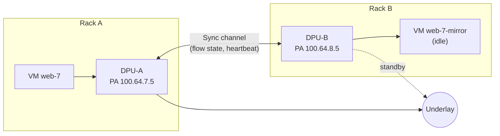
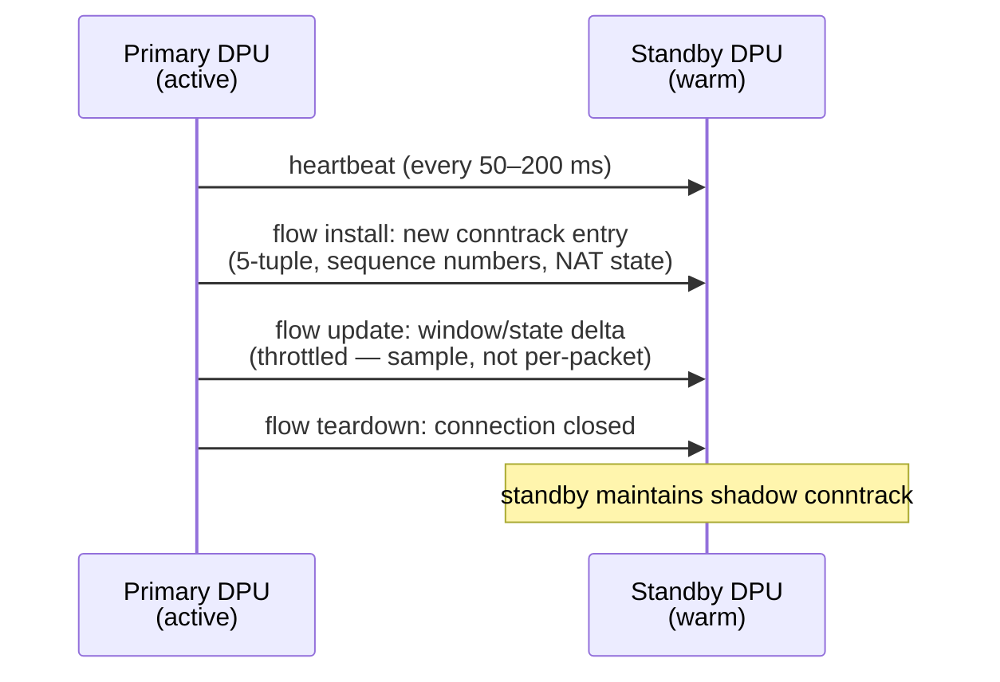
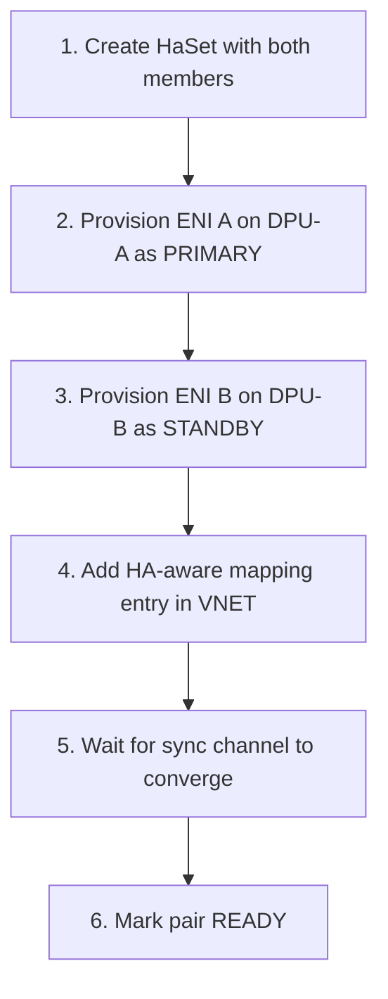

# 13 — Scenario: HA & Failover

> **TL;DR:** DASH HA pairs **two ENIs on two different DPUs** into one
> logical ENI. One is `PRIMARY` and actively forwards; the other is
> `STANDBY` and stays warm. A direct DPU-to-DPU sync channel keeps
> flow state mirrored. On primary failure, the standby promotes and
> resumes flows mid-conversation — ideally without TCP resets. The
> `HaSet` object names the pair; ENIs reference it.

---

## Why HA at the DPU level?

A single DPU is one piece of silicon plugged into one server. If the
DPU dies (firmware crash, line-card failure, host kernel panic), every
ENI on it goes dark. For tenants running stateful workloads (databases,
session-stateful web apps, NFV functions), even sub-second outages
shred TCP flows.

DASH HA solves this by giving each "logically important" ENI a
**partner on a different DPU**, usually in a different rack and
different power domain. Hardware failure on one side promotes the
other.



---

## The `HaSet` object

A pair (occasionally more in some vendor-specific extensions) of ENIs
that are HA partners:

```json
{
  "ha_set_id": "haset-westus2-pair-7",
  "members": [
    {
      "device_id": "dpu-westus2-rack17-007",
      "eni_id":    "ENI_dpu-007_aabbccddeeff",
      "role":      "PRIMARY"
    },
    {
      "device_id": "dpu-westus2-rack42-013",
      "eni_id":    "ENI_dpu-013_aabbccddeefg",
      "role":      "STANDBY"
    }
  ],
  "cp_data_channel": {
    "primary_pa":  "100.64.7.5",
    "standby_pa":  "100.64.8.5",
    "port":        7800
  },
  "dp_channel": {
    "primary_pa":  "100.64.7.5",
    "standby_pa":  "100.64.8.5",
    "port":        7801
  },
  "preempt": false,
  "failover_grace_seconds": 5
}
```

| Field | Purpose |
|-------|---------|
| `members[]` | The two (or more) ENIs in the pair; each lists its current role |
| `cp_data_channel` | Control-plane sync channel (per-flow state install) |
| `dp_channel` | Data-plane channel (heartbeat + fast-path flow updates) |
| `preempt` | If true, recovered primary takes the role back; if false, current primary keeps it |
| `failover_grace_seconds` | How long the survivor waits before promoting |

Both ENIs reference the same `ha_set_id` via their `ha_scope` field,
and each declares its own role.

---

## Two ENIs, one identity — the "shared" properties

For the outside world (other VMs talking to `web-7`), both DPUs
respond on the **same overlay CA** — and they each have their own PA
(one per DPU). The VNET mapping table holds **both PAs** for the same
CA:

```json
{
  "overlay_ip_v4": "10.42.0.5",
  "overlay_mac":   "aa:bb:cc:dd:ee:ff",
  "underlay_ip_v4": "100.64.7.5",
  "ha_alt_underlay_ip_v4": "100.64.8.5",
  "ha_set_id": "haset-westus2-pair-7"
}
```

Senders use the primary PA. If they detect failure (e.g., via a
controller-issued mapping update), they switch to the alt PA. Modern
implementations let the **standby DPU itself** respond on the
primary's PA after promotion (active GARP-style on the underlay).

---

## The sync channel — what flows across

The DP channel between the two DPUs is the magic that lets a
mid-conversation failover not break TCP. Two kinds of traffic flow:



State that gets mirrored:
- Active 5-tuples (so the standby can hash them to the same queue).
- NAT translations (so reply traffic still finds the right CA).
- TCP state hints (so the standby can answer with the right sequence
  numbers after promotion).

State that does **not** get mirrored:
- Per-packet meter buckets (those reset on failover; OK because token
  buckets are eventually-correct).
- Per-packet QoS queue depth (transient).
- Counters (reset; the control plane sums across the pair).

---

## Failover sequence

Primary dies. What happens in order:

```mermaid
sequenceDiagram
    autonumber
    participant P as Primary DPU (failing)
    participant S as Standby DPU
    participant CP as Control Plane
    participant Sender as Some sender VM

    Note over P: Primary crashes (firmware fault)
    S->>S: heartbeat timeout (e.g., 3 missed = 600 ms)
    S->>S: wait failover_grace_seconds (e.g., 5 s)
    S->>S: confirm CP also reports primary down<br/>(prevents split-brain)
    S->>S: promote: role := PRIMARY locally
    S->>CP: report new role (gNMI subscription update)
    CP->>CP: update HaSet members[]
    CP->>Sender: VNET mapping update:<br/>10.42.0.5 → PA 100.64.8.5 (was 100.64.7.5)
    Note over Sender: senders pick up mapping change<br/>and start using new PA
    Sender->>S: traffic for 10.42.0.5 now arrives at S
    S->>S: process using shadow conntrack;<br/>existing TCP flows continue
```

Failover time decomposes:
- **Detection:** heartbeat timeout (configurable, typically 200–600 ms).
- **Grace:** `failover_grace_seconds` (typically 1–5 s) to dampen
  flapping.
- **Promotion:** instant (just a role flip).
- **Steering:** depends on how fast the control plane re-publishes
  the mapping — typically <1 s.

End-to-end goal: <2 s, ideally <500 ms.

---

## Split-brain prevention

The worst HA failure isn't "primary dies and nobody notices" — it's
"both think they're primary." Both DPUs sending traffic with the same
PA confuses the underlay; both writing conntrack creates corrupted
state.

DASH defends with:

1. **Heartbeat alone is not sufficient** — the survivor must also see
   confirmation from the control plane (`CP also reports primary
   down`).
2. **Control-plane fencing** — when promoting, the new primary
   acquires a lease/fence token from the control plane. The old
   primary's tokens become invalid. SAI calls with stale tokens are
   rejected.
3. **`preempt: false` is the default** — a recovered primary does
   **not** auto-take-back. The operator decides when to fail back.

---

## Provisioning an HA pair

The orchestrator's responsibilities, in order:



Both ENIs reference the same `ha_set_id`. The control plane is
responsible for keeping them mutually aware (each side knows the
other's PA and how to reach the sync channel).

---

## What HA does *not* protect against

| Threat | HA helps? | Why / what does help |
|--------|-----------|---------------------|
| Single DPU hardware failure | **Yes** — this is its whole purpose | — |
| Rack power outage | **Yes**, if pair members are in different racks | Pair placement is critical |
| VNET configuration bug pushed to both ENIs | **No** — both members get the same buggy config | Canary / staged rollouts |
| Underlay routing failure isolating both PAs | **No** if both PAs are downstream of the same fault | Diverse PA assignment |
| Tenant-level error (wrong ACL, OOM in VM) | **No** | Not an HA concern |
| Region-wide outage | **No** — cross-region requires cross-region HA, beyond DASH | Application-layer multi-region |

HA solves **DPU-level** redundancy. Higher-level outages need
higher-level mechanisms.

---

## Capacity impact

An HA pair costs:
- 2× ENI slots (one per DPU).
- 2× of every group binding's per-ENI runtime state.
- Sync-channel bandwidth (typically <1% of data-plane traffic; depends
  on flow churn).
- Mapping table entries gain an alternate PA field (negligible size).

Don't HA every VM. Apply selectively to stateful, latency-sensitive
workloads. Stateless web tiers can be made HA via the load balancer
above them and don't need DPU-level pairing.

---

## Common gotchas

1. **Same rack pair.** Placing both members in the same rack defeats
   most HA value. The orchestrator must enforce diversity.
2. **Sync channel saturation.** During flow storms (DDoS, scan
   bursts), the sync channel can fall behind. Drops in the sync
   channel mean failover loses flow state — surviving flows reset.
   Rate-limit flow-install messages.
3. **`preempt: true` ping-pong.** A flaky primary that recovers,
   takes back the role, fails again, etc. Always start with
   `preempt: false`.
4. **Failover during an in-flight config update.** If the primary
   crashes mid-apply, the standby may have an older (or partial)
   config. The control plane must re-push the latest goal-state to
   the new primary after promotion.
5. **MAC/ARP cache lag.** External devices may have stale MAC
   bindings; if your fabric doesn't use VXLAN BUM-flooding for ARP,
   plan a controller-driven ARP refresh post-failover.

---

## Where to go next

- The big picture across all chapters → [14 — Stitching Everything Together](./14-Stitching-Everything-Together.md)
- Glossary of terms → [15 — Glossary](./15-Glossary.md)

---

## See also

- [`ha-set.md`](../protos/published/ha-set.md)
- [`vnet-mapping.md`](../protos/published/vnet-mapping.md) — HA-aware mapping entries
- [DASH HA HLD](https://github.com/sonic-net/DASH/tree/main/documentation/high-avail)
- [00 — README](./00-README.md)
