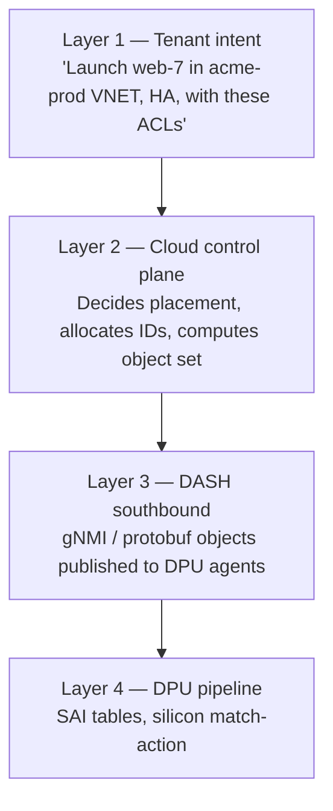
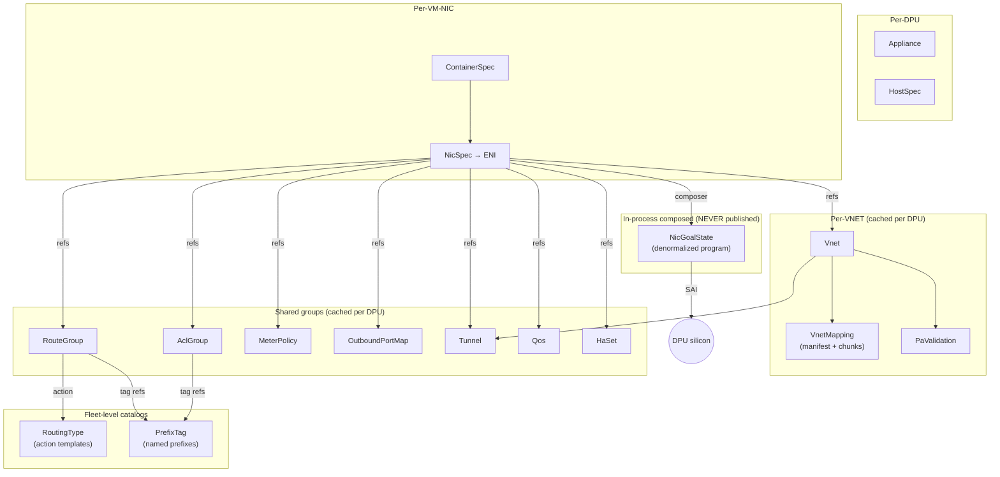
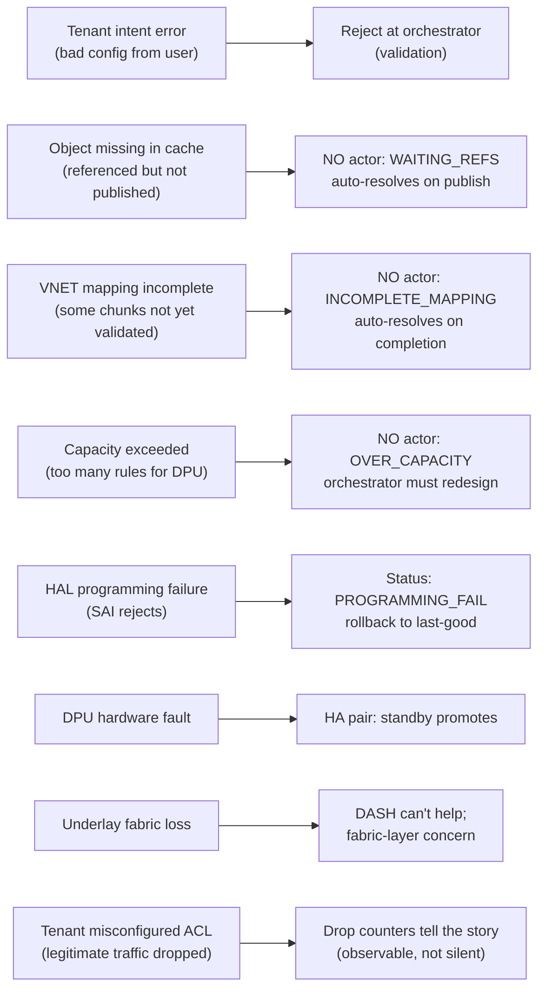

# 14 — Stitching Everything Together

> **TL;DR:** This chapter zooms out from individual objects and stages
> to show the full system: how a tenant intent at the top (orchestrator)
> becomes a programmed pipeline at the bottom (DPU silicon), what
> consistency guarantees hold across each layer, and where the failure
> modes live. By the end, you should be able to draw the entire DASH
> stack on a whiteboard from memory.

---

## The four layers of the stack



Each layer translates the previous into a more concrete form:

| Layer | Language | Time scale | Owner |
|-------|---------|-----------|-------|
| Tenant intent | Cloud API (Azure RP, AWS API) | Seconds–minutes | Tenant |
| Control plane | Internal models, K8s, etcd | Milliseconds–seconds | Cloud provider |
| DASH southbound | gNMI + protobuf | Milliseconds | DASH spec |
| DPU pipeline | SAI + silicon tables | Nanoseconds | DPU vendor |

DASH is **layer 3**. Everything above and below is implementation
choice; DASH defines the contract between them.

---

## The object-flow view

How the ~15 object types relate across the lifecycle:



The ENI sits at the center of every reference. Composition flattens it
all into one program per ENI.

---

## The end-to-end timeline — birth of a packet

From "tenant clicks deploy" to "VM's first packet on the wire":

```mermaid
sequenceDiagram
    autonumber
    participant Tenant
    participant Cloud as Cloud Portal (RP)
    participant Orch as Orchestrator
    participant CP as DASH Control Plane
    participant DPU as DPU Agent
    participant Pipe as DPU Pipeline
    participant VM

    Tenant->>Cloud: Create VM web-7 in VNET acme-prod
    Cloud->>Orch: API: provision VM
    Orch->>Orch: Pick host with capacity → dpu-007
    Orch->>CP: Add ENI to dpu-007, VNET acme-prod, HA pair X, group bindings
    Note over CP: Resolve refs; check refcounts on dpu-007's cached state

    CP->>DPU: (publish any missing groups / VNET / mapping)
    CP->>DPU: publish ContainerSpec for VM
    CP->>DPU: publish NicSpec for web-7/eth0

    DPU->>DPU: NO actor composes NicGoalState
    DPU->>Pipe: SAI: create ENI, install ACL/route/meter/mapping entries
    Pipe-->>DPU: ACK
    DPU-->>CP: ENI READY at revision X
    CP-->>Orch: provisioning done

    Orch->>VM: boot VM web-7 on hypervisor
    VM->>Pipe: first packet (TCP SYN)
    Pipe->>Pipe: 13-stage outbound processing
    Pipe-->>Wire: VXLAN-encapped frame
```

Total time: typically 1–10 seconds for the DASH portion (faster if all
groups are already cached, slower if the VNET is brand-new and the
mapping table must be sharded and shipped).

---

## Consistency guarantees — what holds, what doesn't

DASH's correctness model is **eventually consistent, with monotonic
revisions**:

| Guarantee | Holds | Doesn't hold |
|-----------|:-----:|:------------:|
| Each individual object has monotonic revisions | ✓ | |
| Within one ENI, the composer sees a consistent snapshot of all refs | ✓ | |
| Cross-ENI updates are atomic | | ✗ (e.g., a route added to a group propagates to bound ENIs at their own pace) |
| Cross-DPU updates are atomic | | ✗ (each DPU caches/composes independently) |
| In-flight packets see old-or-new pipeline state, never partial | ✓ | |
| Tenant intent at the top is reflected on every DPU eventually | ✓ | |
| Refs to missing objects produce errors | | ✗ — they produce a transient WAITING state |

Practical implications:
- An ACL rule added at 12:00:00.000 may be active on DPU-A at
  12:00:00.150 and on DPU-B at 12:00:00.300. Don't design assuming
  atomicity across DPUs.
- A new VM landing on a DPU where the VNET mapping is partially built
  waits until the manifest is complete. No half-mapped behavior.
- Tenant changes are eventually applied; the orchestrator must surface
  the per-DPU status so tenants can verify.

---

## Where the failure modes hide

A practical taxonomy of "what goes wrong":



The DASH model is designed so that **most failures are transient and
auto-recoverable**. The non-recoverable ones (OVER_CAPACITY, hardware
fault) produce loud, observable errors.

---

## The control plane's job, summarized

If you're building a DASH control plane, your responsibilities:

1. **Translate tenant intent** to DASH objects. (Tenant says "VM in
   subnet X with NSG Y"; you produce NicSpec + binding ids.)
2. **Allocate IDs** for everything — ENI ids, group ids, mapping
   chunks, HA pairs. Stable, globally unique.
3. **Compute object reuse** — should this tenant's ACL be a new group
   or share an existing one? Refcount everything.
4. **Publish objects in dependency order** — ambient (VNET, groups,
   mappings) before per-ENI specs.
5. **Track per-DPU subscription/cache state** — know which DPUs need
   which objects.
6. **Handle revisions and idempotency** — same intent → same outputs
   → no spurious re-publishes.
7. **Surface status** — per-ENI READY / WAITING / OVER_CAPACITY back
   to the tenant-facing API.
8. **Reconcile drift** — compare desired vs reported, repair anything
   the DPU somehow lost.
9. **Coordinate HA failovers** — fence stale primaries, re-route
   mapping entries, re-push goal-state.
10. **Provide observability** — counters, drop reasons, per-ENI
    health, fleet capacity.

That's roughly the spec for the FleetManager design in this repo's
sibling `Specs/` directory.

---

## What the DPU agent does, summarized

If you're implementing the agent on a DPU:

1. **Subscribe** to your slice of the gNMI topic tree.
2. **Cache** every object received, refcounted by who references it.
3. **Spawn HDO/CO/NO actors** per host/container/NIC arriving.
4. **Compose NicGoalState** on every reference change for any local ENI.
5. **Diff** against last-applied; issue minimal SAI deltas.
6. **Persist** state for warm restart.
7. **Report** ACKs, errors, counters, drift back up.
8. **Heartbeat** the sync channel if part of an HA pair.

The agent is small but its responsibilities are dense — careful state
management is what keeps the fleet sane.

---

## What the DPU silicon does, summarized

If you're a DPU vendor implementing DASH:

1. **Implement SAI DASH headers** — every object type a SAI table.
2. **Run the 13-stage outbound pipeline** at line rate.
3. **Run the 11-stage inbound pipeline** at line rate.
4. **Expose per-stage drop counters** for every reason.
5. **Support warm restart** — state survives agent restart.
6. **Document your capability limits** — max ENIs, max rules, max
   mapping entries.
7. **Pass DASH conformance tests.**

The silicon is the fast path; the agent is the configuration path;
the control plane is the brains.

---

## Putting all 15 chapters in one sentence

> A **tenant intent** to launch a VM becomes a **NicSpec** referencing
> shared **Vnet**, **VnetMapping**, **RouteGroup**, **AclGroup**,
> **MeterPolicy**, **Tunnel**, **Qos** (and optionally **HaSet**,
> **OutboundPortMap**) objects; the **DPU agent** composes them into
> a **NicGoalState**; SAI calls program the silicon; and every
> tenant packet flows through a 13-stage pipeline of ACLs → routing
> → mapping → encap → metering → QoS — at line rate, every time.

If you understand that sentence end-to-end, you understand DASH.

---

## Where to go next

- One-page glossary for terminology refreshers → [15 — Glossary](./15-Glossary.md)
- The schemas for every object → [`Specs/protos/published/`](../protos/published/)
- DASH upstream → <https://github.com/sonic-net/DASH/tree/main>

---

## See also

- All previous chapters [00](./00-README.md)–[13](./13-Scenario-HA-and-Failover.md)
- This repo's sibling [DashFabric architecture spec](../ArchitectureSpecification.md)
