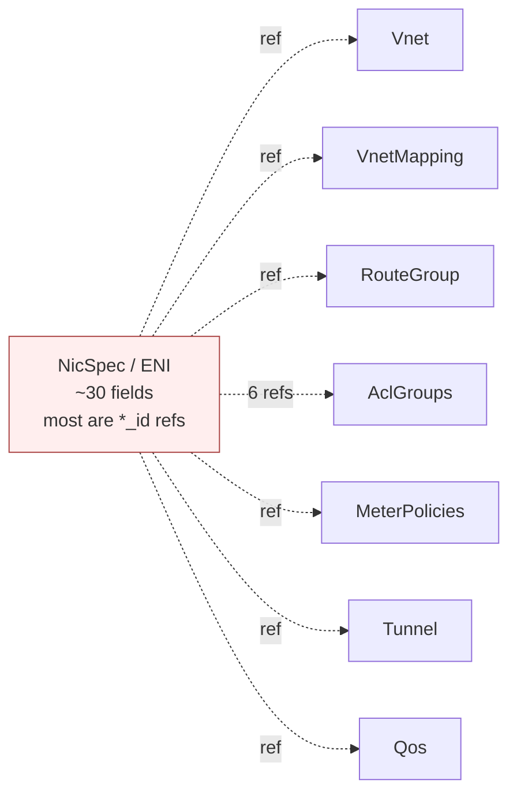

# 16 — Common Misconceptions & Myths

> **TL;DR:** DASH borrows familiar words from networking (ENI, VNET,
> routing table, ACL) but reuses them with subtly different meanings.
> This chapter calls out the traps people fall into when they read
> DASH for the first time — starting with the biggest one: **the ENI
> is not a standalone entity**. Read this before you start designing
> against DASH; it will save you a class of bugs that all look like
> "why isn't my object doing anything?"

---

## How to read this chapter

Each entry follows the same shape:

- **Myth** — the wrong mental model people arrive with.
- **Reality** — what DASH actually does.
- **Why it matters** — the concrete bug or design mistake the myth produces.
- **See** — where in the series this is covered properly.

If you only read one entry, read #1.

---

## 1. "An ENI is a standalone entity"

**Myth.** An ENI is a self-contained object — create it, it works, it
has its own routes/ACLs/meters baked in.

**Reality.** The `NicSpec` (ENI) is almost entirely **references**.
Without the objects it points to — `Vnet`, `VnetMapping`, `RouteGroup`,
`AclGroup`s, `MeterPolicy`, `Tunnel`, `Qos` — the ENI is an empty
shell. The DPU agent's NO actor will sit in `WAITING_REFS` and program
**nothing** into the silicon until every referenced object is present
in the device's local cache. The ENI is a **binding declaration**, not
a configuration.

**Why it matters.** People publish a `NicSpec` first, then wonder why
the VM has no connectivity. They check the ENI in gNMI, see it's
"there," and assume it's working. It isn't — the agent never composed
a `NicGoalState` because half the refs were missing. Publish
**ambient state first** (chapter 11, Phase A), then the ENI.

**See** [05 — ENI Deep Dive](./05-ENI-Deep-Dive.md), [11 — VM NIC Provisioning](./11-Scenario-VM-NIC-Provisioning.md).

---

## 2. "A VNET is a global object — push it once and every DPU has it"

**Myth.** Create a `Vnet` in the control plane and it exists fleet-wide.

**Reality.** `Vnet` is a **device-scoped materialization**. The
control plane publishes it to **each DPU that hosts an ENI in that
VNET** — and nowhere else. A VNET with VMs on 200 DPUs is cached on
exactly those 200 DPUs. A DPU with no member ENIs has no copy.

**Why it matters.** You can't query "what VNETs exist" from any single
DPU and get a fleet-wide answer. You also can't predict which DPUs
need an update when the VNET changes without tracking placement.
Refcount per device.

**See** [04 — VNET and Address Mapping](./04-VNET-and-Address-Mapping.md).

---

## 3. "VnetMapping is one big table object"

**Myth.** The mapping for a VNET is a single object you write atomically.

**Reality.** It's a **manifest + chunks** pair. The `VnetMappingManifest`
is a small header listing chunk ids and their content hashes; each
`VnetMappingChunk` is a sub-1 MiB shard of CA→PA entries. A VNET with
500 K entries may be 50+ chunks. Updates touch the affected chunk(s)
and the manifest — never the whole table.

**Why it matters.** Treating it as monolithic blows your wire budget,
your memory budget on the DPU, and your update latency. The
header/body split is also what makes idempotency (content hash per
chunk) tractable.

**See** [04 — VNET and Address Mapping](./04-VNET-and-Address-Mapping.md).

---

## 4. "There's one ACL list per ENI"

**Myth.** Each ENI has an ACL list; pushing rules updates "the" ACL.

**Reality.** Each ENI binds **six** `AclGroup` slots: three **stages**
(VNIC, SUBNET, VNET) × two **directions** (inbound, outbound). Each
stage produces an outcome that interacts with the next via
`*_AND_CONTINUE` semantics. The ENI binds slots; the slot binds a
group; the group holds the rules.

**Why it matters.** People put all their rules in one group and bind
it to the VNIC stage, then are surprised when subnet/VNET-level
defaults don't apply. The three stages exist precisely so the tenant
can layer per-NIC + per-subnet + per-VNET policy independently.

**See** [07 — ACL Pipeline](./07-ACL-Pipeline.md).

---

## 5. "RouteGroup actions are hardcoded enums"

**Myth.** Each route action is a fixed enum value the DPU silicon
recognizes natively.

**Reality.** Actions go through the `RoutingType` indirection — a
**fleet-scope catalog** of named action templates (`vnet_direct-v1`,
`privatelink-v1`, `service-tunnel-storage-v1`, etc.). Routes
reference a routing type by id; the type defines the actual transform
(encap, NAT, mapping lookup, etc.). New behaviors are added by
publishing new routing-type entries, not by changing route schemas.

**Why it matters.** If you treat actions as opaque enums you'll
re-invent the catalog poorly. Use `RoutingType` so new managed
services and tunneling patterns slot in without code changes.

**See** [06 — Routing Pipeline](./06-Routing-Pipeline.md).

---

## 6. "A Tunnel is just an outer src/dst IP pair"

**Myth.** Why have a `Tunnel` object? It's just two IPs and a port.

**Reality.** `Tunnel` is an **indirection** so that thousands of ENIs
can share one tunneling profile. When the destination PA changes (HA
failover, ingress relocation, ECMP set change), you update **one**
`Tunnel` object and every ENI that references it picks up the new
behavior. Without the indirection, you'd be updating thousands of
ENIs for one fabric change.

**Why it matters.** Inlining tunnel details into routes turns a
single fabric event into a per-ENI republish storm.

**See** [09 — Tunnels and Encap](./09-Tunnels-and-Encap.md).

---

## 7. "Metering and QoS are the same thing"

**Myth.** Both deal with bandwidth, so it's one feature with two names.

**Reality.**
- **Meter** = trTCM **policer** + **counter bucket**. Decides green /
  yellow / red per flow, increments a class-labeled byte/packet
  counter (used for **billing** and observability).
- **QoS** = per-ENI **scheduler**: total bandwidth cap, burst, queue
  count, DSCP remap.

A flow can be policed (meter) and queued (QoS) in the same packet
pass. They answer different questions: "did this flow exceed its
budget?" vs "how is this ENI's pipe shared?"

**Why it matters.** People put rate limits in QoS that belong in
meters (they want per-class billing) or build billing on QoS counters
(which don't have class labels).

**See** [08 — Metering and QoS](./08-Metering-and-QoS.md).

---

## 8. "Encap/decap happens inside the VM"

**Myth.** The guest OS sees VXLAN headers and handles encap.

**Reality.** The VM emits **plain Ethernet** with CA addressing. The
**DPU** does encap on egress and decap on ingress — the guest never
sees an outer header. That's the entire point of network offload: the
VM thinks it's on a flat L2/L3 network, the DPU makes it true.

**Why it matters.** Debugging with `tcpdump` inside the guest shows
inner-only traffic. You need a DPU-side capture (mirror port, agent
hook) to see outer headers.

**See** [09 — Tunnels and Encap](./09-Tunnels-and-Encap.md), [10 — Packet Processing Lifecycle](./10-Packet-Processing-Lifecycle.md).

---

## 9. "HA means traffic load-balances across both DPUs"

**Myth.** An `HaSet` pair is active-active; both DPUs forward.

**Reality.** Standard DASH HA is **active/standby**. One member is
`PRIMARY` and forwards; the other is `STANDBY` and stays warm via the
sync channel. Standby promotes on primary failure. You get
**redundancy**, not **2× throughput**.

**Why it matters.** Capacity planners who assume 2× throughput
overcommit. Also, `preempt: true` is **not** the default for good
reason — automatic fail-back ping-pongs on flaky primaries.

**See** [13 — HA and Failover](./13-Scenario-HA-and-Failover.md).

---

## 10. "DASH defines the northbound API"

**Myth.** DASH is the cloud-provider API tenants call.

**Reality.** DASH defines only the **southbound** — control plane ↔
DPU agent, in gNMI/protobuf. The northbound (the Azure/AWS/GCP-style
tenant API) is **provider-specific**; each provider's control plane
translates its own intent model into DASH objects.

**Why it matters.** You can't build a tenant-facing service on DASH
schemas directly. You build a control plane that maps your tenant
model to DASH and back. The translation is your value-add.

**See** [01 — Introduction and Motivation](./01-Introduction-and-Motivation.md), [14 — Stitching Everything Together](./14-Stitching-Everything-Together.md).

---

## 11. "CA and PA are interchangeable — both are IPs"

**Myth.** "It's all just IPv4."

**Reality.** They live in **disjoint address spaces with different
audiences**:
- **CA (Customer Address)**: overlay IP a VM uses. Tenant-private,
  reusable across tenants (every tenant can have `10.0.0.0/8`).
  Routable only **inside** the VNET context.
- **PA (Provider Address)**: underlay IP of a DPU. Routable on the
  physical fabric. Globally unique within the provider's network.

Mixing them up — e.g., letting a tenant pick a CA that overlaps a PA
range — produces silent steering failures.

**See** [04 — VNET and Address Mapping](./04-VNET-and-Address-Mapping.md), [15 — Glossary](./15-Glossary.md).

---

## 12. "The agent forwards packets"

**Myth.** The DPU's management CPU running the agent is in the data path.

**Reality.** The agent **programs**; the **silicon** forwards. Every
packet goes through match-action tables at line rate without
touching the agent. The agent's job is config, status, counters,
warm-restart state — never per-packet work.

**Why it matters.** Sizing the agent's CPU as if it carries traffic.
Or, debugging "slow packets" by profiling the agent (wrong layer).

**See** [02 — Hardware Foundation](./02-Hardware-Foundation-DPU-Appliance.md), [10 — Packet Processing Lifecycle](./10-Packet-Processing-Lifecycle.md).

---

## 13. "NicGoalState is a DASH object I can publish"

**Myth.** It's listed in `protos/published/`, so I publish it like
anything else.

**Reality.** `NicGoalState` is **composed in-process by the agent's
NO actor** from the published `NicSpec` + all its refs. It is the
fully resolved, denormalized program for one ENI — never sent over
gNMI, never written by the control plane. The schema doc exists so
implementers know the shape the composer produces.

**Why it matters.** Anyone trying to push goal-state from the control
plane is fighting the model. The control plane publishes
**intent** (refs); the agent produces **program** (goal-state).

**See** [05 — ENI Deep Dive](./05-ENI-Deep-Dive.md), [`nic-goal-state.md`](../protos/published/nic-goal-state.md).

---

## 14. "Refs must publish in strict dependency order"

**Myth.** You must publish the VNET before any ENI that references
it, or the ENI is permanently broken.

**Reality.** DASH is **eventually consistent**. Publish in any order.
An ENI whose refs aren't yet cached enters `WAITING_REFS` and **auto-
resolves** when the missing object arrives. The control plane should
publish ambient state first to minimize the WAITING window, but
correctness doesn't require it.

**Why it matters.** People build complex two-phase orchestration to
"guarantee order" when the agent handles it natively. Optimize for
WAITING-window duration, not for ordering guarantees.

**See** [11 — VM NIC Provisioning](./11-Scenario-VM-NIC-Provisioning.md).

---

## 15. "Per-ENI route_rules[] override group routes at packet time"

**Myth.** The pipeline checks inline route_rules first, then falls
back to the group.

**Reality.** Per-ENI `route_rules[]` and group `RouteList` entries
are **merged at compose time** into a single LPM table inside
`NicGoalState`. Inline rules carry higher priority by construction,
so they win, but the silicon sees one unified table — there's no
two-tier lookup at runtime.

**Why it matters.** Don't design as if inline rules have a runtime
fast path. Don't expect inline-vs-group to show in pipeline counters
as separate stages — they collapse before programming.

**See** [05 — ENI Deep Dive](./05-ENI-Deep-Dive.md), [06 — Routing Pipeline](./06-Routing-Pipeline.md).

---

## 16. "PrefixTags are resolved at packet time"

**Myth.** The silicon looks up `PrefixTag` ids inline during ACL match.

**Reality.** Tags are **expanded at compose time**: the composer
replaces every `tag_ref` with its concrete prefix list before
producing the rule table. Silicon sees only prefixes. Updating a tag
republishes every affected `AclGroup`/`RouteGroup` to every DPU that
binds them.

**Why it matters.** A tag like `tag-azure-storage` with 600 prefixes
expands to 600 rule rows wherever it's referenced. Counts add up
against per-ENI rule capacity. Adding a prefix to a popular tag is a
**fleet-wide republish event**, not a cheap edit.

**See** [07 — ACL Pipeline](./07-ACL-Pipeline.md), [06 — Routing Pipeline](./06-Routing-Pipeline.md).

---

## 17. "DASH is a fork of SONiC"

**Myth.** DASH replaces SONiC for DPUs.

**Reality.** DASH is an **addition** to SONiC: new SAI object types,
new agent components, new schemas — but it lives **inside** the SONiC
project. A SONiC distribution can ship with or without DASH support.

**See** [01 — Introduction and Motivation](./01-Introduction-and-Motivation.md).

---

## 18. "DASH = SAI"

**Myth.** They're the same API.

**Reality.** **SAI** is a vendor-neutral C API for switching silicon
(`sai_*` calls). **DASH** is a set of new SAI object types + a
southbound gNMI schema + a reference pipeline (P4) + conformance
tests. SAI is one piece DASH sits on; DASH is broader.

**See** [02 — Hardware Foundation](./02-Hardware-Foundation-DPU-Appliance.md), [15 — Glossary](./15-Glossary.md).

---

## 19. "Service Tunnel and PrivateLink are the same pattern"

**Myth.** Both connect VMs to managed services; pick either one.

**Reality.** They differ in **what address the VM sees** and **what
NAT happens**:

| | Service Tunnel | PrivateLink |
|---|---|---|
| VM destination IP | **Public** service IP | **Private** IP the tenant allocated |
| Per-tenant NAT | Yes (SNAT pool) | Often per-link, simpler |
| Granularity | Per service | Per `/32` endpoint |
| Tenant setup | Add a route hint | Allocate IPs + create endpoint |

Both can coexist for the same tenant. Choose by tenant experience
(public-IP transparent vs native-private), not by capability.

**See** [12 — PrivateLink and Service Tunnel](./12-Scenario-PrivateLink-and-ServiceTunnel.md).

---

## 20. "VNI globally identifies the tenant"

**Myth.** A tenant has one VNI; VNI = tenant id on the wire.

**Reality.** VNI identifies a **VNET**, not a tenant. One tenant
typically has many VNETs (prod, staging, dev, per-region) and
therefore many VNIs. Service-tunnel and PrivateLink also use
**reserved** VNI ranges that don't correspond to tenant VNETs at all.

**See** [04 — VNET and Address Mapping](./04-VNET-and-Address-Mapping.md), [12 — PrivateLink and Service Tunnel](./12-Scenario-PrivateLink-and-ServiceTunnel.md).

---

## 21. "Revisions are timestamps"

**Myth.** Revision is a clock; higher means later in wall time.

**Reality.** Revision is a **monotonic counter per object**, bumped
on every write. It orders writes to the **same** object — not across
objects, and not across DPUs. Comparing revisions across objects to
infer wall-clock order is wrong.

**See** [15 — Glossary](./15-Glossary.md) (entry: Revision).

---

## 22. "Content hash means I have to recompute everything on every update"

**Myth.** SHA-256 of the whole object on every write is expensive.

**Reality.** The hash is the **idempotency key** — it lets you
**skip** work. If the new hash equals the last-applied, the agent
issues **zero** SAI calls. The cost of hashing is paid once per
publish; the savings are paid every time nothing actually changed
(which is most of the time during reconcile).

**See** [14 — Stitching Everything Together](./14-Stitching-Everything-Together.md).

---

## 23. "If a packet is dropped, the silicon tells the VM"

**Myth.** Drops produce ICMP back to the source.

**Reality.** DASH pipeline drops are **silent at the data path**.
What you get instead is **per-stage drop counters** with reason codes
(ACL_DENY_VNIC, ROUTE_NO_MATCH, MAPPING_MISS, PA_VALIDATION_FAIL,
METER_RED, …). Observability tells the story; the VM just sees
packet loss.

**Why it matters.** Don't design tenant-facing UX expecting ICMP
feedback. Build dashboards on drop counters and surface them in your
control-plane status API.

**See** [10 — Packet Processing Lifecycle](./10-Packet-Processing-Lifecycle.md).

---

## A two-line summary

If you remember nothing else:

1. **The ENI is a binding declaration, not a configuration** — it's
   useless without the objects it references.
2. **DASH is the southbound contract** — eventually consistent,
   content-addressed, device-scoped materialization of a fleet-wide
   intent.

Everything else in this series is detail on those two ideas.

---

## Where to go next

- Back to the index → [00 — README](./00-README.md)
- Glossary for the precise term definitions → [15 — Glossary](./15-Glossary.md)
- The whole-system view → [14 — Stitching Everything Together](./14-Stitching-Everything-Together.md)
