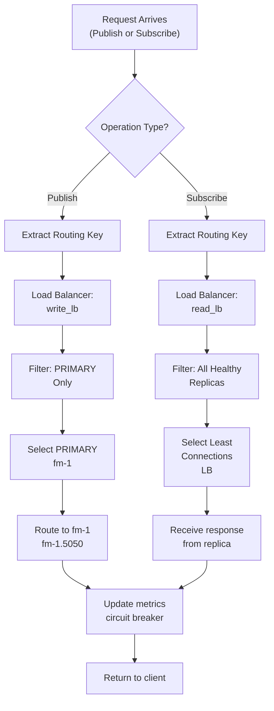
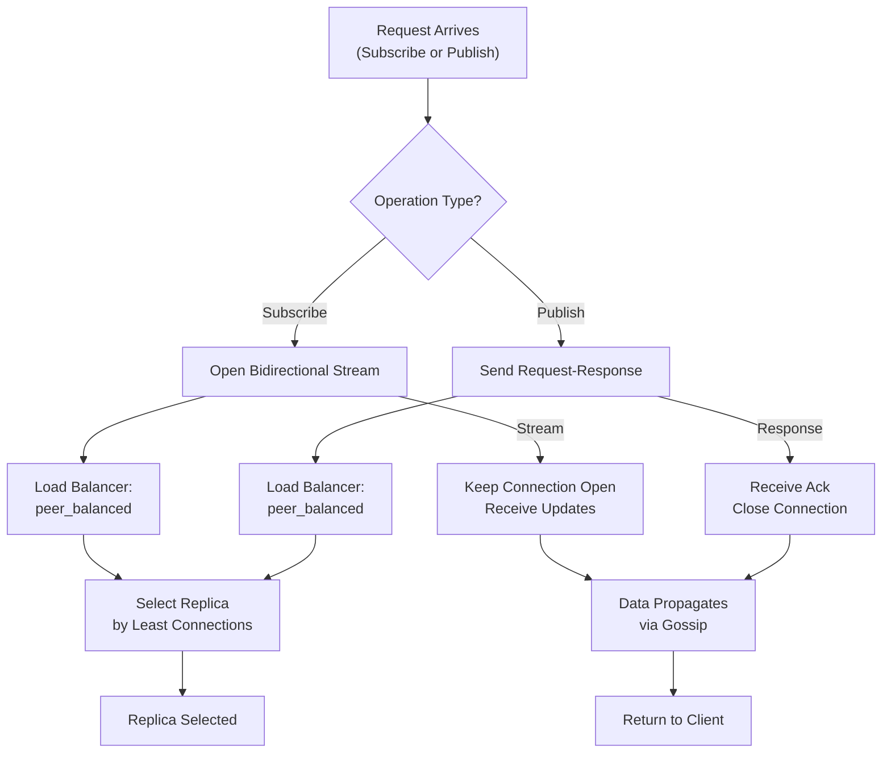
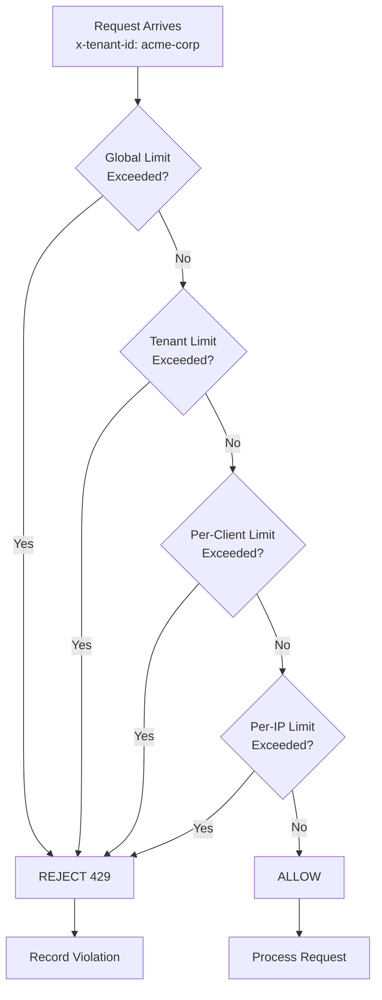
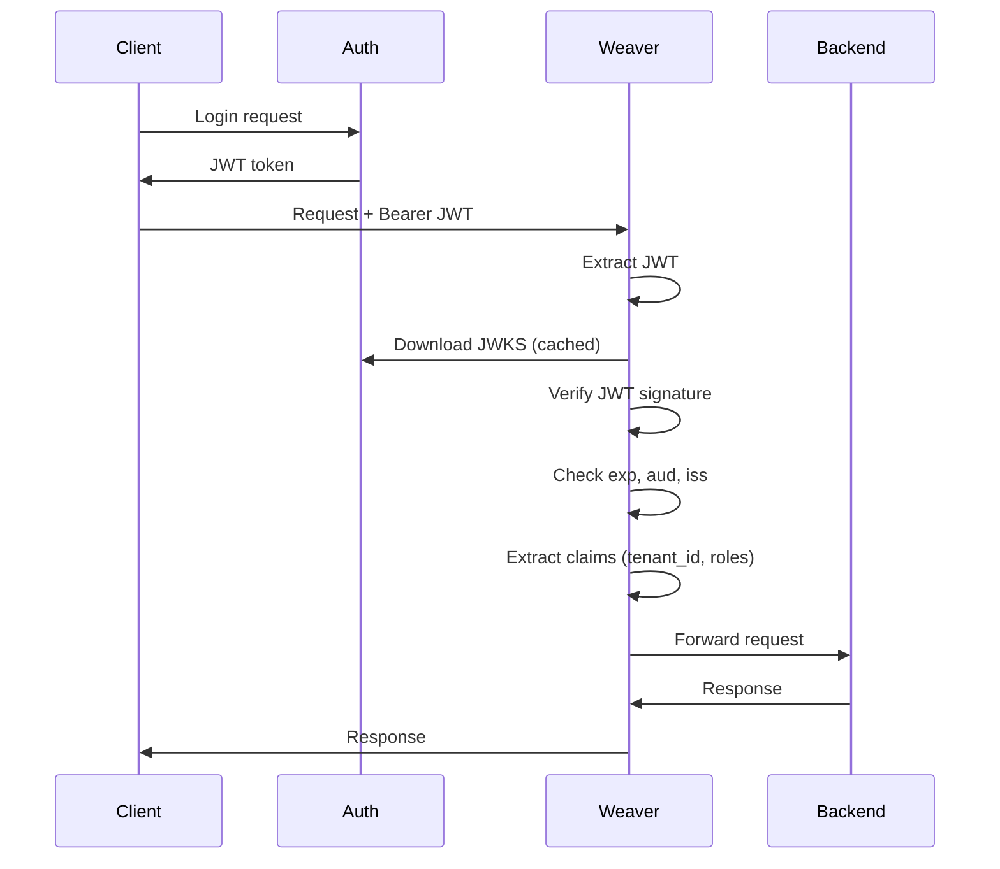
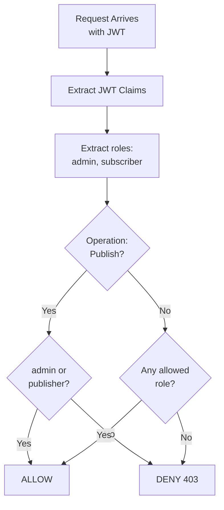
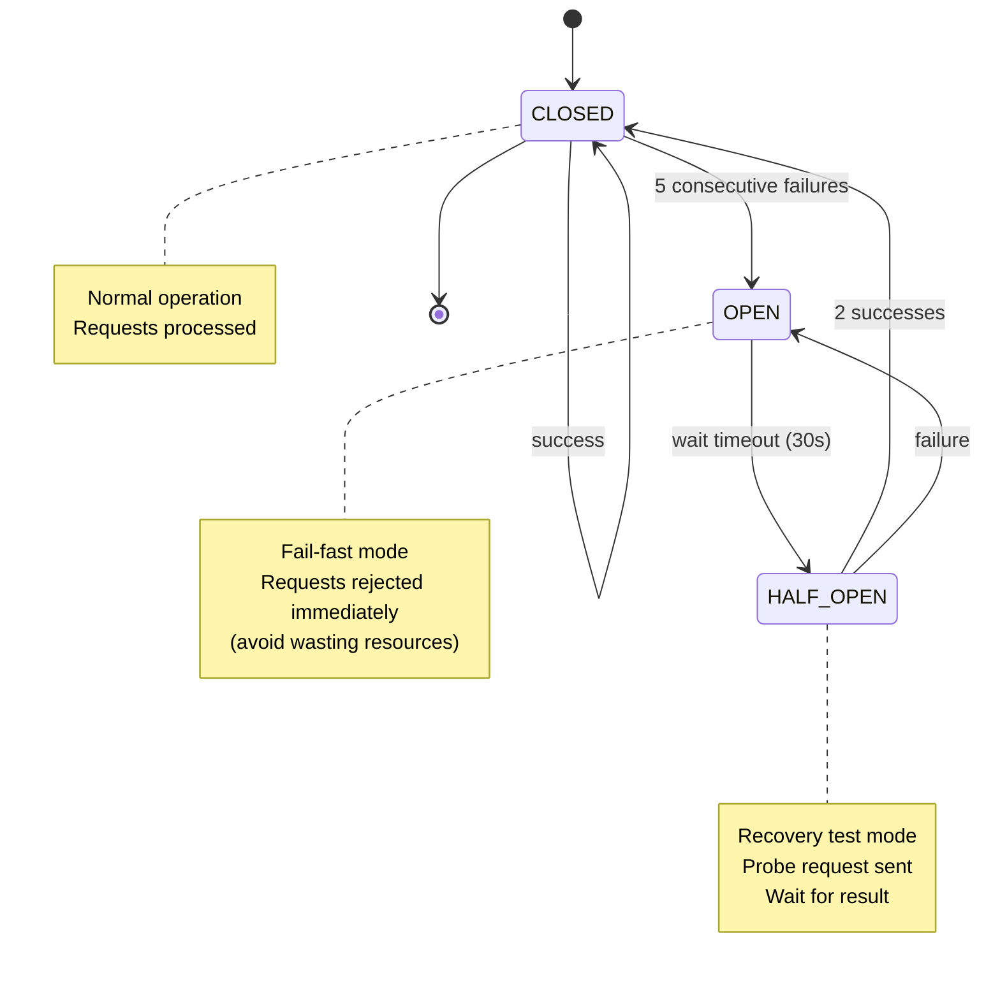
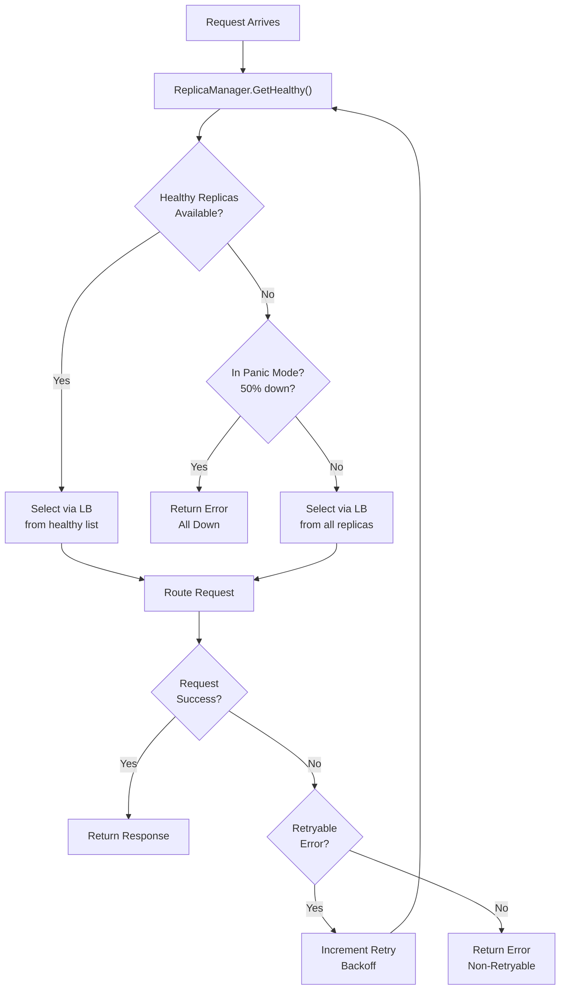
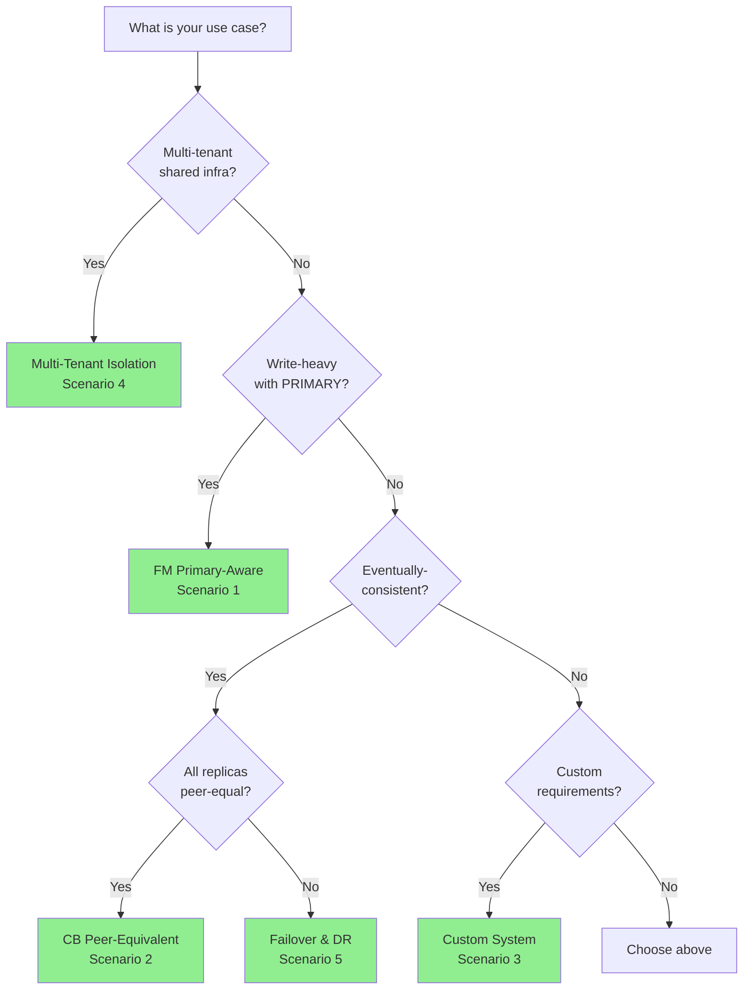

# Weaver: Scenarios & Deployment Patterns (Visual Guide)

> **Status:** Production-Grade Visual Documentation  
> **Version:** 1.0 (Phase 1)  
> **Audience:** DevOps, SREs, Platform Engineers, Architects  
> **Last Updated:** 2026-06-15

---

## Quick Navigation

This guide presents 6 real-world scenarios with:
- **Visual system topology diagrams** (block diagrams + ASCII art)
- **Request flow diagrams** (Mermaid flowcharts)
- **Configuration walkthroughs** (step-by-step with annotations)
- **Decision trees** (when to use, why, trade-offs)

**Choose your scenario:**

| Scenario | Use Case | Key Features | Complexity |
|----------|----------|--------------|-----------|
| [1. FM Primary-Aware](#scenario-1-fm-primary-aware-routing) | Write-heavy data system | Primary routing + read scaling | ⭐⭐ Medium |
| [2. CB Peer-Equivalent](#scenario-2-cb-peer-equivalent-routing) | Eventually-consistent topics | All-equal replicas + streams | ⭐⭐ Medium |
| [3. Custom System (Future-Proof)](#scenario-3-custom-system-future-proof) | Extensible for new systems | Pluggable discovery/LB | ⭐⭐⭐ Advanced |
| [4. Multi-Tenant Isolation](#scenario-4-multi-tenant-isolation) | Shared infrastructure | Rate limits + RBAC | ⭐⭐⭐ Advanced |
| [5. Failover & Disaster Recovery](#scenario-5-failover--disaster-recovery) | High availability | Auto-failover + circuit breaker | ⭐⭐⭐ Advanced |
| [6. Testing & Chaos Engineering](#scenario-6-testing--chaos-engineering) | Quality assurance | Fault injection + resilience | ⭐⭐ Medium |

---

## Scenario 1: FM Primary-Aware Routing

### WHAT: Problem Statement

**The Problem:**
FM (Fabric Manager) is a write-heavy system where:
- Data is **written to PRIMARY replica only** (single source of truth)
- Data is **read from any replica** (read scale-out)
- Read/Write split prevents inconsistency and enables horizontal scaling

**System Layout:**
```
┌─────────────────────────────────────────────────────┐
│                   CLIENT (FM Adapter)                │
│  Sends: Subscribe (read), Publish (write)           │
└────────────────────┬────────────────────────────────┘
                     │
                     ↓
        ┌────────────────────────────┐
        │   WEAVER GATEWAY           │
        │   (Primary-Aware Router)   │
        ├────────────────────────────┤
        │ • Discovery (etcd)         │
        │ • Health Checks (HTTP)     │
        │ • Load Balancing (LC + Primary) │
        │ • Retries + Circuit Breaker │
        └─────────┬──────────────────┘
                  │
         ┌────────┼────────────────────────────┐
         ↓        ↓                            ↓
    ┌─────────┐┌─────────┐              ┌─────────┐
    │ PRIMARY │││ REPLICA │              │ REPLICA │
    │(LEADER)││   2     │              │   3     │
    │ fm-1   │└─────────┘              └─────────┘
    │        │
    │ • Writes│  • Reads               • Reads
    │ • Replicates  │  • Responds         • Responds
    └─────────┘
       
Traffic Pattern:
  • Publish (writes): 20% → always PRIMARY (fm-1)
  • Subscribe (reads): 80% → load-balanced across [fm-1, fm-2, fm-3]
```

**Traffic Characteristics:**
- **Publish Operations** (20%): Write operations that must go to PRIMARY only
- **Subscribe Operations** (80%): Read operations that can go to any replica
- **Replica Read Lag**: Secondary replicas lag PRIMARY by ~100ms

---

### HOW: Step-by-Step Configuration

#### Step 1: Pod Discovery (etcd-based)

**What we're doing:** Discover FM replicas from T2 etcd, including PRIMARY metadata.

**Configuration:**
```yaml
discovery:
  type: "t2_etcd"          # Query T2 etcd for pod list
  poll_interval: 10s       # Refresh every 10 seconds
  
  config:
    endpoint: "http://etcd-t2:2379"    # T2 etcd endpoint
    key_pattern: "/dashfabric/cluster/pods/fm-*"   # Match FM pods
    timeout: 5s
```

**How it works:**
```
Weaver polls etcd every 10s:
  GET /dashfabric/cluster/pods/fm-*
  
Returns:
  {
    "fm-1": {"address": "10.0.1.1", "port": 5050, "role": "PRIMARY"},
    "fm-2": {"address": "10.0.1.2", "port": 5050, "role": "REPLICA"},
    "fm-3": {"address": "10.0.1.3", "port": 5050, "role": "REPLICA"}
  }
```

**Verification:**
```bash
# Check if Weaver discovered replicas
curl http://localhost:8080/debug/replicas | jq '.replicas[] | {name, status, role}'

# Expected output:
# {
#   "name": "fm-1",
#   "status": "HEALTHY",
#   "role": "PRIMARY"
# }
```

---

#### Step 2: Health Monitoring

**What we're doing:** Poll each replica every 10 seconds to ensure it's responding.

**Configuration:**
```yaml
health:
  enabled: true
  type: "http"           # Use HTTP GET for health checks
  interval: 10s          # Check every 10s
  timeout: 5s            # Wait max 5s for response
  
  config:
    endpoint: "/api/v1/health"   # FM health endpoint
    expected_status: 200         # Expect HTTP 200
    
  # State transitions
  consecutive_failures: 3        # Mark down after 3 failed checks
  consecutive_successes: 1       # Mark up after 1 success
  
  # Circuit breaker for entire gateway
  panic_mode:
    enabled: true
    threshold_percent: 50        # If >50% replicas down, fail-safe mode
```

**How it works:**
```
T=0s:   GET /api/v1/health on fm-1 → 200 OK (HEALTHY)
        GET /api/v1/health on fm-2 → 200 OK (HEALTHY)
        GET /api/v1/health on fm-3 → 200 OK (HEALTHY)

T=10s:  All healthy; normal operation

T=20s:  GET /api/v1/health on fm-1 → 500 (failure 1/3)
        Other replicas healthy; fm-1 still HEALTHY

T=30s:  GET /api/v1/health on fm-1 → timeout (failure 2/3)
        fm-1 still HEALTHY

T=40s:  GET /api/v1/health on fm-1 → timeout (failure 3/3)
        fm-1 marked UNHEALTHY; stop routing writes
        Warning logged; alert sent
        
T=50s:  fm-1 responds to health check
        fm-1 marked HEALTHY; resume routing writes
```

**Verification:**
```bash
# Check replica health status
curl http://localhost:8080/debug/replicas/fm-1 | jq '{name, status, last_check_time, consecutive_failures}'

# Check metrics
curl http://localhost:9090/metrics | grep "fm_gw_replica_status"

# Check logs for health check failures
kubectl logs -n weaver <pod-name> | grep "health_check_failed"
```

---

#### Step 3: Load Balancer Configuration

**What we're doing:** Define two load balancers:
- **write_lb**: Routes Publish to PRIMARY only (special handling)
- **read_lb**: Routes Subscribe to any replica (least-connections)

**Configuration:**
```yaml
load_balancers:
  # For WRITE operations (Publish)
  # Special: Must select PRIMARY even if it has high connections
  - name: "write_lb"
    type: "random"   # Not actually used; routing rules override

  # For READ operations (Subscribe)
  # Balanced: Distribute across all replicas by connection count
  - name: "read_lb"
    type: "least_connections"
    config:
      check_interval: 100ms  # Re-evaluate every 100ms
```

**How it works:**
```
For PUBLISH (write):
  1. Discover: [fm-1 (PRIMARY, 42 connections), fm-2 (35 conn), fm-3 (40 conn)]
  2. Routing rule: Publish → PRIMARY only
  3. Select fm-1 (even though high connections)
  4. Send request to fm-1
  
For SUBSCRIBE (read):
  1. Discover: [fm-1 (42 connections), fm-2 (35 connections), fm-3 (40 connections)]
  2. Routing rule: Subscribe → least_connections LB
  3. LB selects fm-2 (lowest: 35 connections)
  4. Send request to fm-2
```

---

#### Step 4: Routing Rules

**What we're doing:** Configure routing rules to send Publish → PRIMARY, Subscribe → load-balanced.

**Configuration:**
```yaml
routing:
  default_strategy: "read_lb"
  timeout: 30s
  
  rules:
    # WRITE OPERATION: Publish → PRIMARY only
    - operation: "Publish"
      strategy: "write_lb"
      metadata_filter:
        role: "PRIMARY"   # Only select replicas with role=PRIMARY
      timeout: 25s
      max_retries: 1     # Limited retries for writes (preserve PRIMARY state)
      
    # READ OPERATION: Subscribe → any replica (load-balanced)
    - operation: "Subscribe"
      strategy: "read_lb"
      timeout: 30s
      max_retries: 3     # More retries for reads (safe)
```

**Mermaid Request Flow Diagram:**



**ASCII Request Flow:**

```
CLIENT:  Publish(topic, data)
   |
   v
WEAVER:
   • Operation: Publish (write)
   • Load Balancer: write_lb
   • Filter: PRIMARY=true
   • Select: fm-1 (PRIMARY)
   |
   v
FM-1 PRIMARY:
   • Update local state
   • Replicate to fm-2, fm-3
   • Respond: OK
   |
   v
WEAVER:
   • Latency: 5.2ms
   • Status: SUCCESS
   • Update metrics
   |
   v
CLIENT:  Response OK


CLIENT:  Subscribe(topic)
   |
   v
WEAVER:
   • Operation: Subscribe (read)
   • Load Balancer: read_lb
   • Select: fm-2 (least connections: 35)
   |
   v
FM-2 REPLICA:
   • Read from replica state
   • Return data
   |
   v
CLIENT:  Response [data...]
```

**Verification:**
```bash
# Send Publish (write) request
grpcurl -plaintext -d '{"topic":"config","data":"..."}' \
  localhost:5051 FM.Broker/Publish

# Should route to PRIMARY (fm-1)
curl http://localhost:8080/debug/logs | jq '.[] | select(.operation=="Publish" and .selected_replica=="fm-1")'

# Send Subscribe (read) request  
grpcurl -plaintext -d '{"topic":"config"}' \
  localhost:5051 FM.Broker/Subscribe

# Should route to least-loaded replica
curl http://localhost:9090/metrics | grep "fm_gw_request_latency_ms"
```

---

#### Step 5: Reliability Patterns

**What we're doing:** Configure circuit breaker and retry logic.

**Configuration:**
```yaml
reliability:
  # Circuit breaker prevents cascading failures
  circuit_breaker:
    enabled: true
    failure_threshold: 5          # Open after 5 consecutive failures
    success_threshold: 2          # Close after 2 successes (HALF_OPEN)
    timeout: 30s                  # Wait 30s before retrying OPEN CB
    
  # Retry logic with exponential backoff
  retry:
    enabled: true
    max_attempts: 3               # Try up to 3 times
    backoff_strategy: "exponential"
    initial_backoff: 10ms         # Start with 10ms
    max_backoff: 5s               # Cap at 5s
    backoff_multiplier: 2.0       # Double each attempt
    
    # Only retry transient errors
    retryable_status_codes: [503, 504, 429]  # Service Unavailable, Gateway Timeout, Too Many
    
  # Timeout configuration
  timeout:
    global: 30s                   # Total request: start → finish
    per_replica: 25s              # Replica response timeout
    connect: 5s                   # TCP connection timeout
```

**Circuit Breaker Timeline:**

```
T=0s:    CB: CLOSED (normal operation)
         Request 1 → fm-1 ✓
         Request 2 → fm-1 ✓
         
T=5s:    fm-1 degraded
         Request 3 → fm-1 ✗ (failure 1/5)
         Request 4 → fm-1 ✗ (failure 2/5)
         Request 5 → fm-1 ✗ (failure 3/5)
         Request 6 → fm-1 ✗ (failure 4/5)
         Request 7 → fm-1 ✗ (failure 5/5)
         
T=10s:   CB: OPEN (fm-1 marked down)
         Request 8 → fm-1 REJECTED immediately (fail-fast)
         Request 9 → fm-1 REJECTED immediately
         
T=40s:   CB: HALF_OPEN (timeout = 30s)
         Probe request → fm-1 (testing recovery)
         
T=41s:   Probe response ✓ (success 1/2)
         
T=42s:   Request 10 → fm-1 ✓ (success 2/2)
         CB: CLOSED (recovery complete)
         Normal operation resumed
```

---

### WHY: Decision Justification

**Why primary-aware routing?**
- FM writes must be single-source-of-truth (PRIMARY only)
- Prevents data divergence from concurrent writes
- Enables consistent replication to secondaries
- Read replicas scale independently

**Why least-connections for reads?**
- Long-lived gRPC streams (Subscribe) need even distribution
- Least-connections avoids overloading any replica
- Better than round-robin: accounts for current load

**Why not weighted LB for reads?**
- All read replicas have identical data
- No need to prefer one over another
- Weighted adds unnecessary complexity

**Trade-offs:**
| Trade-off | Impact | Mitigation |
|-----------|--------|-----------|
| PRIMARY is single point for writes | Single replica failure stops writes | Backup PRIMARY ready; fast failover |
| Read replicas lag PRIMARY | Stale data possible | Document lag SLA (100ms) |
| Circuit breaker adds latency | <1ms overhead per request | Negligible vs. 5ms+ network latency |
| Retries can increase load | Thundering herd on retry | Exponential backoff + jitter |

**Performance Characteristics:**
- **Request Latency (p99):** <1ms (gateway overhead)
- **Total E2E Latency:** 5-50ms (depends on replica)
- **Throughput:** 100k+ req/s per gateway instance
- **Failover Detection:** ~30 seconds (3 failed checks × 10s interval)
- **Failover Execution:** <100ms (automatic routing change)

**When to use this pattern:**
- ✅ Write-heavy systems (FM, databases, config stores)
- ✅ Systems with read scale-out (reads >> writes)
- ✅ Primary-based replication model
- ❌ When all replicas must handle writes equally
- ❌ Peer-to-peer systems (use CB scenario instead)

---

## Scenario 2: CB Peer-Equivalent Routing

### WHAT: Problem Statement

**The Problem:**
CB (ControllerBridge) is an eventually-consistent topic broker where:
- All replicas are **peer-equivalent** (no PRIMARY/SECONDARY distinction)
- Any replica can handle **reads and writes**
- Data eventually propagates across all replicas
- Perfect for distributed systems without single point

**System Layout:**
```
┌─────────────────────────────────────────────────────┐
│                CLIENT (FM Adapter)                  │
│  Sends: Subscribe (get updates), Publish (notify)   │
└────────────────────┬────────────────────────────────┘
                     │
                     ↓
        ┌────────────────────────────┐
        │   WEAVER GATEWAY           │
        │ (Peer-Equivalent Router)   │
        ├────────────────────────────┤
        │ • Discovery (etcd)         │
        │ • Health Checks (gRPC)     │
        │ • Load Balancing (LC)      │
        │ • Request Queuing + BP     │
        │ • Retries + Circuit Breaker│
        └─────────┬──────────────────┘
                  │
         ┌────────┼────────────────────────────┐
         ↓        ↓                            ↓
    ┌─────────┐┌─────────┐              ┌─────────┐
    │  CB-1   ││  CB-2   │              │  CB-3   │
    │ REPLICA ││ REPLICA │              │ REPLICA │
    │         │└─────────┘              │         │
    │ • Writes│  • Writes               │ • Writes│
    │ • Reads │  • Reads                │ • Reads │
    │ • Topics│  • Topics               │ • Topics│
    │         ├──────────────────────────┤        │
    │         │ Gossip: eventual consistency
    └─────────┴──────────────────────────┴─────────┘
       
Traffic Pattern:
  • All operations (Subscribe + Publish): 100%
  • Distributed across [cb-1, cb-2, cb-3]
  • Data propagates via gossip protocol
```

**Traffic Characteristics:**
- **Subscribe (reads):** 60% → any healthy replica (balanced)
- **Publish (writes):** 40% → any healthy replica (balanced)
- **Consistency Model:** Eventual (ms-level lag between replicas)

---

### HOW: Step-by-Step Configuration

#### Step 1: Pod Discovery

**Configuration:**
```yaml
discovery:
  type: "t2_etcd"
  poll_interval: 10s
  
  config:
    endpoint: "http://etcd-t2:2379"
    key_pattern: "/dashfabric/cluster/pods/cb-*"   # Match CB pods
    timeout: 5s
```

**Discovered Replicas:**
```json
{
  "cb-1": {"address": "10.0.2.1", "port": 5050, "role": "REPLICA"},
  "cb-2": {"address": "10.0.2.2", "port": 5050, "role": "REPLICA"},
  "cb-3": {"address": "10.0.2.3", "port": 5050, "role": "REPLICA"}
}
```

All replicas are REPLICA (no PRIMARY distinction).

---

#### Step 2: Load Balancer Configuration

**Configuration:**
```yaml
load_balancers:
  - name: "peer_balanced"
    type: "least_connections"   # All operations use same LB
    config:
      check_interval: 100ms
```

**Why:** All replicas equivalent; distribute evenly by connection count.

---

#### Step 3: Routing Rules

**Configuration:**
```yaml
routing:
  default_strategy: "peer_balanced"
  timeout: 30s
  
  rules:
    # SUBSCRIBE: Subscribe to topic stream
    - operation: "Subscribe"
      strategy: "peer_balanced"
      timeout: 30s           # Long timeout for streaming
      max_retries: 3
      
    # PUBLISH: Publish notification to topic
    - operation: "Publish"
      strategy: "peer_balanced"
      timeout: 15s           # Shorter timeout for request-response
      max_retries: 3
```

**Mermaid Request Flow Diagram:**



**ASCII Request Flow:**

```
CLIENT:  Subscribe(topic="config-updates")
   |
   v
WEAVER:
   • Operation: Subscribe (bidirectional stream)
   • Load Balancer: peer_balanced
   • Select: cb-2 (least connections: 12)
   |
   v
CB-2:
   • Open bidirectional stream
   • Stream updates from topic
   |
   v
CLIENT:
   • Receives: [{"action":"register",...}, {"action":"notify",...}]
   • Connection stays open (streaming)
   • Receives new updates in real-time


CLIENT:  Publish(topic="ack", data={"status":"OK"})
   |
   v
WEAVER:
   • Operation: Publish (request-response)
   • Load Balancer: peer_balanced
   • Select: cb-1 (least connections: 8)
   |
   v
CB-1:
   • Store in topic
   • Replicate to cb-2, cb-3 (gossip)
   • Return ack
   |
   v
WEAVER:
   • Receive ack
   • Latency: 3.1ms
   • Update metrics
   |
   v
CLIENT:  Response OK
```

---

#### Step 4: Request Queuing & Backpressure

**Configuration:**
```yaml
reliability:
  queuing:
    enabled: true
    per_replica_depth: 1000        # Buffer up to 1000 requests per replica
    overflow_behavior: "reject_with_503"  # Reject if queue full
    max_wait_time: 30s             # Reject if queued >30s
```

**Why:** CB handles high traffic; buffering absorbs spikes; backpressure prevents overload.

**Queue Flow:**

```
Request arrives for CB-1
  ├─ Queue depth: 800 / 1000 (80%)
  │  → Enqueue request
  │  → Wait for replica capacity
  ├─ Queue depth: 1000 / 1000 (FULL)
  │  → Next request: REJECT with 503 (Too Many Requests)
  │  → Client retries to different replica
  └─ Queue drains
     ├─ CB-1 processes queued requests
     ├─ Queue depth drops to 200
     └─ New requests accepted again
```

---

### WHY: Decision Justification

**Why peer-equivalent routing?**
- CB topics are eventually-consistent
- All replicas serve reads and writes equally
- No write amplification (all writes independent)
- Enables scaling without bottleneck

**Why least-connections?**
- Bidirectional streams hold connections open
- Least-connections prevents any replica overload
- Distributes concurrent streams evenly

**Why buffering with backpressure?**
- CB handles traffic spikes (many FM clients connecting)
- Queue absorbs temporary overload
- Backpressure prevents cascade failures
- Client retries to healthier replicas

**Trade-offs:**
| Trade-off | Impact | Mitigation |
|-----------|--------|-----------|
| Eventual consistency | Stale data possible (ms lag) | Document SLA: <100ms propagation |
| Write conflicts possible | Same topic written concurrently | Append-only events (conflict-free) |
| Network partition | Replicas diverge temporarily | Auto-heal via gossip when reconnected |
| Queue overflow rejects traffic | Some requests fail | Backpressure is safe; client retries |

**Performance Characteristics:**
- **Throughput:** 100k+ req/s (distributed)
- **Latency (p99):** <1ms gateway + network
- **Consistency Lag:** ~50ms (gossip propagation)
- **Stream Capacity:** 10k concurrent streams per gateway

**When to use this pattern:**
- ✅ Peer-to-peer systems (CB, IPFS, etc.)
- ✅ Eventually-consistent data (events, updates)
- ✅ No write conflicts possible (append-only)
- ✅ Multiple replicas for scaling
- ❌ Strong consistency required
- ❌ Unique resources (one PRIMARY writer)

---

## Scenario 3: Custom System (Future-Proof)

### WHAT: Problem Statement

**The Problem:**
Future systems may have different requirements:
- Discovery mechanism (not etcd; could be Consul, K8s API, DNS)
- Health checks (not HTTP; could be gRPC, TCP, custom)
- Load balancing strategy (not least-connections; could be consistent hash, resource-aware)
- Must work without Weaver code changes

**System Layout:**
```
┌─────────────────────────────────────────────┐
│         CUSTOM SYSTEM (e.g., FR)           │
│  • Discovery: Consul (not etcd)            │
│  • Health: gRPC (not HTTP)                 │
│  • LB: Consistent Hash (not LC)            │
│  • Plugins: Custom rate limiter            │
└─────────────────────────────────────────────┘
                     ↑
         ┌───────────┴────────────┐
         │                        │
    ┌─────────────────────────────────────┐
    │   WEAVER GATEWAY (NO CODE CHANGES)  │
    │   (Config-Driven Everything)        │
    ├─────────────────────────────────────┤
    │ Discovery Plugin: Consul             │
    │ Health Plugin: gRPC                  │
    │ LB Plugin: Consistent Hash           │
    │ Rate Limiter Plugin: Custom          │
    └─────────────────────────────────────┘
         │                        │
         └────────────┬───────────┘
                      ↓
         ┌──────────────────────┐
         │  FR Replicas (3)     │
         │  (geo-distributed)   │
         └──────────────────────┘
```

**Key Insight:** Weaver binary is UNCHANGED. Only configuration changes.

---

### HOW: Step-by-Step Configuration

#### Step 1: Custom Discovery (Consul)

**Configuration:**
```yaml
discovery:
  type: "consul"              # Different discovery provider
  poll_interval: 10s
  
  config:
    endpoint: "http://consul:8500"  # Consul endpoint
    service_name: "fr-service"      # Service in Consul
    datacenter: "us-west"           # Specific datacenter
    filter: "Status == passing"     # Healthy services only
```

**How it works:**
```
Weaver queries Consul every 10s:
  GET /v1/catalog/service/fr-service?dc=us-west&filter=Status == passing
  
Returns:
  [
    {
      "ServiceID": "fr-1",
      "ServiceAddress": "10.0.3.1",
      "ServicePort": 5050,
      "Status": "passing",
      "Meta": {"region": "us-west-1a"}
    },
    ...
  ]
```

---

#### Step 2: Custom Health Check (gRPC)

**Configuration:**
```yaml
health:
  enabled: true
  type: "grpc"                # gRPC health check (not HTTP)
  interval: 10s
  timeout: 5s
  
  config:
    service: "grpc.health.v1.Health"  # Standard gRPC health service
    method: "Check"
    expected_status: "SERVING"        # Expect "SERVING" status
    
  consecutive_failures: 3
  consecutive_successes: 1
```

**How it works:**
```
Weaver calls gRPC health check on fr-1:
  Call: /grpc.health.v1.Health/Check
  Request: {"service": "fr.FRService"}
  
Response:
  {"status": "SERVING"}
  
If status is "SERVING": HEALTHY
If status is "NOT_SERVING": UNHEALTHY
If call fails: Count as failure
```

---

#### Step 3: Custom Load Balancer (Consistent Hash + Geo-Affinity)

**Configuration:**
```yaml
load_balancers:
  - name: "geo_hash"
    type: "custom"              # User-provided plugin
    config:
      plugin_path: "/opt/weaver/plugins/geo_consistent_hash.so"
      plugin_config:
        hash_key: "client_region"  # Extract from request metadata
        prefer_region: "us-west"   # Try this region first
        virtual_nodes: 150         # For even distribution
```

**How it works (plugin pseudocode):**
```go
func (glb *GeoConsistentHashLB) SelectReplica(req *Request, replicas []*Replica) (*Replica, error) {
  // Extract client region from request
  clientRegion := req.Metadata["client_region"]
  
  // Filter replicas in preferred region
  preferredReplicas := filterByRegion(replicas, "us-west")
  
  if len(preferredReplicas) > 0 {
    // Use consistent hash on preferred region replicas
    return glb.hashRing.Select(clientRegion, preferredReplicas)
  }
  
  // Fallback: use all replicas
  return glb.hashRing.Select(clientRegion, replicas)
}
```

**Request Routing:**
```
Request from client: region=us-west-1a
  │
  v
Load Balancer (geo_hash):
  1. Extract: clientRegion = "us-west-1a"
  2. Filter: replicas in "us-west" = [fr-1, fr-2] (fr-3 is in us-east)
  3. Hash: hash("us-west-1a") → Ring position → fr-2
  4. Select: fr-2 (in us-west; geographically close)
  │
  v
Route to FR-2 (us-west-1b)
  ├─ Latency: 2ms (geographic affinity)
  └─ (vs. 50ms if routed to us-east)
```

---

#### Step 4: Custom Rate Limiter (Plugin)

**Configuration:**
```yaml
rate_limiting:
  enabled: true
  
  custom_limiter:
    type: "custom"
    plugin_path: "/opt/weaver/plugins/region_aware_limiter.so"
    plugin_config:
      global_rate: 100000           # 100k req/s globally
      region_rates:
        "us-west": 60000            # 60k to us-west
        "us-east": 40000            # 40k to us-east
      burst_size: 5000              # Allow 5k token burst
```

**How it works (plugin pseudocode):**
```go
func (rl *RegionAwareLimiter) Allow(req *Request) bool {
  // Extract region from request
  region := req.Metadata["region"]
  
  // Check global limit
  if !rl.globalBucket.Allow() {
    return false  // Global limit exceeded
  }
  
  // Check region-specific limit
  regionBucket := rl.regionBuckets[region]
  if !regionBucket.Allow() {
    return false  // Region limit exceeded
  }
  
  return true
}
```

---

#### Step 5: Complete Custom Configuration

**Configuration:**
```yaml
gateway:
  name: "fr-gateway-custom"
  mode: "load_balanced"
  
discovery:
  type: "consul"
  poll_interval: 10s
  config:
    endpoint: "http://consul:8500"
    service_name: "fr-service"
    datacenter: "us-west"
    
health:
  type: "grpc"
  interval: 10s
  config:
    service: "grpc.health.v1.Health"
    expected_status: "SERVING"
    
listeners:
  grpc:
    enabled: true
    port: 5051
  http:
    enabled: true
    port: 8080
    
load_balancers:
  - name: "geo_hash"
    type: "custom"
    config:
      plugin_path: "/opt/weaver/plugins/geo_consistent_hash.so"
      
rate_limiting:
  custom_limiter:
    plugin_path: "/opt/weaver/plugins/region_aware_limiter.so"
    
reliability:
  circuit_breaker:
    enabled: true
    failure_threshold: 3
    timeout: 20s
    
observability:
  metrics:
    enabled: true
    namespace: "fr_gw"
  tracing:
    enabled: true
    sample_rate: 0.1
```

**Verification:**
```bash
# Check if plugins loaded
curl http://localhost:8080/debug/config | jq '.plugins'

# Check plugin functionality
curl http://localhost:9090/metrics | grep "fr_gw_"

# Send test request
grpcurl -plaintext -d '{"request":"..."}' localhost:5051 FR.Service/Call
```

---

### WHY: Decision Justification

**Why plugin architecture?**
- Weaver binary unchanged; no recompilation for new systems
- Each system brings its own plugins (discovery, health, LB, rate limiter)
- Configuration is the only thing that changes

**Why Consul discovery?**
- FR system uses Consul for service registration
- Weaver plugs in; no code changes needed

**Why gRPC health checks?**
- FR service implements standard gRPC health protocol
- More efficient than HTTP polling
- Native to gRPC ecosystem

**Why consistent hash + geo-affinity?**
- FR clients benefit from geographic locality
- Hash ensures same client → same region replica
- Reduces latency; improves performance

**Why region-aware rate limiting?**
- Different regions have different capacity
- Custom logic prevents over-allocation to one region
- Plugin provides business logic without Weaver changes

**Trade-offs:**
| Trade-off | Impact | Mitigation |
|-----------|--------|-----------|
| Plugin development cost | Team must write plugins | Provide plugin SDK + templates |
| Plugin bugs affect gateway | Plugins loaded in-process | Validate plugins before deployment |
| Plugin compatibility | Plugins must match Weaver version | Version gate in plugin manifest |

**When to use this pattern:**
- ✅ New system with unique requirements
- ✅ Team comfortable writing plugins
- ✅ Custom business logic needed
- ✅ Already invested in Weaver ecosystem
- ❌ No custom plugins available
- ❌ Simple needs (use FM or CB pattern instead)

---

## Scenario 4: Multi-Tenant Isolation

### WHAT: Problem Statement

**The Problem:**
Single Weaver instance serves multiple tenants:
- Acme Corp: 10k req/s
- BigCo: 5k req/s
- Startup: 2k req/s
- Must prevent one tenant from starving others (rate limiting)
- Must enforce access control (authentication + RBAC)
- Must isolate metrics and logs per tenant

**System Layout:**
```
┌────────────────────────────────────────────┐
│  MULTI-TENANT SHARED INFRASTRUCTURE        │
├────────────────────────────────────────────┤
│                                            │
│  ┌─────────────────────────────────────┐  │
│  │ Acme Corp      | BigCo  | Startup   │  │
│  │ (10k req/s)    | (5k)   | (2k)      │  │
│  └─────────┬───────────┬──────┬────────┘  │
│            │           │      │           │
│  ┌─────────v─────────────────v─┐         │
│  │  WEAVER GATEWAY              │         │
│  ├──────────────────────────────┤         │
│  │ Rate Limiting (per-tenant)   │         │
│  │ Authentication (Bearer/JWT)   │         │
│  │ Authorization (RBAC)          │         │
│  │ Metrics (tagged by tenant)    │         │
│  │ Logs (filtered by tenant)     │         │
│  └─────────┬─────────────────────┘        │
│            │                              │
│  ┌─────────v──────────────────────┐      │
│  │  Shared Backend Cluster        │      │
│  │  [replica-1, replica-2, ...]   │      │
│  └────────────────────────────────┘      │
└────────────────────────────────────────────┘
```

**Multi-Tenant Requirements:**
1. **Rate Limiting:** Acme ≤ 10k req/s, BigCo ≤ 5k, Startup ≤ 2k
2. **Authentication:** Verify client identity (JWT, API key, mTLS)
3. **Authorization:** Check permissions (RBAC: subscriber, admin, etc.)
4. **Isolation:** Metrics/logs tagged by tenant; no cross-tenant visibility

---

### HOW: Step-by-Step Configuration

#### Step 1: Multi-Dimensional Rate Limiting

**Configuration:**
```yaml
rate_limiting:
  enabled: true
  
  # Global cap (entire gateway)
  global:
    requests_per_second: 100000      # Absolute max
    
  # Per-tenant limit
  per_tenant:
    enabled: true
    extractor_key: "x-tenant-id"     # HTTP header or gRPC metadata
    requests_per_second: 10000       # Default per-tenant limit
    
    # Override for specific tenants
    tenant_overrides:
      acme-corp: 10000               # Acme gets 10k req/s
      bigco: 5000                    # BigCo gets 5k req/s
      startup: 2000                  # Startup gets 2k req/s
    
  # Per-client limit (within tenant)
  per_client:
    enabled: true
    requests_per_second: 1000        # Each client ≤ 1k within tenant limit
    
  # Per-IP limit (security)
  per_ip:
    enabled: true
    requests_per_second: 500         # Each IP ≤ 500 req/s (anti-abuse)
```

**Rate Limiting Decision Tree:**



**Example:**
```
Request: x-tenant-id=acme-corp, x-client-id=acme-client-1, source_ip=203.0.113.5

Checks:
  1. Global (100k req/s): Current 98k → OK
  2. Tenant acme-corp (10k req/s): Current 8500 → OK
  3. Per-client acme-client-1 (1k req/s): Current 950 → OK
  4. Per-IP 203.0.113.5 (500 req/s): Current 450 → OK
  
Result: ALLOW request
```

---

#### Step 2: Authentication (JWT)

**Configuration:**
```yaml
authentication:
  enabled: true
  
  # JWT authentication
  jwt:
    enabled: true
    header_name: "authorization"
    prefix: "Bearer"
    jwks_url: "https://auth.example.com/.well-known/jwks.json"
    cache_ttl: 3600s
    
    # Validation rules
    audience: "weaver-gateway"
    issuer: "https://auth.example.com"
    required_claims:
      - "tenant_id"      # JWT must have tenant_id claim
      - "client_id"      # JWT must have client_id claim
```

**JWT Flow:**



**Example JWT:**
```json
{
  "header": {
    "alg": "RS256",
    "kid": "key-123"
  },
  "payload": {
    "sub": "acme-client-1",
    "tenant_id": "acme-corp",
    "client_id": "acme-client-1",
    "roles": ["subscriber", "publisher"],
    "exp": 1718462400,
    "aud": "weaver-gateway",
    "iss": "https://auth.example.com"
  },
  "signature": "..."
}
```

---

#### Step 3: Authorization (RBAC)

**Configuration:**
```yaml
authorization:
  enabled: true
  
  rbac:
    enabled: true
    
    # Role definitions
    roles:
      - name: "admin"
        permissions:
          - "*"                    # All operations
          
      - name: "publisher"
        permissions:
          - "publish"
          - "subscribe"
          
      - name: "subscriber"
        permissions:
          - "subscribe"
          
      - name: "readonly"
        permissions:
          - "get_metrics"
          - "get_logs"
    
    # Policy: which roles can do what
    policies:
      - resource: "/Publish"
        methods: ["POST", "gRPC"]
        allowed_roles: ["admin", "publisher"]
        
      - resource: "/Subscribe"
        methods: ["POST", "gRPC"]
        allowed_roles: ["admin", "publisher", "subscriber"]
        
      - resource: "/metrics"
        methods: ["GET"]
        allowed_roles: ["admin", "readonly"]
```

**Authorization Decision Tree:**



**Example:**
```
Request: POST /Publish
JWT roles: ["subscriber"]

Check:
  Operation: Publish
  Allowed roles: ["admin", "publisher"]
  User roles: ["subscriber"]
  Intersection: empty
  
Result: DENY 403 Forbidden
```

---

#### Step 4: Multi-Tenant Metrics Isolation

**Configuration:**
```yaml
observability:
  metrics:
    enabled: true
    namespace: "shared_gw"
    
    # Tag all metrics with tenant
    tenant_tagging:
      enabled: true
      extractor_key: "x-tenant-id"
      
    # Tenant-specific rate (e.g., sample only 10%)
    tenant_sampling:
      acme-corp: 1.0                # 100% sampling for Acme (important)
      bigco: 0.5                    # 50% sampling for BigCo (cost)
      startup: 0.1                  # 10% sampling for Startup (low volume)
```

**Metrics Example:**
```
shared_gw_requests_total{tenant="acme-corp", method="publish"} 524
shared_gw_requests_total{tenant="bigco", method="publish"} 198
shared_gw_requests_total{tenant="startup", method="publish"} 45

shared_gw_request_latency_ms{tenant="acme-corp", replica="replica-1"} [histogram]
shared_gw_rate_limit_violations_total{tenant="bigco", limit_type="per_ip"} 12
```

**Prometheus Query for Acme Corp:**
```promql
# Acme Corp requests per second
rate(shared_gw_requests_total{tenant="acme-corp"}[1m])

# Acme Corp error rate
rate(shared_gw_requests_total{tenant="acme-corp", status="error"}[1m]) /
rate(shared_gw_requests_total{tenant="acme-corp"}[1m])

# Acme Corp latency p99
histogram_quantile(0.99, shared_gw_request_latency_ms{tenant="acme-corp"})
```

---

### WHY: Decision Justification

**Why multi-dimensional rate limiting?**
- Prevents any tenant from consuming all capacity
- Layered approach (global → tenant → client → IP) provides defense in depth
- Protects against both intentional abuse and accidental spike

**Why JWT authentication?**
- Stateless; no session storage needed
- Standard; integrates with existing auth systems
- Cryptographically verified; can't be forged

**Why RBAC?**
- Role-based is simpler than attribute-based
- Clear separation: admin vs subscriber vs readonly
- Easy to reason about; easy to audit

**Why tenant tagging in metrics?**
- Enables per-tenant monitoring/billing
- Isolates performance issues to specific tenant
- Allows cost allocation

**Trade-offs:**
| Trade-off | Impact | Mitigation |
|-----------|--------|-----------|
| JWT validation latency | ~0.5ms per request | Cache JWKS; verify offline |
| Rate limiter per-dimension overhead | 5-10% CPU cost | Use lock-free algorithms; atomic ops |
| Metric cardinality explosion | High-cardinality tenants overload Prometheus | Limit sampling; aggregate metrics |
| Multi-tenant contention | Noisy neighbor; slow clients affect others | Request queuing; circuit breaker |

**When to use this pattern:**
- ✅ Multiple independent tenants
- ✅ Shared infrastructure (reduce cost)
- ✅ Need to prevent abuse
- ✅ Support multi-tier pricing
- ❌ Single tenant (simpler patterns exist)
- ❌ Strict compliance isolation needed (use separate instances)

---

## Scenario 5: Failover & Disaster Recovery

### WHAT: Problem Statement

**The Problem:**
Replicas fail; gateway must automatically detect and route around failures:
- **Replica failure detection:** How long until marked down?
- **Automatic failover:** How does routing change?
- **Circuit breaker:** How does it prevent cascade failures?
- **Recovery:** How does failed replica rejoin?

**Timeline of Replica Failure:**
```
T=0s:        All 3 replicas HEALTHY
             Requests routed normally

T=5s:        Replica-1 starts failing (network partition)
             Requests timeout; client retries

T=10s:       Health check detects failure (1/3 checks fail)

T=20s:       Health check detects failure (2/3 checks fail)

T=30s:       Health check detects failure (3/3)
             Replica-1 marked UNHEALTHY
             Automatic failover begins

T=31s:       Requests now avoid replica-1
             Route through replica-2, replica-3 only
             Temporary latency spike (higher load on 2 replicas)

T=60s:       Replica-1 network recovered
             Health check succeeds (1/1)
             Replica-1 marked HEALTHY
             Failover complete; traffic rebalanced
```

---

### HOW: Step-by-Step Configuration

#### Step 1: Health Check Thresholds

**Configuration:**
```yaml
health:
  enabled: true
  type: "http"
  interval: 10s                  # Check every 10s
  timeout: 5s                    # Wait max 5s per check
  
  consecutive_failures: 3        # Mark down after 3 failures
  consecutive_successes: 1       # Mark up after 1 success
  
  # Panic mode: fail-safe if >50% replicas down
  panic_mode:
    enabled: true
    threshold_percent: 50
    notify_url: "https://alerts.example.com/webhook"
```

**Failure Detection Timeline:**
```
T=0s:    Health check: replica-1 OK → HEALTHY
T=10s:   Health check: replica-1 TIMEOUT (failure 1/3) → Still HEALTHY
T=20s:   Health check: replica-1 500 ERROR (failure 2/3) → Still HEALTHY
T=30s:   Health check: replica-1 TIMEOUT (failure 3/3) → MARK UNHEALTHY
         
         At T=30s, replica-1 transitions: HEALTHY → UNHEALTHY
         All requests now avoid replica-1

T=40s:   Health check: replica-1 OK (success 1/1) → MARK HEALTHY
         
         At T=40s, replica-1 transitions: UNHEALTHY → HEALTHY
         Requests now include replica-1 again
```

---

#### Step 2: Circuit Breaker Configuration

**Configuration:**
```yaml
reliability:
  circuit_breaker:
    enabled: true
    failure_threshold: 5             # Open after 5 consecutive failures
    success_threshold: 2             # Close after 2 successes (HALF_OPEN)
    timeout: 30s                     # Time in HALF_OPEN before retry
    metrics_window: 60s              # Count failures in 60s window
```

**Circuit Breaker State Machine:**



**Circuit Breaker + Health Check Timeline:**

```
T=0s:     CB: CLOSED
          Replica: HEALTHY
          Requests: PROCESSED

T=10-30s: Replica fails
          Health check: 3 failures
          Replica: UNHEALTHY
          CB still CLOSED
          Requests: still routed (short-lived; circuit breaker absorbs)

T=31s:    CB: still CLOSED
          Replica: UNHEALTHY
          Requests: skip replica (health check prevents routing)

T=35s:    CB: OPEN (from repeated failures in metrics window)
          Replica: UNHEALTHY
          Requests: fail-fast (CB is open)

T=65s:    CB: HALF_OPEN (timeout = 30s)
          Probe request sent
          
T=66s:    Probe response OK
          CB: HALF_OPEN (1/2 successes)
          
T=67s:    Probe request sent again
          
T=68s:    Probe response OK
          CB: CLOSED (2/2 successes)
          
         Replica still UNHEALTHY (waits for health check success)
         
T=70s:    Health check: OK
          Replica: HEALTHY
          CB: CLOSED
          Normal operation resumed
```

---

#### Step 3: Request Retry with Backoff

**Configuration:**
```yaml
reliability:
  retry:
    enabled: true
    max_attempts: 3                  # Try up to 3 times
    backoff_strategy: "exponential"
    initial_backoff: 10ms
    max_backoff: 5s
    backoff_multiplier: 2.0
    
    # Only retry transient errors
    retryable_status_codes: [503, 504, 429]
```

**Retry Timeline (with failover):**
```
T=0ms:     Request 1 → replica-1
           (replica-1 unhealthy but still routing due to CB delay)
           
T=5ms:     Timeout (no response from replica-1)
           
T=10ms:    Wait 10ms (initial backoff)
           
T=20ms:    Request 1 retry attempt 2
           LB selects replica-2 (least connections)
           Response received
           
T=25ms:    Return success to client
           Total latency: 25ms (vs. 5ms if no failover)
```

---

#### Step 4: Automatic Failover Routing

**Configuration:**
```yaml
routing:
  default_strategy: "least_connections"
  timeout: 30s
  
  failover:
    enabled: true
    fallback_behavior: "next_available"  # Try next replica if selected one fails
    
  rules:
    - operation: "Subscribe"
      strategy: "least_connections"
      exclude_unhealthy: true           # Never route to UNHEALTHY replicas
      timeout: 30s
      max_retries: 3
```

**Failover Decision Tree:**



---

### WHY: Decision Justification

**Why 3 consecutive failures before marking down?**
- Prevents flapping (brief network glitch shouldn't trigger failover)
- 3 × 10s = 30s detection time (acceptable for most use cases)
- Tolerance for occasional transient failures

**Why circuit breaker in addition to health checks?**
- Health checks are slow (10s interval)
- Circuit breaker provides fast fail-fast (<1ms)
- Combined approach: health check for slow issues; CB for fast issues

**Why exponential backoff for retries?**
- Prevents thundering herd (all clients retry simultaneously)
- Gives replica time to recover between attempts
- Reduces load during outages

**Trade-offs:**
| Trade-off | Impact | Mitigation |
|-----------|--------|-----------|
| 30s failover detection latency | Client waits 30s before failover | Use shorter health check interval; CB provides fast fail-fast |
| Retry increases load | Cascading retries can overwhelm | Exponential backoff + jitter; circuit breaker |
| Flapping (rapid up/down) | Unstable routing | Use 3-strike rule; tunable thresholds |

**Performance:**
- **Failover Detection:** ~30 seconds (health check based)
- **Failover Execution:** <1ms (automatic routing change)
- **Recovery Time:** ~40 seconds (10s health check + 30s CB timeout)

**When to use this pattern:**
- ✅ Production systems (require high availability)
- ✅ Replicated backends (can fail safely)
- ✅ Acceptable downtime during failover (30-40s)
- ✅ Transient failures possible (network glitches)
- ❌ Single replica (no failover possible)
- ❌ Zero-downtime required (use global load balancing instead)

---

## Scenario 6: Testing & Chaos Engineering

### WHAT: Problem Statement

**The Problem:**
Test Weaver resilience by injecting faults:
- Kill replicas (simulate crashes)
- Add latency (simulate slow network)
- Return errors (simulate misbehavior)
- Observe how gateway handles; verify SLAs met

**Chaos Scenarios:**
```
Scenario A: Single Replica Failure
  • Kill replica-1
  • Observe: Failover works; requests route to replica-2, replica-3
  • Verify: Latency spike <100ms; no data loss

Scenario B: Network Latency Spike
  • Add 500ms latency to replica-2
  • Observe: Requests avoid replica-2; route through replica-1, replica-3
  • Verify: P99 latency increases <50%; throughput maintained

Scenario C: Cascading Failures
  • Kill replica-1
  • Wait 10s
  • Kill replica-2
  • Observe: Only 1 replica left; gateway in panic mode
  • Verify: Circuit breaker OPEN; requests fail cleanly (no hang)

Scenario D: Replica Recovery
  • Kill replica-1
  • Wait 60s (failover complete)
  • Restore replica-1
  • Observe: Replica rejoins; traffic rebalanced
  • Verify: Recovery complete within 40s
```

---

### HOW: Step-by-Step Configuration

#### Step 1: Chaos Injection Configuration

**Configuration:**
```yaml
chaos:
  enabled: true
  
  # Simulate replica failure
  replica_failure:
    enabled: true
    replicas:
      - name: "replica-1"
        action: "kill"             # KILL, PAUSE, CRASH
        inject_at: 30s             # After 30s of test
        duration: 60s              # Kill for 60s
        
  # Inject latency
  latency_injection:
    enabled: true
    replicas:
      - name: "replica-2"
        latency_ms: 500
        percentage: 100            # 100% of requests
        inject_at: 15s
        duration: 45s
        
  # Inject errors
  error_injection:
    enabled: true
    replicas:
      - name: "replica-3"
        error_rate: 10             # 10% of requests return error
        error_codes: [503, 504]
        inject_at: 45s
        duration: 30s
```

**Chaos Event Timeline:**

```
T=0s:      Test starts
           All replicas: HEALTHY, 0ms latency, 0% errors
           
T=15s:     Latency injection on replica-2 starts
           Replica-2: 500ms latency added
           Requests to replica-2 slow down; LB routes around it
           
T=30s:     Replica-1 failure injection starts
           Replica-1: KILLED
           Requests to replica-1 timeout; failover begins
           
T=40s:     Replica-1 health check detects failure
           Replica-1: marked UNHEALTHY
           Failover complete: traffic now on replica-2, replica-3 only
           
T=45s:     Error injection on replica-3 starts
           Replica-3: 10% of requests return 503
           Client retries; circuit breaker monitors
           
T=60s:     Replica-1 failure injection ends
           Replica-1: restored
           Health check: OK
           Replica-1: marked HEALTHY; traffic rebalanced
           
T=75s:     Latency injection on replica-2 ends
           Replica-2: latency removed
           
T=90s:     Error injection on replica-3 ends
           Replica-3: errors stopped
           
T=95s:     Test complete
           All replicas: HEALTHY, normal performance
           Verify SLAs met
```

---

#### Step 2: Observability for Testing

**Configuration:**
```yaml
observability:
  # Detailed logging for chaos test
  logging:
    enabled: true
    level: "DEBUG"                 # Verbose logging
    format: "json"
    sample_rate: 1.0               # 100% logging (capture everything)
    
  # Comprehensive metrics
  metrics:
    enabled: true
    namespace: "chaos_test"
    
    # Capture all events
    replica_health: true
    request_latency: true
    error_rate: true
    circuit_breaker_state: true
    queue_depth: true
    retry_rate: true
    
  # 100% trace sampling
  tracing:
    enabled: true
    sample_rate: 1.0               # 100% (trace every request)
    service_name: "chaos-test"
```

**Metrics Queries for Test Analysis:**

```promql
# Replica health over time
chaos_test_replica_status{replica="replica-1"} @ 60s  # Should show drop at T=30s

# Request latency spike
histogram_quantile(0.99, chaos_test_request_latency_ms) @ 15s  # Should spike at T=15s

# Error rate during injection
rate(chaos_test_requests_total{status="error"}[1m]) @ 45s  # Should show 10% errors

# Circuit breaker state transitions
chaos_test_circuit_breaker_transitions_total  # Track CLOSED → OPEN → HALF_OPEN → CLOSED

# Recovery time
(chaos_test_replica_status @ 60s) - (chaos_test_replica_status @ 30s)  # Transition time
```

---

#### Step 3: Automated Test Scenarios

**Test Script (pseudocode):**

```bash
#!/bin/bash

# Scenario A: Single Replica Failure
run_test "Scenario A: Single Replica Failure" {
  # Start baseline
  baseline_latency=$(measure_p99_latency)
  baseline_throughput=$(measure_throughput)
  
  # Kill replica-1
  inject_failure("replica-1", "KILL", 60s)
  
  # Monitor during failover
  sleep 30s  # Let failover happen
  failover_latency=$(measure_p99_latency)
  failover_throughput=$(measure_throughput)
  
  # Verify SLA
  assert latency_spike = (failover_latency - baseline_latency) < 100ms
  assert throughput_maintained = failover_throughput > baseline_throughput * 0.95
  
  # Wait for recovery
  sleep 60s
  recovery_latency=$(measure_p99_latency)
  
  assert recovered = recovery_latency ~= baseline_latency
}

# Scenario B: Cascading Failures
run_test "Scenario B: Cascading Failures" {
  # Kill replica-1
  inject_failure("replica-1", "KILL", 120s)
  sleep 30s
  
  # Kill replica-2
  inject_failure("replica-2", "KILL", 90s)
  sleep 5s
  
  # Observe: panic mode should trigger (2/3 down)
  assert panic_mode_active = check_panic_mode() == true
  
  # Verify: circuit breaker OPEN
  assert cb_open = get_circuit_breaker_state("replica-1") == "OPEN"
}
```

---

### WHY: Decision Justification

**Why chaos testing?**
- Uncovers failures that won't happen in staging
- Builds confidence in resilience
- Documents failure modes and recovery behavior
- Validates SLA claims

**Why 100% trace sampling during chaos?**
- Need complete visibility during failures
- Can't miss critical events
- Performance penalty acceptable during testing

**Why measure latency, throughput, error rate?**
- Latency: Did failover cause unacceptable spike?
- Throughput: Did any clients get dropped?
- Error rate: Are errors handled correctly?

**When to use this pattern:**
- ✅ Before production deployment (verify SLAs)
- ✅ After code changes (regression test)
- ✅ Periodic chaos (ongoing resilience verification)
- ✅ Learning exercise (understand failure modes)
- ❌ During customer production (too disruptive)
- ❌ If SLAs undefined (nothing to verify)

---

## Decision Tree: Choosing Your Scenario



---

**End of Scenarios & Deployment Patterns**

All 6 scenarios documented with visual diagrams, configuration walkthroughs, and design justifications.
