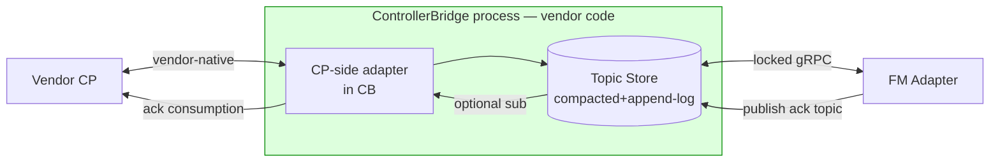

# ControllerBridge and Acks — Retrospective

> **Date:** 2026-06-14
> **Topic:** Splitting the FM ↔ vendor-CP integration into an
> out-of-process **ControllerBridge** with a locked gRPC contract, plus
> a symmetric topic-broker ack model.
> **Outcome:** `Specs/CB/` (8 docs), `Specs/cb_fm_protos/` (16 protos),
> `Specs/FM/orchestrator-plugin-interface.md` superseded.

This retrospective captures how the design moved from "FM loads a
vendor plugin in-process" to "vendor runs a CB service that speaks a
locked wire to FM," and how the ack model converged from typed RPCs
to a symmetric pub/sub topic broker.

## 1. Where we started

Before this round, the integration story was the document at
`Specs/FM/orchestrator-plugin-interface.md`:

- FM loads a vendor-supplied **Go plugin** (`.so` / linked package).
- The plugin implements a Go interface (`Subscribe`, `Replay`, `Ack`).
- Translation from vendor-native shape → FM domain happened *inside FM*
  via the plugin's translator code.
- Acks were *typed callbacks* on the plugin interface.

It satisfied the requirements (vendor-neutral, replay-safe,
backpressure-aware, conformance-tested) but folded vendor code into
the FM binary.

## 2. Round 1 — the schema discussion that turned into a CB discussion

The user opened a brainstorm on three sub-topics:

1. **Per-topic schemas:** `/config/devices/`, `/config/nics/`,
   `/config/vnets/`, `/config/mappings/`, `/config/acls/`,
   `/config/routes/`, `/config/vms/`, `/config/containers/`,
   `/config/ha/` — each with FM-defined storage layout and DASH lineage.
2. **Plugin upper-half / lower-half:** a translator with two faces —
   one talking the vendor's CP, one talking FM's domain.
3. **Protos per topic.**

Then the framing twist: rather than a *plugin*, a **ControllerBridge**
service — a vendor-implemented process that does forward translation
(CP → FM) and reverse translation (FM ack → CP).

I sketched two variants:

- **Path A:** in-process plugin (existing model, evolved).
- **Path B:** out-of-process gRPC service (CB).

I leaned toward A on grounds of perf and operational simplicity.
The user pushed back hard.

### The pivot

> *"i dont like any vendor code to go in my FM. it make FM
> vernarable."*

That single sentence killed Path A. The argument was not performance,
it was **blast radius**: a buggy or hostile vendor adapter inside the
FM binary can corrupt FM state, leak credentials, or panic the
process. Out-of-process the worst it can do is fail its own RPCs;
FM's resilience patterns (retry, circuit-break, mark CB unhealthy)
already handle that.

I had been optimizing the wrong axis.

### Other walkbacks in this round

| What I proposed | What we landed on | Why |
|------------------|---------------------|-----|
| "upper half / lower half" naming | **CP-side / FM-side** | Avoid kernel-driver associations; matches "which side of the wire" mental model |
| Single `cb_proto/` mixed with FM protos | Separate `cb_fm_protos/` folder | The wire contract is a different stability contract — must move under its own version pin |
| Drop the conformance suite (vendor self-test) | **Keep + expand** to T1–T24 | Multi-vendor parity is the whole point; without conformance there is no contract |

## 3. Round 2 — the ack model debate

I proposed a typed RPC: `AckStream(stream Ack) returns (stream
AckResult)` with a discriminator field.

The user pushed back with a much simpler picture:

> *"Assume Fm subscribe to /config/vnet/vnet-id got sone notification,
> consumed the data, then it writes to /config/vnet/vnet-id/acknowledge
> a string OK. then its up to the vendor code to read or not. FM part
> of CB just stores it rightly and quickly."*

This is structurally cleaner: **CB is a symmetric topic broker.** FM
subscribes to CP-owned topics; FM publishes to FM-owned ack topics on
the *same* CB; the CB just stores them in its topic store. Vendor's
CP-side decides whether to consume the ack stream.

### Where I pushed back, and where we re-converged

I argued the user's "string OK" hides important state. There are two
*kinds* of acks the vendor cares about:

- **Did FM see this event?** (durability ack — needed for vendor retry)
- **Is the resource actually programmed in the fleet?** (state ack —
  needed for billing, rollouts, GC)

The user accepted the *distinction*; we kept the *transport*. That
gave the final shape:

| Sub-topic | Class | Emitted on |
|-----------|-------|------------|
| `…/<key>/ack/delivery` | append-log | T1 persist |
| `…/<key>/ack/state` | compacted | registry transition (PROGRAMMED, FAILED, RETIRED) |

No new RPC. No discriminator field. Two sub-topics on the existing
broker. The vendor's mental model is "I pub on `/config/...`, I sub
on `/.../ack/...`" — symmetric and small.

### What this unlocked

Once acks were just topics:

- **Ref-count derivation** dropped out for free. The StateAck payload
  carries `consumers[]` and `ref_count` derived from existing
  registries — no separate counter to keep in sync.
- **Cold-start republish** is idempotent because the state topic is
  compacted. FM walks registries, republishes; overwriting the same
  value is a no-op.
- **Three-id model** (watermark / content_hash / desired_version)
  fits cleanly in the ack payload — each id with a clear owner and a
  clear job.

## 4. Before / after

### Before

Vendor code lives inside the FM process. Failure surface = entire FM.

### After

Vendor code is a separate process. FM speaks one locked gRPC contract.
Acks ride the same topic broker as config — symmetric pub/sub.

## 5. Compare / contrast

| Dimension | In-process plugin (rejected) | ControllerBridge (chosen) |
|-----------|------------------------------|---------------------------|
| Vendor code location | Linked into FM binary | Separate process, separate node OK |
| Failure blast radius | Whole FM | One CB; FM circuit-breaks |
| Wire | Go interface | gRPC (`cb_fm_protos/`) |
| Translation site | Inside FM | CB's CP-side adapter |
| Ack transport | Typed callbacks | Topics (`/ack/delivery`, `/ack/state`) |
| Multi-language vendors | Go-only | Any gRPC-capable language |
| Conformance | Plugin self-test | Same suite + cbsim cross-check |
| Versioning | Plugin re-link | Major prefix in topic root + `Init` negotiation |
| Operability | Restart = full FM restart | Restart vendor side independently |

## 6. Lessons

1. **Optimize for blast radius before performance.** I picked
   "in-process is faster" before checking "in-process is safer."
   The user's veto inverted the priority correctly. Future calls:
   surface the security/operational axis before perf.

2. **Listen for the structural simplification.** "Just publish OK to
   `/.../acknowledge`" sounded like under-design. It was actually a
   structural collapse — the broker is already there, why invent a
   second transport. I should have arrived at this before being
   pushed.

3. **Distinctions are real even when transports collapse.** I kept
   pushing on the two-kinds-of-ack point and that survived the
   collapse, as sub-topics. The distinction was load-bearing; the
   typed RPC was not.

4. **Naming carries semantics.** "upper half / lower half" had hidden
   cost — it implied a driver/OS hierarchy that misled about who
   owned what. CP-side / FM-side is boring and correct. Boring
   beats clever for protocol terminology.

5. **Each round must produce design improvement.** Per
   [Collaboration Rule 4](../protocols/collaboration-rules.md), this
   round produced: a new module (`Specs/CB/`), a locked wire
   (`Specs/cb_fm_protos/`), a deprecation banner on the old plugin
   doc, and this retrospective. All four exist; the round closes.

## 7. Artefacts produced

- `Specs/CB/README.md` — module index
- `Specs/CB/01-cb-architecture-hld.md` — HLD
- `Specs/CB/02-cb-low-level-design-lld.md` — LLD
- `Specs/CB/03-cb-vendor-implementation-guide.md` — vendor guide
- `Specs/CB/04-cb-conformance-suite.md` — T1–T24
- `Specs/CB/05-cb-ack-and-versioning.md` — three-id model + acks
- `Specs/CB/06-cb-simulator-design.md` — `cbsim`
- `Specs/CB/07-cb-simulator-cli.md` — `cbsim` CLI
- `Specs/cb_fm_protos/` — 16 proto files (service, common, topics)
- `Specs/FM/orchestrator-plugin-interface.md` — superseded banner
- `Specs/protocols/README.md` — reference layer updated

## 8. Forward pointers

- The conformance suite (T1–T24) is the contract under test. Writing
  test fixtures for `cbsim` will surface the next round of
  ambiguities.
- Topic shapes in `cb_fm_protos/topics/*.proto` are skeleton; field
  finalization happens when we write the first vendor adapter against
  them. Expect 1–2 fields per topic to flex.
- The `desired_version` monotonic counter needs a documented
  computation rule when FM observes a delete-then-recreate of the
  same key (does v restart at 1, or continue?). Open question; pick
  before first vendor integration.
