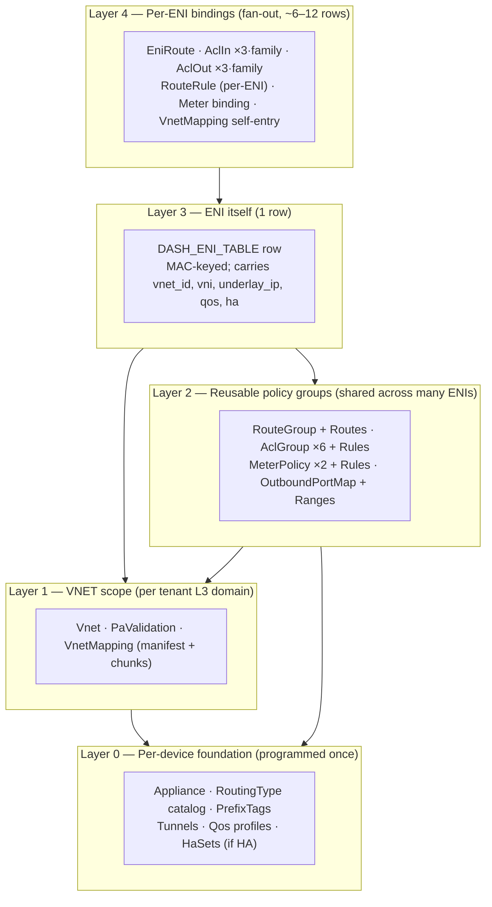
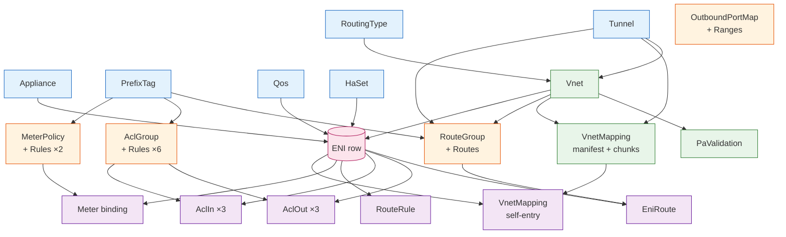
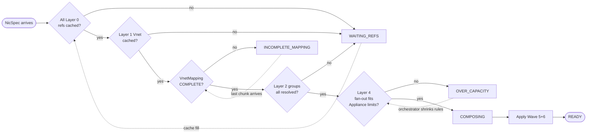
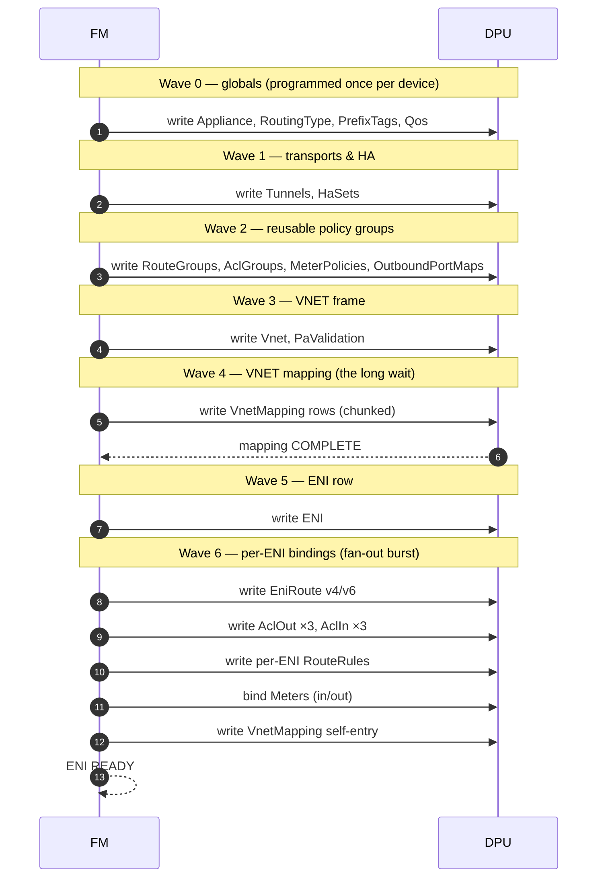
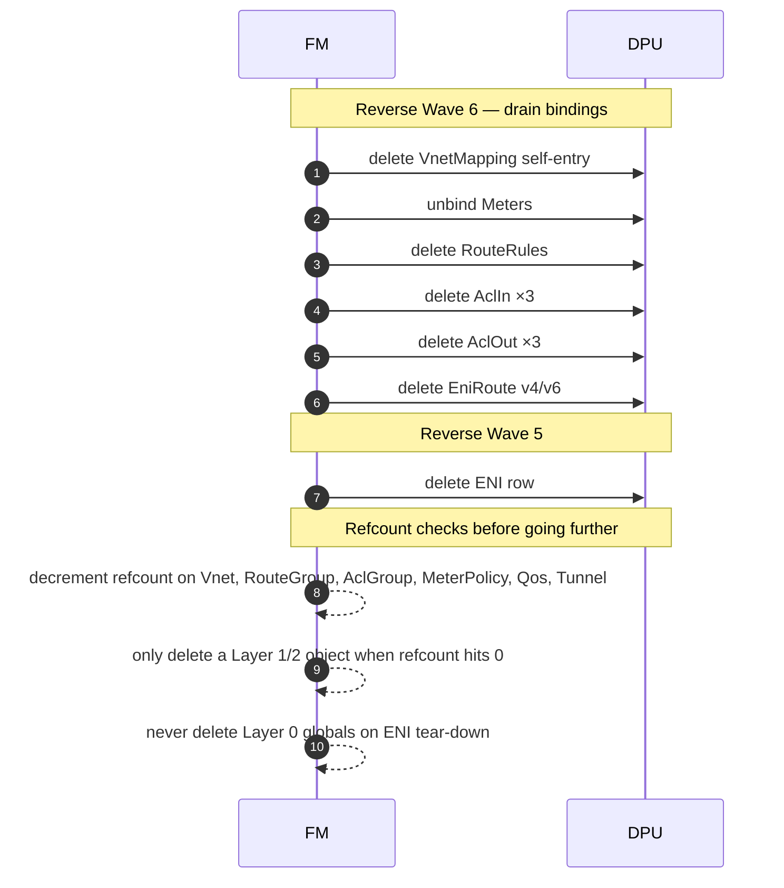
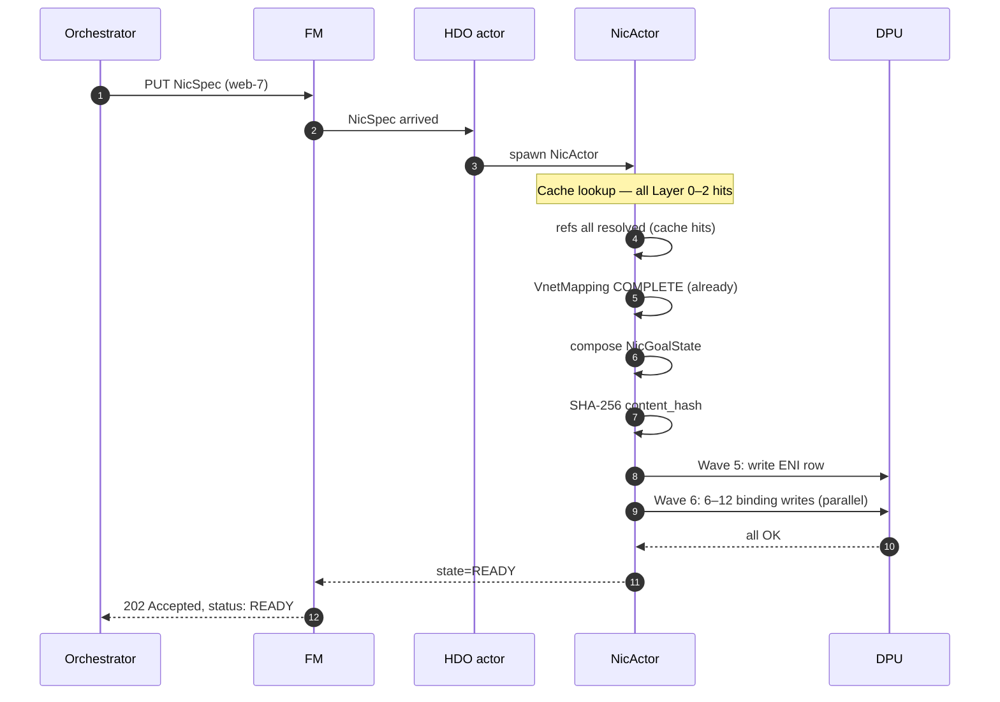
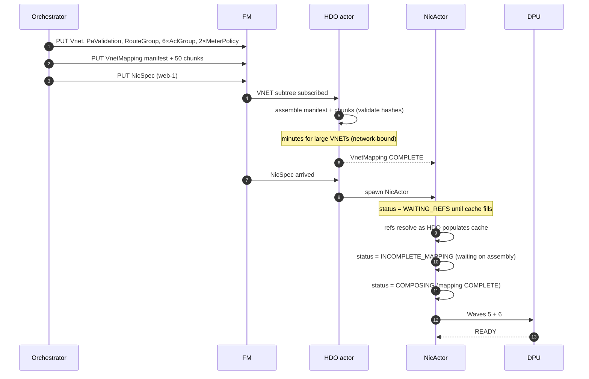
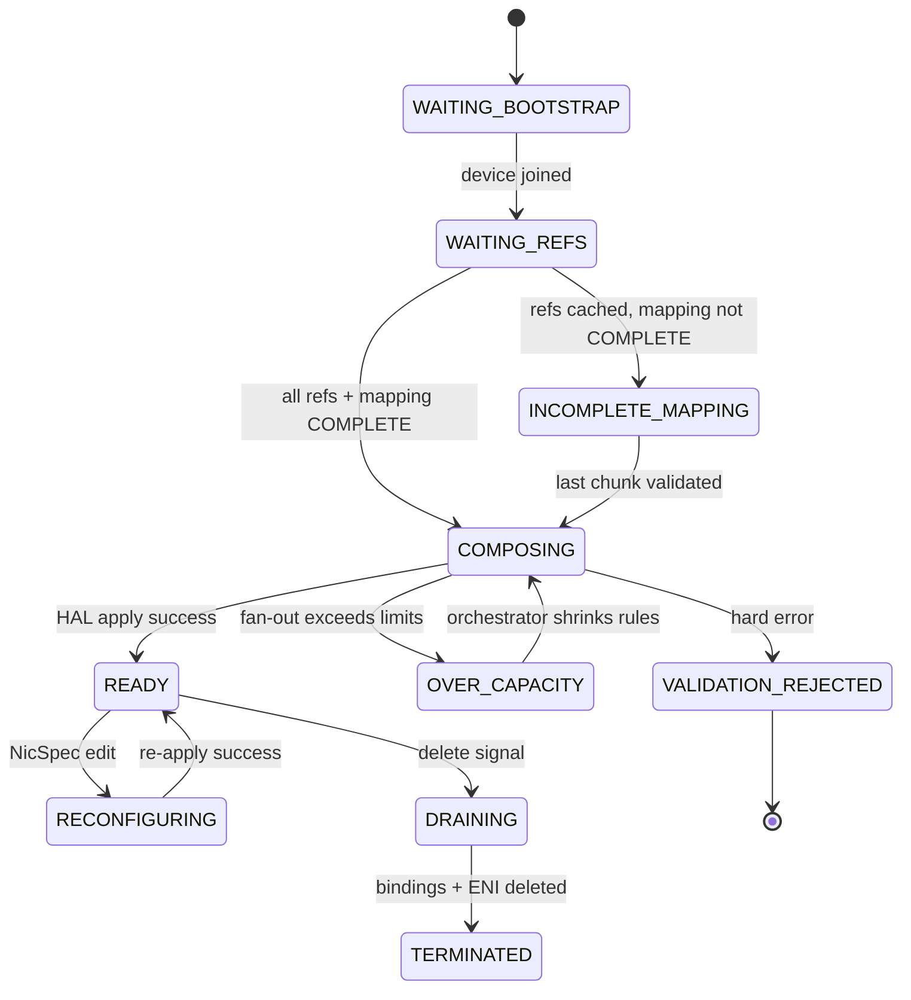

# Me & AI — ENI Dependency Graph (Learning 11A)

> **Topic:** Building a precise, layered mental model of *what an ENI
> depends on* across the DASH data model — and turning that into the
> "5-layer cake" diagram that now anchors every later FM design choice.
> This is the foundational discussion of the project's middle phase.

---

## 1. Where it started

The originating user prompt was:

> "I want a Learning doc that traces, end-to-end, what an ENI depends
> on. Not at the prose level — I want the dependency graph drawn out,
> with concrete layers, with the cardinal rule that programs an ENI
> only after its dependencies are present, and with the gates that
> enforce that rule."

The document landed at `Specs/Learning-DashNet/11A-ENI-Dependency-Graph.md`.

---

## 2. The discussion as it happened

### 2.1 First pass — too flat

My first attempt drew the dependencies as a single flat node-graph: ENI
in the middle, ACLs / routes / mappings / VNETs / groups hanging off it.
The user's pushback was immediate and correct:

> "This doesn't show *order*. The whole point is that some of these
> have to exist before others can even be evaluated. A flat graph hides
> that."

That reframed the problem: the graph isn't really a graph; it's a
*partial order*. Some nodes are ambient (must be present before any ENI
on a DPU can be programmed); some are ENI-specific (must be present
before *this particular* ENI can be programmed); some are flow-time
(consulted while data-plane traffic flows).

#### The "flat → layered" contrast

| Flat-graph framing (rejected) | Layered framing (accepted) |
|------|------|
| ENI is the center; everything radiates outward. | ENI sits at Layer 3; *everything is below it*. |
| Reader can't tell what must come first. | Reader sees a topological order. |
| Sharing scope is invisible. | Sharing scope falls out of the layer (Layer 0/1/2 shared, Layer 3/4 per-ENI). |
| No place for "VnetMapping COMPLETE gate." | Layer 1's VnetMapping is the *dominant blocker*; called out explicitly. |
| Suggests one watch per ENI per dependency. | Suggests one watch per *shared thing*; collapses to ~100 streams. |

### 2.2 The 5-layer cake emerges

Working from that insight, we collapsed the partial order into 5 layers:

The cake metaphor matters: each layer rests on the one below. You can
*declare* a Layer 3 NicSpec before Layer 1/2 are present, but you cannot
*program* the DPU until everything below is there.

#### Layer-by-layer in one table

| Layer | What lives there | Cardinality | Sharing |
|-------|------------------|-------------|---------|
| **L0** | Appliance, RoutingType, PrefixTags, Tunnels, Qos, HaSets | per-device or fleet-wide | every ENI on the DPU |
| **L1** | Vnet, PaValidation, VnetMapping (manifest+chunks) | per-tenant | every ENI in the VNET on the DPU |
| **L2** | RouteGroup, AclGroup ×6, MeterPolicy ×2, OutboundPortMap | per-tenant or shared | tens to thousands of ENIs |
| **L3** | The ENI row itself | 1 per VM-NIC | not shared |
| **L4** | EniRoute, AclIn ×3, AclOut ×3, RouteRule, Meter binding, self-entry | 6–12 rows per ENI | not shared |

### 2.3 The full dependency DAG

Once the layers were settled, drawing the actual DAG (with foreign-key
direction) made the rationale concrete:

Read every arrow as: *"the source must be programmed and validated
before the target."* The ENI row sits at the convergence of three
chains — device chain (Appliance/QoS/HaSet), VNET chain (RoutingType→Vnet,
plus mapping completeness), and policy-group chain (PrefixTag→Group).
Layer 4 then radiates outward.

### 2.4 The cardinal rule

Out of the layering came the rule that the user kept re-stating until
it was crisp:

> **An ENI is programmed onto a DPU only when every dependency in
> Layers 0–3 is resolved and present, *and* the Layer-4 mapping
> subscription has produced an initial set.**

This is not "good practice"; it is a hard correctness invariant. A NIC
programmed against a half-loaded VNET produces silent data-plane bugs
that look like flow drops. The rule is what later motivates the
per-registry `Acquire → Initial → Ready` contract in the FM redesign.

### 2.5 The five gates

The user then asked, "How do we enforce this in the *runtime*, not just
on paper?" That produced the **gate** vocabulary, drawn as a flowchart:

| Gate | Layer | What it asserts |
|------|-------|-----------------|
| **G0** | L0 | DPU ready: HAL session up, device capabilities known |
| **G1** | L0/L2 | Globals + groups hydrated (RoutingType, PrefixTags, ACL/route groups) |
| **G2** | L1 | Vnet body present + RoutingType ref resolved |
| **G3** | L1 | VnetMapping COMPLETE — manifest loaded, every chunk hash-validated |
| **G4** | L3 | NicSpec accepted (mac unique, vnet_id resolves) |
| **G5** | L4 | Fan-out fits Appliance capacity (rule counts, slot counts) |

A NicActor cannot transition to `PROGRAMMING` until every gate is green.
**The cardinal rule is the *invariant*; the gates are the *mechanism*.**

The three "yellow" gate states (`WAITING_REFS`, `INCOMPLETE_MAPPING`,
`OVER_CAPACITY`) are *transient*, not errors. The NicActor keeps
re-composing as the cache fills.

### 2.6 The sharing matrix

The next question was, "If two ENIs on the same DPU join the same VNET,
do they each maintain their own subscriptions?" The answer, very
deliberately, is **no** — and this is what later forces the registry
pattern in FM:

| Layer | Object | Scope | Sharing |
|-------|--------|-------|---------|
| 0 | Appliance | per-device | 1 per DPU (no sharing) |
| 0 | RoutingType | fleet-wide | every ENI on every DPU |
| 0 | PrefixTag | fleet-wide | many ACL/route rules |
| 0 | Tunnel | per-region | many VNETs and rules |
| 0 | Qos | tier-shaped | many ENIs per tier |
| 0 | HaSet | per HA pair | exactly 2 ENIs |
| 1 | Vnet | per tenant | many ENIs in a tenant |
| 1 | VnetMapping | per VNET | every ENI in the VNET |
| 1 | PaValidation | per VNET | one per VNET |
| 2 | RouteGroup | per tenant or shared | tens to thousands of ENIs |
| 2 | AclGroup | per tenant or shared | tens to thousands of ENIs |
| 2 | MeterPolicy | per tier or per tenant | tens to thousands of ENIs |
| 3 | ENI | per VM-NIC | not shared |
| 4 | All bindings | per ENI | not shared |

This matrix is what later quantifies the cost saving of registries:

| Subscription model | Watches in a 5,000-DPU shard with 100 ENIs/DPU |
|--------------------|------------------------------------------------|
| Per-ENI per-dependency (the rejected model) | ~500,000 |
| Per-shared-thing (the accepted model) | ~100 |

The savings come almost entirely from Layer 4 — the fattest layer —
being shared per-VNET-per-DPU rather than per-ENI.

### 2.7 The 7-wave programming order

Walking through how an ENI actually gets programmed end-to-end produced
the 7-wave model (which is just a topological sort of the DAG):

| Wave | Layer | Objects programmed | Why |
|------|-------|--------------------|-----|
| 0 | 0 | Appliance, RoutingType, PrefixTag, Qos | Globals — must precede everything |
| 1 | 0 | Tunnel, HaSet | Transports & HA — referenced by VNETs and ENIs |
| 2 | 2 | RouteGroup, AclGroup, MeterPolicy, OutboundPortMap | Reusable groups before any consumer binds |
| 3 | 1 | Vnet, PaValidation | The L3 domain frame |
| 4 | 1 | VnetMapping (manifest + chunks) | Mapping rows; gated on COMPLETE |
| 5 | 3 | ENI row | The NIC itself |
| 6 | 4 | EniRoute, AclIn/Out, RouteRule, Meter binding, self-entry | The fan-out wires the ENI to its policies |

Wave 6 is the only wave that fans **outward** — it's the one place where
a single NicSpec begets ~12 SAI calls. Failures here are partial-state
risks; HAL must be ready to roll back.

### 2.8 Tear-down — reverse-wave

Removing an ENI walks the graph backwards. Each step depends on the
*absence* of references from upstream:

Two rules from this:

- **If you delete the ENI row before deleting its bindings, the bindings
  become orphans** pointing at a dead ENI. Some SAI implementations
  cascade-delete; many do not. Always tear down Layer 4 before Layer 3.
- **Refcount on every shared object; delete only when the count hits zero.**
  Many ENIs share Layer 1–2; deleting a `Vnet` because the *first* ENI
  in it tore down would delete it for everyone.

### 2.9 Seven waves in seven worked examples

We then walked through seven concrete provisioning scenarios end-to-end
to verify the layer model held up:

| Wave (provisioning scenario) | What changes |
|------------------------------|--------------|
| 1. Cold boot, new DPU, 1 VNET, 1 ENI | Full G0→G5 traversal — most expensive case |
| 2. 2nd ENI, same VNET, same DPU | G0/G1/G2 already green; only G3/G4/G5; mapping subscription **reused** |
| 3. 2nd ENI, *different* VNET, same DPU | New G2 (new VNET ambient); new per-VNET sub-actor; new G3 |
| 4. VNET mapping update mid-flight | Layer 4 stream pushes; existing ENIs re-program incrementally; cardinal rule preserved (already past G3) |
| 5. ACL group reused by new ENI | Layer 1 already in place; refcount bumps in registry; **no rehydration cost** |
| 6. NIC delete | Reverse traversal; Layer 1/2 *may* drop only when refcount hits 0 + cooldown elapses |
| 7. HA failover | Layer 3 role flip; Layer 0/1/2 untouched; Layer 4 subscription unchanged; only per-direction tables re-program |

Walking these out caught two errors in my earlier wording:

- I had implied **Layer 1 was per-ENI** (it isn't — per-VNET, shared
  across all ENIs that joined the VNET on this DPU).
- I had implied **mapping deletes were expensive** (they aren't — the
  per-VNET sub-actor handles incremental deltas).

### 2.10 Worked example — Nth VM in established VNET (fast path)

Total time: **tens to hundreds of milliseconds**. No mapping-table load,
no group rebuild — just the per-NIC fan-out.

### 2.11 Worked example — first VM in fresh tenant (cold path)

Total time: **dominated by VnetMapping assembly** (Wave 4). The ENI
itself is microseconds; the table that lets it resolve traffic is the
multi-second/minute step. **This is why FM caches mapping per-VNET and
why subsequent VMs in the same VNET are 100× faster.**

#### Cold path vs. fast path side-by-side

| Step | Cold (first VM in fresh VNET) | Fast (Nth VM, established VNET) |
|------|------------------------------|----------------------------------|
| L0 globals | already cached | already cached |
| L1 Vnet | **CREATED** | cache hit |
| L1 PaValidation | **CREATED** | cache hit |
| L1 VnetMapping | **bulk-loaded** (manifest + N chunks, hash-validated) | cache hit (or chunk delta) |
| L2 RouteGroup | **CREATED** | cache hit |
| L2 AclGroup ×6 | **CREATED** | cache hit |
| L2 MeterPolicy ×2 | **CREATED** | cache hit |
| L3 ENI | created | created |
| L4 fan-out | 6–12 writes | 6–12 writes |
| **Dominant wait** | Wave 4 mapping assembly (~minutes) | Wave 6 fan-out (~ms) |

### 2.12 Failure modes per layer

Mapped to layers:

| Layer | Failure | Lifecycle state | Recovery |
|-------|---------|-----------------|----------|
| 0 | Tunnel/RoutingType/Qos missing | `WAITING_REFS` | orchestrator publishes the missing global |
| 0 | Appliance not registered | `WAITING_BOOTSTRAP` | device finishes onboard |
| 1 | Vnet not yet published | `WAITING_REFS` | orchestrator publishes Vnet |
| 1 | VnetMapping incomplete | `INCOMPLETE_MAPPING` | last chunk arrives + content-hash validates |
| 1 | Mapping chunk hash mismatch | `VALIDATION_REJECTED` | orchestrator republishes |
| 2 | Group missing | `WAITING_REFS` | orchestrator publishes group |
| 2 | Group rule count exceeds Appliance limit | `OVER_CAPACITY` | orchestrator shrinks rules |
| 3 | MAC collision | `VALIDATION_REJECTED{MAC_COLLISION}` | orchestrator changes MAC (DELETE+CREATE) |
| 3 | DPU rejects ENI write | `RECONFIGURING` | retry; if persistent, escalate |
| 4 | Partial fan-out | `RECONFIGURING` | HAL rolls back applied bindings, retries |
| 4 | Self-entry conflict | `VALIDATION_REJECTED` | investigate orchestrator double-write |

---

## 3. What we converged on

The doc now has, by section:

- **§1–3:** problem statement, why a graph view, why a *layered* graph view.
- **§4–9:** each of the 5 layers, with what lives there and what consumes it.
- **§10:** the cardinal rule, stated as an invariant.
- **§11:** the 5 gates, mapped to the 5 layers.
- **§12:** the sharing matrix.
- **§13:** the 7 waves, each as a sequence walkthrough.
- **§14:** mapping back to upstream DASH artifacts and FM concepts.
- **§14.1–14.4 (added later):** explicit mapping of layers → registries
  → storage tiers, why the cardinal rule survives the registry refactor,
  restated cost comparison, and what lives in T1 vs. what is derived.
  These were inserted *after* the FM redesign converged, to close the
  loop back from FM to this learning doc.

---

## 4. What we improved

| Before | After |
|--------|-------|
| Flat dependency graph — order invisible. | 5-layer cake; partial order made explicit. |
| "Don't program an ENI before deps are ready" stated as a guideline. | Cardinal rule + 5 gates, stated as a hard invariant. |
| Cost of subscriptions left as hand-wave. | Sharing matrix quantifies the savings: 500k → 100 watches. |
| Single example. | Seven waves cover the realistic provisioning surface. |
| Mapping completeness was implicit. | Wave 4 + G3 callout: VnetMapping is the **dominant cold-start blocker**. |
| Tear-down treated symmetrically. | Reverse-wave with refcount + cooldown rules. |
| Disconnected from FM design. | §14.1–14.4 ties layers → registries → storage tiers. |

---

## 5. Pointers to the resulting artifacts

- `Specs/Learning-DashNet/11A-ENI-Dependency-Graph.md` — the doc itself.
- `Specs/FM/registry-pattern-design.md` — the sharing matrix is what
  justifies the five registries.
- `Specs/FM/vm-eni-provisioning-design.md` §5A — the "phases A/B/C/D"
  there are exactly the gates G0–G4 expressed in actor-runtime terms.
- `Specs/FM/fleet-manager-hld.md` §3.5–3.6 — the redesign that operates
  on this dependency model.

---

## 6. Why this discussion mattered

This was the *foundational* discussion of the project's middle phase.
Every later FM design call traces back to a sentence in this doc:

- The **registry pattern** is a direct implementation of the sharing matrix.
- The **cardinal rule + gates** is what the registry's
  `Acquire → Initial → Ready` contract enforces.
- The **slim HDO** (no domain caches in the device adapter) only made
  sense once we'd accepted that domain knowledge lives in the per-layer
  registries, not per-DPU.
- The **plugin watermark + RESYNC** contract is what feeds the registries
  without breaking the cardinal rule under restart.
- The **three-tier storage** has T1 carrying Layer 0–3 state, T3 warming
  Layer 0–2 reads, and T2 coordinating which pod owns which layer.

Pinning the dependency graph down — with order, gates, and sharing —
turned a hand-wavy "ENIs depend on stuff" intuition into a checkable
invariant that the FM design has to satisfy. Most of what came later
was working out *how* to satisfy it efficiently.

---

## 7. Lessons (for future learning docs)

- **Order over inventory.** Listing all the objects is easier than
  drawing their partial order. The partial order is what readers
  actually need.
- **Sharing scope is half the story.** Knowing what's per-ENI vs.
  per-VNET vs. fleet-wide is what determines control-plane cost. Hide
  it and the design will be wrong.
- **Worked examples beat prose for invariants.** The two examples in
  §2.10/§2.11 (cold path vs. fast path) caught the implicit assumption
  that "every ENI pays the mapping cost." It doesn't — only the first
  in a fresh VNET does.
- **Gates are the bridge from spec to runtime.** "Don't program before
  X" is prose. "Acquire blocks until X" is a runtime contract. The
  gate vocabulary made this translatable.
