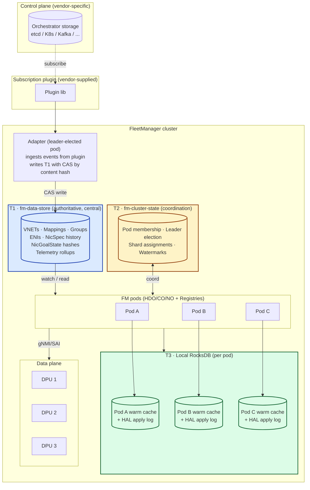
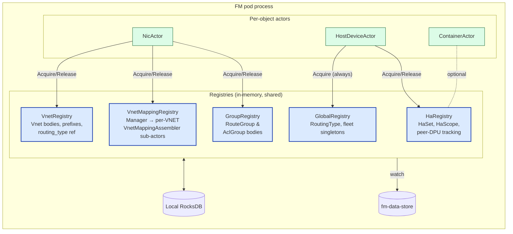
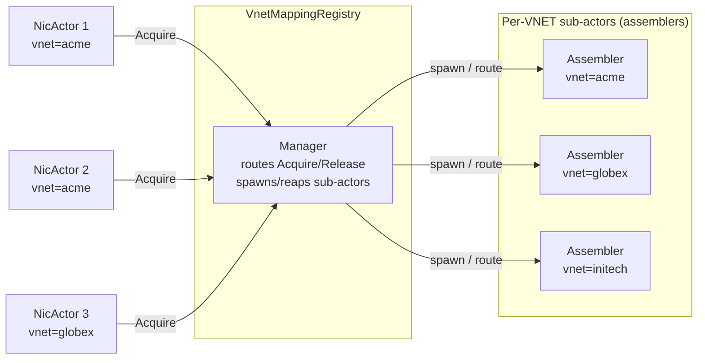
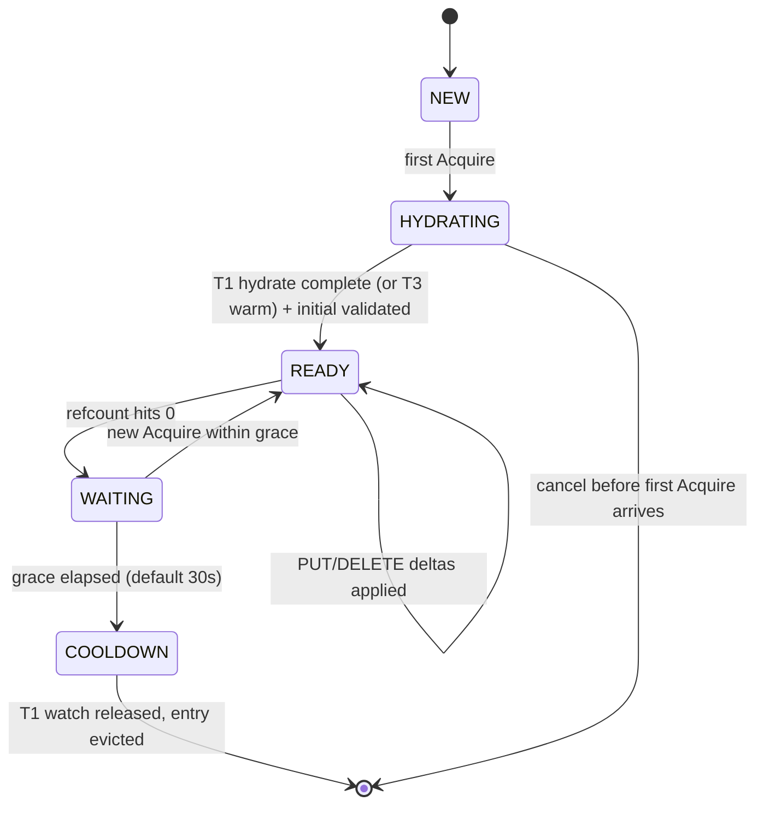
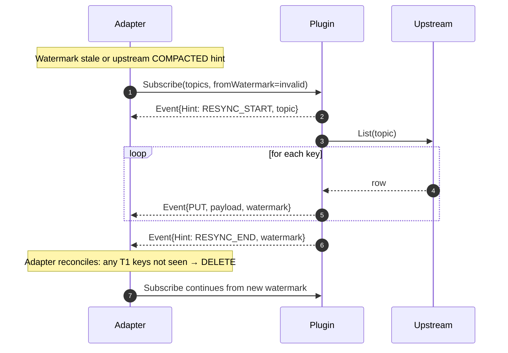
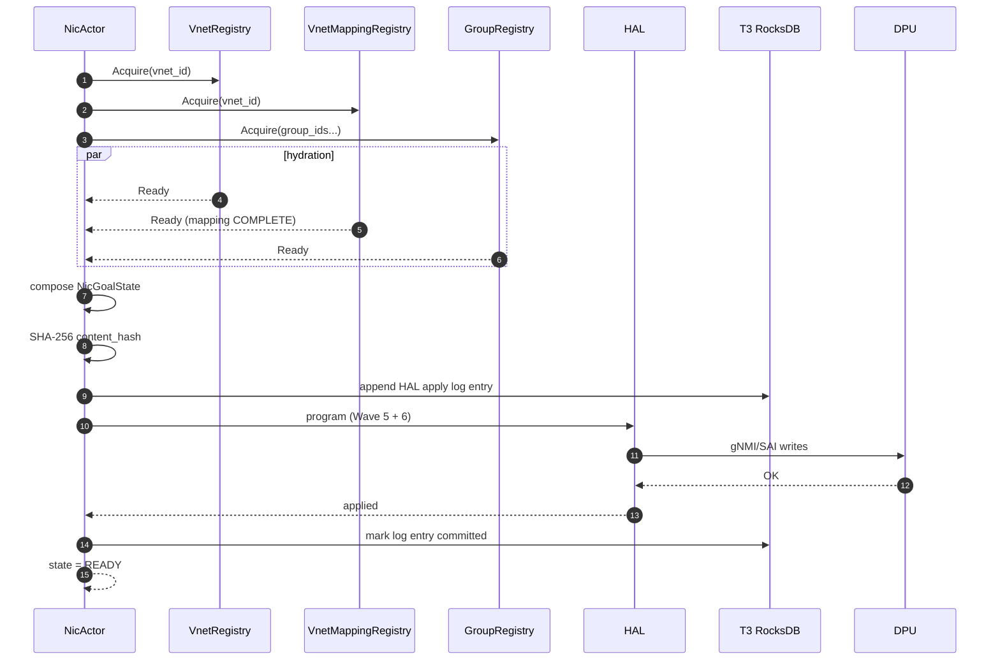
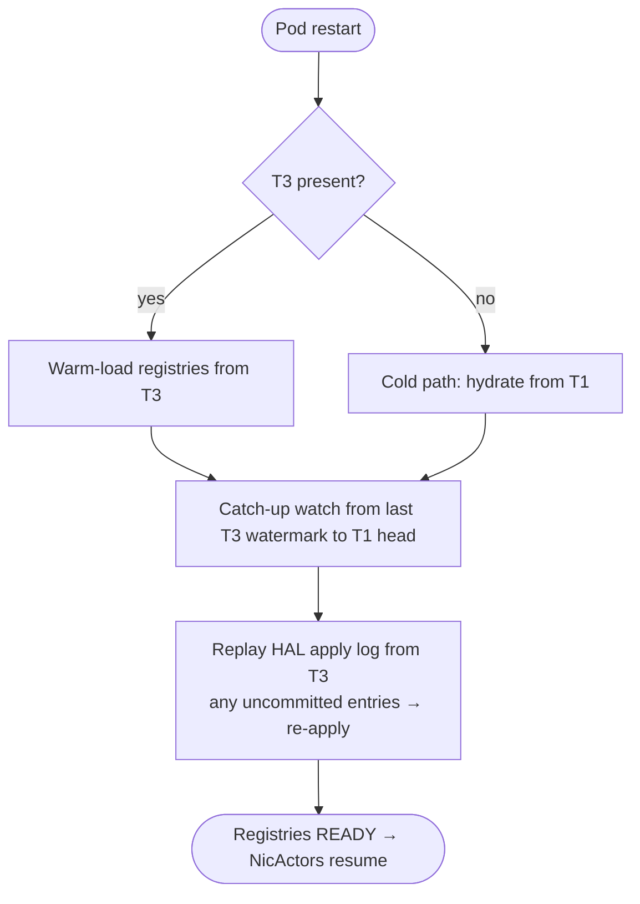
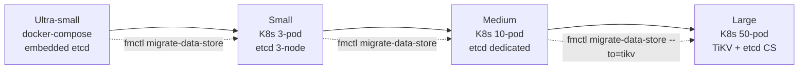

# Me & AI — FleetManager Design Reflection (Registry Pattern + Three-Tier Storage)

> **Topic:** The redesign of FleetManager — the largest discussion in
> the project so far. Out of it came: the *Registry pattern*, the
> *vendor-neutral subscription plugin*, and the *three-tier storage
> architecture*. This doc captures the conversation (including the
> places I had to back down), the diagrams we drew, the
> compare-and-contrast tables, and what improved.

---

## 1. Where it started

Two prompts triggered the redesign, in sequence.

First:

> "Look at the current FM HLD and the provisioning design. Tell me
> what's wrong with the actor-per-ENI subscription model. Be honest —
> don't just rationalize what's there."

Then, after the critique landed:

> "Proceed with all artifacts. Be very explanatory, comprehensive, and
> structured (use diagrams as appropriate)."

And, layered on top:

> "Default backend shall be etcd. But let's ensure our software is
> flexible with all config knobs which provide flexibility to next
> level."

---

## 2. The discussion as it happened

### 2.1 The honest critique

Reading `fleet-manager-hld.md` §3.1–3.4 and `vm-eni-provisioning-design.md`
§5 with the dependency-graph mindset from Learning 11A, three problems
stood out:

| # | Problem | Concrete cost |
|---|---------|---------------|
| 1 | **Watches scale per-ENI, not per-shared-thing.** | A shard with 5,000 DPUs and 100 ENIs each = **500,000 watches** for things the sharing matrix says should collapse to **~100 streams**. |
| 2 | **HDO carries domain caches.** The device adapter ended up holding per-VNET, per-ACL, per-mapping caches because no one else had a place to put them. | Layering violation: HDO's job is *the gNMI/SAI session to a device*, not *what to program*. |
| 3 | **No clean separation between authoritative central state and coordination state.** Heartbeats (every 5s × N pods) and ENI rows (millions, slowly changing) hit the same backend. | Backend sized for chatty side wastes money; sized for bulk side is tail-latency-poisoned by heartbeats. |

I named these to the user. The user's response was, in effect, *"yes,
fix all three."*

### 2.2 Two architectural pushbacks I had to walk back

I started the redesign with two opinions that, on further pushback,
turned out to be wrong. Both are worth recording because they shaped
the final design.

#### Pushback #1 — I argued for one Registry, not five

> *My initial position:* "A single 'NicWorld' registry that keeps
> everything indexed is simpler. Fewer moving parts. The actor system
> can route lookups through one façade."

The user pushed back:

> "No — you're hiding the cardinal rule again. The reason there are
> layers in 11A is that they have *different lifetimes and different
> sharing scopes*. Collapse them and you collapse the gates. I want
> one registry per layer."

That was right. Side-by-side:

| Single-registry (rejected) | Five registries (accepted) |
|---|---|
| One `NicWorld` façade indexes everything. | One registry per dependency layer. |
| `Acquire → Initial → Ready` is a per-key contract — but a "key" mixes Vnet, mapping, group. | Per-layer contract — a Vnet's `Ready` is independent of a Group's `Ready`. |
| Refcount semantics blur (when does a Vnet drop?). | Each registry has its own refcount; mapping stays alive as long as one ENI in the VNET on this DPU is alive. |
| State machine has no place to bolt the `INCOMPLETE_MAPPING` gate. | `VnetMappingRegistry` *is* the gate. |
| Test surface: one fat thing. | Five small things, each with its own test harness; same `Registry[K,V]` interface. |

The five-registry split — Global, Vnet, VnetMapping, Group, Ha — fell
out directly from the sharing matrix in 11A.

#### Pushback #2 — I argued the plugin interface should expose a typed schema

> *My initial position:* "The plugin should know about NicSpec, VNET,
> Mapping types — strongly typed events make the adapter simpler."

The user pushed back:

> "That couples FM to whatever shape upstream uses. Different
> orchestrators publish differently. The plugin's job is to deliver
> *opaque payloads under well-known topic strings* with watermarks.
> The adapter parses. Don't pollute the plugin contract."

Side-by-side:

| Typed plugin (rejected) | Opaque-payload plugin (accepted) |
|---|---|
| `Plugin.OnNicSpec(NicSpec)`, `Plugin.OnVnet(Vnet)` … | `Plugin.Subscribe(topics) → chan Event{topic, payload, watermark}` |
| Every new orchestrator schema = new plugin codegen. | New orchestrator schema = new adapter parser; plugin unchanged. |
| Plugin must depend on FM's protobufs. | Plugin depends only on a tiny Go interface. |
| Hard to write 6 reference plugins (etcd, k8s, kafka, nats, REST, gRPC). | Easy — each is <600 LOC. |
| Conformance tests require schema-aware harness. | Conformance is 10 generic tests over the opaque contract. |

That was also right. The plugin contract converged to:

```go
type Plugin interface {
    Init(ctx context.Context, cfg map[string]any) error
    Topics() []TopicPattern                    // declared topic patterns
    Subscribe(ctx context.Context,
              topics []string,
              fromWatermark Watermark) (<-chan Event, error)
    Get(ctx context.Context, topic, key string) (Event, error)
    List(ctx context.Context, topic string,
         fromWatermark Watermark) (<-chan Event, error)  // for RESYNC
    Health(ctx context.Context) HealthStatus
    Close() error
}

type Event struct {
    Topic     string      // e.g. "fm.vnet.<id>"
    Key       string
    Payload   []byte      // opaque to plugin
    Watermark Watermark
    Hint      Hint        // OOO | COMPACTED | RESYNC_START | RESYNC_END | ...
}
```

Six reference adapters (`etcd-watch`, `k8s-informer`, `kafka`,
`nats-jetstream`, `rest-poll`, `grpc-sidecar`) each fit under 600 lines.

### 2.3 Five smaller pushback resolutions

These came up during the artifact pass; resolutions were quick once
named:

| # | Question | Resolution |
|---|----------|------------|
| 1 | "Why etcd as default?" | Every K8s shop already runs etcd; ultra-small ships embedded. *But every config knob must keep the option to swap* (TiKV, FoundationDB, Cassandra, even Postgres for tiny shops). The `DataStore` interface was kept narrow specifically to make swap cheap. |
| 2 | "Why three tiers and not two?" | T1 = bulk authoritative, T2 = chatty coordination, T3 = per-pod warm cache. Drop T3 → pod restart stampedes T1; drop T2 → lease churn poisons T1; drop T1 → no audit. Documented explicitly in `storage-architecture.md` so it isn't re-litigated. |
| 3 | "What's the manager + per-VNET sub-actor pattern for?" | Mapping assembly was head-of-line-blocking when one slow VNET stalled the whole stream. Splitting into a manager that fans out to per-VNET sub-actors fixed it; registry contract unchanged for callers. |
| 4 | "What is the canonical subscriber identity?" | The `eni_id` format from Decision #13 (`ENI_<DPU>_<MAC>`) — reused; avoided inventing a new identity scheme. |
| 5 | "Where does goal-state durability sit on the cost/safety axis?" | Three modes: `hash_only` (default — cheap, full audit via plugin replay), `full` (durable goal-state, expensive in T1), `hybrid` (full for last N revs, hash-only beyond). Default is `hash_only` because plugin retention covers the same ground. |

### 2.4 The redesign as it landed — three-tier overview



| Tier | Role | Default | Pluggable to | Why separate |
|------|------|---------|--------------|--------------|
| **T1** | Authoritative bulk store; reconciliation truth, audit, backfill | etcd | TiKV, FoundationDB, SQLite (tiny), Cassandra, Postgres | Bulk + slow-changing; can't be poisoned by chatty heartbeats |
| **T2** | Coordination: leader election, shard map, watermarks, pod heartbeats | etcd (often shares T1's cluster in small tiers) | etcd, ZooKeeper | Chatty + small; if it shares T1 in large tiers, T1 gets tail-latency hit |
| **T3** | Per-pod warm cache + HAL apply log + watch resume cursors | RocksDB | BadgerDB, LMDB | Pod-local; restart = warm hydrate from T3, no T1 stampede |

### 2.5 Five-registry pattern



| Registry | Holds | Layer (from 11A) | Subscriber identity | Lifetime |
|----------|-------|-------------------|---------------------|----------|
| **GlobalRegistry** | RoutingType catalog, fleet-wide singletons | L0 | `pod_id` (always 1) | pod lifetime |
| **VnetRegistry** | Vnet bodies, address prefixes | L1a | `eni_id` | refcounted per `vnet_id` |
| **VnetMappingRegistry** | Manifest + chunks (assembled), self-entries | L1b | `eni_id` | refcounted per `vnet_id` |
| **GroupRegistry** | RouteGroup, AclGroup bodies | L2 | `eni_id` | refcounted per `group_id` |
| **HaRegistry** | HaSet, HaScope, peer DPU tracking | L4 (HA only) | `eni_id` | refcounted per `ha_set_id` |

#### The common contract

Every registry implements the same three-method interface:

```go
type Registry[K comparable, V any] interface {
    // First subscriber → opens T1 watch, hydrates from T3 then T1.
    // Nth subscriber → returns Subscription bound to the existing entry.
    Acquire(ctx context.Context, key K, sub SubscriberID) (Subscription[V], cancel func())

    // Decrements refcount. At 0, schedules debounced unsubscribe (default 30s grace).
    Release(key K, sub SubscriberID)

    // Read-only; does NOT register interest. For audit/debug paths.
    Read(key K) (V, bool)
}

type Subscription[V any] struct {
    Updates <-chan Update[V]   // PUT / DELETE / RESYNC
    Initial V                  // current value at acquire time
    Ready   <-chan struct{}    // closed when first hydration is complete
}
```

The `Ready` channel is the **gate from 11A made mechanical**: a NicActor
parks until every `Acquire` it issued has signaled `Ready`. Then it
composes.

#### Manager + per-VNET sub-actor (mapping)



A slow chunk for `globex` no longer blocks `acme`'s assembly. Each
sub-actor owns the manifest + chunk hash validation for its VNET.

#### Registry state machine



### 2.6 The vendor-neutral plugin

```mermaid
flowchart LR
    subgraph UP["Upstream control plane (any vendor)"]
        OE[etcd]
        OK[K8s API]
        OQ[Kafka / NATS]
        OR[REST endpoint]
    end

    subgraph ADP["Adapter (leader-elected FM pod)"]
        direction TB
        PL[Plugin<br/>Subscribe/Get/List]
        PR[Parser<br/>topic-aware]
        CAS[T1 writer<br/>CAS by content hash]
    end

    UP --opaque events--> PL
    PL --topic + payload + watermark--> PR
    PR --typed FM domain object--> CAS
    CAS --PUT--> T1[(T1 fm-data-store)]
```

The plugin only knows: (a) what topics to subscribe to, (b) where to
send events, (c) how to resume from a watermark. The adapter knows the
parser. This decoupling is what allowed six reference plugins to ship
in <600 lines each.

#### Plugin RESYNC sequence



#### Adapter responsibilities

| Concern | Adapter does | Adapter does NOT |
|---------|--------------|-------------------|
| Leader election | one adapter pod owns ingest at a time (T2 lease) | run in parallel without coordination |
| CAS dedup | hashes payload, skips T1 write if hash unchanged | re-write on every event |
| Topic parsing | maps `fm.vnet.<id>` → Vnet protobuf | depend on plugin's typing |
| RESYNC reconciliation | tombstone T1 keys absent from RESYNC | leave stale rows |
| Watermark persistence | writes watermark to T1 after each batch | hold watermark in memory only |

### 2.7 Ingest path sequence

```mermaid
sequenceDiagram
    autonumber
    participant Orch as Orchestrator
    participant P as Plugin
    participant A as Adapter
    participant T1 as T1 fm-data-store
    participant Reg as VnetRegistry
    participant NO as NicActor

    Orch->>P: PUT vnet/acme
    P-->>A: Event{topic=fm.vnet.acme, payload, watermark}
    A->>A: parse → Vnet pb; SHA-256 content hash
    A->>T1: CAS write /fm/v1/vnet/acme (skip if hash same)
    T1-->>Reg: WATCH delivers PUT
    Reg->>Reg: update entry; deliver Update on Subscription
    Reg-->>NO: Update PUT
    NO->>NO: re-compose if needed; emit goal state
```

### 2.8 Compose / program path



### 2.9 Restart recovery flow



This is what makes the **<2-minute warm restart RTO** possible: T3
holds enough state that the pod can re-enter `READY` without
re-downloading every VNET mapping from T1.

### 2.10 Customer tier ladder

The user explicitly wanted *one binary, four tiers*, not separate
products. The tier ladder we documented:

| Tier | DPUs | ENIs | Hosts | T1 backend | T2 | FM pods | Plugin example | $/mo (rough) |
|------|------|------|-------|------------|----|---------|----------------|--------------|
| **Ultra-small** | 1–100 | <5k | 1 | embedded etcd or SQLite | shared with T1 | 1 container | `etcd-watch` | $50 |
| **Small** | 100–500 | 5k–50k | 1–3 nodes | etcd 3-node co-located | shared with T1 | 2–3 pods | `etcd-watch` | $500 |
| **Medium** | 500–5k | 50k–500k | 3–10 nodes | etcd 3-node dedicated | shared with T1 | 5–20 pods | `k8s-informer` or `kafka` | $5,000 |
| **Large** | 5k–10k+ | 500k–10M | 10+ nodes | etcd 5-node or TiKV | etcd 3-node *separate* | 20–100 pods | `kafka` or `grpc-sidecar` | $50,000+ |

Promotion path: change config, run `fmctl migrate-data-store`,
rolling restart. The binary doesn't change; only configuration does.



### 2.11 Recovery story — pay rent for the layered storage

The recovery design (the last big artifact) made the layered storage
*pay rent*. Each failure mode has a defined RTO:

| Failure | RTO | Mechanism |
|---------|-----|-----------|
| Warm pod restart | <2 min | T3 hot-load + T1 catch-up |
| Adapter leader handoff | <15s | T2 lease |
| Plugin disconnect | <60s | Watermark resume |
| Plugin watermark stale | <5 min | RESYNC over List API |
| T1 outage → restore | 30 min RTO, 1h RPO | Snapshot + plugin replay |
| T3 corruption | ~15 min for 100k-ENI shard | Cold pod restart — same as warm but no T3 prime |
| Data-plane HA failover | <2s end-to-end | DPU-level (orthogonal to FM) |

The "rehydrate from a higher-numbered tier or from T1" rule is what
makes recovery analyzable. **The cardinal rule from 11A holds throughout
recovery** — at no point during recovery does an ENI get programmed
before its gates are re-satisfied.

---

## 3. The before/after picture

### 3.1 Architectural shape

```
[BEFORE]                                    [AFTER]
HDO-per-DPU subscribes to                   Plugin → Adapter → T1
everything its NICs need                              ↓
(per-ENI watches)                          ┌──── 5 Registries ────┐
                                            ▼                      ▼
                                       NicActor (Acquire/Release/Read)
                                            ↓
                                       Slim HDO (gNMI/SAI only)
                                            ↓
                                           DPU
```

### 3.2 Side-by-side

| Aspect | Before | After |
|--------|--------|-------|
| Subscription scope | per-ENI | per-shared-thing (registry) |
| Watches in 5,000-DPU shard | ~500,000 | ~100 |
| HDO role | domain caches + gNMI session | gNMI session only ("slim HDO") |
| Domain cache location | scattered in HDO per DPU | single in-pod registry |
| Storage layering | one backend, mixed concerns | T1 / T2 / T3 with distinct workloads |
| Plugin contract | typed, schema-coupled | opaque payloads + topic + watermark |
| Plugin LOC (per orchestrator) | N×schema-coupled | <600 LOC, 6 reference impls |
| Config flexibility | implicit | every knob explicit; `fmctl migrate-data-store` for backend swap |
| Tier scaling | Helm-only | docker-compose → K8s small/medium/large, **same binary** |
| Cardinal-rule enforcement | prose in spec | mechanical: registry `Ready` channel |
| Recovery story | hand-waved | RTO/RPO per failure mode, weekly chaos suite |
| Goal-state durability | implicit (full?) | three modes: `hash_only` (default), `full`, `hybrid` |
| Customer onboarding cost story | implicit | 4 tiers × concrete configs × cost numbers |

---

## 4. What we converged on — eight artifacts

| # | Artifact | What it commits to |
|---|----------|--------------------|
| 1 | `Specs/FM/storage-architecture.md` | Three tiers, narrow `DataStore` interface, default etcd, every knob exposed |
| 2 | `Specs/FM/orchestrator-plugin-interface.md` | Small Go contract, opaque payloads, watermarks, RESYNC, conformance suite, six reference plugins |
| 3 | `Specs/FM/registry-pattern-design.md` | Five registries, common `Acquire/Release/Read` contract, manager+sub-actor for mapping |
| 4 | `Specs/FM/recovery-and-failover-design.md` | Every failure mode, RTO/RPO targets, weekly chaos suite |
| 5 | `Specs/FM/deployment-tiers.md` | Four tiers, concrete configs, migration path |
| 6 | `Specs/FM/fleet-manager-hld.md` | §3.5/§3.6 redesign sections; old §3.1–3.4 marked superseded |
| 7 | `Specs/FM/vm-eni-provisioning-design.md` | §5A — four-phase A/B/C/D flow operationalizing 11A's gates |
| 8 | `Specs/Learning-DashNet/11A-ENI-Dependency-Graph.md` | §14.1–§14.4 closing the loop back from FM to the dependency graph |

A standing rule from this round: **when an FM design call has to be
made, it is judged by whether it preserves the cardinal rule and
respects the sharing matrix.** The 11A artifact and the upstream-DASH
alignment posture are now load-bearing as the *acceptance criteria*
for FM work, not just background.

---

## 5. What we improved (executive summary)

| Before | After |
|--------|-------|
| 500k watches per shard. | ~100 streams per shard. |
| HDO mixed device + domain. | Slim HDO; domain in registries. |
| One backend, mixed workloads. | T1/T2/T3 with distinct backends, each pluggable. |
| Plugin tied to schema. | Opaque payloads, topic+watermark contract. |
| No migration path between sizes. | Same binary, four tiers, `fmctl migrate-data-store`. |
| Recovery hand-waved. | Every failure mode has RTO/RPO + chaos test. |
| Cardinal rule was prose. | Cardinal rule enforced by registry `Ready` gate. |
| Customer tier story implicit. | docker-compose to TiKV ladder, with cost numbers. |

---

## 6. Pointers to the resulting artifacts

All under `Specs/FM/` unless noted:

- `storage-architecture.md`
- `orchestrator-plugin-interface.md`
- `registry-pattern-design.md`
- `recovery-and-failover-design.md`
- `deployment-tiers.md`
- `fleet-manager-hld.md` (§3.5, §3.6 added)
- `vm-eni-provisioning-design.md` (§5A added)
- `Specs/Learning-DashNet/11A-ENI-Dependency-Graph.md` (§14.1–14.4 added)

---

## 7. Why this discussion mattered

Two things came out that go beyond the FM scope:

1. **A *posture* on flexibility.** "Default etcd, but every knob is a
   config knob" became the project's stance on every backend choice
   that comes later — not just storage. The plugin interface is the
   same posture applied to upstream connectivity rather than upstream
   *semantics* (which was the upstream-DASH alignment posture).
2. **A working method.** The pattern of *"honest critique → architectural
   pushback → walk back when wrong → land the design"* became the
   project's working rhythm. Both pushbacks I had to walk back in this
   round (single-registry, typed-plugin) were productive — they
   sharpened the rationale for the final shape, and the docs explain
   *why not* the other path, which makes them harder to regress.

The FM redesign is the project's spine. Most things downstream — multi-
tenancy, cross-region, observability rollups — will graft onto it. The
spine being right *now* is what makes those grafts feasible later.

---

## 8. What I'd do differently next time

A short retrospective on my own behavior in this round:

- I led with the wrong abstraction twice (single registry, typed
  plugin). Both times the user's pushback was the corrective. **Lesson:
  before proposing an abstraction, re-read the *invariant* it has to
  protect.** In both cases the invariant — the cardinal rule, the
  vendor-neutrality goal — was already written down; I had simply not
  re-read it before opining.
- I underused diagrams in the first artifact pass, then over-corrected
  toward diagrams in the next. The right ratio was somewhere in
  between; the user's "use diagrams as appropriate" instruction was
  exactly that — *as appropriate*, not *everywhere*.
- I would have benefited from putting the "what we converged on" and
  "what we improved" sections directly into the FM HLD's redesign
  banner from the start, instead of only here in retrospect. That would
  force the rationale to live next to the design.
