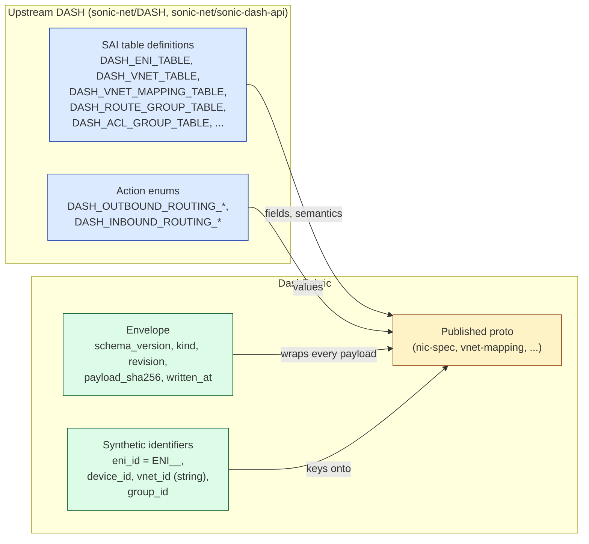

# Me & AI — Upstream DASH Alignment Pass

> **Topic:** Five-file callout pass aligning DashFabric's published proto
> specs with the upstream DASH project — establishing the project's
> *posture* that DashFabric reads as a *consumer* of DASH, not a parallel
> author. This is the warm-up discussion that anchored every later spec.

---

## 1. Where it started

The originating user prompt:

> *"Go through the published proto docs and add explicit callouts so
> that DashFabric clearly references upstream DASH definitions instead
> of inventing parallel ones. We are implementers of the DASH model,
> not authors of it."*

Files in scope:

1. `Specs/protos/published/nic-spec.md`
2. `Specs/protos/published/nic-goal-state.md`
3. `Specs/protos/published/vnet-mapping.md`
4. `Specs/protos/published/routing-type.md`
5. `Specs/FM/fleet-manager-rest-api.md` (§2.7 — the `NicSpec` request schema)

---

## 2. The discussion as it happened

### 2.1 The implicit framing problem

The specs *as written* used DASH-shaped vocabulary throughout but rarely
said the words "DASH" or "upstream". A first-time reader could not tell
whether a field was:

- **(a) inherited** from upstream DASH SAI tables and therefore not
  ours to redefine,
- **(b) a DashFabric envelope** wrapping a DASH payload (so the
  envelope is ours but the payload is theirs), or
- **(c) genuinely DashFabric-original** (e.g., the
  `eni_id = ENI_<DPU>_<MAC>` synthetic identifier).

The user's framing — paraphrased from the exchange — was:

> "If a future contributor reads `nic-spec.md` and thinks the field set
> is something *we* designed, we've done the wrong thing. The fields
> *are* DASH. Make that visible. Where we extend, label the extension."

That single observation is what the alignment pass had to encode in
prose.

### 2.2 The lineage diagram we sketched

To make the (a)/(b)/(c) split explicit, we drew this view of where each
piece of a DashFabric proto comes from:

That diagram is the mental model the alignment callouts had to make
legible inside each file.

### 2.3 What I changed in each file (with the discussion that drove each)

**File 1 — `nic-spec.md`** *(MAC-keyed NIC declaration)*

The discussion: "*This reads like our schema. It isn't. Most of these
fields are DASH `dash_eni` columns, plus the per-direction ACL/route
table bindings.*"

Resulting callouts I added:

- A leading **"Upstream alignment"** box stating that the field set
  derives from `DASH_ENI_TABLE` + the binding tables.
- Per-field-group inline notes naming the upstream SAI table:
  - overlay/MAC group → `DASH_ENI_TABLE`
  - ACL bindings → `DASH_ACL_OUT_TABLE` / `DASH_ACL_IN_TABLE`
  - route bindings → `DASH_ENI_ROUTE_TABLE` + `DASH_ROUTE_RULE_TABLE`
  - HA scope → `DASH_HA_*` family
- A standout note that **upstream `DASH_ENI_TABLE` does NOT have an
  `overlay_ip` column** — that lives only as a row in
  `DASH_VNET_MAPPING_TABLE` (the *self-entry*). The presence of
  `primary_ip_v4`/`primary_ip_v6` in NicSpec is a *DashFabric
  convenience* that materializes the self-entry at compose time.

**File 2 — `nic-goal-state.md`** *(composed per-DPU programming bundle)*

The discussion: "*Goal-state is what we hand to HAL. The slices in it
each correspond to a DASH SAI table — readers shouldn't have to guess
which.*"

Resulting callouts:

- New **"Upstream alignment"** section with a table mapping each
  goal-state slice to its DASH table:

  | Goal-state slice | Upstream DASH artifact |
  |------------------|------------------------|
  | `eni_row` | `DASH_ENI_TABLE` |
  | `eni_route_v4`, `eni_route_v6` | `DASH_ENI_ROUTE_TABLE` |
  | `acl_in[3]`, `acl_out[3]` | `DASH_ACL_IN_TABLE`, `DASH_ACL_OUT_TABLE` |
  | `route_rules` | `DASH_ROUTE_RULE_TABLE` |
  | `meter_in`, `meter_out` | SAI meter attribute on ENI |
  | `mapping_self_entry` | `DASH_VNET_MAPPING_TABLE` (single row) |

- Explicit note that DashFabric's `revision` + `content_hash` are
  *envelope* metadata, not part of DASH semantics.

**File 3 — `vnet-mapping.md`** *(`mac → underlay PA` mapping table)*

The discussion: "*The whole table semantics are
`dash_outbound_ca_to_pa` + `dash_inbound_routing`. Our manifest+chunks
packaging is *ours*, but the rows themselves are DASH.*"

Resulting callouts:

- Header callout that the row shape is the
  `DASH_VNET_MAPPING_TABLE` upstream definition.
- Distinction made between **delivery shape** (manifest + chunks; ours,
  for transport efficiency) and **row semantics** (DASH).
- The HDO-side assembly lifecycle was framed as a *DashFabric*
  implementation of how the upstream table gets to the DPU — not a
  DASH-level concept.

**File 4 — `routing-type.md`** *(action chains for routing decisions)*

The discussion: "*Each action enum we use has an upstream name. Don't
make readers grep upstream — put the upstream action in parentheses
inline.*"

Resulting callouts:

Each routing action acquired an inline `(DASH: <upstream-action-name>)`
parenthetical, e.g.:

| DashFabric action | Upstream DASH equivalent |
|-------------------|---------------------------|
| `vnet` | `SAI_OUTBOUND_ROUTING_ENTRY_ACTION_ROUTE_VNET` |
| `vnet_direct` | `SAI_OUTBOUND_ROUTING_ENTRY_ACTION_ROUTE_VNET_DIRECT` |
| `direct` | `SAI_OUTBOUND_ROUTING_ENTRY_ACTION_ROUTE_DIRECT` |
| `service_tunnel` | `SAI_OUTBOUND_ROUTING_ENTRY_ACTION_ROUTE_SERVICE_TUNNEL` |
| `private_link` | `SAI_OUTBOUND_ROUTING_ENTRY_ACTION_ROUTE_PRIVATELINK` |
| `private_link_mapping` | `SAI_OUTBOUND_ROUTING_ENTRY_ACTION_ROUTE_PRIVATELINK_MAPPING` |
| `drop` | `SAI_OUTBOUND_ROUTING_ENTRY_ACTION_DROP` |

(Exact upstream names in the file — the callout makes the lineage
greppable.)

**File 5 — `fleet-manager-rest-api.md` §2.7** *(REST `NicSpec` endpoint)*

The discussion: "*This looks like a fresh JSON schema. The body shape is
DashFabric's REST envelope around the DASH-shaped NIC declaration. Say
that.*"

Resulting callout: a leading paragraph in §2.7 stating the body is a
DashFabric envelope whose payload follows `nic-spec.md`, which itself
derives from upstream DASH.

### 2.4 What I deliberately did *not* do

The user's intent was a *callout pass*, not a rename pass. So:

| Tempting | Why we declined |
|----------|-----------------|
| Rename DashFabric fields to match upstream exactly. | Compatibility cost; breaks anyone already integrating. Out of scope for this pass. |
| Replace the field tables with bare links to upstream. | The published docs are meant to be readable standalone. Callouts are *additive* — they reveal lineage without forcing a doc-hop. |
| Auto-generate the proto files from upstream SAI definitions. | Sound idea long-term; not in scope for an alignment-callout pass. |
| Drop the `Envelope` wrapper to be "more DASH-like". | Envelope is load-bearing for FM — schema versioning, content-hash dedup, revision tracking. Keeping it labeled as DashFabric is the right answer. |

---

## 3. What we converged on

A standing rule that now governs every published-proto doc:

> **Every DASH-derived concept must, in the doc that introduces it,
> name the upstream DASH artifact it derives from. If DashFabric
> extends or envelopes the concept, the extension is labeled as such.**

This is a *posture*, not a one-time edit. Future protos added to
`Specs/protos/published/` are expected to carry the same callouts.

---

## 4. What we improved

| Before | After |
|--------|-------|
| Reader could not tell which fields were DASH and which were DashFabric inventions. | Every DASH-sourced field group is labeled with its upstream SAI table. |
| `routing-type.md` actions read like DashFabric vocabulary. | Each action carries a `(DASH: <upstream-action-name>)` cross-reference. |
| FM REST `NicSpec` body looked like a fresh schema. | §2.7 now flags it as a DashFabric envelope around the DASH NIC declaration. |
| Goal-state slices appeared as a flat structure. | Each slice tagged with the DASH table it programs. |
| `nic-spec.md` overlay-IP fields presented as upstream-natural. | Now flagged as a DashFabric convenience that materializes a self-entry in `DASH_VNET_MAPPING_TABLE`. |
| Mapping doc conflated delivery shape with row semantics. | Manifest+chunks packaging marked DashFabric; row shape marked DASH. |
| No project-wide rule on upstream alignment. | Standing rule established for all future published protos. |

---

## 5. Pointers to the resulting artifacts

All five appear as `M` (modified) in this branch's git status — the
alignment callouts produced those modifications:

- `Specs/protos/published/nic-spec.md`
- `Specs/protos/published/nic-goal-state.md`
- `Specs/protos/published/vnet-mapping.md`
- `Specs/protos/published/routing-type.md`
- `Specs/FM/fleet-manager-rest-api.md` (§2.7)

---

## 6. Why this discussion mattered

It was small in word-count but set the *posture* of every spec that
followed:

1. **The ENI Dependency Graph (Learning 11A)** draws its 5-layer cake
   directly from DASH table semantics. That exercise was only legible
   because we'd already drawn the line between "upstream" and "ours".
2. **The FleetManager redesign** treats DASH-shaped goal-state as the
   payload it programs; FM's job is the *delivery* and *coordination*
   problem around it, not the schema problem inside it. The clean
   separation between envelope and payload — asserted in this pass —
   is what made that scoping possible.
3. **The orchestrator plugin contract** — opaque payloads under
   well-known topic strings — is the same posture applied to upstream
   *connectivity* rather than upstream *semantics*. We don't redefine
   the orchestrator's wire format; we plug in.

Without this pass, every later doc would have re-litigated "is this our
field or theirs?" — and would have drifted.

---

## 7. Lessons (for future alignment passes)

- **Callout, don't rename.** Lineage made visible is cheap;
  vocabulary changes are expensive.
- **Three-bucket every field**: upstream / envelope / synthetic. Once
  the bucket is stated, the rest of the prose writes itself.
- **Diagrams over prose** for lineage. The mermaid in §2.2 above tells
  the story faster than three paragraphs would.
- **Treat the rule as a posture.** A one-time pass decays unless future
  contributors know the standard. The rule in §3 is what survives the
  pass.
