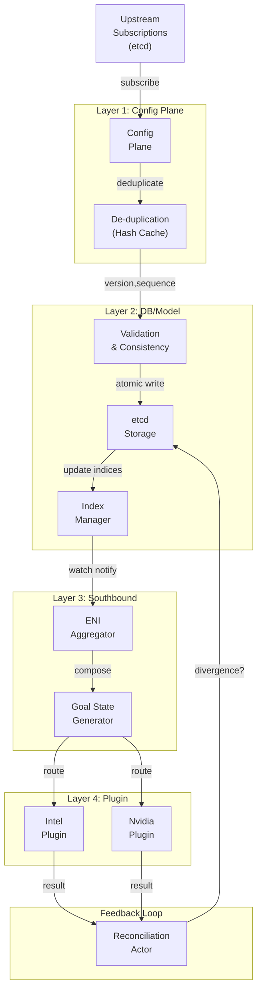

# FM Control Plane: Complete Architecture Specification

**Version**: 1.0  
**Status**: Design Complete - Ready for Implementation  
**Last Updated**: 2026-06-19  
**Author**: Architectural Team

---

## Table of Contents

1. [Overview & Vision](#overview--vision)
2. [Architecture Layers](#architecture-layers)
3. [Core Design Principles](#core-design-principles)
4. [Data Flow](#data-flow)
5. [Component Interaction](#component-interaction)
6. [Quality Attributes](#quality-attributes)
7. [Implementation Roadmap](#implementation-roadmap)
8. [Design Documents Index](#design-documents-index)

---

## Overview & Vision

### Problem Statement

DashFabric requires a production-grade **Fabric Management (FM) Control Plane** to manage networking configuration for:
- **DASH Hosts** (compute hosts with DPU/NIC hosting VMs via SR-IOV)
- **DASH Appliances** (external devices serving as floating NICs)
- **ENIs** (Elastic Network Interfaces) with complex configuration hierarchies
- **Multi-tenant workloads** at scale (1000s of hosts, 100k+ ENIs)

Existing limitations:
- FM-GW and CB-GW are point solutions (replaced by Weaver)
- No unified data model for ENI configuration
- Scale concerns with duplicate notifications and configuration inconsistency
- No feedback loops for divergence detection

### Vision

**A distributed, scalable, resilient control plane that:**
1. **Absorbs complexity** - handles subscription management, versioning, deduplication
2. **Ensures consistency** - maintains strict data model invariants across all layers
3. **Enables extensibility** - pluggable vendors (Intel, Nvidia, custom DASH) without breaking existing pipelines
4. **Provides observability** - comprehensive versioning, tracing, and reconciliation
5. **Scales horizontally** - per-construct actors, etcd-backed storage, lock-free operations where possible

---

## Architecture Layers

### Four-Layer Model

```
┌─────────────────────────────────────────────────────────────┐
│ Layer 1: Config Plane                                       │
│ Input: Subscription changes from external systems (etcd)    │
│ Output: Deduplicated, versioned ConfigUpdate events         │
├─────────────────────────────────────────────────────────────┤
│ Layer 2: Database/Model Management                          │
│ Input: ConfigUpdate events                                  │
│ Output: Normalized, consistent construct storage            │
├─────────────────────────────────────────────────────────────┤
│ Layer 3: Southbound Data Provider                           │
│ Input: Construct changes (via etcd watch)                   │
│ Output: Per-ENI Goal State (full DASH model)                │
├─────────────────────────────────────────────────────────────┤
│ Layer 4: Goal State Programming Plugin                      │
│ Input: Goal State (DASH proto)                              │
│ Output: Programming result (success/partial/failure)        │
└─────────────────────────────────────────────────────────────┘
     ↓
┌─────────────────────────────────────────────────────────────┐
│ Feedback Loop: Reconciliation & State Sync                  │
│ Monitors: Actual state vs. desired state divergence         │
│ Action: Triggers re-programming or alerts                   │
└─────────────────────────────────────────────────────────────┘
```

### Layer Responsibilities

| Layer | Role | Key Concern |
|-------|------|-------------|
| **Layer 1: Config Plane** | Ingest, validate, deduplicate | Eliminate noise from duplicate subscriptions |
| **Layer 2: Database/Model** | Store, normalize, maintain consistency | Single source of truth for all constructs |
| **Layer 3: Southbound Provider** | Generate deployment plans | Per-ENI Goal State encapsulation |
| **Layer 4: Plugin** | Execute on devices | Vendor-agnostic, extensible programming |
| **Feedback Loop** | Detect & recover divergence | Reliability and correctness |

---

## Core Design Principles

### 1. Versioning for Deduplication & Idempotency

Every construct has:
- **Version number** (logical causality, e.g., RouteTable_v6)
- **Content hash** (SHA256 of canonical JSON for idempotency)
- **Sequence number** (global ordering, monotonic)

**Benefit**: Duplicate notifications (common in distributed systems) cost only a hash comparison, not full reprocessing.

### 2. Per-ENI Goal State Encapsulation

Goal State is **per-ENI**, containing:
- Complete ENI configuration
- Full hierarchical DASH model (routes, ACLs, mappings)
- Version stamps for all constructs
- Fingerprint for idempotency check

**Benefit**: Localizes blast radius on failure; enables independent retry per ENI.

### 3. Feedback Loops for Reliability

```
Goal State Programming Plugin → [success/partial/failure] → Reconciliation Actor
                                                                    ↓
                                         [divergence detected?] → re-apply or alert
```

**Benefit**: System detects and recovers from divergence without manual intervention.

### 4. Pluggable Architecture for Extensibility

Goal State Programming is a **library-based plugin interface**, not gRPC:
- Intel DPU plugin (handles Intel-specific extensions)
- Nvidia DPU plugin (handles Nvidia-specific extensions)
- Custom plugins (vendor-provided, experimental)

**Benefit**: New DASH proto versions or vendor extensions don't require re-deployment; instantiate new plugin instance.

### 5. Strict Consistency Model

Invariants enforced at each layer:
- No circular dependencies
- No dangling references
- VNET isolation (RouteTable_A not accessible from VNET_B)
- Version monotonicity (v5 → v6, never v5 → v4)

**Benefit**: Prevents cascading failures from inconsistent state.

---

## Data Flow

### Complete Request Journey

```
1. External subscription update (etcd notification)
   ↓ [Layer 1: Config Plane]
   - Validate schema
   - Compute contentHash
   - Check hash cache: is this a duplicate?
   - If duplicate: SKIP (metric: dedup_hit)
   - If new: assign sequence, version, emit ConfigUpdate
   ↓ [Layer 2: Database/Model Management]
   - Validate: constructs don't reference non-existent entities
   - Validate: no circular dependencies
   - Validate: version is monotonic
   - Write to etcd (atomic transaction)
   - Update indices (for fast lookup)
   - Emit: "ConstructUpdated" event
   ↓ [Layer 3: Southbound Data Provider]
   - Triggered by: etcd watch notification of construct change
   - For each ENI in affected VNET:
     * Fetch all constructs for this ENI
     * Compose Goal State (full DASH model)
     * Stamp version and compute fingerprint
     * Route to appropriate plugin (Intel/Nvidia/Custom)
   ↓ [Layer 4: Goal State Programming Plugin]
   - Receive Goal State
   - Check: "Is this fingerprint already applied?" (from cache)
   - If yes: return cached result (idempotent)
   - If no: call DASH Programmer API
   - Receive result: status, applied_version, actual_fingerprint
   - Return result to Southbound Provider
   ↓ [Feedback Loop: Reconciliation]
   - Every 5-10 minutes: Query actual state from device
   - Compare: desired (Goal State) vs. actual
   - If match: OK
   - If divergence: re-apply Goal State (with retry logic)
```

---

## Component Interaction

### Communication Patterns

**Layer 1 ↔ Layer 2**: Async, event-driven
- Layer 1 → Layer 2: `ConfigUpdate` proto (versioned, sequenced)
- Storage: etcd
- Pattern: Publish-subscribe (etcd watch)

**Layer 2 ↔ Layer 3**: Async, watch-based
- Trigger: etcd watch on `/fm/constructs/*`
- Layer 3 queries Layer 2 for complete construct set
- Pattern: Pull-on-notification

**Layer 3 ↔ Layer 4**: Sync, request-response
- Layer 3 → Layer 4: `GoalState` proto (in-memory)
- Layer 4 → Layer 3: `ProgrammingResult` proto
- Pattern: Library call (not gRPC)

**Reconciliation → All Layers**: Async, monitoring
- Query Layer 4 (actual state)
- Compare with Layer 3 (desired state)
- Feedback to Layer 2 (if divergence detected)
- Trigger re-programming

### Concurrency Model

**Layer 1**: Single goroutine per tenant (sequential processing)

**Layer 2**: 
- One actor per construct type (RouteTable Actor, ACL Actor, etc.)
- Actors run in parallel
- Within one construct type, updates are serialized

**Layer 3**: 
- One aggregator per VNET (can run in parallel)
- Goal State generation is deterministic, no locking

**Layer 4**:
- Plugin spawns N worker goroutines (configurable, e.g., 10)
- Each worker handles one ENI programming task
- Worker pool manages concurrency

---

## Quality Attributes

### 1. Reliability

- **Versioning**: Every update is versioned, enabling rollback and replay
- **Deduplication**: Duplicate notifications don't cause re-processing
- **Feedback loops**: Detect and recover from divergence
- **Idempotency**: Goal State can be applied multiple times safely

**Target**: 99.99% availability, < 1 second recovery on transient failures

### 2. Scalability

- **Per-construct actors**: Horizontal scale by adding FM instances
- **etcd-backed storage**: Distributed consensus, replication built-in
- **Plugin worker pools**: Configurable concurrency per plugin
- **Index optimization**: Fast lookups even with 100k+ constructs

**Target**: Support 1000s of hosts, 100k+ ENIs, sub-second latency

### 3. Consistency

- **Strict invariants**: Enforced at each layer
- **Atomic writes**: Single construct update is atomic
- **Cascading deletes**: VNET deletion cascades to all children
- **Relation validation**: No dangling references

**Target**: No inconsistent state, 100% data integrity

### 4. Observability

- **Versioning**: Full audit trail (who changed what, when)
- **Metrics**: Prometheus-compatible metrics at each layer
- **Tracing**: Request flow from Config Plane → Plugin
- **Structured logging**: JSON logs with context

**Target**: < 1 second issue detection, root cause identification

### 5. Maintainability

- **Clear separation of concerns**: Each layer has one job
- **Plugin architecture**: Easy to add new vendors without modifying core
- **Deterministic algorithms**: Easy to test and reason about

**Target**: < 1 day to onboard new vendor

---

## Implementation Roadmap

### Phase 1: Foundation (Weeks 1-4)
**Deliverable**: Layer 2 (Database/Model) with etcd storage

- Implement versioning infrastructure (version, sequence, hash)
- Implement Layer 2: construct storage, consistency checking, indices
- etcd integration (connect, watch, atomic writes)
- Unit tests for consistency algorithms
- Integration tests with real etcd

**Success Criteria**:
- ✓ Constructs stored correctly with versions
- ✓ Consistency checks prevent invalid states
- ✓ Indices enable fast O(log n) lookups
- ✓ Cascading deletes work correctly

### Phase 2: Config Plane & Integration (Weeks 5-8)
**Deliverable**: Layer 1 (Config Plane) + end-to-end Config → Layer 2

- Implement Layer 1: subscription ingestion, hash cache, sequencer
- Implement deduplication algorithm
- End-to-end tests: Duplicate subscriptions cost only hash comparison
- Verify version/sequence assignment

**Success Criteria**:
- ✓ Duplicate notifications deduplicated (0 reprocessing)
- ✓ Hash cache hit rate > 90% on production-like workload
- ✓ Deduplication latency < 1ms

### Phase 3: Southbound Provider (Weeks 9-13)
**Deliverable**: Layer 3 (Southbound Provider) + Goal State generation

- Implement ENI aggregator (fetch constructs for one ENI)
- Implement Goal State generator (compose full DASH model)
- Implement version stamper and fingerprint computation
- Implement partial failure handler (retry logic)
- Integration tests: Layer 2 → Layer 3 → mock plugin

**Success Criteria**:
- ✓ Goal State generation deterministic (same input = same output)
- ✓ Version consistency across all constructs in Goal State
- ✓ Partial failure recovery works (max 3 retries)

### Phase 4: Plugin Architecture & Reconciliation (Weeks 14-26)
**Deliverable**: Layer 4 (Plugin) + Reconciliation + Production readiness

- Implement plugin registry and loader
- Implement Intel DPU plugin (example)
- Implement Nvidia DPU plugin (example)
- Implement reconciliation actor (periodic sync)
- Implement feedback loop (result handling)
- Implement observability (metrics, logging, tracing)
- Production deployment guide
- Load testing (100k ENIs, 1000 hosts)

**Success Criteria**:
- ✓ Plugin interface extensible (new vendor in < 1 day)
- ✓ Reconciliation detects divergence within 5-10 minutes
- ✓ System recovers from 90% of failures automatically
- ✓ < 10 seconds latency from subscription to Goal State on device

---

## Design Documents Index

This architecture is defined across multiple detailed design specifications:

### Core Layer Specifications

1. **[FM_DESIGN_LAYER1_CONFIG_PLANE.md](FM_DESIGN_LAYER1_CONFIG_PLANE.md)**
   - Config Plane responsibilities
   - Subscription management
   - De-duplication algorithm
   - Hash cache implementation

2. **[FM_DESIGN_LAYER2_DATABASE_MODEL.md](FM_DESIGN_LAYER2_DATABASE_MODEL.md)**
   - Database/Model layer design
   - Actor model for constructs
   - Consistency enforcement
   - Cascading deletes
   - etcd integration

3. **[FM_DESIGN_LAYER3_SOUTHBOUND.md](FM_DESIGN_LAYER3_SOUTHBOUND.md)**
   - Southbound Data Provider design
   - ENI aggregation
   - Goal State generation
   - Version stamping
   - Partial failure handling

4. **[FM_DESIGN_LAYER4_PLUGIN.md](FM_DESIGN_LAYER4_PLUGIN.md)**
   - Goal State Programming Plugin architecture
   - Plugin interface contract
   - Multi-vendor support (Intel, Nvidia, Custom)
   - Idempotency guarantees
   - Worker pool concurrency

### Cross-Cutting Concerns

5. **[FM_DESIGN_VERSIONING_DEDUP.md](FM_DESIGN_VERSIONING_DEDUP.md)**
   - Versioning model (version + hash + sequence)
   - De-duplication flow
   - Content-addressed hashing
   - Deduplication impact on scale

6. **[FM_DESIGN_FEEDBACK_RECONCILIATION.md](FM_DESIGN_FEEDBACK_RECONCILIATION.md)**
   - Bidirectional feedback loops
   - Reconciliation cycle design
   - Divergence detection
   - Recovery strategies
   - Consistency invariants

7. **[FM_DESIGN_CONSISTENT_MODELING.md](FM_DESIGN_CONSISTENT_MODELING.md)**
   - Canonical data model for constructs
   - Naming conventions
   - Consistency checks at each layer
   - Isolation principles
   - Reference vs. embedding decisions

8. **[FM_DESIGN_SCHEMAS.md](FM_DESIGN_SCHEMAS.md)**
   - Protobuf message definitions
   - Message schemas for each layer
   - Naming conventions and conventions
   - Version propagation

### Implementation Guides

9. **[FM_IMPLEMENTATION_ROADMAP.md](FM_IMPLEMENTATION_ROADMAP.md)**
   - Detailed 4-phase implementation plan
   - Week-by-week breakdown
   - Success criteria for each phase
   - Risk mitigation strategies

---

## Quick Reference: Data Flow Diagrams

### Mermaid: Complete Data Flow



### State Machine: ENI Lifecycle

```
PENDING
  ↓
SYNCING ←─────────────┐
  ├→ SYNCED          │
  └→ DEGRADED ───────┘
       ↓
    DELETED
```

---

## Architecture Principles Summary

| Principle | Implementation | Benefit |
|-----------|---|---|
| **Layered design** | Clear separation of concerns | Easy to test, modify, extend |
| **Versioning everywhere** | Every construct versioned | Full audit trail, idempotency |
| **Per-ENI encapsulation** | Goal State per-ENI | Localized failure domains |
| **Feedback loops** | Reconciliation cycle | Reliability, automatic recovery |
| **Pluggable vendors** | Library-based plugins | Extensibility without re-deployment |
| **Strict consistency** | Invariants at each layer | Data integrity, correctness |

---

## Next Steps for Implementation Teams

1. **Review** each design document in the index above
2. **Clarify** any ambiguities with architecture team
3. **Start Phase 1** with Layer 2 (Foundation)
4. **Build comprehensive tests** (unit + integration + chaos)
5. **Implement observability** from day 1 (metrics, logging)
6. **Document APIs** as you build (proto files, interfaces)

---

## Appendix: Glossary

- **ENI**: Elastic Network Interface (network interface for a VM)
- **VNET**: Virtual Network (top-level construct in hierarchy)
- **Goal State**: Complete per-ENI configuration in DASH proto format
- **Construct**: Reusable building block (RouteTable, ACL, Mapping, ENI)
- **Deduplication**: Skipping re-processing of identical inputs
- **Idempotency**: Applying same input multiple times = applying once
- **Reconciliation**: Detecting and recovering from divergence between desired and actual state
- **Fingerprint**: Content hash for idempotency verification
- **Plugin**: Vendor-specific library for Goal State programming

---

**Document Status**: Complete - Ready for team review and implementation planning
