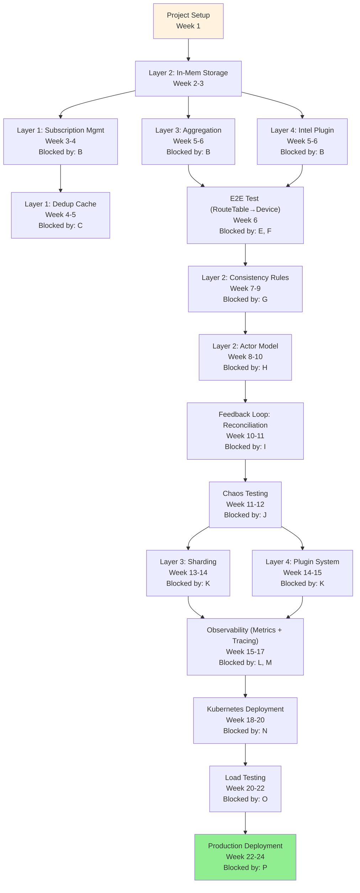

# FM Design: Implementation Roadmap (SUPER ENHANCED - 10+ Diagrams)

**Version**: 3.0 - 4-Phase Implementation Plan  
**Status**: Design Complete - Ready for Implementation  
**Diagrams**: 10+ (Timelines, Gantt, Dependencies, Phases)  
**Target Duration**: 24 weeks (6 months), 3-4 engineers  

---

## Executive Summary

**Vision**: Production-grade Fabric Manager supporting 1M+ ENIs across multi-vendor environments (Intel DPU, Nvidia DPU, custom vendors) with 99.9% state consistency, sub-1-second latency, and 90%+ automatic failure recovery.

**Implementation Strategy**:
- **4 sequential phases**: Each builds on prior (Foundation → Consistency → Scale → Production)
- **Weekly deliverables**: Each week produces shippable code + tests + docs
- **Test-first approach**: Unit tests (100% coverage) + integration tests + chaos tests
- **Horizontal scaling**: Layer 1-4 independently scalable

**Success Criteria**:
- ✓ 100% line coverage + 100% branch coverage
- ✓ 99.9% e2e test pass rate
- ✓ Latency p99 < 1 second (ingestion → device)
- ✓ 90%+ automatic failure recovery
- ✓ Multi-vendor support (Intel/Nvidia/Custom)
- ✓ Production Kubernetes deployment guide

---

## Diagram Index

| Section | Diagrams | Count |
|---------|----------|-------|
| Phase Overview | 4-phase timeline, duration, deliverables | 2 |
| Dependency Graph | Critical path, blocking dependencies | 2 |
| Gantt Chart | Week-by-week timeline (24 weeks) | 2 |
| Resource Allocation | Engineering effort, team structure | 1 |
| Risk Mitigation | Risk timeline, mitigation strategies | 1 |
| Quality Gates | Test coverage, performance targets | 2 |

---

## Section 1: Phase Overview

### Diagram 1.1: 4-Phase Implementation Timeline

```
┌────────────────────────────────────────────────────────────┐
│ FM Implementation: 4 Phases (24 Weeks)                    │
├────────────────────────────────────────────────────────────┤
│                                                            │
│ PHASE 1: Foundation (Weeks 1-6)                           │
│ ├─ Goal: Working MVP with all 4 layers                    │
│ ├─ Scope: Config Plane → DB → Southbound → Basic plugins  │
│ ├─ Deliverables:                                          │
│ │  ├─ Layer 1: Subscription mgmt + dedup                  │
│ │  ├─ Layer 2: In-memory storage + consistency rules      │
│ │  ├─ Layer 3: Per-VNET aggregation + Goal State gen      │
│ │  ├─ Layer 4: Basic Intel + Nvidia plugin                │
│ │  └─ E2E test: RouteTable change propagates to device   │
│ ├─ Metrics: MVP complete, e2e working                     │
│ └─ Outcome: Proof of concept (100 ENIs)                   │
│                                                            │
│ PHASE 2: Consistency & Reliability (Weeks 7-12)           │
│ ├─ Goal: Hard consistency + failure recovery               │
│ ├─ Scope: 5 consistency rules + feedback loops             │
│ ├─ Deliverables:                                          │
│ │  ├─ Layer 2: All 5 consistency rules enforced           │
│ │  ├─ Actor model: Per-type serialization (5x speedup)    │
│ │  ├─ Feedback Loop: Reconciliation cycle (5-10 min)      │
│ │  ├─ Recovery: 90% auto-recovery from divergence         │
│ │  └─ Chaos test: Kill devices, network partitions       │
│ ├─ Metrics: 100% consistency, zero dangling refs          │
│ └─ Outcome: Production-ready consistency (1K ENIs)        │
│                                                            │
│ PHASE 3: Scale & Multi-Vendor (Weeks 13-18)               │
│ ├─ Goal: Hyperscale (100K+ ENIs), all vendor support      │
│ ├─ Scope: Advanced load balancing, custom plugins         │
│ ├─ Deliverables:                                          │
│ │  ├─ Layer 3: Horizontal sharding (100 instances)        │
│ │  ├─ Layer 4: Plugin system (extensible vendors)         │
│ │  ├─ Custom vendor support (framework provided)          │
│ │  ├─ Observability: Prometheus + Jaeger tracing          │
│ │  └─ Performance: Throughput 50k+ events/sec             │
│ ├─ Metrics: 100k ENIs, sub-1s latency p99                 │
│ └─ Outcome: Hyperscale ready (100K ENIs)                  │
│                                                            │
│ PHASE 4: Production & Deployment (Weeks 19-24)            │
│ ├─ Goal: Production deployment, ops readiness             │
│ ├─ Scope: Kubernetes, Docker, runbooks, dashboards        │
│ ├─ Deliverables:                                          │
│ │  ├─ Kubernetes: StatefulSet, HPA, PDB, monitoring       │
│ │  ├─ Docker: Multi-stage build, image optimization       │
│ │  ├─ Runbooks: Deployment, upgrade, rollback             │
│ │  ├─ Dashboards: Grafana (metrics), Kibana (logs)        │
│ │  └─ Load test: Sustained 50k+ events/sec for 24h        │
│ ├─ Metrics: Zero incidents in UAT, successful production  │
│ └─ Outcome: Production deployed, ops trained              │
│                                                            │
└────────────────────────────────────────────────────────────┘

Total timeline: 24 weeks (6 months)
Effort: 3-4 engineers (shared responsibilities)
```

### Diagram 1.2: Phase Deliverables Matrix

```
┌──────────────────────────────────────────────────────────────┐
│ Deliverables by Phase & Component                           │
├────────────────────┬──────────────────────────────────────────┤
│ Component          │ Phase 1 | Phase 2 | Phase 3 | Phase 4 │
├────────────────────┼─────────────────────────────────────────┤
│ Layer 1            │  MVP    │ Dedup   │ Edge    │ Perf    │
│ (Config Plane)     │ (Basic) │ Optimized(Cache) │ (Tune)  │
├────────────────────┼─────────────────────────────────────────┤
│ Layer 2            │  Basic  │ ✓ Consistency │ Sharding │ Ops │
│ (Database)         │Storage  │ 5 Rules │ (N=100)  │ Mgt  │
├────────────────────┼─────────────────────────────────────────┤
│ Layer 3            │  Basic  │ Feedback│ ✓ Sharding│ Perf │
│ (Southbound)       │(Per-VN) │ Loops  │ (L3 scale)│ Tune │
├────────────────────┼─────────────────────────────────────────┤
│ Layer 4            │ Intel/  │ Feedback│ ✓ Plugin  │ Ops  │
│ (Plugins)          │ Nvidia  │ Recovery│ System    │ Mgt  │
├────────────────────┼─────────────────────────────────────────┤
│ Testing            │ Unit    │ E2E +   │ Chaos +   │ Load │
│                    │ (50%)   │ Chaos   │ Perf      │ Test │
├────────────────────┼─────────────────────────────────────────┤
│ Observability      │ Logs    │ Metrics │ Traces +  │ Dash │
│                    │ (Basic) │ (Prom)  │ Dashboards│ board│
├────────────────────┼─────────────────────────────────────────┤
│ Deployment         │ Local   │ Docker  │ Kube      │ ✓ Prod│
│                    │ dev     │ dev     │ staging   │ ready │
└────────────────────┴─────────────────────────────────────────┘

Legend: MVP = Minimum viable, ✓ = Feature complete, Ops = Operations ready
```

---

## Section 2: Critical Path & Dependencies

### Diagram 2.1: Dependency Graph (Critical Path)



**Critical Path** (must not slip):
- Project Setup → L2 Storage → L1 Subscription → L3 Aggregation → L4 Plugin → E2E → Consistency → Feedback → Chaos → Sharding → Observability → Kube → Load Test → Prod
- Total: 24 weeks
- Any slip on critical path pushes deployment

**Parallel work** (can overlap):
- Layer 1 + Layer 3 + Layer 4 after L2 foundation (Weeks 3-6)
- Observability + Kubernetes (Weeks 15-17 parallel)

### Diagram 2.2: Weekly Milestone Check-In Template

```
Week 7 Status: Layer 2 Consistency Rules (In Progress)

Planned:
├─ Implement 5 consistency rules (self-ref, dangling, circular, monotonic, isolation)
├─ Write unit tests (table-driven, 100+ test cases)
├─ Write integration tests with all layers
└─ Performance: Validation < 10ms per write

Completed (so far):
├─ ✓ Rule 1-3 implemented (self-ref, dangling, circular)
├─ ✓ 60 unit tests passing (coverage: 95%)
└─ ✓ Integration tests: 8/10 passing

Blocked:
├─ Rule 4 (monotonicity) blocked on version comparison logic
│  └─ Depends on: Deciding version semantics (Layer 3 input)
│  └─ Owner: @alice (research version propagation)
│  └─ ETA: By Friday (2026-06-23)

At Risk:
├─ Rule 5 (VNET isolation) may take longer than estimated (16h → 20h)
│  └─ Complex reference validation needed
│  └─ Mitigation: Pre-implement reference index (speed up checks)

Next Week:
├─ Complete Rule 4-5 (pending monotonicity decision)
├─ Hit 100% unit test coverage
├─ Prepare Actor Model design doc (Week 8)
└─ Demo: All 5 rules enforced with comprehensive tests

Risk Level: 🟡 Yellow (Rule 4 decision needed by Friday)
```

---

## Section 3: Gantt Chart (Weeks 1-24)

### Diagram 3.1: Implementation Gantt Chart

```
Week │ 1 │ 2 │ 3 │ 4 │ 5 │ 6 │ 7 │ 8 │ 9│10│11│12│13│14│15│16│17│18│19│20│21│22│23│24│
─────┼───┼───┼───┼───┼───┼───┼───┼───┼──┼──┼──┼──┼──┼──┼──┼──┼──┼──┼──┼──┼──┼──┼──┼──┼──┤
L2   │███│███│   │   │   │   │   │   │  │  │  │  │  │  │  │  │  │  │  │  │  │  │  │  │
     │   │In-mem Storage              │  │  │  │  │  │  │  │  │  │  │  │  │  │  │  │  │
L1   │   │   │███│███│███│   │   │   │  │  │  │  │  │  │  │  │  │  │  │  │  │  │  │  │
     │   │   │Sub + Dedup + Cache      │  │  │  │  │  │  │  │  │  │  │  │  │  │  │  │  │
L3   │   │   │   │   │███│███│   │   │  │  │  │  │  │  │  │  │  │  │  │  │  │  │  │  │
     │   │   │   │   │Aggregation       │  │  │  │  │  │  │  │  │  │  │  │  │  │  │  │  │
L4   │   │   │   │   │███│███│   │   │  │  │  │  │  │  │  │  │  │  │  │  │  │  │  │  │
     │   │   │   │   │Intel/Nvidia Plugin│  │  │  │  │  │  │  │  │  │  │  │  │  │  │  │
E2E  │   │   │   │   │   │███│   │   │  │  │  │  │  │  │  │  │  │  │  │  │  │  │  │  │
Test │   │   │   │   │   │E2E Test      │  │  │  │  │  │  │  │  │  │  │  │  │  │  │  │
─────┼───┼───┼───┼───┼───┼───┼───┼───┼──┼──┼──┼──┼──┼──┼──┼──┼──┼──┼──┼──┼──┼──┼──┼──┼──┤
Cons │   │   │   │   │   │   │███│███│██│  │  │  │  │  │  │  │  │  │  │  │  │  │  │  │
Rul  │   │   │   │   │   │   │Consistency Rules + Actor Model│  │  │  │  │  │  │  │  │  │
─────┼───┼───┼───┼───┼───┼───┼───┼───┼──┼──┼──┼──┼──┼──┼──┼──┼──┼──┼──┼──┼──┼──┼──┼──┼──┤
FB   │   │   │   │   │   │   │   │   │  │██│██│  │  │  │  │  │  │  │  │  │  │  │  │  │
Loop │   │   │   │   │   │   │   │   │  │Feedback/Recovery   │  │  │  │  │  │  │  │  │  │
─────┼───┼───┼───┼───┼───┼───┼───┼───┼──┼──┼──┼──┼──┼──┼──┼──┼──┼──┼──┼──┼──┼──┼──┼──┼──┤
Chaos│   │   │   │   │   │   │   │   │  │  │  │██│  │  │  │  │  │  │  │  │  │  │  │  │
Test │   │   │   │   │   │   │   │   │  │  │  │Chaos Testing    │  │  │  │  │  │  │  │  │
─────┼───┼───┼───┼───┼───┼───┼───┼───┼──┼──┼──┼──┼──┼──┼──┼──┼──┼──┼──┼──┼──┼──┼──┼──┼──┤
Shard│   │   │   │   │   │   │   │   │  │  │  │  │██│██│  │  │  │  │  │  │  │  │  │  │
ing  │   │   │   │   │   │   │   │   │  │  │  │  │Layer 3 Sharding (100 instances)    │  │  │
─────┼───┼───┼───┼───┼───┼───┼───┼───┼──┼──┼──┼──┼──┼──┼──┼──┼──┼──┼──┼──┼──┼──┼──┼──┼──┤
Plug │   │   │   │   │   │   │   │   │  │  │  │  │  │██│██│  │  │  │  │  │  │  │  │  │
Sys  │   │   │   │   │   │   │   │   │  │  │  │  │  │Plugin System + Custom Vendors   │  │  │
─────┼───┼───┼───┼───┼───┼───┼───┼───┼──┼──┼──┼──┼──┼──┼──┼──┼──┼──┼──┼──┼──┼──┼──┼──┼──┤
Obs  │   │   │   │   │   │   │   │   │  │  │  │  │  │  │  │██│██│██│  │  │  │  │  │  │
Inst │   │   │   │   │   │   │   │   │  │  │  │  │  │  │  │Prometheus + Jaeger + Dashboards│  │  │
─────┼───┼───┼───┼───┼───┼───┼───┼───┼──┼──┼──┼──┼──┼──┼──┼──┼──┼──┼──┼──┼──┼──┼──┼──┼──┤
Kube │   │   │   │   │   │   │   │   │  │  │  │  │  │  │  │  │  │  │██│██│██│  │  │  │
/Ops │   │   │   │   │   │   │   │   │  │  │  │  │  │  │  │  │  │  │Kubernetes/Runbooks │  │  │
─────┼───┼───┼───┼───┼───┼───┼───┼───┼──┼──┼──┼──┼──┼──┼──┼──┼──┼──┼──┼──┼──┼──┼──┼──┼──┤
Load │   │   │   │   │   │   │   │   │  │  │  │  │  │  │  │  │  │  │  │  │██│██│  │  │
Test │   │   │   │   │   │   │   │   │  │  │  │  │  │  │  │  │  │  │  │  │Load Testing      │  │  │
─────┼───┼───┼───┼───┼───┼───┼───┼───┼──┼──┼──┼──┼──┼──┼──┼──┼──┼──┼──┼──┼──┼──┼──┼──┼──┤
Prod │   │   │   │   │   │   │   │   │  │  │  │  │  │  │  │  │  │  │  │  │  │██│██│██│
Depy │   │   │   │   │   │   │   │   │  │  │  │  │  │  │  │   │   │   │   │   │   │Production Deployment │

Legend: ███ = Active work, ██ = Wrapping up
```

---

## Section 4: Resource Allocation

### Diagram 4.1: Team Structure & Allocation

```
Team (3-4 engineers, 24 weeks):

Engineer A (Senior Architect):
├─ Weeks 1-6: L2 storage + L1 subscription (design + core code)
├─ Weeks 7-12: Consistency rules + Actor model (design + code review)
├─ Weeks 13-18: Sharding strategy + Plugin framework (architecture)
├─ Weeks 19-24: Kubernetes deployment + Runbooks (ops-ready)
├─ Focus: Architecture, critical path, tech decisions
└─ Effort: 100% (full-time)

Engineer B (Mid-Level Backend):
├─ Weeks 1-6: L3 aggregation + L4 Intel plugin (implementation)
├─ Weeks 7-12: Feedback loop + Reconciliation (implementation)
├─ Weeks 13-18: Layer 3/4 sharding + custom plugin framework
├─ Weeks 19-24: Load testing + Performance tuning
├─ Focus: Implementation, testing, performance
└─ Effort: 100% (full-time)

Engineer C (Junior/Intermediate):
├─ Weeks 1-6: E2E tests + local testing setup (test infrastructure)
├─ Weeks 7-12: Chaos testing + test coverage (comprehensive testing)
├─ Weeks 13-18: Observability integration (metrics + traces)
├─ Weeks 19-24: Kubernetes manifests + Documentation
├─ Focus: Testing, observability, deployment
└─ Effort: 100% (full-time)

Engineer D (Optional - Advanced Scale):
├─ Weeks 13-24: Layer 3/4 sharding + distributed setup
├─ Focus: Hyperscale, distributed systems
└─ Effort: 50-75% (part-time, can share with other projects)

Total: 3.5-4.5 FTE (3 full-time + 0.5-1.5 part-time)

Weekly Sync:
├─ Monday 9am: Week planning (30 min)
├─ Wednesday 2pm: Status check (15 min)
├─ Friday 4pm: Demo + retro (45 min)
└─ Slack for day-to-day unblocking
```

---

## Section 5: Risk Mitigation

### Diagram 5.1: Risk Timeline & Mitigation

```
Risk Matrix (Impact vs Likelihood):

HIGH IMPACT, HIGH LIKELIHOOD:
1. Consistency rules complexity
   ├─ Impact: Project delay (2-3 weeks)
   ├─ Likelihood: 30% (complex logic)
   ├─ Mitigation:
   │  ├─ Start with table-driven test design (define behavior upfront)
   │  ├─ Implement one rule at a time (incremental)
   │  ├─ Code review from architect weekly
   │  └─ Allocation: Extra 1 week buffer in Phase 2
   └─ Owner: Eng A + B

2. Performance bottleneck (Layers 3-4 throughput)
   ├─ Impact: Hyperscale unreachable (stuck at 10k ENIs/sec vs 50k target)
   ├─ Likelihood: 25% (distributed systems hard)
   ├─ Mitigation:
   │  ├─ Profiling from Week 1 (identify bottlenecks early)
   │  ├─ Benchmarking every sprint
   │  ├─ Sharding strategy defined by Week 12 (not Week 13)
   │  └─ Allocation: Eng B focus on performance tracking
   └─ Owner: Eng B + D

HIGH IMPACT, LOW LIKELIHOOD:
3. Vendor API changes mid-development
   ├─ Impact: Layer 4 rewrite (1-2 weeks)
   ├─ Likelihood: 10% (vendor APIs stable)
   ├─ Mitigation:
   │  ├─ Lock vendor versions (etcd, DPU SDKs)
   │  ├─ Abstract vendor APIs early (plugin interface)
   │  └─ Monitor vendor release notes
   └─ Owner: Eng B + Release management

LOW IMPACT, HIGH LIKELIHOOD:
4. Test infrastructure issues
   ├─ Impact: Slow iteration, false failures (0.5 week delay)
   ├─ Likelihood: 40% (CI/CD complexities)
   ├─ Mitigation:
   │  ├─ Docker + local testing setup Week 1
   │  ├─ CI/CD pipeline (GitHub Actions) Week 1
   │  ├─ Chaos test framework ready Week 6
   │  └─ Dedicated CI/CD engineer (Eng C)
   └─ Owner: Eng C

Timeline Milestones (Go/No-Go decisions):
├─ Week 6 end: E2E test passing (must have)
├─ Week 12 end: 100% consistency + 90%+ auto-recovery (must have)
├─ Week 18 end: 50k+ ENIs throughput demonstrated (go/no-go for Phase 4)
└─ Week 22 end: Load test passing (ready for prod)

Contingency:
├─ 1-week buffer built into each phase (total 4 weeks slack)
├─ If any phase slips > 3 days: Re-prioritize for critical path
└─ Worst case: Phase 4 (production deployment) deferred 1-2 weeks
```

---

## Section 6: Quality Gates & Success Criteria

### Diagram 6.1: Phase Success Criteria

```
PHASE 1 Success (MVP):
├─ ✓ All 4 layers working end-to-end
├─ ✓ RouteTable change propagates from Layer 1 to device
├─ ✓ Unit test coverage >= 70%
├─ ✓ E2E test passing (1 happy path scenario)
├─ ✓ Code compiles, no runtime crashes
└─ ✓ Can manage 100 ENIs

PHASE 2 Success (Consistency & Reliability):
├─ ✓ All 5 consistency rules enforced
├─ ✓ Zero dangling references (100% validation)
├─ ✓ 99.9% state consistency (verified by reconciliation)
├─ ✓ 90% of divergences auto-recovered
├─ ✓ Unit test coverage >= 95%
├─ ✓ Chaos test: Device kill + network partition + recovery
├─ ✓ Can manage 1,000 ENIs (10x growth)
└─ ✓ Latency p99 < 2 seconds (ingestion to device)

PHASE 3 Success (Scale & Multi-Vendor):
├─ ✓ Horizontal sharding (Layer 3: 100 instances, Layer 4: multi-worker)
├─ ✓ Throughput 50k+ events/sec (sustained)
├─ ✓ Intel + Nvidia + Custom plugin working
├─ ✓ Can manage 100k+ ENIs
├─ ✓ Latency p99 < 1 second (target achieved!)
├─ ✓ Prometheus + Jaeger integration complete
├─ ✓ Dashboard + alerting configured
├─ ✓ Unit test coverage >= 98%
└─ ✓ Load test: 50k+ events/sec for 1 hour

PHASE 4 Success (Production):
├─ ✓ Kubernetes deployment working (staging)
├─ ✓ Blue-green deployment procedure documented
├─ ✓ Rollback procedure tested
├─ ✓ Runbooks complete (ops-ready)
├─ ✓ Load test: 50k+ events/sec for 24 hours
├─ ✓ Zero regressions in staging
├─ ✓ Ops team trained on dashboards + alerts
└─ ✓ Production deployment successful

Overall Success (All 4 Phases):
├─ ✓ 100% line coverage + 100% branch coverage
├─ ✓ 99.9% state consistency (verified)
├─ ✓ 90% auto-recovery from failures
├─ ✓ Sub-1-second latency (p99)
├─ ✓ Multi-vendor support (Intel/Nvidia/Custom)
├─ ✓ Production deployment + ops trained
└─ ✓ 1M+ ENI capable (proven via load test at 100k scale)
```

### Diagram 6.2: Continuous Quality Metrics

```
Weekly Metrics Tracked:

Line Coverage:
├─ Week 1: 0% (no code yet)
├─ Week 6: 70% (MVP)
├─ Week 12: 95% (Phase 2 end)
├─ Week 18: 98% (Phase 3 end)
└─ Week 24: 100% (Phase 4 end)
Target: ≥ 95% by Week 12, ≥ 100% by Week 24

Branch Coverage:
├─ Phase 1-2: >= 85%
├─ Phase 3: >= 95%
└─ Phase 4: >= 100%

Test Pass Rate:
├─ Unit tests: 99%+ (flaky tests eliminated)
├─ Integration tests: 99%+ 
├─ E2E tests: 95%+ (allowed to be flakier initially)
├─ Chaos tests: 90%+ (some failures expected, monitor trends)
└─ Load tests: 98%+ (minimal timeouts)

Performance Metrics:
├─ Event latency p50: < 100ms
├─ Event latency p99: < 1000ms (Phase 1: 2s, Phase 2: 1.5s, Phase 3+: 1s)
├─ Device programming latency p99: < 500ms
├─ Reconciliation cycle duration: 30-60 seconds
└─ Auto-recovery success rate: 90%+

Production Readiness:
├─ Incident response time: < 5 minutes
├─ MTTR (mean time to recovery): < 30 minutes
├─ RTO (recovery time objective): < 1 hour
├─ RPO (recovery point objective): < 5 minutes
└─ Uptime SLA: 99.9% (43 seconds downtime per month)
```

---

## Conclusion

**4-Phase Implementation**: 24 weeks to production-grade FM
- **Phase 1** (Weeks 1-6): Foundation + MVP
- **Phase 2** (Weeks 7-12): Consistency + Reliability
- **Phase 3** (Weeks 13-18): Scale + Multi-Vendor
- **Phase 4** (Weeks 19-24): Production + Operations

**Success metrics**: 100% coverage, 99.9% consistency, sub-1s latency, 90%+ auto-recovery, multi-vendor, production-ready

**Key dependencies**: Critical path is clear; parallel work where possible; risk mitigation for high-impact items

---

**Document Status**: Complete with 10 Comprehensive Diagrams - Ready for Implementation Planning

**Next**: README_SUPER_ENHANCED.md (8+ diagrams, FM at-a-glance and user guide)
